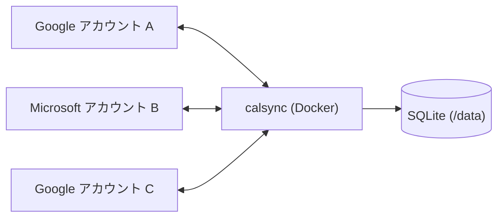

# calsync

複数の Google カレンダー / Microsoft 365(および個人 Microsoft アカウント)カレンダーを相互監視し、どれかのアカウントに Busy な予定が入ったら他の全アカウントに「予定あり」ブロッカー予定を自動作成する、セルフホスト型の OSS ツールです。Go 製シングルバイナリ、Docker で常駐します。



- 予定の中身は同期しません。タイトル固定(既定「予定あり」)・詳細なしのブロッカーだけを作ります
- Google ↔ Microsoft 混在でも相互ブロックが成立します
- ブロッカーへの再同期による無限ループは構造的に防止しています
- 同一人物の複数アカウントが同じ会議に招待されているケースは、既定で重複ブロッカーを抑止します(`dedupe_same_meeting`)

## v1 の制約

- Microsoft アカウントは**プライマリカレンダーのみ**監視・書き込み可能です(Google は複数カレンダー可)
- 過去方向の同期はしません。同期対象は現在〜未来 3 ヶ月(`sync_window` で変更可)です
- 同時刻に複数の元予定があってもブロッカーはマージしません(元予定 1 : ブロッカー 1)
- 単一インスタンス前提です。同じデータディレクトリで 2 プロセス目を起動すると flock により起動エラーになります
- `calsync sync` / `calsync reconcile` / `calsync accounts remove` は同じデータディレクトリの排他ロックを取得するため、デーモン稼働中は実行できません(停止してから実行してください)。一方 `calsync status` / `calsync doctor` は読み取り専用で排他ロックを取得しないため、**デーモン稼働中でも実行できます**
- アカウント間でタイムゾーンが異なる場合、終日予定は「同じ日付」の終日ブロッカーとしてミラーされます(同じ絶対時間帯ではありません)

## 必要なもの

- 自分の Google Cloud(GCP)OAuth クライアント、および/または Microsoft Entra ID のアプリ登録(下記手順。calsync は共有クライアントを配布しません)
- Docker / Docker Compose(または Go 1.25 でのローカルビルド)

## セットアップ 1: Google(GCP)

1. GCP プロジェクトを作成し、**Google Calendar API** を有効化します
2. OAuth 同意画面を設定します:
   - Google Workspace 組織で使うなら **Internal** が第一推奨です(未検証アプリ警告自体が出ません)
   - それ以外は **External** を選び、**公開ステータスを必ず「In production」にしてください**。
     **Testing のままだと refresh token が 7 日で失効し、常時同期ツールとして成立しません**(Google の公式仕様です)
   - 個人利用(累計 100 ユーザー未満)なら Google の検証審査は不要です。認可時に「Google hasn't verified this app」警告が出ますが、「Advanced」→「Go to ...(unsafe)」でクリックスルーできます
3. 認証情報 → OAuth クライアント ID を **「Desktop app」タイプ**で作成し、**作成直後に JSON をダウンロードして保存してください**(2025 年以降、client secret は作成時にしか表示されません)。JSON をデータディレクトリに置き、`providers.google.credentials_file` にパスを指定します
4. Desktop app の client_secret について: Google 公式ドキュメントは「In this context, the client secret is obviously not treated as a secret.(この文脈では client secret は秘密として扱われない)」と明記しています。JSON がデータディレクトリにあること自体は設計上の問題ではありませんが、他人のアクセスできる場所には置かないでください
5. **セットアップ後の定期的なメンテナンス作業は不要です**。Google には「6 ヶ月」系の制限が 2 つあります(トークン交換が 6 ヶ月ない OAuth クライアントの自動削除・6 ヶ月未使用の refresh token の失効)が、どちらも「その間まったく使われなかった場合」にのみ発動します。calsync は毎分のポーリングでトークンを更新し続けるため、**稼働している限りこの条件には該当しません**。注意が必要なのは **calsync を 6 ヶ月以上停止して放置した場合だけ**です。その場合は `invalid_client` エラー(クライアント自動削除。削除から 30 日以内なら GCP コンソールから復元可能)やトークン失効が起きるので、クライアントの復元または再作成 + JSON 差し替え + `calsync auth add <id>` の再実行が必要です

### Google Workspace 組織で GCP が使えない場合

- **OAuth クライアントを作る GCP プロジェクトは、同期対象のアカウントと同じである必要はありません**。calsync は `providers.google.credentials_file` の 1 クライアントを全 Google アカウントで共用するため、個人の Google アカウントで GCP プロジェクトとクライアントを作成し(External + In production)、職場アカウントはそのクライアントに対して認証する構成が可能です。職場側で GCP サービスが無効化されていても、この構成なら問題になりません
- ただし本当の関門は組織の**第三者アプリのアクセス制御**(管理コンソール → セキュリティ → API の制御)です。管理者が未確認アプリをブロックしていたり Google Calendar API を「制限付き」に設定している場合、職場アカウントの認可そのものがブロックされ、未検証アプリ警告のクリックスルーもできません。この場合は管理者にこのアプリ(client ID)を信頼済みとして許可してもらう必要があります
- 組織で GCP が使えるなら、その組織のプロジェクトで **Internal** として作るのが最も摩擦の少ない構成です(未検証警告なし・検証審査不要。ただし組織の API 制御設定によっては Internal アプリでも別途信頼登録が必要な場合があります)

## セットアップ 2: Microsoft(Entra ID)

1. アプリ登録は**無料テナントで可能で、課金は不要**です。個人 Microsoft アカウント(outlook.com 等)しか持っていない場合は、先に無料の Azure アカウントを作成すると Entra テナントが手に入ります
2. [Entra 管理センター](https://entra.microsoft.com) → App registrations → New registration:
   - Supported account types: **「Accounts in any organizational directory and personal Microsoft accounts」**を選択(signInAudience=AzureADandPersonalMicrosoftAccount)。calsync は `/common` エンドポイントで認証します
3. Authentication → Add a platform → **「Mobile and desktop applications」**を選び、Redirect URI に **`http://localhost`** を追加します(localhost はポート番号がマッチング時に無視されるため、ポート指定は不要です)
4. 「認証」ページで **「パブリック クライアント フローを許可する(Allow public client flows)」を有効** にします。新 UI(Authentication (Preview))では **「設定」タブ**、旧 UI では「Advanced settings」の中にあります。**これを忘れると Device Code フロー使用時に `AADSTS7000218` エラーになります**
5. API permissions → Add a permission → Microsoft Graph → Delegated permissions で **`Calendars.ReadWrite`** と **`MailboxSettings.Read`**(終日ブロッカー作成に使うメールボックスのタイムゾーン取得に必要)を追加します(`offline_access` は calsync が要求スコープに含めます)。既定では管理者同意は不要ですが、組織でユーザー同意が無効化されている場合は `AADSTS65001` または `AADSTS90094` が出ます。その場合は管理者に API permissions ページの **「Grant admin consent for <テナント名>」** を押してもらってください
6. Overview の **Application (client) ID** を `providers.microsoft.client_id` に設定します

## 設定ファイル

`./data/calsync.yaml` を作成します:

```yaml
poll_interval: 1m              # 差分ポーリング間隔
sync_window: 3mo               # 同期ウィンドウ(未来方向)。"90d" のような日数指定も可
blocker_title: "予定あり"       # ブロッカーの固定タイトル
reconcile_at: "04:00"          # 日次リコンサイル時刻(コンテナの TZ で解釈)
dedupe_same_meeting: true      # 同一会議の重複ブロッカー抑止
busy_show_as: [busy, oof, tentative]   # Microsoft で Busy 扱いにする showAs 値

providers:
  google:
    credentials_file: /data/google-client.json   # GCP でダウンロードした JSON
  microsoft:
    client_id: 00000000-0000-0000-0000-000000000000  # Entra の Application (client) ID

accounts:
  - id: personal
    provider: google
    email: user@gmail.com
    calendars: [primary]        # 監視対象(Google は複数指定可)
    blocker_calendar: primary   # ブロッカー書き込み先(既定 primary)
  - id: work-ms
    provider: microsoft
    email: user@example365.co.jp
    # Microsoft は v1 ではプライマリカレンダーのみ
```

## 認証(auth add)

コンテナにはブラウザがないため、**ホストマシンで実行するのが基本**です。トークンはデータディレクトリ(`./data/tokens/`)に保存され、そのままコンテナから使えます。

### 推奨: ホストで実行

```bash
go build -o calsync ./cmd/calsync
./calsync auth add personal --config ./data/calsync.yaml --data ./data
./calsync auth add work-ms  --config ./data/calsync.yaml --data ./data
./calsync auth list         --config ./data/calsync.yaml --data ./data
```

ブラウザが開き(開かない場合は表示された URL を手動で開く)、認可後にループバックリダイレクトでトークンが保存されます。

### 代替: Docker 内で実行(ポート公開)

イメージの ENTRYPOINT は `calsync run` なので、`--entrypoint` の上書きが必要です:

```bash
docker compose run --rm --entrypoint /calsync \
  -p 127.0.0.1:8484:8484 calsync \
  auth add personal --config /data/calsync.yaml --data /data --port 8484
```

表示された認可 URL をホストのブラウザで開きます。`--port 8484` はランダムポートを固定し、公開したポート経由でリダイレクトがコンテナに届くようにするためのものです。

### Microsoft のみの代替: Device Code Flow

```bash
docker compose run --rm --entrypoint /calsync calsync \
  auth add work-ms --config /data/calsync.yaml --data /data --device-code
```

コードと URL が表示されるだけで完結します(ポート公開不要)。ただし組織テナントでは条件付きアクセスにより Device Code Flow がブロックされている場合があります。

## 起動

```bash
docker compose up -d --build
docker compose logs -f calsync
```

`calsync status` / `calsync doctor` は読み取り専用でデータディレクトリの排他ロックを取得しないため、**デーモン稼働中でもそのまま実行できます**:

```bash
docker compose run --rm --entrypoint /calsync calsync status --data /data
docker compose run --rm --entrypoint /calsync calsync doctor --config /data/calsync.yaml --data /data
```

一方 `calsync sync` / `calsync reconcile` / `calsync accounts remove` はデータディレクトリの排他ロックを取得するため、実行前にデーモンを停止してください:

```bash
docker compose stop calsync
docker compose run --rm --entrypoint /calsync calsync reconcile --config /data/calsync.yaml --data /data
docker compose start calsync
```

## CLI リファレンス

| コマンド | 説明 |
| --- | --- |
| `calsync run` | デーモン起動(Docker の既定エントリポイント) |
| `calsync sync --once` | 1 回だけ同期して終了 |
| `calsync reconcile` | フルリコンサイル手動実行(ウィンドウスライド・孤児収容・DB 再構築を含む) |
| `calsync status` | 各カレンダーの最終同期時刻・エラー状態(reauth_required 等) |
| `calsync doctor` | 設定・トークン・API 疎通・YAML と DB の不整合診断 |
| `calsync auth add <id> [--port N] [--device-code]` | OAuth フロー(ホスト実行推奨。--device-code は Microsoft のみ) |
| `calsync auth list` | トークン状態一覧 |
| `calsync accounts remove <id> [--force]` | 配布済みブロッカー削除 → 受領ブロッカー削除 → ローカル状態削除 |

共通フラグ: `--config`(既定 `calsync.yaml`)、`--data`(既定 `./data`)

## ブロッカーの元アカウント表示(オプション)

既定ではブロッカーは「予定あり」のみで、どのアカウント由来かは表示されません(意図的な匿名設計)。**自分のカレンダー単位**で説明欄に元アカウントの ID を表示したい場合は、そのアカウントに `show_origin_in_description: true` を設定します:

```yaml
accounts:
  - id: personal
    provider: google
    email: you@gmail.com
    show_origin_in_description: true   # personal のカレンダーに作られるブロッカーの説明欄に「calsync: ミラー元アカウント = <id>」を記載
```

- 記載されるのは YAML の `id` のみ(メールアドレスは記載しません)
- 設定の ON/OFF は**次回のリコンサイル(毎日 04:00 または `calsync reconcile`)で既存ブロッカーにも遡及反映**されます
- 説明欄はそのカレンダーの共有設定によっては第三者に見える可能性があります。組織のカレンダーでは慎重に判断してください

## アカウントの削除

**必ず `calsync accounts remove <id>` を実行してから、calsync.yaml からそのアカウントのエントリを削除してください。順序を逆にしないでください。**

先に calsync.yaml からアカウントを消してしまうと、`accounts remove` はそのアカウント自身の provider を構築できません(provider は calsync.yaml の `accounts` 一覧から組み立てられるため)。その結果、そのアカウントが受け取っていた受領ブロッカーの削除には `--force` が必須になり、`--force` を使った場合、対象アカウントのカレンダーに受領ブロッカーが残ったままになります(手動削除が必要です)。

正しい順序:

```bash
docker compose stop calsync
docker compose run --rm --entrypoint /calsync calsync \
  accounts remove old-account --config /data/calsync.yaml --data /data
```

`accounts remove` の完了(配布済みブロッカー削除 → 受領ブロッカー削除 → ローカル状態削除)を確認してから、calsync.yaml から `old-account` のエントリを削除し、`docker compose start calsync` してください。

YAML から消しただけの状態は `calsync doctor` と起動時ログが孤児として警告します。認証切れ等でリモートのブロッカーを消せない場合は `--force` でローカル状態だけ削除できます(ブロッカーは各カレンダーに残るため手動削除が必要です)。

## トークン失効時(reauth_required)

パスワード変更・管理者リセット・長期未使用などで refresh token は失効することがあります。失効したアカウントだけ同期が止まり(`status` に reauth_required と表示)、他のアカウントは同期を継続します。ホストで `calsync auth add <id>` を再実行すれば、次のサイクルとリコンサイルで停止期間中の差分も自動回収されます。

## プライバシーについて

calsync が作成するブロッカー予定には、ループ防止・自己修復のための拡張プロパティ(`calsync-origin` タグ)として**元アカウントの ID と元イベントの ID** が保存されます。カレンダーの UI には表示されませんが、そのカレンダーに API アクセスできる人(組織の管理者を含む)は読み取れます。アカウント ID(YAML の `id`)に見られたくない文字列を使わないでください。タイトル・本文・参加者など予定の中身は一切コピーされません。

## データとバックアップ

- `./data` に SQLite(状態 DB)・OAuth トークン(0600)・設定が入ります。このディレクトリだけバックアップすれば移行できます
- DB を失っても、`calsync reconcile` がカレンダー上の calsync タグからマッピングを再構築します

## トラブルシューティング

| 症状 | 原因と対処 |
| --- | --- |
| Google: 7 日ごとに再認証を求められる | OAuth 同意画面が Testing のまま。**In production に変更**(上記セットアップ 1-2) |
| Google: `invalid_client` | calsync を 6 ヶ月以上停止していたためクライアントが自動削除された(稼働中は発生しない)。30 日以内なら GCP コンソールで復元、超過ならクライアント再作成 + JSON 差し替え |
| Google: 職場アカウントの認可が組織ポリシーでブロックされる | GWS の第三者アプリアクセス制御。管理者に client ID の許可を依頼(セットアップ 1 の「GWS 組織で GCP が使えない場合」参照) |
| Microsoft: `AADSTS7000218` | 「Allow public client flows」が No のまま。Yes に変更(セットアップ 2-4) |
| Microsoft: `AADSTS65001` / `AADSTS90094` | 組織でユーザー同意が無効。管理者に「Grant admin consent」を依頼(セットアップ 2-5) |
| `data directory is locked by another calsync process` | 二重起動、または `sync` / `reconcile` / `accounts remove` をデーモン実行中に実行した。デーモンを止めてから実行(`status` / `doctor` は稼働中でも実行可) |
| ブロッカーを手で消したのに復活する | 仕様です。元予定が生きている限りリコンサイルが再作成します |

## ライセンス

MIT License([LICENSE](LICENSE) を参照)
