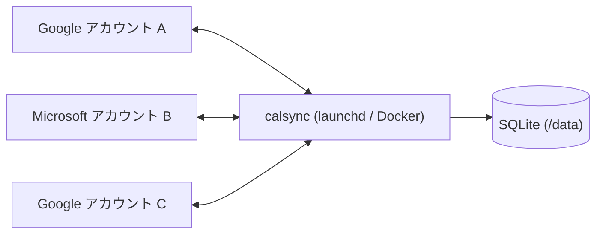

# calsync

複数の Google カレンダー / Microsoft 365(および個人 Microsoft アカウント)カレンダーを相互監視し、どれかのアカウントに Busy な予定が入ったら他の全アカウントに「予定あり」ブロッカー予定を自動作成する、セルフホスト型の OSS ツールです。Go 製シングルバイナリで、macOS では launchd の LaunchAgent として、Linux では Docker でそれぞれ常駐します。



- 既定では予定の中身は同期しません。タイトル固定(既定「予定あり」)・詳細なしのブロッカーだけを作ります(`detail_sync` で明示したペアに限りタイトル/説明を転記でき、`visibility` でペア別に公開設定も変更できます)
- Google ↔ Microsoft 混在でも相互ブロックが成立します
- ブロッカーへの再同期による無限ループは構造的に防止しています
- 同一人物の複数アカウントが同じ会議に招待されているケースは、既定で重複ブロッカーを抑止します(`dedupe_same_meeting`)
- 朝のダイジェストと開始前リマインドを Slack(DM またはチャンネル)へ通知できます(`notifications.slack`。既定は無効)
- ブロッカーを配布せず朝のダイジェストにだけ載せる通知専用カレンダーを指定できます(`digest_calendars`。Google のみ)

## v1 の制約

- Microsoft アカウントは**プライマリカレンダーのみ**監視・書き込み可能です(Google は複数カレンダー可)
- 過去方向の同期はしません。同期対象は現在〜未来 3 ヶ月(`sync_window` で変更可)です
- 同時刻に複数の元予定があってもブロッカーはマージしません(元予定 1 : ブロッカー 1)
- 単一インスタンス前提です。同じデータディレクトリで 2 プロセス目を起動すると flock により起動エラーになります
- `calsync sync` / `calsync reconcile` / `calsync accounts remove` は同じデータディレクトリの排他ロックを取得するため、デーモン稼働中は実行できません(停止してから実行してください)。一方 `calsync status` / `calsync doctor` は読み取り専用で排他ロックを取得しないため、デーモン稼働中でも実行できます(**ただしコンテナ運用時はホストから直接実行せず、コンテナ経由で実行してください** — [データとバックアップ](#データとバックアップ)参照)
- アカウント間でタイムゾーンが異なる場合、終日予定は「同じ日付」の終日ブロッカーとしてミラーされます(同じ絶対時間帯ではありません)

## 必要なもの

- 自分の Google Cloud(GCP)OAuth クライアント、および/または Microsoft Entra ID のアプリ登録(下記手順。calsync は共有クライアントを配布しません)
- **macOS(ネイティブ常駐・推奨)**: Go 1.25 以上(ビルドに使用)と python3(インストーラの plist 生成に使用。Xcode Command Line Tools に付属)
- **Linux / その他**: Docker / Docker Compose(認証 `auth add` はホスト実行が基本のため、Go があると簡単です)

## セットアップ 1: Google(GCP)

1. GCP プロジェクトを作成し、**Google Calendar API** を有効化します
2. OAuth 同意画面を設定します:
   - Google Workspace 組織で使うなら **Internal** が第一推奨です(未検証アプリ警告自体が出ません)
   - それ以外は **External** を選び、**公開ステータスを必ず「In production」にしてください**。
     **Testing のままだと refresh token が 7 日で失効し、常時同期ツールとして成立しません**(Google の公式仕様です)
   - 個人利用(累計 100 ユーザー未満)なら Google の検証審査は不要です。認可時に「Google hasn't verified this app」警告が出ますが、「Advanced」→「Go to ...(unsafe)」でクリックスルーできます
3. 認証情報 → OAuth クライアント ID を **「Desktop app」タイプ**で作成し、**作成直後に JSON をダウンロードして保存してください**(2025 年以降、client secret は作成時にしか表示されません)。JSON をデータディレクトリに置き、`providers.google.credentials_file` にパスを指定します
4. Desktop app の client_secret について: Google 公式ドキュメントは「In this context, the client secret is obviously not treated as a secret.(この文脈では client secret は秘密として扱われない)」と明記しています。JSON がデータディレクトリにあること自体は設計上の問題ではありませんが、他人のアクセスできる場所には置かないでください
5. **セットアップ後の定期的なメンテナンス作業は不要です**。Google には「6 ヶ月」系の制限が 2 つあります(トークン交換が 6 ヶ月ない OAuth クライアントの自動削除・6 ヶ月未使用の refresh token の失効)が、どちらも「その間まったく使われなかった場合」にのみ発動します。calsync は毎分のポーリングでトークンを更新し続けるため、**稼働している限りこの条件には該当しません**。注意が必要なのは **calsync を 6 ヶ月以上停止して放置した場合だけ**です。その場合は `invalid_client` エラー(クライアント自動削除。削除から 30 日以内なら GCP コンソールから復元可能)やトークン失効が起きるので、クライアントの復元または再作成 + JSON 差し替え + `calsync auth add <id>` の再実行が必要です

### Google Workspace 組織で GCP が使えない場合

- **OAuth クライアントを作る GCP プロジェクトは、同期対象のアカウントと同じである必要はありません**。calsync は `providers.google.credentials_file` の 1 クライアントを全 Google アカウントで共用するため、個人の Google アカウントで GCP プロジェクトとクライアントを作成し(External + In production)、職場アカウントはそのクライアントに対して認証する構成が可能です。職場側で GCP サービスが無効化されていても、この構成なら問題になりません
- ただし本当の関門は組織の**第三者アプリのアクセス制御**(管理コンソール → セキュリティ → API の制御)です。管理者が未確認アプリをブロックしていたり Google Calendar API を「制限付き」に設定している場合、職場アカウントの認可そのものがブロックされ、未検証アプリ警告のクリックスルーもできません。この場合は管理者にこのアプリ(client ID)を信頼済みとして許可してもらう必要があります
- 組織で GCP が使えるなら、その組織のプロジェクトで **Internal** として作るのが最も摩擦の少ない構成です(未検証警告なし・検証審査不要。ただし組織の API 制御設定によっては Internal アプリでも別途信頼登録が必要な場合があります)

## セットアップ 2: Microsoft(Entra ID)

1. アプリ登録は**無料テナントで可能で、課金は不要**です。個人 Microsoft アカウント(outlook.com 等)しか持っていない場合は、先に無料の Azure アカウントを作成すると Entra テナントが手に入ります
2. [Entra 管理センター](https://entra.microsoft.com) → App registrations → New registration:
   - Supported account types: **「Accounts in any organizational directory and personal Microsoft accounts」**を選択(signInAudience=AzureADandPersonalMicrosoftAccount)。calsync は `/common` エンドポイントで認証します
3. Authentication → Add a platform → **「Mobile and desktop applications」**を選び、Redirect URI に **`http://localhost`** を追加します(localhost はポート番号がマッチング時に無視されるため、ポート指定は不要です)
4. 「認証」ページで **「パブリック クライアント フローを許可する(Allow public client flows)」を有効** にします。新 UI(Authentication (Preview))では **「設定」タブ**、旧 UI では「Advanced settings」の中にあります。**これを忘れると Device Code フロー使用時に `AADSTS7000218` エラーになります**
5. API permissions → Add a permission → Microsoft Graph → Delegated permissions で **`Calendars.ReadWrite`** と **`MailboxSettings.Read`**(終日ブロッカー作成に使うメールボックスのタイムゾーン取得に必要)を追加します(`offline_access` は calsync が要求スコープに含めます)。既定では管理者同意は不要ですが、組織でユーザー同意が無効化されている場合は `AADSTS65001` または `AADSTS90094` が出ます。その場合は管理者に API permissions ページの **「Grant admin consent for <テナント名>」** を押してもらってください
6. Overview の **Application (client) ID** を `providers.microsoft.client_id` に設定します

## 設定ファイル

`./data/calsync.yaml` を作成します:

```yaml
poll_interval: 1m              # 差分ポーリング間隔
sync_window: 3mo               # 同期ウィンドウ(未来方向)。"90d" のような日数指定も可
blocker_title: "予定あり"       # ブロッカーの固定タイトル
reconcile_at: "04:00"          # 日次リコンサイル時刻(実行環境のローカル TZ。Docker はコンテナの TZ、launchd はシステムの TZ)
dedupe_same_meeting: true      # 同一会議の重複ブロッカー抑止
busy_show_as: [busy, oof, tentative]   # Microsoft で Busy 扱いにする showAs 値(free / tentative / busy / oof / workingElsewhere / unknown から選択)

providers:
  google:
    credentials_file: /data/google-client.json   # GCP でダウンロードした JSON
  microsoft:
    client_id: 00000000-0000-0000-0000-000000000000  # Entra の Application (client) ID

accounts:
  - id: personal
    provider: google
    email: user@gmail.com
    calendars: [primary]        # 監視対象(Google は複数指定可)
    blocker_calendar: primary   # ブロッカー書き込み先(既定 primary)
  - id: work-ms
    provider: microsoft
    email: user@example365.co.jp
    # Microsoft は v1 ではプライマリカレンダーのみ
```

このほか、Slack 通知の `notifications`([Slack 通知](#slack-通知オプション))、通知専用カレンダーの `accounts[].digest_calendars`([通知専用カレンダー](#通知専用カレンダーdigest_calendars))、元アカウント表示の `accounts[].show_origin_in_description`([ブロッカーの元アカウント表示](#ブロッカーの元アカウント表示オプション))、ペア別転記の `detail_sync`([ペア別にタイトル/説明も同期する](#ペア別にタイトル説明も同期するdetail_sync))が指定できます。

## 認証(auth add)

コンテナにはブラウザがないため、**ホストマシンで実行するのが基本**です。トークンはデータディレクトリ(`./data/tokens/`)に保存され、そのままコンテナから使えます。

### 推奨: ホストで実行

```bash
go build -o calsync ./cmd/calsync
./calsync auth add personal --config ./data/calsync.yaml --data ./data
./calsync auth add work-ms  --config ./data/calsync.yaml --data ./data
./calsync auth list         --config ./data/calsync.yaml --data ./data
```

ブラウザが開き(開かない場合は表示された URL を手動で開く)、認可後にループバックリダイレクトでトークンが保存されます。

### 代替: Docker 内で実行(ポート公開)

イメージの ENTRYPOINT は `calsync run` なので、`--entrypoint` の上書きが必要です:

```bash
docker compose run --rm --entrypoint /calsync \
  -p 127.0.0.1:8484:8484 calsync \
  auth add personal --config /data/calsync.yaml --data /data --port 8484
```

表示された認可 URL をホストのブラウザで開きます。`--port 8484` はランダムポートを固定し、公開したポート経由でリダイレクトがコンテナに届くようにするためのものです。

### Microsoft のみの代替: Device Code Flow

```bash
docker compose run --rm --entrypoint /calsync calsync \
  auth add work-ms --config /data/calsync.yaml --data /data --device-code
```

コードと URL が表示されるだけで完結します(ポート公開不要)。ただし組織テナントでは条件付きアクセスにより Device Code Flow がブロックされている場合があります。

## 起動

常駐方式は OS によって使い分けます。**macOS では launchd によるネイティブ常駐が推奨**です。Linux やリモートサーバーでは従来どおり Docker を使います。

### macOS ネイティブ常駐(推奨)

Docker Desktop(VM + GUI アプリ + 自動更新)は不安定要素が多く、純 Go・CGO なしの単一バイナリである calsync にとってコンテナの利点はほとんどありません。macOS では `launchd` の LaunchAgent として直接常駐させます。

```bash
./scripts/macos/install-launchd.sh
```

このスクリプトは冪等です(何度実行してもビルド → plist 再生成 → 再登録 → 再起動をやり直すだけ)。内部で行うこと:

1. macOS であること・データディレクトリ(既定 `./data`)・`calsync.yaml` の存在を確認。**コンテナ運用から移行する場合は `calsync.yaml` の `credentials_file` をコンテナ内パス(`/data/google-client.json`)からホストの絶対パスに変更しておくこと**(スクリプトが検知してエラーにします — 実測でクラッシュループになった移行時の落とし穴)
2. `calsync.yaml` に `notifications` が設定されていれば、`bot_token_env`(既定 `SLACK_BOT_TOKEN`)の環境変数が現在のシェルに存在することを確認(なければエラーで中断)
3. `go build` でバイナリを `~/.local/bin/calsync` に配置(`CALSYNC_BIN` で上書き可)
4. Docker の calsync コンテナが稼働中なら中断し、`docker compose down` を案内(移行時の二重運用事故防止。docker コマンドが無い/デーモン停止中は黙ってスキップ)
5. `scripts/macos/com.btajp.calsync.plist.template` からプレースホルダを置換して `~/Library/LaunchAgents/com.btajp.calsync.plist` を生成(`chmod 600` — トークンを含むため)
6. `launchctl bootout` → `bootstrap` → `kickstart` で登録・起動
7. `launchctl print` の起動状態と、ログ(`~/Library/Logs/calsync.log`)末尾を表示

環境変数による上書き:

| 変数 | 内容 | 既定値 |
| --- | --- | --- |
| `CALSYNC_BIN` | バイナリの配置ディレクトリ | `~/.local/bin` |
| `CALSYNC_DATA` | データディレクトリ(`calsync.yaml` の場所) | `<リポジトリ>/data` |

**更新フロー**: `git pull` してから `./scripts/macos/install-launchd.sh` を再実行するだけです(再ビルド・plist 再生成・再起動まで冪等にやり直します)。**トークンを変更した場合も同じスクリプトを再実行**してください(plist に転記し直されます)。

**スリープ挙動**: Mac がスリープ中は同期・通知とも停止し、起床後の最初の tick で再開します。`morning_digest` の時刻にスリープしていた場合、**同日中に起床すれば遅延送信されます**(日付を跨いだ分は放棄される既存仕様どおりです)。

状態確認・アンインストール:

```bash
launchctl print gui/$(id -u)/com.btajp.calsync   # 稼働状態
tail -f ~/Library/Logs/calsync.log               # ログ
./scripts/macos/uninstall-launchd.sh              # アンインストール(バイナリ・data/ は残る)
```

`calsync status` / `calsync doctor` はデータディレクトリの排他ロックを取得しない読み取り専用コマンドなので、ネイティブ運用では**デーモン稼働中でもホストからそのまま実行できます**(コンテナ運用時の制約とは異なります。詳細は [CLAUDE.md](CLAUDE.md) を参照):

```bash
./calsync status --data ./data
./calsync doctor --config ./data/calsync.yaml --data ./data
```

一方 `calsync sync` / `calsync reconcile` / `calsync accounts remove` はデータディレクトリの排他ロックを取得するため、実行前にデーモンを停止してください:

```bash
launchctl bootout gui/$(id -u)/com.btajp.calsync
./calsync reconcile --config ./data/calsync.yaml --data ./data
./scripts/macos/install-launchd.sh   # 再起動(再ビルドと再登録も兼ねる)
```

### Linux / その他(標準)

macOS 以外(および macOS 上での動作確認・検証用途)では Docker Compose で常駐します。calsync 本体への変更は一切ないため、この節の手順は従来どおりです。

```bash
docker compose up -d --build
docker compose logs -f calsync
```

`calsync status` / `calsync doctor` は読み取り専用でデータディレクトリの排他ロックを取得しないため、**デーモン稼働中でもそのまま実行できます**:

```bash
docker compose run --rm --entrypoint /calsync calsync status --data /data
docker compose run --rm --entrypoint /calsync calsync doctor --config /data/calsync.yaml --data /data
```

一方 `calsync sync` / `calsync reconcile` / `calsync accounts remove` はデータディレクトリの排他ロックを取得するため、実行前にデーモンを停止してください:

```bash
docker compose stop calsync
docker compose run --rm --entrypoint /calsync calsync reconcile --config /data/calsync.yaml --data /data
docker compose start calsync
```

## CLI リファレンス

| コマンド | 説明 |
| --- | --- |
| `calsync run` | デーモン起動(Docker の既定エントリポイント。launchd の LaunchAgent もこれを起動) |
| `calsync sync --once` | 1 回だけ同期して終了 |
| `calsync reconcile` | フルリコンサイル手動実行(ウィンドウスライド・孤児収容・DB 再構築を含む) |
| `calsync status` | 各カレンダーの最終同期時刻・エラー状態(reauth_required 等) |
| `calsync doctor` | 設定・トークン・API 疎通・YAML と DB の不整合診断 |
| `calsync auth add <id> [--port N] [--device-code]` | OAuth フロー(ホスト実行推奨。--device-code は Microsoft のみ) |
| `calsync auth list` | トークン状態一覧 |
| `calsync accounts remove <id> [--force]` | 配布済みブロッカー削除 → 受領ブロッカー削除 → ローカル状態削除 |

共通フラグ: `--config`(既定 `calsync.yaml`)、`--data`(既定 `./data`)

## ブロッカーの元アカウント表示(オプション)

既定ではブロッカーは「予定あり」のみで、どのアカウント由来かは表示されません(意図的な匿名設計)。**自分のカレンダー単位**で説明欄に元アカウントの ID を表示したい場合は、そのアカウントに `show_origin_in_description: true` を設定します:

```yaml
accounts:
  - id: personal
    provider: google
    email: you@gmail.com
    show_origin_in_description: true   # personal のカレンダーに作られるブロッカーの説明欄に「calsync: ミラー元アカウント = <id>」を記載
```

- 記載されるのは YAML の `id` のみ(メールアドレスは記載しません)
- 設定の ON/OFF は**次回のリコンサイル(毎日 04:00 または `calsync reconcile`)で既存ブロッカーにも遡及反映**されます
- 説明欄はそのカレンダーの共有設定によっては第三者に見える可能性があります。組織のカレンダーでは慎重に判断してください

## ペア別にタイトル/説明も同期する(detail_sync)

既定ではブロッカーの中身は転記されませんが、「アカウント B の予定をアカウント A へミラーするときだけ、タイトル(と説明)も見たい」場合は、トップレベルの `detail_sync` でペアを明示します:

```yaml
detail_sync:
  - from: work-ms     # 元アカウント(accounts の id)
    to: personal      # ミラー先アカウント
    fields: [title, description]   # title / description から選択
    visibility: default             # private(既定)| default | public
  - from: personal
    to: work-ms
    fields: [title]
```

- 方向は一方通行です(逆方向も欲しければ 2 エントリ書きます)。指定していないペアは従来どおり完全匿名のままです
- 元イベントのタイトル/説明の変更は次のポーリング(既定 1 分)で自動追従します
- ペアの追加・削除・fields 変更を既存ブロッカーに反映するには、デーモン再起動後の日次リコンサイルを待つか、デーモン停止中に `calsync reconcile` を実行します
- `visibility` でペアのブロッカーの公開設定を変えられます: `private`(既定 — 非公開のまま)/ `default`(カレンダーの共有設定に従う = 普通の予定と同じ)/ `public`(共有相手が時間枠のみ表示でも詳細を見せる)。Microsoft がミラー先の場合、default/public はどちらも通常の予定(sensitivity: normal)になります。変更は次回リコンサイルで既存ブロッカーにも遡及します
- `visibility` 未指定のペアと通常のブロッカーは private のままです。閲覧権限だけの共有相手には従来どおり非公開の予定としか見えませんが、**編集権限を持つ共有相手・組織の管理者・そのカレンダーに API アクセスできる人は転記されたタイトル/説明を読めます**。組織のカレンダーへ転記するペアは慎重に設定してください

## Slack 通知(オプション)

朝のダイジェスト(指定時刻に当日の実予定を全アカウント横断で通知)と、開始前リマインド(予定の指定時間前に通知)を Slack の DM またはチャンネルへ送信できます。既定では無効です。

### 通知の内容(Block Kit)

- **ダイジェスト**: 予定ごとに 1 セクションで表示し、由来アカウントごとの色付きバー(`accounts` の定義順で固定パレットを巡回割当)が付きます。時系列で連続する同一アカウント色の予定は 1 つの色付きグループにまとまります。件名はその予定を作ったカレンダー上の該当イベントへのリンク(Google: `htmlLink` / Microsoft: `webLink`)になり、クリックするとカレンダー側で開きます。Zoom / Google Meet / Microsoft Teams の会議 URL が見つかった予定には「参加」ボタン(ブロックの accessory)が付きます。1 通に載る予定が 20 件を超える場合は残りを「…他 N 件」にまとめます(Block Kit を描画しない面向けのテキスト fallback は 100 件まで)。リンクのプレビュー展開(unfurl)は常に抑止します
- **リマインド**: 件名・参加ボタンに加えて、**予定の本文(description)をプレーンテキスト化した全文**を表示します(長文は約 2,900 字で切り詰め)。Microsoft は Graph API にテキスト化させ(`Prefer: outlook.body-content-type="text"`)、Google は簡易的な HTML タグ除去で整形します
- **会議 URL の抽出順**: まずカレンダー側の構造化フィールド(Google `conferenceData` / Microsoft `onlineMeeting`)を優先し、なければ場所(location)→本文(description)の順で `zoom.us` / `meet.google.com` / `teams.microsoft.com` の `https` URL を検出します。抽出できなかった場合は参加ボタンを付けません
- **プレビュー表示との関係**: モバイル通知バナーや検索結果など Block Kit を描画しない面には、従来どおりのテキスト形式(件名・時刻のみ、会議 URL・本文は含みません)を fallback として送ります
- **縮退**: Slack が blocks / attachments を不正と判定した場合(`invalid_blocks` / `invalid_attachments` 系のエラー)は、テキストのみの通知として 1 回だけ再送します

### 設定

```yaml
notifications:
  slack:
    bot_token_env: SLACK_BOT_TOKEN  # トークンを読む環境変数名(既定 SLACK_BOT_TOKEN)。トークン自体は YAML に書きません
    channel: "C0XXXXXXX"            # C…/G… ならチャンネル、U… なら DM(conversations.open で自動解決)
                                     # Enterprise Grid のユーザー ID(W…)は v1 未対応(DM は U… のみ)
    morning_digest: "07:30"         # 省略するとダイジェスト無効。"HH:MM"、実行環境のローカル TZ(reconcile_at と同形式)
    remind_before: 10m               # 省略するとリマインド無効。正の Go duration。poll_interval 以上が必須
```

- `morning_digest` と `remind_before` の両方を省略すると設定エラーになります(設定したのに何も送られない事故の防止)
- トークンは環境変数からのみ読みます(YAML にトークンを書かないでください)。検証は `calsync run` 起動時のみ行われ、トークンが空だと起動を拒否します(`status` / `doctor` はトークンなしでも動作します)

### 通知専用カレンダー(`digest_calendars`)

「他アカウントへブロッカーを配布したくないが、朝のダイジェストには載せたい」カレンダーをアカウントごとに指定できます(例: 個人アカウントの「ゴミの日」カレンダーは予定として知りたいが、それで仕事カレンダーを「予定あり」ブロックしたくない場合)。

```yaml
accounts:
  - id: personal
    provider: google
    email: user@gmail.com
    digest_calendars: ["xxxxx@group.calendar.google.com"]  # 通知専用(ブロック元にはならない)
```

- 対象カレンダーはダイジェストの**ライブ取得にだけ**参加します。`calendars`(監視対象)には含まれないため、同期(カーソル・イベントキャッシュ・日次リコンサイル・ブロッカー配布)には一切関与しません
- **google アカウントのみ**指定できます(microsoft は v1 制約により非対応。Graph 実装が `/me/calendarView` 固定でプライマリ以外を取得できないため)
- 同一アカウント内で `calendars` との重複、`digest_calendars` 内の重複、空文字列はいずれも設定エラーになります
- **リマインド対象外です**。イベントキャッシュに入らないため構造的に発火しません(free の予定・終日予定がリマインド対象外なのと同列の制約です)

#### カレンダー ID の調べ方

1. Google カレンダーの設定画面を開く
2. 左側の「マイカレンダー」から対象カレンダーを選ぶ
3. 「カレンダーの設定」→ 対象カレンダーの設定ページ → 「カレンダーの統合」
4. 「カレンダー ID」欄の値(`xxxxx@group.calendar.google.com` 形式)をコピーし、`digest_calendars` に指定する

### Slack App の作成手順

1. [api.slack.com/apps](https://api.slack.com/apps) → **Create New App** → **From scratch**
2. **OAuth & Permissions** → **Scopes** → **Bot Token Scopes** に以下を追加します:
   - `chat:write` (必須。メッセージ送信)
   - `im:write` (DM 送信を使う場合)
   - `chat:write.public` (Bot が未参加の公開チャンネルへ送る場合)
3. **Install to Workspace** を実行し、発行された `xoxb-` から始まる Bot User OAuth Token を控えます
4. **プライベートチャンネルへ送る場合は、対象チャンネルで `/invite @<App名>` して Bot を招待してください**(未招待のままだと `not_in_channel` エラーになります)

### channel の調べ方

- チャンネル宛て: チャンネル詳細画面の一番下にある Channel ID(`C…` または `G…`)
- DM 宛て: 送り先ユーザーのプロフィール → 「その他」→ **メンバー ID をコピー**(`U…`)

### docker compose での渡し方

トークンは `docker-compose.yaml` の `environment` 経由でコンテナに渡し、実体は `.env` に置きます(`.env` はリポジトリにコミットしないでください):

```yaml
services:
  calsync:
    environment:
      TZ: Asia/Tokyo
      SLACK_BOT_TOKEN: ${SLACK_BOT_TOKEN}
```

```bash
# .env
SLACK_BOT_TOKEN=xoxb-...
```

### 制約

- リマインドの対象は「busy かつ時刻指定の予定」のみです。**free の予定・終日予定・`digest_calendars` の予定はリマインド対象外**です(v1 制約)。ダイジェストはライブ取得のため free の予定・`digest_calendars` の予定も件名付きで含まれます
- calsync を停止していた間に日付を跨いだ場合、その日のダイジェストはキャッチアップされません(`reconcile_at` と同じ制約です)
- **通知先チャンネルの公開範囲に注意してください**。ダイジェスト・リマインドとも予定の件名がそのまま通知に含まれます。それに加えて、**リマインドには予定の本文(description)が全文表示され、会議 URL が見つかった予定にはダイジェスト・リマインドの両方に「参加」ボタンが付きます**。会議 URL には Zoom のパスワード付きリンクのように参加用の秘密情報が含まれる場合があり、本文にも会議の詳細や機密情報が書かれている可能性があります。共有範囲の広いチャンネルを指定すると、予定の件名だけでなく会議への参加手段や本文の内容まで意図せず広く見える可能性があるため、`channel` には信頼できる範囲のメンバーのみが参加するチャンネルまたは DM を指定してください

## アカウントの削除

**必ず `calsync accounts remove <id>` を実行してから、calsync.yaml からそのアカウントのエントリを削除してください。順序を逆にしないでください。**

先に calsync.yaml からアカウントを消してしまうと、`accounts remove` はそのアカウント自身の provider を構築できません(provider は calsync.yaml の `accounts` 一覧から組み立てられるため)。その結果、そのアカウントが受け取っていた受領ブロッカーの削除には `--force` が必須になり、`--force` を使った場合、対象アカウントのカレンダーに受領ブロッカーが残ったままになります(手動削除が必要です)。

正しい順序:

```bash
docker compose stop calsync
docker compose run --rm --entrypoint /calsync calsync \
  accounts remove old-account --config /data/calsync.yaml --data /data
```

macOS ネイティブ(launchd)運用の場合:

```bash
launchctl bootout gui/$(id -u)/com.btajp.calsync
./calsync accounts remove old-account --config ./data/calsync.yaml --data ./data
# calsync.yaml からエントリを削除してから再起動
./scripts/macos/install-launchd.sh
```

`accounts remove` の完了(配布済みブロッカー削除 → 受領ブロッカー削除 → ローカル状態削除)を確認してから、calsync.yaml から `old-account` のエントリを削除し、`docker compose start calsync`(または launchd の場合は上記のとおり再起動)してください。

YAML から消しただけの状態は `calsync doctor` と起動時ログが孤児として警告します。認証切れ等でリモートのブロッカーを消せない場合は `--force` でローカル状態だけ削除できます(ブロッカーは各カレンダーに残るため手動削除が必要です)。

## アンインストール

**順序が重要です。トークン(`./data`)を消す前にブロッカーを掃除してください** — リモートのブロッカー削除には各アカウントの認証が必要で、先にトークンを消すと手動削除以外の手段がなくなります。

### 1. デーモンを停止する

```bash
launchctl bootout gui/$(id -u)/com.btajp.calsync   # macOS ネイティブ(launchd)
docker compose down                                 # Docker
```

### 2. 全カレンダーからブロッカーを掃除する

アカウントを 1 つずつ `accounts remove` します([アカウントの削除](#アカウントの削除)と同じ要領。このとき calsync.yaml のエントリはまだ消しません):

```bash
./calsync accounts remove <id> --config ./data/calsync.yaml --data ./data
```

全アカウントに対して実行すると、配布済み・受領済みのブロッカーがすべてのカレンダーから削除されます。認証切れ等で消せないアカウントは `--force` でスキップできますが、そのカレンダーに残ったブロッカーは手動削除が必要です。

### 3. 常駐を解除する

```bash
./scripts/macos/uninstall-launchd.sh   # macOS: bootout + plist 削除(バイナリ・data/ は残る)
docker compose down --rmi local        # Docker: イメージも消す場合
```

### 4. ローカルデータとバイナリを削除する

```bash
rm -rf ./data                  # トークン・SQLite・設定(復元不能なので順序 2 の完了後に)
rm -f ~/.local/bin/calsync     # macOS ネイティブ運用のバイナリ(CALSYNC_BIN で変更していた場合はそのパス)
```

リポジトリの clone 自体が不要なら丸ごと削除して構いません。

### 5. アカウント側のアクセス権を取り消す

- **Google**: [myaccount.google.com/connections](https://myaccount.google.com/connections)(サードパーティ製アプリとサービス)で、calsync に使った OAuth クライアントのアクセス権を削除
- **Microsoft(個人アカウント)**: [account.live.com/consent/Manage](https://account.live.com/consent/Manage) でアプリのアクセス許可を削除
- **Microsoft(組織アカウント)**: [myapps.microsoft.com](https://myapps.microsoft.com) の該当アプリから取り消し(組織設定によっては管理者作業)

### 6. (自分で作成した場合)クラウド側の登録を削除する

- GCP: OAuth クライアント(calsync 専用にプロジェクトを作った場合はプロジェクトごと)を削除
- Entra ID: アプリの登録を削除
- Slack: 通知を使っていた場合、アプリをワークスペースから削除

最後に各カレンダーを見て、ブロッカー(既定タイトル「予定あり」)が残っていないことを確認してください。

## トークン失効時(reauth_required)

パスワード変更・管理者リセット・長期未使用などで refresh token は失効することがあります。失効したアカウントだけ同期が止まり(`status` に reauth_required と表示)、他のアカウントは同期を継続します。ホストで `calsync auth add <id>` を再実行すれば、次のサイクルとリコンサイルで停止期間中の差分も自動回収されます。

## プライバシーについて

calsync が作成するブロッカー予定には、ループ防止・自己修復のための拡張プロパティ(`calsync-origin` タグ)として**元アカウントの ID と元イベントの ID** が保存されます。カレンダーの UI には表示されませんが、そのカレンダーに API アクセスできる人(組織の管理者を含む)は読み取れます。アカウント ID(YAML の `id`)に見られたくない文字列を使わないでください。タイトル・本文・参加者など予定の中身は、既定では一切コピーされません(`detail_sync` で明示的にオプトインしたペアに限り、タイトル/説明が転記されます)。

なお、`detail_sync` の `visibility` を `default` / `public` にしたペアは閲覧権限のみの共有相手にも転記内容が見えます([detail_sync](#ペア別にタイトル説明も同期するdetail_sync) 参照)。Slack 通知を有効にした場合は予定の件名(リマインドは本文全文も)が通知先チャンネルへ送られます([Slack 通知の制約](#制約) 参照)。

## データとバックアップ

- `./data` に SQLite(状態 DB)・OAuth トークン(0600)・設定が入ります。このディレクトリだけバックアップすれば移行できます
- DB を失っても、`calsync reconcile` がカレンダー上の calsync タグからマッピングを再構築します
- **コンテナ運用時は、コンテナ稼働中にホストから `./data` 内の SQLite へ一切アクセスしないでください(読み取りも禁止)**。WAL のロック・共有メモリは VM 境界を跨いで機能せず、ホスト側の読み取りだけで DB が破損した実績があります。バックアップの取得やホストビルドの `calsync status` / `doctor` 実行はコンテナ停止中に行い、稼働中の状態確認は `docker compose logs` か `docker exec calsync /calsync status --config /data/calsync.yaml --data /data` を使ってください。macOS ネイティブ(launchd)運用ではこの境界自体が存在しないため、稼働中の `status` / `doctor` は安全です

## トラブルシューティング

| 症状 | 原因と対処 |
| --- | --- |
| Google: 7 日ごとに再認証を求められる | OAuth 同意画面が Testing のまま。**In production に変更**(上記セットアップ 1-2) |
| Google: `invalid_client` | calsync を 6 ヶ月以上停止していたためクライアントが自動削除された(稼働中は発生しない)。30 日以内なら GCP コンソールで復元、超過ならクライアント再作成 + JSON 差し替え |
| Google: 職場アカウントの認可が組織ポリシーでブロックされる | GWS の第三者アプリアクセス制御。管理者に client ID の許可を依頼(セットアップ 1 の「GWS 組織で GCP が使えない場合」参照) |
| Microsoft: `AADSTS7000218` | 「Allow public client flows」が No のまま。Yes に変更(セットアップ 2-4) |
| Microsoft: `AADSTS65001` / `AADSTS90094` | 組織でユーザー同意が無効。管理者に「Grant admin consent」を依頼(セットアップ 2-5) |
| `data directory is locked by another calsync process` | 二重起動、または `sync` / `reconcile` / `accounts remove` をデーモン実行中に実行した。デーモンを止めてから実行(`status` / `doctor` は稼働中でも実行可) |
| ブロッカーを手で消したのに復活する | 仕様です。元予定が生きている限りリコンサイルが再作成します |

## ライセンス

MIT License([LICENSE](LICENSE) を参照)
