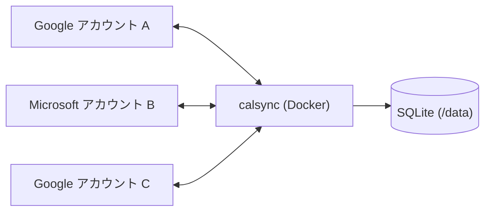

# calsync v1 Implementation Plan

> **For agentic workers:** REQUIRED SUB-SKILL: Use superpowers:subagent-driven-development (recommended) or superpowers:executing-plans to implement this plan task-by-task. Steps use checkbox (`- [ ]`) syntax for tracking.

**Goal:** 複数の Google / Microsoft カレンダーを相互監視し、Busy 予定を他の全アカウントに「予定あり」ブロッカーとしてミラーする、セルフホスト型 Go 製デーモン calsync v1 を実装する。

**Architecture:** Hub & Spoke 構成。差分ポーリング(Google syncToken / Graph deltaLink)で変更を 1 つの同期エンジンに集約し、SQLite の mappings テーブル(一次)+ 拡張プロパティタグ(二次)でループを遮断しながら、冪等キー付きでブロッカーを配布する。仕様書: `docs/superpowers/specs/2026-07-03-calsync-design.md`(全タスクの正)。

**Tech Stack:** Go 1.25 / cobra / yaml.v3 / modernc.org/sqlite(CGO 不使用)/ gofrs/flock / golang.org/x/oauth2(両プロバイダ・MSAL 不使用)/ google.golang.org/api/calendar/v3 / Microsoft Graph は net/http 直叩き / testify(require)

## Global Constraints

- module は `github.com/work-a-co/calsync`、Go 1.25、`CGO_ENABLED=0`(distroless 配布のため)
- 依存ライブラリは上記 Tech Stack のみ。追加しない(YAGNI)
- 図はすべて Mermaid(このリポジトリは ASCII 図禁止)
- コミットは Conventional Commits(feat: / fix: / test: / docs: / chore:、英語)。各タスク末尾で必ずコミット
- ブロッカー既定タイトルは「予定あり」。ブロッカーは reminders 無効・private・busy で作成
- Graph 全リクエストに `Prefer: IdType="ImmutableId"` を付与し、`Prefer: odata.maxpagesize` は使わない
- v1 制約: Microsoft はプライマリカレンダーのみ / 過去方向は同期しない / 単一インスタンス前提(flock)
- ウィンドウ判定はクライアント側フィルタが正(サーバー側ウィンドウはベストエフォート)
- カーソル失効時(Google 410 / Graph 410・syncStateNotFound)に mappings をワイプしない(カーソルとイベントキャッシュのみ破棄)
- 各タスクの型名・シグネチャは本計画に書かれたものを厳守(タスク間の整合はこの計画で保証されている)

## タスク一覧(全21・依存順)

| # | タスク | 依存 |
| --- | --- | --- |
| 1 | プロジェクト初期化 + model パッケージ | — |
| 2 | config パッケージ | 1 |
| 3 | store: Open/migrate/flock + calendars | 1 |
| 4 | store: events キャッシュ | 3 |
| 5 | store: mappings | 3 |
| 6 | provider インターフェース + fake | 1 |
| 7 | engine: classify | 1 |
| 8 | engine: processEvent + 配布 | 2–7 |
| 9 | engine: iCalUID 重複抑止 + 昇格 | 8 |
| 10 | engine: FullResync + カーソル失効リカバリ | 8 |
| 11 | engine: Reconcile(adoption・pending・suppressed) | 9, 10 |
| 12 | auth: TokenStore + PersistingTokenSource | 1 |
| 13 | auth: ループバック PKCE + Device Code | 12 |
| 14 | provider/google: Changes | 6 |
| 15 | provider/google: ブロッカー CRUD + ListBlockers | 14 |
| 16 | provider/microsoft: Changes | 6 |
| 17 | provider/microsoft: ブロッカー CRUD + ListBlockers | 16 |
| 18 | engine/scheduler: Run ループ + reconcile_at | 11 |
| 19 | CLI 配線(run/sync/status/doctor/auth) | 13, 15, 17, 18 |
| 20 | accounts remove | 19 |
| 21 | Dockerfile + compose + README | 19 |

---

### Task 1: プロジェクト初期化 + model パッケージ(TimeHash/キー導出のテスト付き)

**Files:**
- Create: `go.mod`(+ `go.sum`)
- Create: `internal/model/model.go`
- Test: `internal/model/model_test.go`

**Interfaces:**
- Consumes: なし(最初のタスク)
- Produces(後続の全タスクが依存):
  - `type Window struct { Start, End time.Time }` / `func (w Window) Contains(ev NormalizedEvent) bool`
  - `type CalendarRef struct { AccountID, CalendarID string }` / `func (r CalendarRef) String() string`
  - `type NormalizedEvent struct { ID, ICalUID string; StartUTC, EndUTC time.Time; IsAllDay bool; AllDayStart, AllDayEnd string; IsBusy, IsDeclined, Deleted bool; OriginTag string }`
  - `type Blocker struct { Title string; StartUTC, EndUTC time.Time; IsAllDay bool; AllDayStart, AllDayEnd, TargetTimezone, OriginTag string }`
  - `type BlockerRecord struct { EventID, OriginTag, TimeHash string }`
  - `func OriginTagOf(accountID, eventID string) string`
  - `func TimeHash(ev NormalizedEvent) string`
  - `func GoogleBlockerID(originTag, targetAccount string) string`
  - `func MSTransactionID(originTag, targetAccount string) string`

- [ ] **Step 1: Go モジュールを初期化する**

リポジトリルート(`/Users/user/ghq/github.com/work-a-co/calsync`)で実行する。コントラクトの固定値どおり module パスは `github.com/work-a-co/calsync`、Go バージョンは 1.25 に固定する(ローカルの toolchain が新しくても `go mod edit -go=1.25` で明示的に揃える)。

Run:
```bash
go mod init github.com/work-a-co/calsync
go mod edit -go=1.25
```
Expected:
```
go: creating new go.mod: module github.com/work-a-co/calsync
```
(`go.mod` に `module github.com/work-a-co/calsync` と `go 1.25` が入る)

- [ ] **Step 2: 依存を追加する(コントラクト固定の7モジュール。これ以外を追加しない)**

Run:
```bash
go get github.com/spf13/cobra@latest \
  gopkg.in/yaml.v3@latest \
  modernc.org/sqlite@latest \
  github.com/gofrs/flock@latest \
  golang.org/x/oauth2@latest \
  google.golang.org/api@latest \
  github.com/stretchr/testify@latest
```
Expected: 各モジュールについて `go: added github.com/spf13/cobra v1.x.x` 形式の行が出力され、`go.mod` の require に7モジュール(+間接依存)が追加され、`go.sum` が生成される。

注意: この時点では大半の依存が未使用のため、**全タスク完了まで `go mod tidy` を実行しない**(実行すると未使用 require が削除され、後続タスクで再取得が必要になる)。

- [ ] **Step 3: モジュール初期化をコミットする**

Run:
```bash
git add go.mod go.sum
git commit -m "chore: initialize Go module and add pinned dependencies"
```

- [ ] **Step 4: 失敗するテストを書く**

`internal/model/model_test.go` を以下の内容で作成する。検証対象: TimeHash が終日/時刻指定で異なる・同一入力で安定・非UTC入力の正規化、GoogleBlockerID が接頭辞 `cs` + Google 許容文字(a-v0-9)のみで構成、MSTransactionID の形式(`calsync-` + 32桁hex)、OriginTagOf、Window.Contains の境界(end==Window.Start は除外、部分重なりは包含、終日イベント)。

```go
package model

import (
	"testing"
	"time"

	"github.com/stretchr/testify/require"
)

func TestTimeHash(t *testing.T) {
	jst := time.FixedZone("JST", 9*60*60)
	timed := func(startHour, endHour int) NormalizedEvent {
		return NormalizedEvent{
			StartUTC: time.Date(2026, 7, 10, startHour, 0, 0, 0, time.UTC),
			EndUTC:   time.Date(2026, 7, 10, endHour, 0, 0, 0, time.UTC),
		}
	}
	allDay := func(start, end string) NormalizedEvent {
		return NormalizedEvent{IsAllDay: true, AllDayStart: start, AllDayEnd: end}
	}

	tests := []struct {
		name      string
		a, b      NormalizedEvent
		wantEqual bool
	}{
		{
			name:      "same timed input is stable",
			a:         timed(1, 2),
			b:         timed(1, 2),
			wantEqual: true,
		},
		{
			name: "non-UTC location is normalized before hashing",
			a:    timed(1, 2),
			b: NormalizedEvent{
				StartUTC: time.Date(2026, 7, 10, 10, 0, 0, 0, jst), // == 2026-07-10T01:00Z
				EndUTC:   time.Date(2026, 7, 10, 11, 0, 0, 0, jst), // == 2026-07-10T02:00Z
			},
			wantEqual: true,
		},
		{
			name:      "different end time differs",
			a:         timed(1, 2),
			b:         timed(1, 3),
			wantEqual: false,
		},
		{
			name:      "same all-day input is stable",
			a:         allDay("2026-07-10", "2026-07-11"),
			b:         allDay("2026-07-10", "2026-07-11"),
			wantEqual: true,
		},
		{
			name: "all-day differs from timed event covering the same instant range",
			a:    allDay("2026-07-10", "2026-07-11"),
			b: NormalizedEvent{
				StartUTC: time.Date(2026, 7, 10, 0, 0, 0, 0, time.UTC),
				EndUTC:   time.Date(2026, 7, 11, 0, 0, 0, 0, time.UTC),
			},
			wantEqual: false,
		},
		{
			name:      "different all-day dates differ",
			a:         allDay("2026-07-10", "2026-07-11"),
			b:         allDay("2026-07-10", "2026-07-12"),
			wantEqual: false,
		},
	}
	for _, tt := range tests {
		t.Run(tt.name, func(t *testing.T) {
			ha, hb := TimeHash(tt.a), TimeHash(tt.b)
			require.Regexp(t, `^[0-9a-f]{16}$`, ha, "TimeHash must be 16 hex chars")
			require.Regexp(t, `^[0-9a-f]{16}$`, hb, "TimeHash must be 16 hex chars")
			if tt.wantEqual {
				require.Equal(t, ha, hb)
			} else {
				require.NotEqual(t, ha, hb)
			}
		})
	}
}

func TestIdempotencyKeys(t *testing.T) {
	tests := []struct {
		name          string
		originTag     string
		targetAccount string
	}{
		{name: "basic", originTag: "acct-a:ev123", targetAccount: "acct-b"},
		{name: "different target yields different keys", originTag: "acct-a:ev123", targetAccount: "acct-c"},
		{name: "different origin event yields different keys", originTag: "acct-a:ev999", targetAccount: "acct-b"},
	}
	seenGoogle := map[string]bool{}
	seenMS := map[string]bool{}
	for _, tt := range tests {
		t.Run(tt.name, func(t *testing.T) {
			g := GoogleBlockerID(tt.originTag, tt.targetAccount)
			// 接頭辞 cs + sha256 先頭20バイトの base32(5bit×32文字)。Google の
			// クライアント生成 ID 許容文字 a-v0-9(base32hex 小文字)のみで構成される。
			require.Regexp(t, `^cs[a-v0-9]{32}$`, g)
			require.Equal(t, g, GoogleBlockerID(tt.originTag, tt.targetAccount), "must be deterministic")
			require.False(t, seenGoogle[g], "GoogleBlockerID must be unique per (originTag, targetAccount)")
			seenGoogle[g] = true

			m := MSTransactionID(tt.originTag, tt.targetAccount)
			// calsync- + sha256 先頭16バイトの hex(32桁)。
			require.Regexp(t, `^calsync-[0-9a-f]{32}$`, m)
			require.Equal(t, m, MSTransactionID(tt.originTag, tt.targetAccount), "must be deterministic")
			require.False(t, seenMS[m], "MSTransactionID must be unique per (originTag, targetAccount)")
			seenMS[m] = true
		})
	}
}

func TestOriginTagOf(t *testing.T) {
	require.Equal(t, "acct-a:ev123", OriginTagOf("acct-a", "ev123"))
}

func TestCalendarRefString(t *testing.T) {
	require.Equal(t, "acct-a/primary", CalendarRef{AccountID: "acct-a", CalendarID: "primary"}.String())
}

func TestWindowContains(t *testing.T) {
	w := Window{
		Start: time.Date(2026, 7, 1, 0, 0, 0, 0, time.UTC),
		End:   time.Date(2026, 10, 1, 0, 0, 0, 0, time.UTC),
	}
	d := func(month time.Month, day, hour int) time.Time {
		return time.Date(2026, month, day, hour, 0, 0, 0, time.UTC)
	}
	timed := func(start, end time.Time) NormalizedEvent {
		return NormalizedEvent{StartUTC: start, EndUTC: end}
	}
	allDay := func(start, end string) NormalizedEvent {
		return NormalizedEvent{IsAllDay: true, AllDayStart: start, AllDayEnd: end}
	}

	tests := []struct {
		name string
		ev   NormalizedEvent
		want bool
	}{
		{"fully inside is included", timed(d(7, 10, 10), d(7, 10, 11)), true},
		{"end exactly at window start is excluded", timed(d(6, 30, 23), d(7, 1, 0)), false},
		{"start exactly at window end is excluded", timed(d(10, 1, 0), d(10, 1, 1)), false},
		{"partial overlap across window start is included", timed(d(6, 30, 23), d(7, 1, 1)), true},
		{"partial overlap across window end is included", timed(d(9, 30, 23), d(10, 1, 1)), true},
		{"event spanning the entire window is included", timed(d(6, 1, 0), d(11, 1, 0)), true},
		{"entirely before window is excluded", timed(d(6, 1, 0), d(6, 2, 0)), false},
		{"entirely after window is excluded", timed(d(10, 2, 0), d(10, 3, 0)), false},
		{"all-day inside window is included", allDay("2026-07-10", "2026-07-11"), true},
		{"all-day ending on window start date is excluded", allDay("2026-06-30", "2026-07-01"), false},
		{"all-day overlapping window start is included", allDay("2026-06-30", "2026-07-02"), true},
		{"all-day starting at window end is excluded", allDay("2026-10-01", "2026-10-02"), false},
		{"all-day with unparsable dates is excluded", NormalizedEvent{IsAllDay: true}, false},
	}
	for _, tt := range tests {
		t.Run(tt.name, func(t *testing.T) {
			require.Equal(t, tt.want, w.Contains(tt.ev))
		})
	}
}
```

- [ ] **Step 5: テストが失敗することを確認**

Run:
```bash
go test ./internal/model/
```
Expected: FAIL(`model.go` が未作成のため参照先の型・関数が全て未定義でビルドエラー)
```
# github.com/work-a-co/calsync/internal/model [github.com/work-a-co/calsync/internal/model.test]
internal/model/model_test.go:13:10: undefined: NormalizedEvent
internal/model/model_test.go:87:15: undefined: TimeHash
internal/model/model_test.go:110:9: undefined: GoogleBlockerID
internal/model/model_test.go:118:9: undefined: MSTransactionID
internal/model/model_test.go:130:33: undefined: OriginTagOf
internal/model/model_test.go:134:34: undefined: CalendarRef
internal/model/model_test.go:138:7: undefined: Window
FAIL	github.com/work-a-co/calsync/internal/model [build failed]
```
(行番号は目安。`undefined:` の対象が上記シンボル群であることを確認する)

- [ ] **Step 6: 最小実装(コントラクトの model.go 全文をそのまま採用)**

`internal/model/model.go` を以下の内容で作成する。共通コントラクトの全文であり、一字も変更しない。

```go
package model

import (
	"crypto/sha256"
	"encoding/base32"
	"encoding/hex"
	"fmt"
	"time"
)

type Window struct {
	Start time.Time // 含む(end > Start のイベントが対象)
	End   time.Time // 含まない(start < End のイベントが対象)
}

type CalendarRef struct {
	AccountID  string
	CalendarID string // Google: "primary" 等 / Microsoft: 常に "primary"(v1)
}

type NormalizedEvent struct {
	ID          string // プロバイダのイベントID(opaque。パース禁止)
	ICalUID     string
	StartUTC    time.Time
	EndUTC      time.Time
	IsAllDay    bool
	AllDayStart string // "2006-01-02"(IsAllDay時のみ。現地日付)
	AllDayEnd   string // 排他的終了日
	IsBusy      bool
	IsDeclined  bool
	Deleted     bool   // cancelled / @removed / isCancelled
	OriginTag   string // calsync タグが読めた場合のみ(Graph delta では常に "")
}

type Blocker struct {
	Title          string
	StartUTC       time.Time
	EndUTC         time.Time
	IsAllDay       bool
	AllDayStart    string
	AllDayEnd      string
	TargetTimezone string // 終日ブロッカー作成用(Graph はこのTZの midnight 境界で作る)
	OriginTag      string
}

type BlockerRecord struct {
	EventID   string
	OriginTag string
	TimeHash  string
}

// OriginTag は "<origin_account_id>:<origin_event_id>"
func OriginTagOf(accountID, eventID string) string { return accountID + ":" + eventID }

// TimeHash: 予定時刻の変更検出用。16桁hex。
func TimeHash(ev NormalizedEvent) string {
	var s string
	if ev.IsAllDay {
		s = "allday|" + ev.AllDayStart + "|" + ev.AllDayEnd
	} else {
		s = ev.StartUTC.UTC().Format(time.RFC3339) + "|" + ev.EndUTC.UTC().Format(time.RFC3339)
	}
	sum := sha256.Sum256([]byte(s))
	return hex.EncodeToString(sum[:])[:16]
}

var b32 = base32.NewEncoding("abcdefghijklmnopqrstuv0123456789").WithPadding(base32.NoPadding) // 疑似base32hex(Google許容文字 a-v0-9)

// GoogleBlockerID: Google events.insert の id に指定するクライアント生成ID(冪等キー)。
func GoogleBlockerID(originTag, targetAccount string) string {
	sum := sha256.Sum256([]byte("gcal|" + originTag + "|" + targetAccount))
	return "cs" + b32.EncodeToString(sum[:20])
}

// MSTransactionID: Graph イベント作成の transactionId(冪等キー)。
func MSTransactionID(originTag, targetAccount string) string {
	sum := sha256.Sum256([]byte("msgraph|" + originTag + "|" + targetAccount))
	return "calsync-" + hex.EncodeToString(sum[:16])
}

func (w Window) Contains(ev NormalizedEvent) bool {
	if ev.IsAllDay {
		// 終日は現地日付だが、境界判定は日付をUTC日付として近似してよい(仕様5.3)
		start, err1 := time.Parse("2006-01-02", ev.AllDayStart)
		end, err2 := time.Parse("2006-01-02", ev.AllDayEnd)
		if err1 != nil || err2 != nil {
			return false
		}
		return end.After(w.Start) && start.Before(w.End)
	}
	return ev.EndUTC.After(w.Start) && ev.StartUTC.Before(w.End)
}

func (r CalendarRef) String() string { return fmt.Sprintf("%s/%s", r.AccountID, r.CalendarID) }
```

- [ ] **Step 7: テストが通ることを確認**

Run:
```bash
go test ./internal/model/ -v
```
Expected: PASS(全サブテスト成功)
```
=== RUN   TestTimeHash
=== RUN   TestTimeHash/same_timed_input_is_stable
...
--- PASS: TestTimeHash (0.00s)
--- PASS: TestIdempotencyKeys (0.00s)
--- PASS: TestOriginTagOf (0.00s)
--- PASS: TestCalendarRefString (0.00s)
--- PASS: TestWindowContains (0.00s)
PASS
ok  	github.com/work-a-co/calsync/internal/model	0.xxxs
```

- [ ] **Step 8: コミット**

Run:
```bash
git add internal/model/
git commit -m "feat: add model package with normalized types, TimeHash, and idempotency key derivation"
```

### Task 2: config パッケージ(YAML ロード・検証・期間パース)

**Files:**
- Create: `internal/config/config.go`
- Test: `internal/config/config_test.go`

**Interfaces:**
- Consumes(Task 1):
  - `model.Window`(`WindowFrom` の戻り値型)
- Produces(engine / CLI / provider 構築が依存):
  - `type Config struct { PollInterval time.Duration; SyncWindowMonths, SyncWindowDays int; BlockerTitle, ReconcileAt string; DedupeSameMeeting bool; BusyShowAs []string; Providers ProvidersConfig; Accounts []Account }`
  - `type ProvidersConfig struct { Google struct{ CredentialsFile string }; Microsoft struct{ ClientID string } }`
  - `type Account struct { ID, Provider, Email string; Calendars []string; BlockerCalendar string }`
  - `func Load(path string) (*Config, error)`
  - `func (c *Config) WindowFrom(now time.Time) model.Window`
  - `func (c *Config) TargetsOf(originAccountID string) []Account`
  - `func (c *Config) AccountByID(id string) *Account`

- [ ] **Step 1: 失敗するテストを書く**

`internal/config/config_test.go` を以下の内容で作成する。テーブルドリブンで、各ケースは `t.TempDir()` に YAML ファイルを書いてから `Load` する。検証対象: 正常系のデフォルト補完(PollInterval 1m / SyncWindow 3mo / BlockerTitle 予定あり / ReconcileAt 04:00 / DedupeSameMeeting true / BusyShowAs 既定 / Calendars・BlockerCalendar 既定 primary)、明示指定の上書き、`sync_window` の `3mo`/`90d`/不正値、ID 重複エラー、provider 不正エラー、microsoft の primary 以外エラー(v1制約)、`yaml.v3` の `KnownFields(true)` による未知キーエラー、`WindowFrom`/`TargetsOf`/`AccountByID`。

```go
package config

import (
	"os"
	"path/filepath"
	"testing"
	"time"

	"github.com/stretchr/testify/require"
)

func writeConfig(t *testing.T, content string) string {
	t.Helper()
	path := filepath.Join(t.TempDir(), "calsync.yaml")
	require.NoError(t, os.WriteFile(path, []byte(content), 0o600))
	return path
}

const minimalYAML = `
accounts:
  - id: personal
    provider: google
    email: user@gmail.com
`

func TestLoad(t *testing.T) {
	tests := []struct {
		name    string
		yaml    string
		wantErr string                        // 空なら成功を期待。非空なら err.Error() に含まれる文字列
		check   func(t *testing.T, c *Config) // 成功時の追加検証
	}{
		{
			name: "defaults are applied for a minimal config",
			yaml: minimalYAML,
			check: func(t *testing.T, c *Config) {
				require.Equal(t, time.Minute, c.PollInterval)
				require.Equal(t, 3, c.SyncWindowMonths)
				require.Equal(t, 0, c.SyncWindowDays)
				require.Equal(t, "予定あり", c.BlockerTitle)
				require.Equal(t, "04:00", c.ReconcileAt)
				require.True(t, c.DedupeSameMeeting)
				require.Equal(t, []string{"busy", "oof", "tentative"}, c.BusyShowAs)
				require.Len(t, c.Accounts, 1)
				require.Equal(t, "personal", c.Accounts[0].ID)
				require.Equal(t, "google", c.Accounts[0].Provider)
				require.Equal(t, "user@gmail.com", c.Accounts[0].Email)
				require.Equal(t, []string{"primary"}, c.Accounts[0].Calendars)
				require.Equal(t, "primary", c.Accounts[0].BlockerCalendar)
			},
		},
		{
			name: "explicit values override defaults",
			yaml: `
poll_interval: 5m
sync_window: 90d
blocker_title: Busy
reconcile_at: "03:30"
dedupe_same_meeting: false
busy_show_as: [busy, oof]
providers:
  google:
    credentials_file: /data/google-client.json
  microsoft:
    client_id: 00000000-1111-2222-3333-444444444444
accounts:
  - id: personal
    provider: google
    email: user@gmail.com
    calendars: [primary, team@group.calendar.google.com]
    blocker_calendar: blockers@group.calendar.google.com
  - id: work-ms
    provider: microsoft
    email: user@example365.co.jp
`,
			check: func(t *testing.T, c *Config) {
				require.Equal(t, 5*time.Minute, c.PollInterval)
				require.Equal(t, 0, c.SyncWindowMonths)
				require.Equal(t, 90, c.SyncWindowDays)
				require.Equal(t, "Busy", c.BlockerTitle)
				require.Equal(t, "03:30", c.ReconcileAt)
				require.False(t, c.DedupeSameMeeting)
				require.Equal(t, []string{"busy", "oof"}, c.BusyShowAs)
				require.Equal(t, "/data/google-client.json", c.Providers.Google.CredentialsFile)
				require.Equal(t, "00000000-1111-2222-3333-444444444444", c.Providers.Microsoft.ClientID)
				require.Len(t, c.Accounts, 2)
				require.Equal(t, []string{"primary", "team@group.calendar.google.com"}, c.Accounts[0].Calendars)
				require.Equal(t, "blockers@group.calendar.google.com", c.Accounts[0].BlockerCalendar)
				require.Equal(t, []string{"primary"}, c.Accounts[1].Calendars)
				require.Equal(t, "primary", c.Accounts[1].BlockerCalendar)
			},
		},
		{
			name: "sync_window in months",
			yaml: "sync_window: 6mo\n" + minimalYAML,
			check: func(t *testing.T, c *Config) {
				require.Equal(t, 6, c.SyncWindowMonths)
				require.Equal(t, 0, c.SyncWindowDays)
			},
		},
		{
			name:    "invalid sync_window unit is rejected",
			yaml:    "sync_window: 3w\n" + minimalYAML,
			wantErr: "invalid sync_window",
		},
		{
			name:    "invalid poll_interval is rejected",
			yaml:    "poll_interval: fast\n" + minimalYAML,
			wantErr: "invalid poll_interval",
		},
		{
			name:    "invalid reconcile_at is rejected",
			yaml:    "reconcile_at: \"25:99\"\n" + minimalYAML,
			wantErr: "invalid reconcile_at",
		},
		{
			name: "duplicate account id is rejected",
			yaml: `
accounts:
  - id: personal
    provider: google
    email: a@gmail.com
  - id: personal
    provider: microsoft
    email: b@example.com
`,
			wantErr: `duplicate account id "personal"`,
		},
		{
			name: "missing account id is rejected",
			yaml: `
accounts:
  - provider: google
    email: a@gmail.com
`,
			wantErr: "id is required",
		},
		{
			name: "unsupported provider is rejected",
			yaml: `
accounts:
  - id: icloud
    provider: apple
    email: a@icloud.com
`,
			wantErr: `unsupported provider "apple"`,
		},
		{
			name: "microsoft non-primary calendars are rejected (v1 constraint)",
			yaml: `
accounts:
  - id: work-ms
    provider: microsoft
    email: a@example.com
    calendars: [primary, second]
`,
			wantErr: "microsoft supports only the primary calendar",
		},
		{
			name: "microsoft non-primary blocker_calendar is rejected (v1 constraint)",
			yaml: `
accounts:
  - id: work-ms
    provider: microsoft
    email: a@example.com
    blocker_calendar: second
`,
			wantErr: "microsoft supports only the primary calendar",
		},
		{
			name:    "unknown top-level key is rejected by KnownFields",
			yaml:    "pol_interval: 1m\n" + minimalYAML,
			wantErr: "field pol_interval not found",
		},
		{
			name: "unknown account key is rejected by KnownFields",
			yaml: `
accounts:
  - id: personal
    provider: google
    email: a@gmail.com
    callendars: [primary]
`,
			wantErr: "field callendars not found",
		},
	}
	for _, tt := range tests {
		t.Run(tt.name, func(t *testing.T) {
			cfg, err := Load(writeConfig(t, tt.yaml))
			if tt.wantErr != "" {
				require.Error(t, err)
				require.Contains(t, err.Error(), tt.wantErr)
				return
			}
			require.NoError(t, err)
			tt.check(t, cfg)
		})
	}
}

func TestLoadMissingFile(t *testing.T) {
	_, err := Load(filepath.Join(t.TempDir(), "nope.yaml"))
	require.Error(t, err)
}

func TestWindowFrom(t *testing.T) {
	now := time.Date(2026, 7, 3, 10, 0, 0, 0, time.UTC)
	tests := []struct {
		name    string
		cfg     Config
		wantEnd time.Time
	}{
		{
			name:    "months uses AddDate(0, mo, 0)",
			cfg:     Config{SyncWindowMonths: 3},
			wantEnd: time.Date(2026, 10, 3, 10, 0, 0, 0, time.UTC),
		},
		{
			name:    "days uses AddDate(0, 0, d)",
			cfg:     Config{SyncWindowDays: 90},
			wantEnd: time.Date(2026, 10, 1, 10, 0, 0, 0, time.UTC),
		},
	}
	for _, tt := range tests {
		t.Run(tt.name, func(t *testing.T) {
			w := tt.cfg.WindowFrom(now)
			require.Equal(t, now, w.Start)
			require.Equal(t, tt.wantEnd, w.End)
		})
	}
}

func TestTargetsOfAndAccountByID(t *testing.T) {
	src := `
accounts:
  - id: a
    provider: google
    email: a@gmail.com
  - id: b
    provider: microsoft
    email: b@example.com
  - id: c
    provider: google
    email: c@gmail.com
`
	cfg, err := Load(writeConfig(t, src))
	require.NoError(t, err)

	targets := cfg.TargetsOf("b")
	ids := make([]string, 0, len(targets))
	for _, a := range targets {
		ids = append(ids, a.ID)
	}
	require.Equal(t, []string{"a", "c"}, ids, "TargetsOf must return all accounts except the origin")

	acct := cfg.AccountByID("b")
	require.NotNil(t, acct)
	require.Equal(t, "microsoft", acct.Provider)
	require.Nil(t, cfg.AccountByID("missing"))
}
```

- [ ] **Step 2: テストが失敗することを確認**

Run:
```bash
go test ./internal/config/
```
Expected: FAIL(`config.go` が未作成のためビルドエラー)
```
# github.com/work-a-co/calsync/internal/config [github.com/work-a-co/calsync/internal/config.test]
internal/config/config_test.go:29:38: undefined: Config
internal/config/config_test.go:229:15: undefined: Load
FAIL	github.com/work-a-co/calsync/internal/config [build failed]
```
(行番号は目安。`undefined: Config` / `undefined: Load` が出ることを確認する)

- [ ] **Step 3: 最小実装**

`internal/config/config.go` を以下の内容で作成する。公開型・シグネチャはコントラクトどおり。YAML の生の形(文字列の `poll_interval` / `sync_window` 等)は非公開の `raw*` 構造体で受け、`yaml.Decoder.KnownFields(true)` で未知キーをエラーにしてから、検証・デフォルト補完済みの `Config` に変換する。

```go
package config

import (
	"fmt"
	"os"
	"regexp"
	"strconv"
	"time"

	"gopkg.in/yaml.v3"

	"github.com/work-a-co/calsync/internal/model"
)

type Config struct {
	PollInterval      time.Duration // 既定 1m
	SyncWindowMonths  int           // "3mo" → 3。SyncWindowDays と排他
	SyncWindowDays    int           // "90d" → 90
	BlockerTitle      string        // 既定 "予定あり"
	ReconcileAt       string        // 既定 "04:00"(コンテナのローカルTZで解釈)
	DedupeSameMeeting bool          // 既定 true
	BusyShowAs        []string      // 既定 [busy, oof, tentative]
	Providers         ProvidersConfig
	Accounts          []Account
}

type ProvidersConfig struct {
	Google    struct{ CredentialsFile string } // GCP クライアントJSON のパス
	Microsoft struct{ ClientID string }        // Entra アプリの client_id
}

type Account struct {
	ID, Provider, Email string   // Provider は "google" | "microsoft"
	Calendars           []string // 既定 ["primary"]。microsoft は ["primary"] 以外エラー(v1制約)
	BlockerCalendar     string   // 既定 "primary"
}

// rawConfig は YAML の生の形。KnownFields(true) の照合対象になるため、
// 受理するキーはここに列挙されたものが全て。
type rawConfig struct {
	PollInterval      string       `yaml:"poll_interval"`
	SyncWindow        string       `yaml:"sync_window"`
	BlockerTitle      string       `yaml:"blocker_title"`
	ReconcileAt       string       `yaml:"reconcile_at"`
	DedupeSameMeeting *bool        `yaml:"dedupe_same_meeting"` // 未指定(nil)と false を区別する
	BusyShowAs        []string     `yaml:"busy_show_as"`
	Providers         rawProviders `yaml:"providers"`
	Accounts          []rawAccount `yaml:"accounts"`
}

type rawProviders struct {
	Google    rawGoogleProvider    `yaml:"google"`
	Microsoft rawMicrosoftProvider `yaml:"microsoft"`
}

type rawGoogleProvider struct {
	CredentialsFile string `yaml:"credentials_file"`
}

type rawMicrosoftProvider struct {
	ClientID string `yaml:"client_id"`
}

type rawAccount struct {
	ID              string   `yaml:"id"`
	Provider        string   `yaml:"provider"`
	Email           string   `yaml:"email"`
	Calendars       []string `yaml:"calendars"`
	BlockerCalendar string   `yaml:"blocker_calendar"`
}

var syncWindowRe = regexp.MustCompile(`^([0-9]+)(mo|d)$`)

// Load は YAML 設定を読み込み、検証とデフォルト補完を行う。
func Load(path string) (*Config, error) {
	f, err := os.Open(path)
	if err != nil {
		return nil, fmt.Errorf("config: %w", err)
	}
	defer f.Close()

	var raw rawConfig
	dec := yaml.NewDecoder(f)
	dec.KnownFields(true) // 未知キーはエラー(タイポの黙殺を防ぐ)
	if err := dec.Decode(&raw); err != nil {
		return nil, fmt.Errorf("config: parse %s: %w", path, err)
	}

	cfg := &Config{
		PollInterval:      time.Minute,
		SyncWindowMonths:  3,
		BlockerTitle:      "予定あり",
		ReconcileAt:       "04:00",
		DedupeSameMeeting: true,
		BusyShowAs:        []string{"busy", "oof", "tentative"},
	}
	cfg.Providers.Google.CredentialsFile = raw.Providers.Google.CredentialsFile
	cfg.Providers.Microsoft.ClientID = raw.Providers.Microsoft.ClientID

	if raw.PollInterval != "" {
		d, err := time.ParseDuration(raw.PollInterval)
		if err != nil || d <= 0 {
			return nil, fmt.Errorf("config: invalid poll_interval %q (want a positive Go duration such as \"1m\")", raw.PollInterval)
		}
		cfg.PollInterval = d
	}

	if raw.SyncWindow != "" {
		m := syncWindowRe.FindStringSubmatch(raw.SyncWindow)
		if m == nil {
			return nil, fmt.Errorf("config: invalid sync_window %q (want \"<n>mo\" or \"<n>d\", e.g. \"3mo\", \"90d\")", raw.SyncWindow)
		}
		n, err := strconv.Atoi(m[1])
		if err != nil || n <= 0 {
			return nil, fmt.Errorf("config: invalid sync_window %q (value must be a positive integer)", raw.SyncWindow)
		}
		if m[2] == "mo" {
			cfg.SyncWindowMonths, cfg.SyncWindowDays = n, 0
		} else {
			cfg.SyncWindowMonths, cfg.SyncWindowDays = 0, n
		}
	}

	if raw.BlockerTitle != "" {
		cfg.BlockerTitle = raw.BlockerTitle
	}
	if raw.ReconcileAt != "" {
		cfg.ReconcileAt = raw.ReconcileAt
	}
	if _, err := time.Parse("15:04", cfg.ReconcileAt); err != nil {
		return nil, fmt.Errorf("config: invalid reconcile_at %q (want \"HH:MM\", e.g. \"04:00\")", cfg.ReconcileAt)
	}
	if raw.DedupeSameMeeting != nil {
		cfg.DedupeSameMeeting = *raw.DedupeSameMeeting
	}
	if len(raw.BusyShowAs) > 0 {
		cfg.BusyShowAs = raw.BusyShowAs
	}

	seen := make(map[string]bool, len(raw.Accounts))
	for i, ra := range raw.Accounts {
		a := Account{
			ID:              ra.ID,
			Provider:        ra.Provider,
			Email:           ra.Email,
			Calendars:       ra.Calendars,
			BlockerCalendar: ra.BlockerCalendar,
		}
		if a.ID == "" {
			return nil, fmt.Errorf("config: accounts[%d]: id is required", i)
		}
		if seen[a.ID] {
			return nil, fmt.Errorf("config: duplicate account id %q", a.ID)
		}
		seen[a.ID] = true
		if a.Provider != "google" && a.Provider != "microsoft" {
			return nil, fmt.Errorf("config: account %q: unsupported provider %q (want \"google\" or \"microsoft\")", a.ID, a.Provider)
		}
		if len(a.Calendars) == 0 {
			a.Calendars = []string{"primary"}
		}
		if a.BlockerCalendar == "" {
			a.BlockerCalendar = "primary"
		}
		if a.Provider == "microsoft" {
			for _, cal := range a.Calendars {
				if cal != "primary" {
					return nil, fmt.Errorf("config: account %q: microsoft supports only the primary calendar in v1 (got calendar %q)", a.ID, cal)
				}
			}
			if a.BlockerCalendar != "primary" {
				return nil, fmt.Errorf("config: account %q: microsoft supports only the primary calendar in v1 (got blocker_calendar %q)", a.ID, a.BlockerCalendar)
			}
		}
		cfg.Accounts = append(cfg.Accounts, a)
	}

	return cfg, nil
}

// WindowFrom は now を起点とする同期ウィンドウを返す。
// months は AddDate(0, mo, 0)、days は AddDate(0, 0, d) で終端を計算する。
func (c *Config) WindowFrom(now time.Time) model.Window {
	end := now.AddDate(0, c.SyncWindowMonths, 0)
	if c.SyncWindowDays > 0 {
		end = now.AddDate(0, 0, c.SyncWindowDays)
	}
	return model.Window{Start: now, End: end}
}

// TargetsOf は origin 以外の全アカウント(= ブロッカー配布先)を返す。
func (c *Config) TargetsOf(originAccountID string) []Account {
	var out []Account
	for _, a := range c.Accounts {
		if a.ID != originAccountID {
			out = append(out, a)
		}
	}
	return out
}

// AccountByID は該当アカウントへのポインタを返す。無ければ nil。
func (c *Config) AccountByID(id string) *Account {
	for i := range c.Accounts {
		if c.Accounts[i].ID == id {
			return &c.Accounts[i]
		}
	}
	return nil
}
```

- [ ] **Step 4: テストが通ることを確認**

Run:
```bash
go test ./internal/config/ -v
```
Expected: PASS(全サブテスト成功)
```
=== RUN   TestLoad
=== RUN   TestLoad/defaults_are_applied_for_a_minimal_config
=== RUN   TestLoad/explicit_values_override_defaults
...
--- PASS: TestLoad (0.01s)
--- PASS: TestLoadMissingFile (0.00s)
--- PASS: TestWindowFrom (0.00s)
--- PASS: TestTargetsOfAndAccountByID (0.00s)
PASS
ok  	github.com/work-a-co/calsync/internal/config	0.xxxs
```

- [ ] **Step 5: コミット**

Run:
```bash
git add internal/config/
git commit -m "feat: add config package with YAML loading, validation, and sync window parsing"
```

### Task 3: store: Open/migrate/flock/WAL + calendars 操作

SQLite ステートストアの土台を作る。`Open` はデータディレクトリの flock 取得(二重起動で `ErrLocked`)→ SQLite オープン(WAL)→ スキーマ migrate を行う。スキーマは仕様書 7 章の SQL をベースに、コントラクトの注記どおり **events テーブルに `all_day_start TEXT` / `all_day_end TEXT` を追加**する。あわせて calendars テーブルの全操作を実装する。

前提: Task 1 で `go.mod`(module `github.com/work-a-co/calsync`、Go 1.25)と `internal/model/model.go` が作成済みであること。

補足(コントラクトへの追記): コントラクトの store API 一覧に無い `TouchSynced(ref model.CalendarRef, at time.Time) error` を追加する。`SetCalendarError` はエラー有無にかかわらず `last_synced_at` を現在時刻で更新する(コントラクトのコメント「"" でクリア。last_synced_at も更新」の実装)が、リコンサイル等で「同期成功時刻だけを明示的に記録する」操作が別途必要なため。既存シグネチャの変更ではなくメソッド追加のみ。

**Files:**
- Create: `internal/store/store.go`
- Test: `internal/store/store_test.go`
- Modify: `go.mod` / `go.sum`(`go mod tidy` による `github.com/gofrs/flock` / `modernc.org/sqlite` の追記)

**Interfaces:**
- Consumes: `model.CalendarRef{AccountID, CalendarID string}`、`model.Window{Start, End time.Time}`(Task 1)
- Produces(Task 4/5/8〜11/19/20 が依存):
  - `var ErrLocked = errors.New("data directory is locked by another calsync process")`
  - `func Open(dataDir string) (*Store, error)` / `func (s *Store) Close() error`
  - `func OpenReadOnly(dataDir string) (*Store, error)`(flock を取らない読み取り専用。status / doctor がデーモン稼働中に使う。WAL は並行リーダーを許す)
  - `type CalendarState struct { Ref model.CalendarRef; Cursor string; Window model.Window; Timezone string; LastSyncedAt time.Time; LastError string }`
  - `func (s *Store) UpsertCalendar(ref model.CalendarRef) error`
  - `func (s *Store) GetCalendar(ref model.CalendarRef) (*CalendarState, error)`(未存在は `(nil, nil)`)
  - `func (s *Store) ListCalendars() ([]CalendarState, error)`
  - `func (s *Store) SetCursor(ref model.CalendarRef, cursor string, w model.Window) error`
  - `func (s *Store) ClearCursor(ref model.CalendarRef) error`
  - `func (s *Store) SetCalendarTimezone(ref model.CalendarRef, tz string) error`
  - `func (s *Store) SetCalendarError(ref model.CalendarRef, msg string) error`
  - `func (s *Store) TouchSynced(ref model.CalendarRef, at time.Time) error`
  - `func (s *Store) DeleteCalendarsForAccount(accountID string) error`
  - テストヘルパ `mustOpen(t *testing.T) *Store`(同パッケージの Task 4/5 テストが再利用)

- [ ] **Step 1: 失敗するテストを書く**

`internal/store/store_test.go` を以下の内容で新規作成する。

```go
package store

import (
	"os"
	"path/filepath"
	"testing"
	"time"

	"github.com/stretchr/testify/require"

	"github.com/work-a-co/calsync/internal/model"
)

// mustOpen は t.TempDir にストアを開き、テスト終了時に閉じる。
// Task 4 / Task 5 のテストからも再利用する共有ヘルパ。
func mustOpen(t *testing.T) *Store {
	t.Helper()
	s, err := Open(t.TempDir())
	require.NoError(t, err)
	t.Cleanup(func() { _ = s.Close() })
	return s
}

func TestOpen_CreatesSchemaAndWAL(t *testing.T) {
	dir := t.TempDir()
	s, err := Open(dir)
	require.NoError(t, err)
	t.Cleanup(func() { _ = s.Close() })

	// DB ファイルが作成されている
	_, statErr := os.Stat(filepath.Join(dir, "calsync.db"))
	require.NoError(t, statErr)

	// WAL モードが有効
	var mode string
	require.NoError(t, s.db.QueryRow("PRAGMA journal_mode").Scan(&mode))
	require.Equal(t, "wal", mode)

	// スキーマ: 3 テーブルが存在する
	for _, tbl := range []string{"calendars", "events", "mappings"} {
		var name string
		err := s.db.QueryRow(
			"SELECT name FROM sqlite_master WHERE type='table' AND name=?", tbl).Scan(&name)
		require.NoError(t, err, "table %s must exist", tbl)
	}
}

func TestOpen_SecondOpenReturnsErrLocked(t *testing.T) {
	dir := t.TempDir()
	s1, err := Open(dir)
	require.NoError(t, err)

	// 同一ディレクトリの二重 Open は flock で弾かれる
	s2, err := Open(dir)
	require.Nil(t, s2)
	require.ErrorIs(t, err, ErrLocked)

	// Close で解放すれば再度開ける
	require.NoError(t, s1.Close())
	s3, err := Open(dir)
	require.NoError(t, err)
	require.NoError(t, s3.Close())
}

func TestOpenReadOnly_CoexistsWithRunningDaemon(t *testing.T) {
	dir := t.TempDir()
	writer, err := Open(dir) // デーモン相当(flock 保持)
	require.NoError(t, err)
	t.Cleanup(func() { _ = writer.Close() })
	ref := model.CalendarRef{AccountID: "a", CalendarID: "primary"}
	require.NoError(t, writer.UpsertCalendar(ref))

	// flock 保持中でも読み取り専用オープンは成功し、読める
	ro, err := OpenReadOnly(dir)
	require.NoError(t, err)
	t.Cleanup(func() { _ = ro.Close() })
	states, err := ro.ListCalendars()
	require.NoError(t, err)
	require.Len(t, states, 1)

	// 書き込みは拒否される(mode=ro)
	require.Error(t, ro.UpsertCalendar(model.CalendarRef{AccountID: "b", CalendarID: "primary"}))
}

func TestOpenReadOnly_FailsWhenDBMissing(t *testing.T) {
	_, err := OpenReadOnly(t.TempDir())
	require.Error(t, err)
}

func TestCalendars_UpsertAndGet(t *testing.T) {
	s := mustOpen(t)
	ref := model.CalendarRef{AccountID: "acct-a", CalendarID: "primary"}

	// 未存在は (nil, nil)
	got, err := s.GetCalendar(ref)
	require.NoError(t, err)
	require.Nil(t, got)

	// Upsert は冪等(2 回呼んでもエラーにならず 1 行のまま)
	require.NoError(t, s.UpsertCalendar(ref))
	require.NoError(t, s.UpsertCalendar(ref))

	got, err = s.GetCalendar(ref)
	require.NoError(t, err)
	require.NotNil(t, got)
	require.Equal(t, ref, got.Ref)
	require.Empty(t, got.Cursor)
	require.Empty(t, got.Timezone)
	require.Empty(t, got.LastError)
	require.True(t, got.Window.Start.IsZero())
	require.True(t, got.Window.End.IsZero())
	require.True(t, got.LastSyncedAt.IsZero())

	list, err := s.ListCalendars()
	require.NoError(t, err)
	require.Len(t, list, 1)
}

func TestCalendars_Mutations(t *testing.T) {
	window := model.Window{
		Start: time.Date(2026, 7, 3, 0, 0, 0, 0, time.UTC),
		End:   time.Date(2026, 10, 3, 0, 0, 0, 0, time.UTC),
	}
	syncedAt := time.Date(2026, 7, 3, 12, 34, 56, 0, time.UTC)

	cases := []struct {
		name   string
		mutate func(s *Store, ref model.CalendarRef) error
		check  func(t *testing.T, st *CalendarState)
	}{
		{
			name: "SetCursor はカーソルとウィンドウを保存する",
			mutate: func(s *Store, ref model.CalendarRef) error {
				return s.SetCursor(ref, "sync-token-1", window)
			},
			check: func(t *testing.T, st *CalendarState) {
				require.Equal(t, "sync-token-1", st.Cursor)
				require.True(t, st.Window.Start.Equal(window.Start))
				require.True(t, st.Window.End.Equal(window.End))
			},
		},
		{
			name: "ClearCursor はカーソルとウィンドウを消す",
			mutate: func(s *Store, ref model.CalendarRef) error {
				if err := s.SetCursor(ref, "sync-token-1", window); err != nil {
					return err
				}
				return s.ClearCursor(ref)
			},
			check: func(t *testing.T, st *CalendarState) {
				require.Empty(t, st.Cursor)
				require.True(t, st.Window.Start.IsZero())
				require.True(t, st.Window.End.IsZero())
			},
		},
		{
			name: "SetCalendarTimezone はタイムゾーンを保存する",
			mutate: func(s *Store, ref model.CalendarRef) error {
				return s.SetCalendarTimezone(ref, "Asia/Tokyo")
			},
			check: func(t *testing.T, st *CalendarState) {
				require.Equal(t, "Asia/Tokyo", st.Timezone)
			},
		},
		{
			name: "SetCalendarError はメッセージを記録し last_synced_at も更新する",
			mutate: func(s *Store, ref model.CalendarRef) error {
				return s.SetCalendarError(ref, "boom")
			},
			check: func(t *testing.T, st *CalendarState) {
				require.Equal(t, "boom", st.LastError)
				require.False(t, st.LastSyncedAt.IsZero())
			},
		},
		{
			name: "SetCalendarError の空文字はエラーをクリアする",
			mutate: func(s *Store, ref model.CalendarRef) error {
				if err := s.SetCalendarError(ref, "boom"); err != nil {
					return err
				}
				return s.SetCalendarError(ref, "")
			},
			check: func(t *testing.T, st *CalendarState) {
				require.Empty(t, st.LastError)
				require.False(t, st.LastSyncedAt.IsZero())
			},
		},
		{
			name: "TouchSynced は指定時刻を last_synced_at に保存する",
			mutate: func(s *Store, ref model.CalendarRef) error {
				return s.TouchSynced(ref, syncedAt)
			},
			check: func(t *testing.T, st *CalendarState) {
				require.True(t, st.LastSyncedAt.Equal(syncedAt))
			},
		},
	}
	for _, tc := range cases {
		t.Run(tc.name, func(t *testing.T) {
			s := mustOpen(t)
			ref := model.CalendarRef{AccountID: "acct-a", CalendarID: "primary"}
			require.NoError(t, s.UpsertCalendar(ref))
			require.NoError(t, tc.mutate(s, ref))
			st, err := s.GetCalendar(ref)
			require.NoError(t, err)
			require.NotNil(t, st)
			tc.check(t, st)
		})
	}
}

func TestCalendars_ListAndDeleteForAccount(t *testing.T) {
	s := mustOpen(t)
	refs := []model.CalendarRef{
		{AccountID: "acct-a", CalendarID: "primary"},
		{AccountID: "acct-a", CalendarID: "team"},
		{AccountID: "acct-b", CalendarID: "primary"},
	}
	for _, ref := range refs {
		require.NoError(t, s.UpsertCalendar(ref))
	}

	list, err := s.ListCalendars()
	require.NoError(t, err)
	require.Len(t, list, 3)
	gotRefs := make([]model.CalendarRef, 0, len(list))
	for _, st := range list {
		gotRefs = append(gotRefs, st.Ref)
	}
	require.Equal(t, refs, gotRefs) // account_id, calendar_id 昇順

	require.NoError(t, s.DeleteCalendarsForAccount("acct-a"))
	list, err = s.ListCalendars()
	require.NoError(t, err)
	require.Len(t, list, 1)
	require.Equal(t, refs[2], list[0].Ref)
}
```

- [ ] **Step 2: テストが失敗することを確認**

Run: `go test ./internal/store/ -v`
Expected: FAIL(ビルドエラー。実装ファイル `store.go` が存在しないため、`internal/store/store_test.go` のコンパイルが `undefined: Store` / `undefined: Open` / `undefined: ErrLocked` / `undefined: CalendarState` で失敗し、`FAIL github.com/work-a-co/calsync/internal/store [build failed]` が出る)

- [ ] **Step 3: 最小実装**

`internal/store/store.go` を以下の内容で新規作成する。

```go
// Package store は calsync のステートストア(SQLite 1 ファイル + WAL + flock)を提供する。
package store

import (
	"database/sql"
	"errors"
	"fmt"
	"os"
	"path/filepath"
	"time"

	"github.com/gofrs/flock"
	_ "modernc.org/sqlite" // driver name "sqlite" を登録

	"github.com/work-a-co/calsync/internal/model"
)

// ErrLocked は別の calsync プロセスがデータディレクトリを掴んでいる場合に Open が返す。
var ErrLocked = errors.New("data directory is locked by another calsync process")

// Store は SQLite に裏付けられたステートストア。単一プロセス前提(flock で保証)。
type Store struct {
	db   *sql.DB
	lock *flock.Flock
}

// スキーマは仕様書 7 章 + events への all_day_start/all_day_end TEXT 追加(計画側補正)。
const schema = `
CREATE TABLE IF NOT EXISTS calendars (
  account_id     TEXT NOT NULL,
  calendar_id    TEXT NOT NULL,
  cursor         TEXT,
  window_start   INTEGER,
  window_end     INTEGER,
  timezone       TEXT,
  last_synced_at INTEGER,
  last_error     TEXT,
  PRIMARY KEY (account_id, calendar_id)
);

CREATE TABLE IF NOT EXISTS events (
  account_id    TEXT NOT NULL,
  calendar_id   TEXT NOT NULL,
  event_id      TEXT NOT NULL,
  ical_uid      TEXT,
  start_utc     INTEGER,
  end_utc       INTEGER,
  is_all_day    INTEGER NOT NULL DEFAULT 0,
  all_day_start TEXT,
  all_day_end   TEXT,
  time_hash     TEXT NOT NULL,
  PRIMARY KEY (account_id, calendar_id, event_id)
);
CREATE INDEX IF NOT EXISTS idx_events_icaluid ON events (ical_uid, start_utc);

CREATE TABLE IF NOT EXISTS mappings (
  origin_account   TEXT NOT NULL,
  origin_calendar  TEXT NOT NULL,
  origin_event_id  TEXT NOT NULL,
  target_account   TEXT NOT NULL,
  target_calendar  TEXT NOT NULL,
  blocker_event_id TEXT,
  idempotency_key  TEXT NOT NULL,
  time_hash        TEXT NOT NULL,
  status           TEXT NOT NULL,
  PRIMARY KEY (origin_account, origin_calendar, origin_event_id, target_account)
);
CREATE INDEX IF NOT EXISTS idx_mappings_blocker ON mappings (target_account, blocker_event_id);
`

// Open はデータディレクトリの flock を取得し(失敗は ErrLocked)、
// WAL モードで SQLite を開いてスキーマを migrate する。
func Open(dataDir string) (*Store, error) {
	if err := os.MkdirAll(dataDir, 0o700); err != nil {
		return nil, fmt.Errorf("create data dir: %w", err)
	}
	lock := flock.New(filepath.Join(dataDir, "calsync.lock"))
	locked, err := lock.TryLock()
	if err != nil {
		return nil, fmt.Errorf("acquire lock: %w", err)
	}
	if !locked {
		return nil, ErrLocked
	}
	// _pragma はコネクションごとに適用される(database/sql のプール対策)。
	dsn := "file:" + filepath.Join(dataDir, "calsync.db") +
		"?_pragma=journal_mode(WAL)&_pragma=busy_timeout(5000)"
	db, err := sql.Open("sqlite", dsn)
	if err != nil {
		_ = lock.Unlock()
		return nil, fmt.Errorf("open sqlite: %w", err)
	}
	// SQLite は単一ライター。プール多重化による SQLITE_BUSY を避ける。
	db.SetMaxOpenConns(1)

	var mode string
	if err := db.QueryRow("PRAGMA journal_mode").Scan(&mode); err != nil {
		_ = db.Close()
		_ = lock.Unlock()
		return nil, fmt.Errorf("check journal mode: %w", err)
	}
	if mode != "wal" {
		_ = db.Close()
		_ = lock.Unlock()
		return nil, fmt.Errorf("journal_mode is %q, want wal", mode)
	}
	if _, err := db.Exec(schema); err != nil {
		_ = db.Close()
		_ = lock.Unlock()
		return nil, fmt.Errorf("migrate schema: %w", err)
	}
	return &Store{db: db, lock: lock}, nil
}

// OpenReadOnly は flock を取らずに読み取り専用で SQLite を開く。
// status / doctor 用: WAL は並行リーダーを許すため、稼働中のデーモンと共存できる。
func OpenReadOnly(dataDir string) (*Store, error) {
	dsn := "file:" + filepath.Join(dataDir, "calsync.db") +
		"?mode=ro&_pragma=busy_timeout(5000)"
	db, err := sql.Open("sqlite", dsn)
	if err != nil {
		return nil, fmt.Errorf("open sqlite read-only: %w", err)
	}
	db.SetMaxOpenConns(1)
	// sql.Open は遅延接続のため、DB ファイル欠如をここで検知する。
	if err := db.Ping(); err != nil {
		_ = db.Close()
		return nil, fmt.Errorf("open sqlite read-only: %w", err)
	}
	return &Store{db: db}, nil
}

// Close は DB を閉じ、flock を保持していれば解放する(読み取り専用時は lock が nil)。
func (s *Store) Close() error {
	dbErr := s.db.Close()
	var unlockErr error
	if s.lock != nil {
		unlockErr = s.lock.Unlock()
	}
	if dbErr != nil {
		return dbErr
	}
	return unlockErr
}

// CalendarState は calendars テーブルの 1 行。
type CalendarState struct {
	Ref          model.CalendarRef
	Cursor       string
	Window       model.Window
	Timezone     string
	LastSyncedAt time.Time
	LastError    string
}

// UpsertCalendar は行が無ければ作る(あれば何もしない)。冪等。
func (s *Store) UpsertCalendar(ref model.CalendarRef) error {
	_, err := s.db.Exec(`
INSERT INTO calendars (account_id, calendar_id) VALUES (?, ?)
ON CONFLICT (account_id, calendar_id) DO NOTHING`,
		ref.AccountID, ref.CalendarID)
	return err
}

// GetCalendar は 1 行を返す。未存在は (nil, nil)。
func (s *Store) GetCalendar(ref model.CalendarRef) (*CalendarState, error) {
	row := s.db.QueryRow(`
SELECT cursor, window_start, window_end, timezone, last_synced_at, last_error
FROM calendars WHERE account_id = ? AND calendar_id = ?`,
		ref.AccountID, ref.CalendarID)
	var (
		cursor, tz, lastError    sql.NullString
		wStart, wEnd, lastSynced sql.NullInt64
	)
	err := row.Scan(&cursor, &wStart, &wEnd, &tz, &lastSynced, &lastError)
	if errors.Is(err, sql.ErrNoRows) {
		return nil, nil
	}
	if err != nil {
		return nil, err
	}
	st := &CalendarState{
		Ref:       ref,
		Cursor:    cursor.String,
		Timezone:  tz.String,
		LastError: lastError.String,
	}
	if wStart.Valid {
		st.Window.Start = time.Unix(wStart.Int64, 0).UTC()
	}
	if wEnd.Valid {
		st.Window.End = time.Unix(wEnd.Int64, 0).UTC()
	}
	if lastSynced.Valid {
		st.LastSyncedAt = time.Unix(lastSynced.Int64, 0).UTC()
	}
	return st, nil
}

// ListCalendars は全行を (account_id, calendar_id) 昇順で返す。
func (s *Store) ListCalendars() ([]CalendarState, error) {
	rows, err := s.db.Query(`
SELECT account_id, calendar_id, cursor, window_start, window_end, timezone, last_synced_at, last_error
FROM calendars ORDER BY account_id, calendar_id`)
	if err != nil {
		return nil, err
	}
	defer rows.Close()
	var out []CalendarState
	for rows.Next() {
		var (
			acct, cal                string
			cursor, tz, lastError    sql.NullString
			wStart, wEnd, lastSynced sql.NullInt64
		)
		if err := rows.Scan(&acct, &cal, &cursor, &wStart, &wEnd, &tz, &lastSynced, &lastError); err != nil {
			return nil, err
		}
		st := CalendarState{
			Ref:       model.CalendarRef{AccountID: acct, CalendarID: cal},
			Cursor:    cursor.String,
			Timezone:  tz.String,
			LastError: lastError.String,
		}
		if wStart.Valid {
			st.Window.Start = time.Unix(wStart.Int64, 0).UTC()
		}
		if wEnd.Valid {
			st.Window.End = time.Unix(wEnd.Int64, 0).UTC()
		}
		if lastSynced.Valid {
			st.LastSyncedAt = time.Unix(lastSynced.Int64, 0).UTC()
		}
		out = append(out, st)
	}
	return out, rows.Err()
}

// SetCursor はカーソルとカーソル確立時のウィンドウを保存する(行が無ければ作る)。
func (s *Store) SetCursor(ref model.CalendarRef, cursor string, w model.Window) error {
	_, err := s.db.Exec(`
INSERT INTO calendars (account_id, calendar_id, cursor, window_start, window_end)
VALUES (?, ?, ?, ?, ?)
ON CONFLICT (account_id, calendar_id) DO UPDATE SET
  cursor       = excluded.cursor,
  window_start = excluded.window_start,
  window_end   = excluded.window_end`,
		ref.AccountID, ref.CalendarID, cursor, w.Start.Unix(), w.End.Unix())
	return err
}

// ClearCursor はカーソルとウィンドウを NULL に戻す(フル再同期のトリガー)。
func (s *Store) ClearCursor(ref model.CalendarRef) error {
	_, err := s.db.Exec(`
UPDATE calendars SET cursor = NULL, window_start = NULL, window_end = NULL
WHERE account_id = ? AND calendar_id = ?`,
		ref.AccountID, ref.CalendarID)
	return err
}

// SetCalendarTimezone は終日ブロッカー作成用のタイムゾーンをキャッシュする(行が無ければ作る)。
func (s *Store) SetCalendarTimezone(ref model.CalendarRef, tz string) error {
	_, err := s.db.Exec(`
INSERT INTO calendars (account_id, calendar_id, timezone) VALUES (?, ?, ?)
ON CONFLICT (account_id, calendar_id) DO UPDATE SET timezone = excluded.timezone`,
		ref.AccountID, ref.CalendarID, tz)
	return err
}

// SetCalendarError は last_error を設定する(msg=="" で NULL クリア)。
// 同期試行があった記録として last_synced_at も現在時刻で更新する。
func (s *Store) SetCalendarError(ref model.CalendarRef, msg string) error {
	var v any
	if msg != "" {
		v = msg
	}
	_, err := s.db.Exec(`
UPDATE calendars SET last_error = ?, last_synced_at = ?
WHERE account_id = ? AND calendar_id = ?`,
		v, time.Now().Unix(), ref.AccountID, ref.CalendarID)
	return err
}

// TouchSynced は last_synced_at を指定時刻に更新する。
func (s *Store) TouchSynced(ref model.CalendarRef, at time.Time) error {
	_, err := s.db.Exec(`
UPDATE calendars SET last_synced_at = ? WHERE account_id = ? AND calendar_id = ?`,
		at.Unix(), ref.AccountID, ref.CalendarID)
	return err
}

// DeleteCalendarsForAccount はアカウントの全カレンダー行を削除する(accounts remove 用)。
func (s *Store) DeleteCalendarsForAccount(accountID string) error {
	_, err := s.db.Exec(`DELETE FROM calendars WHERE account_id = ?`, accountID)
	return err
}
```

- [ ] **Step 4: テストが通ることを確認**

Run: `go mod tidy && go test ./internal/store/ -v`
Expected: PASS(`TestOpen_CreatesSchemaAndWAL` / `TestOpen_SecondOpenReturnsErrLocked` / `TestCalendars_UpsertAndGet` / `TestCalendars_Mutations` の全サブテスト / `TestCalendars_ListAndDeleteForAccount` がすべて `--- PASS`、`ok github.com/work-a-co/calsync/internal/store`)

- [ ] **Step 5: コミット**

```
git add go.mod go.sum internal/store/store.go internal/store/store_test.go
git commit -m "feat(store): add SQLite store with WAL, flock and calendar state ops"
```

### Task 4: store: events キャッシュ操作(HasBusyEventByICalUID 含む)

監視カレンダーの busy イベントキャッシュ(仕様書 7 章 events テーブル)の CRUD と、iCalUID 重複抑止(仕様書 6.5)用の存在判定 `HasBusyEventByICalUID` を実装する。判定は時刻指定イベントなら `ical_uid + start_utc` 完全一致、`allDayStart` 引数が非空なら `ical_uid + all_day_start` 一致で行う。`time_hash` 列は `model.TimeHash(ev)` で導出して保存する。

**Files:**
- Create: `internal/store/events.go`
- Test: `internal/store/events_test.go`

**Interfaces:**
- Consumes: `*store.Store` / `mustOpen`(Task 3)、`model.NormalizedEvent`・`model.TimeHash(ev model.NormalizedEvent) string`(Task 1)
- Produces(Task 5 の JOIN テスト、engine の Task 8〜11 が依存):
  - `func (s *Store) UpsertEvent(ref model.CalendarRef, ev model.NormalizedEvent) error`
  - `func (s *Store) GetEvent(ref model.CalendarRef, eventID string) (*model.NormalizedEvent, error)`(未存在は `(nil, nil)`)
  - `func (s *Store) DeleteEvent(ref model.CalendarRef, eventID string) error`
  - `func (s *Store) ListEventIDs(ref model.CalendarRef) ([]string, error)`
  - `func (s *Store) DeleteEventsForAccount(accountID string) error`
  - `func (s *Store) HasBusyEventByICalUID(accountID, icalUID string, startUTC time.Time, allDayStart string) (bool, error)`
  - テストヘルパ `timedEvent` / `allDayEvent`(Task 5 テストが再利用)

- [ ] **Step 1: 失敗するテストを書く**

`internal/store/events_test.go` を以下の内容で新規作成する。

```go
package store

import (
	"testing"
	"time"

	"github.com/stretchr/testify/require"

	"github.com/work-a-co/calsync/internal/model"
)

// timedEvent は時刻指定の busy イベントを作るヘルパ(Task 5 のテストも使用)。
func timedEvent(id, icalUID string, start time.Time, d time.Duration) model.NormalizedEvent {
	return model.NormalizedEvent{
		ID:       id,
		ICalUID:  icalUID,
		StartUTC: start,
		EndUTC:   start.Add(d),
		IsBusy:   true,
	}
}

// allDayEvent は終日 busy イベントを作るヘルパ(end は排他的終了日)。
func allDayEvent(id, icalUID, start, end string) model.NormalizedEvent {
	return model.NormalizedEvent{
		ID:          id,
		ICalUID:     icalUID,
		IsAllDay:    true,
		AllDayStart: start,
		AllDayEnd:   end,
		IsBusy:      true,
	}
}

func TestEvents_UpsertGetDelete(t *testing.T) {
	s := mustOpen(t)
	ref := model.CalendarRef{AccountID: "acct-a", CalendarID: "primary"}
	start := time.Date(2026, 7, 10, 9, 0, 0, 0, time.UTC)
	ev := timedEvent("ev1", "uid-1@example.com", start, time.Hour)

	// 未存在は (nil, nil)
	got, err := s.GetEvent(ref, "ev1")
	require.NoError(t, err)
	require.Nil(t, got)

	require.NoError(t, s.UpsertEvent(ref, ev))
	got, err = s.GetEvent(ref, "ev1")
	require.NoError(t, err)
	require.NotNil(t, got)
	require.Equal(t, "ev1", got.ID)
	require.Equal(t, "uid-1@example.com", got.ICalUID)
	require.True(t, got.StartUTC.Equal(start))
	require.True(t, got.EndUTC.Equal(start.Add(time.Hour)))
	require.False(t, got.IsAllDay)
	require.True(t, got.IsBusy) // キャッシュには busy イベントのみ入る契約

	// upsert: 同一キーで時刻を更新できる
	moved := timedEvent("ev1", "uid-1@example.com", start.Add(2*time.Hour), time.Hour)
	require.NoError(t, s.UpsertEvent(ref, moved))
	got, err = s.GetEvent(ref, "ev1")
	require.NoError(t, err)
	require.True(t, got.StartUTC.Equal(start.Add(2*time.Hour)))

	ids, err := s.ListEventIDs(ref)
	require.NoError(t, err)
	require.Equal(t, []string{"ev1"}, ids)

	require.NoError(t, s.DeleteEvent(ref, "ev1"))
	got, err = s.GetEvent(ref, "ev1")
	require.NoError(t, err)
	require.Nil(t, got)

	// 存在しない ID の削除はエラーにならない(冪等)
	require.NoError(t, s.DeleteEvent(ref, "ev1"))
}

func TestEvents_AllDayRoundTrip(t *testing.T) {
	s := mustOpen(t)
	ref := model.CalendarRef{AccountID: "acct-a", CalendarID: "primary"}
	ev := allDayEvent("ev-allday", "uid-ad@example.com", "2026-07-20", "2026-07-21")

	require.NoError(t, s.UpsertEvent(ref, ev))
	got, err := s.GetEvent(ref, "ev-allday")
	require.NoError(t, err)
	require.NotNil(t, got)
	require.True(t, got.IsAllDay)
	require.Equal(t, "2026-07-20", got.AllDayStart)
	require.Equal(t, "2026-07-21", got.AllDayEnd)
}

func TestEvents_ListIDsAndDeleteForAccount(t *testing.T) {
	s := mustOpen(t)
	refA1 := model.CalendarRef{AccountID: "acct-a", CalendarID: "primary"}
	refA2 := model.CalendarRef{AccountID: "acct-a", CalendarID: "team"}
	refB := model.CalendarRef{AccountID: "acct-b", CalendarID: "primary"}
	start := time.Date(2026, 7, 10, 9, 0, 0, 0, time.UTC)

	require.NoError(t, s.UpsertEvent(refA1, timedEvent("a1-ev2", "u1", start, time.Hour)))
	require.NoError(t, s.UpsertEvent(refA1, timedEvent("a1-ev1", "u2", start, time.Hour)))
	require.NoError(t, s.UpsertEvent(refA2, timedEvent("a2-ev1", "u3", start, time.Hour)))
	require.NoError(t, s.UpsertEvent(refB, timedEvent("b-ev1", "u4", start, time.Hour)))

	// event_id 昇順、他カレンダー・他アカウントは混ざらない
	ids, err := s.ListEventIDs(refA1)
	require.NoError(t, err)
	require.Equal(t, []string{"a1-ev1", "a1-ev2"}, ids)

	ids, err = s.ListEventIDs(refB)
	require.NoError(t, err)
	require.Equal(t, []string{"b-ev1"}, ids)

	// アカウント単位削除は全カレンダーに及び、他アカウントに触れない
	require.NoError(t, s.DeleteEventsForAccount("acct-a"))
	ids, err = s.ListEventIDs(refA1)
	require.NoError(t, err)
	require.Empty(t, ids)
	ids, err = s.ListEventIDs(refA2)
	require.NoError(t, err)
	require.Empty(t, ids)
	ids, err = s.ListEventIDs(refB)
	require.NoError(t, err)
	require.Equal(t, []string{"b-ev1"}, ids)
}

func TestHasBusyEventByICalUID(t *testing.T) {
	s := mustOpen(t)
	refB := model.CalendarRef{AccountID: "acct-b", CalendarID: "primary"}
	refC := model.CalendarRef{AccountID: "acct-c", CalendarID: "primary"}
	start := time.Date(2026, 7, 10, 9, 0, 0, 0, time.UTC)

	require.NoError(t, s.UpsertEvent(refB, timedEvent("b-timed", "meet-1", start, time.Hour)))
	require.NoError(t, s.UpsertEvent(refB, allDayEvent("b-allday", "ad-1", "2026-07-20", "2026-07-21")))
	require.NoError(t, s.UpsertEvent(refC, timedEvent("c-timed", "meet-2", start, time.Hour)))

	cases := []struct {
		name        string
		accountID   string
		icalUID     string
		startUTC    time.Time
		allDayStart string
		want        bool
	}{
		{"時刻指定: ical_uid+start_utc 一致でヒット", "acct-b", "meet-1", start, "", true},
		{"時刻指定: start_utc 不一致はヒットしない", "acct-b", "meet-1", start.Add(time.Hour), "", false},
		{"時刻指定: 未知の ical_uid はヒットしない", "acct-b", "no-such-uid", start, "", false},
		{"時刻指定: 他アカウントのイベントはヒットしない", "acct-b", "meet-2", start, "", false},
		{"終日: ical_uid+all_day_start 一致でヒット", "acct-b", "ad-1", time.Time{}, "2026-07-20", true},
		{"終日: 日付不一致はヒットしない", "acct-b", "ad-1", time.Time{}, "2026-07-21", false},
		{"終日: allDayStart 指定時は時刻指定イベントにヒットしない", "acct-b", "meet-1", start, "2026-07-10", false},
		{"空の ical_uid は常に false", "acct-b", "", start, "", false},
	}
	for _, tc := range cases {
		t.Run(tc.name, func(t *testing.T) {
			got, err := s.HasBusyEventByICalUID(tc.accountID, tc.icalUID, tc.startUTC, tc.allDayStart)
			require.NoError(t, err)
			require.Equal(t, tc.want, got)
		})
	}
}
```

- [ ] **Step 2: テストが失敗することを確認**

Run: `go test ./internal/store/ -v`
Expected: FAIL(ビルドエラー: `s.UpsertEvent undefined (type *Store has no field or method UpsertEvent)` / `s.GetEvent undefined ...` / `s.DeleteEvent undefined ...` / `s.ListEventIDs undefined ...` / `s.DeleteEventsForAccount undefined ...` / `s.HasBusyEventByICalUID undefined ...`、`[build failed]`)

- [ ] **Step 3: 最小実装**

`internal/store/events.go` を以下の内容で新規作成する。

```go
package store

import (
	"database/sql"
	"errors"
	"time"

	"github.com/work-a-co/calsync/internal/model"
)

func boolToInt(b bool) int {
	if b {
		return 1
	}
	return 0
}

// UpsertEvent は busy イベントをキャッシュに upsert する。
// time_hash は model.TimeHash で導出して保存する。
func (s *Store) UpsertEvent(ref model.CalendarRef, ev model.NormalizedEvent) error {
	_, err := s.db.Exec(`
INSERT INTO events (account_id, calendar_id, event_id, ical_uid, start_utc, end_utc,
                    is_all_day, all_day_start, all_day_end, time_hash)
VALUES (?, ?, ?, ?, ?, ?, ?, ?, ?, ?)
ON CONFLICT (account_id, calendar_id, event_id) DO UPDATE SET
  ical_uid      = excluded.ical_uid,
  start_utc     = excluded.start_utc,
  end_utc       = excluded.end_utc,
  is_all_day    = excluded.is_all_day,
  all_day_start = excluded.all_day_start,
  all_day_end   = excluded.all_day_end,
  time_hash     = excluded.time_hash`,
		ref.AccountID, ref.CalendarID, ev.ID, ev.ICalUID,
		ev.StartUTC.UTC().Unix(), ev.EndUTC.UTC().Unix(),
		boolToInt(ev.IsAllDay), ev.AllDayStart, ev.AllDayEnd,
		model.TimeHash(ev))
	return err
}

// GetEvent はキャッシュ行を NormalizedEvent に復元して返す。未存在は (nil, nil)。
// キャッシュには busy イベントのみ入る契約のため IsBusy=true で復元する。
func (s *Store) GetEvent(ref model.CalendarRef, eventID string) (*model.NormalizedEvent, error) {
	row := s.db.QueryRow(`
SELECT ical_uid, start_utc, end_utc, is_all_day, all_day_start, all_day_end
FROM events WHERE account_id = ? AND calendar_id = ? AND event_id = ?`,
		ref.AccountID, ref.CalendarID, eventID)
	var (
		icalUID, adStart, adEnd sql.NullString
		startUTC, endUTC        sql.NullInt64
		isAllDay                int
	)
	err := row.Scan(&icalUID, &startUTC, &endUTC, &isAllDay, &adStart, &adEnd)
	if errors.Is(err, sql.ErrNoRows) {
		return nil, nil
	}
	if err != nil {
		return nil, err
	}
	ev := &model.NormalizedEvent{
		ID:          eventID,
		ICalUID:     icalUID.String,
		IsAllDay:    isAllDay != 0,
		AllDayStart: adStart.String,
		AllDayEnd:   adEnd.String,
		IsBusy:      true,
	}
	if startUTC.Valid {
		ev.StartUTC = time.Unix(startUTC.Int64, 0).UTC()
	}
	if endUTC.Valid {
		ev.EndUTC = time.Unix(endUTC.Int64, 0).UTC()
	}
	return ev, nil
}

// DeleteEvent はキャッシュ行を削除する。未存在でもエラーにしない(冪等)。
func (s *Store) DeleteEvent(ref model.CalendarRef, eventID string) error {
	_, err := s.db.Exec(`
DELETE FROM events WHERE account_id = ? AND calendar_id = ? AND event_id = ?`,
		ref.AccountID, ref.CalendarID, eventID)
	return err
}

// ListEventIDs はカレンダーのキャッシュ済みイベント ID を昇順で返す
// (リコンサイルの set-difference 用)。
func (s *Store) ListEventIDs(ref model.CalendarRef) ([]string, error) {
	rows, err := s.db.Query(`
SELECT event_id FROM events WHERE account_id = ? AND calendar_id = ? ORDER BY event_id`,
		ref.AccountID, ref.CalendarID)
	if err != nil {
		return nil, err
	}
	defer rows.Close()
	var ids []string
	for rows.Next() {
		var id string
		if err := rows.Scan(&id); err != nil {
			return nil, err
		}
		ids = append(ids, id)
	}
	return ids, rows.Err()
}

// DeleteEventsForAccount はアカウントの全キャッシュを削除する(accounts remove / フル再同期用)。
func (s *Store) DeleteEventsForAccount(accountID string) error {
	_, err := s.db.Exec(`DELETE FROM events WHERE account_id = ?`, accountID)
	return err
}

// HasBusyEventByICalUID はターゲットアカウントに「同一会議の実予定」があるかを返す(仕様書 6.5)。
// allDayStart が非空なら ical_uid + all_day_start 一致、そうでなければ ical_uid + start_utc 一致で判定する。
func (s *Store) HasBusyEventByICalUID(accountID, icalUID string, startUTC time.Time, allDayStart string) (bool, error) {
	if icalUID == "" {
		return false, nil
	}
	var (
		n   int
		err error
	)
	if allDayStart != "" {
		err = s.db.QueryRow(`
SELECT COUNT(1) FROM events
WHERE account_id = ? AND ical_uid = ? AND all_day_start = ?`,
			accountID, icalUID, allDayStart).Scan(&n)
	} else {
		err = s.db.QueryRow(`
SELECT COUNT(1) FROM events
WHERE account_id = ? AND ical_uid = ? AND start_utc = ?`,
			accountID, icalUID, startUTC.UTC().Unix()).Scan(&n)
	}
	if err != nil {
		return false, err
	}
	return n > 0, nil
}
```

- [ ] **Step 4: テストが通ることを確認**

Run: `go test ./internal/store/ -v`
Expected: PASS(Task 3 の全テストに加え `TestEvents_UpsertGetDelete` / `TestEvents_AllDayRoundTrip` / `TestEvents_ListIDsAndDeleteForAccount` / `TestHasBusyEventByICalUID` の全サブテストが `--- PASS`)

- [ ] **Step 5: コミット**

```
git add internal/store/events.go internal/store/events_test.go
git commit -m "feat(store): add busy event cache with iCalUID dedupe lookup"
```

### Task 5: store: mappings 操作(状態遷移・JOIN クエリ含む)

origin 予定 → ブロッカーの対応表(仕様書 7 章 mappings テーブル)を実装する。`status` は `pending | active | suppressed` の 3 状態(仕様書 6.4/6.5)。`blocker_event_id` は pending / suppressed 中は空("")で、DB には NULL として保存する。`IsBlocker` はループ防止の一次判定(仕様書 6.3)で、`blocker_event_id` が空の行にヒットしてはならない。`ListSuppressedByOriginICalUID` は suppressed 昇格(仕様書 6.5)用に events キャッシュと JOIN する。

**Files:**
- Create: `internal/store/mappings.go`
- Test: `internal/store/mappings_test.go`

**Interfaces:**
- Consumes: `*store.Store` / `mustOpen`(Task 3)、`UpsertEvent` / `timedEvent` ヘルパ(Task 4。JOIN テストで使用)
- Produces(engine の Task 8〜11、CLI の Task 19/20 が依存):
  - `type Mapping struct { OriginAccount, OriginCalendar, OriginEventID string; TargetAccount, TargetCalendar string; BlockerEventID string; IdempotencyKey string; TimeHash string; Status string }`
  - `const StatusPending = "pending"` / `StatusActive = "active"` / `StatusSuppressed = "suppressed"`
  - `func (s *Store) PutMapping(m Mapping) error`(upsert)
  - `func (s *Store) GetMapping(originAcct, originCal, originEventID, targetAcct string) (*Mapping, error)`(未存在は `(nil, nil)`)
  - `func (s *Store) DeleteMapping(originAcct, originCal, originEventID, targetAcct string) error`
  - `func (s *Store) ListMappingsForOrigin(originAcct, originCal, originEventID string) ([]Mapping, error)`
  - `func (s *Store) ListMappingsWhereOriginAccount(accountID string) ([]Mapping, error)`
  - `func (s *Store) ListMappingsWhereTargetAccount(accountID string) ([]Mapping, error)`
  - `func (s *Store) IsBlocker(targetAcct, eventID string) (bool, error)`
  - `func (s *Store) ListPendingMappings() ([]Mapping, error)`
  - `func (s *Store) ListSuppressedByOriginICalUID(targetAcct, icalUID string) ([]Mapping, error)`

- [ ] **Step 1: 失敗するテストを書く**

`internal/store/mappings_test.go` を以下の内容で新規作成する。

```go
package store

import (
	"testing"
	"time"

	"github.com/stretchr/testify/require"

	"github.com/work-a-co/calsync/internal/model"
)

func mkMapping(originAcct, originEventID, targetAcct, status, blockerID string) Mapping {
	return Mapping{
		OriginAccount:  originAcct,
		OriginCalendar: "primary",
		OriginEventID:  originEventID,
		TargetAccount:  targetAcct,
		TargetCalendar: "primary",
		BlockerEventID: blockerID,
		IdempotencyKey: "idem-" + originAcct + "-" + originEventID + "-" + targetAcct,
		TimeHash:       "1111222233334444",
		Status:         status,
	}
}

func TestMappings_PutGetDelete(t *testing.T) {
	s := mustOpen(t)

	// 未存在は (nil, nil)
	got, err := s.GetMapping("acct-a", "primary", "ev1", "acct-b")
	require.NoError(t, err)
	require.Nil(t, got)

	m := mkMapping("acct-a", "ev1", "acct-b", StatusPending, "")
	require.NoError(t, s.PutMapping(m))

	got, err = s.GetMapping("acct-a", "primary", "ev1", "acct-b")
	require.NoError(t, err)
	require.NotNil(t, got)
	require.Equal(t, m, *got) // BlockerEventID は "" のまま往復する

	// upsert: pending → active + blocker_event_id 記録(仕様書 6.4 の状態遷移)
	m.BlockerEventID = "blocker-1"
	m.Status = StatusActive
	require.NoError(t, s.PutMapping(m))
	got, err = s.GetMapping("acct-a", "primary", "ev1", "acct-b")
	require.NoError(t, err)
	require.NotNil(t, got)
	require.Equal(t, "blocker-1", got.BlockerEventID)
	require.Equal(t, StatusActive, got.Status)

	require.NoError(t, s.DeleteMapping("acct-a", "primary", "ev1", "acct-b"))
	got, err = s.GetMapping("acct-a", "primary", "ev1", "acct-b")
	require.NoError(t, err)
	require.Nil(t, got)

	// 存在しない行の削除はエラーにならない(冪等)
	require.NoError(t, s.DeleteMapping("acct-a", "primary", "ev1", "acct-b"))
}

func TestMappings_ListQueries(t *testing.T) {
	s := mustOpen(t)
	m1 := mkMapping("acct-a", "ev1", "acct-b", StatusActive, "blk-ab-1")
	m2 := mkMapping("acct-a", "ev1", "acct-c", StatusActive, "blk-ac-1")
	m3 := mkMapping("acct-a", "ev2", "acct-b", StatusPending, "")
	m4 := mkMapping("acct-b", "ev9", "acct-a", StatusActive, "blk-ba-9")
	for _, m := range []Mapping{m1, m2, m3, m4} {
		require.NoError(t, s.PutMapping(m))
	}

	cases := []struct {
		name string
		list func() ([]Mapping, error)
		want []Mapping
	}{
		{
			name: "ListMappingsForOrigin は 1 origin イベントの全ターゲット行を返す",
			list: func() ([]Mapping, error) { return s.ListMappingsForOrigin("acct-a", "primary", "ev1") },
			want: []Mapping{m1, m2}, // target_account 昇順
		},
		{
			name: "ListMappingsWhereOriginAccount は origin がそのアカウントの全行を返す",
			list: func() ([]Mapping, error) { return s.ListMappingsWhereOriginAccount("acct-a") },
			want: []Mapping{m1, m2, m3}, // origin_calendar, origin_event_id, target_account 昇順
		},
		{
			name: "ListMappingsWhereTargetAccount は target がそのアカウントの全行を返す",
			list: func() ([]Mapping, error) { return s.ListMappingsWhereTargetAccount("acct-b") },
			want: []Mapping{m1, m3}, // origin_account, origin_calendar, origin_event_id 昇順
		},
		{
			name: "ListPendingMappings は pending 行のみ返す",
			list: func() ([]Mapping, error) { return s.ListPendingMappings() },
			want: []Mapping{m3},
		},
	}
	for _, tc := range cases {
		t.Run(tc.name, func(t *testing.T) {
			got, err := tc.list()
			require.NoError(t, err)
			require.Equal(t, tc.want, got)
		})
	}
}

func TestIsBlocker(t *testing.T) {
	s := mustOpen(t)
	require.NoError(t, s.PutMapping(mkMapping("acct-a", "ev1", "acct-b", StatusActive, "blk-1")))
	require.NoError(t, s.PutMapping(mkMapping("acct-a", "ev2", "acct-b", StatusPending, "")))

	cases := []struct {
		name       string
		targetAcct string
		eventID    string
		want       bool
	}{
		{"登録済みブロッカー ID はヒット", "acct-b", "blk-1", true},
		{"別アカウントの検索ではヒットしない", "acct-c", "blk-1", false},
		{"未知の ID はヒットしない", "acct-b", "no-such", false},
		{"空文字は blocker_event_id が空(NULL)の行にヒットしない", "acct-b", "", false},
	}
	for _, tc := range cases {
		t.Run(tc.name, func(t *testing.T) {
			got, err := s.IsBlocker(tc.targetAcct, tc.eventID)
			require.NoError(t, err)
			require.Equal(t, tc.want, got)
		})
	}
}

func TestListSuppressedByOriginICalUID(t *testing.T) {
	s := mustOpen(t)
	origin := model.CalendarRef{AccountID: "acct-a", CalendarID: "primary"}
	start := time.Date(2026, 7, 10, 9, 0, 0, 0, time.UTC)

	// origin 側イベントキャッシュ(ev-s2 は意図的にキャッシュしない)
	require.NoError(t, s.UpsertEvent(origin, timedEvent("ev-s1", "meet-1", start, time.Hour)))
	require.NoError(t, s.UpsertEvent(origin, timedEvent("ev-s3", "other-uid", start, time.Hour)))
	require.NoError(t, s.UpsertEvent(origin, timedEvent("ev-s4", "meet-1", start, time.Hour)))

	suppressed := mkMapping("acct-a", "ev-s1", "acct-b", StatusSuppressed, "")
	require.NoError(t, s.PutMapping(suppressed))
	// origin キャッシュに無い suppressed → 返らない
	require.NoError(t, s.PutMapping(mkMapping("acct-a", "ev-s2", "acct-b", StatusSuppressed, "")))
	// iCalUID 不一致の suppressed → 返らない
	require.NoError(t, s.PutMapping(mkMapping("acct-a", "ev-s3", "acct-b", StatusSuppressed, "")))
	// 別ターゲットの suppressed → 返らない
	require.NoError(t, s.PutMapping(mkMapping("acct-a", "ev-s1", "acct-c", StatusSuppressed, "")))
	// iCalUID は一致するが active → 返らない
	require.NoError(t, s.PutMapping(mkMapping("acct-a", "ev-s4", "acct-b", StatusActive, "blk-4")))

	got, err := s.ListSuppressedByOriginICalUID("acct-b", "meet-1")
	require.NoError(t, err)
	require.Equal(t, []Mapping{suppressed}, got)

	// 該当なしは空
	got, err = s.ListSuppressedByOriginICalUID("acct-b", "no-such-uid")
	require.NoError(t, err)
	require.Empty(t, got)
}
```

- [ ] **Step 2: テストが失敗することを確認**

Run: `go test ./internal/store/ -v`
Expected: FAIL(ビルドエラー: `undefined: Mapping` / `undefined: StatusPending` / `undefined: StatusActive` / `undefined: StatusSuppressed` / `s.PutMapping undefined (type *Store has no field or method PutMapping)` / `s.GetMapping undefined ...` / `s.IsBlocker undefined ...` / `s.ListSuppressedByOriginICalUID undefined ...`、`[build failed]`)

- [ ] **Step 3: 最小実装**

`internal/store/mappings.go` を以下の内容で新規作成する。

```go
package store

import (
	"database/sql"
	"errors"
)

// Mapping は origin 予定 1 件 → ターゲットアカウント 1 件のブロッカー対応(仕様書 7 章)。
type Mapping struct {
	OriginAccount, OriginCalendar, OriginEventID string
	TargetAccount, TargetCalendar                string
	BlockerEventID                               string // pending/suppressed 中は ""
	IdempotencyKey                               string
	TimeHash                                     string
	Status                                       string // StatusPending / StatusActive / StatusSuppressed
}

const (
	StatusPending    = "pending"
	StatusActive     = "active"
	StatusSuppressed = "suppressed"
)

// SELECT 列の共通定義。blocker_event_id は NULL を "" に正規化して読む。
const mappingColumns = `origin_account, origin_calendar, origin_event_id,
target_account, target_calendar, COALESCE(blocker_event_id, ''), idempotency_key, time_hash, status`

func scanMapping(sc interface{ Scan(...any) error }) (Mapping, error) {
	var m Mapping
	err := sc.Scan(&m.OriginAccount, &m.OriginCalendar, &m.OriginEventID,
		&m.TargetAccount, &m.TargetCalendar, &m.BlockerEventID,
		&m.IdempotencyKey, &m.TimeHash, &m.Status)
	return m, err
}

func (s *Store) queryMappings(query string, args ...any) ([]Mapping, error) {
	rows, err := s.db.Query(query, args...)
	if err != nil {
		return nil, err
	}
	defer rows.Close()
	var out []Mapping
	for rows.Next() {
		m, err := scanMapping(rows)
		if err != nil {
			return nil, err
		}
		out = append(out, m)
	}
	return out, rows.Err()
}

// PutMapping は mapping を upsert する。BlockerEventID=="" は NULL として保存する
// (IsBlocker が空 ID にヒットしないことの担保)。
func (s *Store) PutMapping(m Mapping) error {
	var blockerID any
	if m.BlockerEventID != "" {
		blockerID = m.BlockerEventID
	}
	_, err := s.db.Exec(`
INSERT INTO mappings (origin_account, origin_calendar, origin_event_id,
                      target_account, target_calendar, blocker_event_id,
                      idempotency_key, time_hash, status)
VALUES (?, ?, ?, ?, ?, ?, ?, ?, ?)
ON CONFLICT (origin_account, origin_calendar, origin_event_id, target_account) DO UPDATE SET
  target_calendar  = excluded.target_calendar,
  blocker_event_id = excluded.blocker_event_id,
  idempotency_key  = excluded.idempotency_key,
  time_hash        = excluded.time_hash,
  status           = excluded.status`,
		m.OriginAccount, m.OriginCalendar, m.OriginEventID,
		m.TargetAccount, m.TargetCalendar, blockerID,
		m.IdempotencyKey, m.TimeHash, m.Status)
	return err
}

// GetMapping は主キー一致の 1 行を返す。未存在は (nil, nil)。
func (s *Store) GetMapping(originAcct, originCal, originEventID, targetAcct string) (*Mapping, error) {
	row := s.db.QueryRow(`
SELECT `+mappingColumns+`
FROM mappings
WHERE origin_account = ? AND origin_calendar = ? AND origin_event_id = ? AND target_account = ?`,
		originAcct, originCal, originEventID, targetAcct)
	m, err := scanMapping(row)
	if errors.Is(err, sql.ErrNoRows) {
		return nil, nil
	}
	if err != nil {
		return nil, err
	}
	return &m, nil
}

// DeleteMapping は主キー一致の 1 行を削除する。未存在でもエラーにしない(冪等)。
func (s *Store) DeleteMapping(originAcct, originCal, originEventID, targetAcct string) error {
	_, err := s.db.Exec(`
DELETE FROM mappings
WHERE origin_account = ? AND origin_calendar = ? AND origin_event_id = ? AND target_account = ?`,
		originAcct, originCal, originEventID, targetAcct)
	return err
}

// ListMappingsForOrigin は 1 origin イベントの全ターゲット行を返す(ブロッカー一斉削除用)。
func (s *Store) ListMappingsForOrigin(originAcct, originCal, originEventID string) ([]Mapping, error) {
	return s.queryMappings(`
SELECT `+mappingColumns+`
FROM mappings
WHERE origin_account = ? AND origin_calendar = ? AND origin_event_id = ?
ORDER BY target_account`, originAcct, originCal, originEventID)
}

// ListMappingsWhereOriginAccount は origin がそのアカウントの全行を返す(accounts remove: 配布済み削除用)。
func (s *Store) ListMappingsWhereOriginAccount(accountID string) ([]Mapping, error) {
	return s.queryMappings(`
SELECT `+mappingColumns+`
FROM mappings WHERE origin_account = ?
ORDER BY origin_calendar, origin_event_id, target_account`, accountID)
}

// ListMappingsWhereTargetAccount は target がそのアカウントの全行を返す(accounts remove: 受領削除用)。
func (s *Store) ListMappingsWhereTargetAccount(accountID string) ([]Mapping, error) {
	return s.queryMappings(`
SELECT `+mappingColumns+`
FROM mappings WHERE target_account = ?
ORDER BY origin_account, origin_calendar, origin_event_id`, accountID)
}

// IsBlocker はループ防止の一次判定(仕様書 6.3): 受信イベント ID が自作ブロッカーとして
// 登録済みかを返す。blocker_event_id が空(NULL)の行にはヒットしない。
func (s *Store) IsBlocker(targetAcct, eventID string) (bool, error) {
	if eventID == "" {
		return false, nil
	}
	var n int
	err := s.db.QueryRow(`
SELECT COUNT(1) FROM mappings WHERE target_account = ? AND blocker_event_id = ?`,
		targetAcct, eventID).Scan(&n)
	if err != nil {
		return false, err
	}
	return n > 0, nil
}

// ListPendingMappings は pending のまま残った行を返す(リコンサイルの解決対象。仕様書 6.4)。
func (s *Store) ListPendingMappings() ([]Mapping, error) {
	return s.queryMappings(`
SELECT `+mappingColumns+`
FROM mappings WHERE status = ?
ORDER BY origin_account, origin_calendar, origin_event_id, target_account`, StatusPending)
}

// ListSuppressedByOriginICalUID は suppressed 昇格用(仕様書 6.5): ターゲットの実予定が
// 消えたとき、その iCalUID を origin 側イベントキャッシュと JOIN して逆引きする。
// origin キャッシュに ical_uid 一致のイベントが実在する suppressed 行だけを返す。
func (s *Store) ListSuppressedByOriginICalUID(targetAcct, icalUID string) ([]Mapping, error) {
	return s.queryMappings(`
SELECT m.origin_account, m.origin_calendar, m.origin_event_id,
       m.target_account, m.target_calendar, COALESCE(m.blocker_event_id, ''),
       m.idempotency_key, m.time_hash, m.status
FROM mappings m
JOIN events e
  ON e.account_id = m.origin_account
 AND e.calendar_id = m.origin_calendar
 AND e.event_id = m.origin_event_id
WHERE m.target_account = ? AND m.status = ? AND e.ical_uid = ?
ORDER BY m.origin_account, m.origin_calendar, m.origin_event_id`,
		targetAcct, StatusSuppressed, icalUID)
}
```

- [ ] **Step 4: テストが通ることを確認**

Run: `go test ./internal/store/ -v`
Expected: PASS(Task 3/4 の全テストに加え `TestMappings_PutGetDelete` / `TestMappings_ListQueries` の全サブテスト / `TestIsBlocker` の全サブテスト / `TestListSuppressedByOriginICalUID` が `--- PASS`)

- [ ] **Step 5: レースディテクタ付きでストア全体を確認**

Run: `go test -race ./internal/store/`
Expected: PASS(`ok github.com/work-a-co/calsync/internal/store`)

- [ ] **Step 6: コミット**

```
git add internal/store/mappings.go internal/store/mappings_test.go
git commit -m "feat(store): add blocker mappings with status transitions and suppressed join"
```

### Task 6: provider インターフェース + fake プロバイダ

**Files:**
- Create: `internal/provider/provider.go`
- Create: `internal/provider/fake/fake.go`
- Test: `internal/provider/fake/fake_test.go`

**Interfaces:**
- Consumes(Task 1 `internal/model`):
  - `model.CalendarRef` / `model.Window` / `model.NormalizedEvent` / `model.Blocker` / `model.BlockerRecord`
  - `func model.TimeHash(ev model.NormalizedEvent) string`
- Produces(後続の全エンジンタスク 8〜11・18 が依存):
  - `provider.Provider` インターフェース(コントラクト全文)と sentinel errors `ErrCursorInvalid` / `ErrAuthExpired` / `ErrNotFound`
  - fake 公開 API:
    - `func New() *Fake`
    - `func (f *Fake) SetFullState(cal model.CalendarRef, evs []model.NormalizedEvent)`
    - `func (f *Fake) QueueChanges(cal model.CalendarRef, evs []model.NormalizedEvent)`
    - `func (f *Fake) FailNext(cal model.CalendarRef, err error)`
    - `func (f *Fake) Blockers(cal model.CalendarRef) []model.BlockerRecord`(EventID 昇順)
    - `func (f *Fake) SeedBlocker(cal model.CalendarRef, rec model.BlockerRecord)`(EventID で upsert)
    - `func (f *Fake) SetTimezone(cal model.CalendarRef, tz string)`
    - `func (f *Fake) StoredBlocker(cal model.CalendarRef, eventID string) (model.Blocker, bool)` — **コントラクトの公開 API への追加**。Task 8 が `Blocker.Title` / `TargetTimezone` を検証するために必要(`BlockerRecord` には含まれないため)。観測専用の読み取りメソッドであり既存 API の意味は変えない
  - このタスクのテストで固定する fake の契約(後続タスクはこの契約を前提にしてよい):
    - `Changes` は成功のたびに `"c1","c2",...` と増加するカーソルを返す(フル・増分共通の連番)。`cursor==""` は `SetFullState` の全量、`cursor!=""` は `QueueChanges` のキュー先頭を消費、キュー枯渇時は空スライス
    - `FailNext` のエラーは 1 回で消費され、そのとき `newCursor` は空
    - `CreateBlocker` は同一 `idemKey` の再作成で既存 ID を返す(二重作成しない)
    - `DeleteBlocker` は未存在 ID(404 相当)でも `nil`
    - `UpdateBlocker` は未存在 ID で `provider.ErrNotFound` を返す
    - `ListBlockers` はウィンドウでフィルタしない(fake の単純化。作成分 + SeedBlocker 分を返す)
    - `GetCalendarTimezone` の既定値は `"UTC"`
    - 状態は `model.CalendarRef` 単位で完全分離

- [ ] **Step 1: 失敗するテストを書く**

`internal/provider/fake/fake_test.go` を以下の内容で作成する:

```go
package fake_test

import (
	"context"
	"sort"
	"testing"
	"time"

	"github.com/stretchr/testify/require"

	"github.com/work-a-co/calsync/internal/model"
	"github.com/work-a-co/calsync/internal/provider"
	"github.com/work-a-co/calsync/internal/provider/fake"
)

var (
	calA = model.CalendarRef{AccountID: "a", CalendarID: "primary"}
	calB = model.CalendarRef{AccountID: "b", CalendarID: "primary"}
)

func ev(id string, start time.Time) model.NormalizedEvent {
	return model.NormalizedEvent{
		ID:       id,
		ICalUID:  id + "@test",
		StartUTC: start,
		EndUTC:   start.Add(time.Hour),
		IsBusy:   true,
	}
}

func blocker(tag string, start time.Time) model.Blocker {
	return model.Blocker{
		Title:          "予定あり",
		StartUTC:       start,
		EndUTC:         start.Add(time.Hour),
		TargetTimezone: "UTC",
		OriginTag:      tag,
	}
}

func TestChanges_FullThenIncrementalCursorSequence(t *testing.T) {
	f := fake.New()
	ctx := context.Background()
	base := time.Date(2026, 7, 10, 1, 0, 0, 0, time.UTC)
	w := model.Window{Start: base.AddDate(0, 0, -7), End: base.AddDate(0, 3, 0)}

	f.SetFullState(calA, []model.NormalizedEvent{ev("e1", base), ev("e2", base.Add(2*time.Hour))})
	f.QueueChanges(calA, []model.NormalizedEvent{ev("e3", base.Add(4*time.Hour))})
	f.QueueChanges(calA, nil)

	// cursor=="" → フル同期(SetFullState の全量)
	evs, cur, err := f.Changes(ctx, calA, "", w)
	require.NoError(t, err)
	require.Len(t, evs, 2)
	require.Equal(t, "e1", evs[0].ID)
	require.Equal(t, "e2", evs[1].ID)
	require.Equal(t, "c1", cur)

	// 増分1回目: キュー先頭を消費
	evs, cur, err = f.Changes(ctx, calA, cur, w)
	require.NoError(t, err)
	require.Len(t, evs, 1)
	require.Equal(t, "e3", evs[0].ID)
	require.Equal(t, "c2", cur)

	// 増分2回目: 空のキュー要素も1要素として消費される
	evs, cur, err = f.Changes(ctx, calA, cur, w)
	require.NoError(t, err)
	require.Empty(t, evs)
	require.Equal(t, "c3", cur)

	// キュー枯渇後は空イベント + 新カーソル
	evs, cur, err = f.Changes(ctx, calA, cur, w)
	require.NoError(t, err)
	require.Empty(t, evs)
	require.Equal(t, "c4", cur)
}

func TestChanges_FailNext(t *testing.T) {
	cases := []struct {
		name string
		err  error
	}{
		{"cursor invalid", provider.ErrCursorInvalid},
		{"auth expired", provider.ErrAuthExpired},
	}
	for _, tc := range cases {
		t.Run(tc.name, func(t *testing.T) {
			f := fake.New()
			ctx := context.Background()
			f.FailNext(calA, tc.err)

			_, cur, err := f.Changes(ctx, calA, "", model.Window{})
			require.ErrorIs(t, err, tc.err)
			require.Empty(t, cur) // 失敗時は newCursor を返さない(完走時のみ非空の契約)

			// エラーは1回で消費され、次の呼び出しは成功する
			_, cur, err = f.Changes(ctx, calA, "", model.Window{})
			require.NoError(t, err)
			require.Equal(t, "c1", cur)
		})
	}
}

func TestChanges_CalendarsAreIsolated(t *testing.T) {
	f := fake.New()
	ctx := context.Background()
	base := time.Date(2026, 7, 10, 1, 0, 0, 0, time.UTC)

	f.SetFullState(calA, []model.NormalizedEvent{ev("e1", base)})

	// calB には何も設定していない → 空 + calB 自身の連番カーソル
	evs, cur, err := f.Changes(ctx, calB, "", model.Window{})
	require.NoError(t, err)
	require.Empty(t, evs)
	require.Equal(t, "c1", cur)

	// calA は独立に自分の全量を返す
	evs, cur, err = f.Changes(ctx, calA, "", model.Window{})
	require.NoError(t, err)
	require.Len(t, evs, 1)
	require.Equal(t, "c1", cur)
}

func TestCreateBlocker_IdempotentOnSameKey(t *testing.T) {
	f := fake.New()
	ctx := context.Background()
	start := time.Date(2026, 7, 10, 1, 0, 0, 0, time.UTC)

	id1, err := f.CreateBlocker(ctx, calB, blocker("a:e1", start), "key-1")
	require.NoError(t, err)
	require.NotEmpty(t, id1)

	// 同一 idemKey の再作成 → 既存 ID を返し、二重作成しない(実プロバイダと同じ契約)
	id2, err := f.CreateBlocker(ctx, calB, blocker("a:e1", start), "key-1")
	require.NoError(t, err)
	require.Equal(t, id1, id2)
	require.Len(t, f.Blockers(calB), 1)

	// 別キーは別ブロッカー
	id3, err := f.CreateBlocker(ctx, calB, blocker("a:e2", start), "key-2")
	require.NoError(t, err)
	require.NotEqual(t, id1, id3)
	require.Len(t, f.Blockers(calB), 2)
}

func TestCreateBlocker_RecordsTagTimeHashAndBody(t *testing.T) {
	f := fake.New()
	ctx := context.Background()
	start := time.Date(2026, 7, 10, 1, 0, 0, 0, time.UTC)
	b := blocker("a:e1", start)

	id, err := f.CreateBlocker(ctx, calB, b, "key-1")
	require.NoError(t, err)

	recs := f.Blockers(calB)
	require.Len(t, recs, 1)
	require.Equal(t, id, recs[0].EventID)
	require.Equal(t, "a:e1", recs[0].OriginTag)
	wantHash := model.TimeHash(model.NormalizedEvent{StartUTC: b.StartUTC, EndUTC: b.EndUTC})
	require.Equal(t, wantHash, recs[0].TimeHash)

	body, ok := f.StoredBlocker(calB, id)
	require.True(t, ok)
	require.Equal(t, "予定あり", body.Title)
	require.Equal(t, "UTC", body.TargetTimezone)
	require.Equal(t, "a:e1", body.OriginTag)

	_, ok = f.StoredBlocker(calB, "no-such-id")
	require.False(t, ok)
}

func TestUpdateBlocker(t *testing.T) {
	f := fake.New()
	ctx := context.Background()
	start := time.Date(2026, 7, 10, 1, 0, 0, 0, time.UTC)
	id, err := f.CreateBlocker(ctx, calB, blocker("a:e1", start), "key-1")
	require.NoError(t, err)

	updated := blocker("a:e1", start.Add(30*time.Minute))
	require.NoError(t, f.UpdateBlocker(ctx, calB, id, updated))

	recs := f.Blockers(calB)
	require.Len(t, recs, 1)
	wantHash := model.TimeHash(model.NormalizedEvent{StartUTC: updated.StartUTC, EndUTC: updated.EndUTC})
	require.Equal(t, wantHash, recs[0].TimeHash)
	body, ok := f.StoredBlocker(calB, id)
	require.True(t, ok)
	require.Equal(t, updated.StartUTC, body.StartUTC)

	// 未存在 ID は ErrNotFound
	err = f.UpdateBlocker(ctx, calB, "no-such-id", updated)
	require.ErrorIs(t, err, provider.ErrNotFound)
}

func TestDeleteBlocker(t *testing.T) {
	f := fake.New()
	ctx := context.Background()
	start := time.Date(2026, 7, 10, 1, 0, 0, 0, time.UTC)
	id, err := f.CreateBlocker(ctx, calB, blocker("a:e1", start), "key-1")
	require.NoError(t, err)

	require.NoError(t, f.DeleteBlocker(ctx, calB, id))
	require.Empty(t, f.Blockers(calB))

	// 未存在(404 相当)でも nil(コントラクト: 404 は成功扱い)
	require.NoError(t, f.DeleteBlocker(ctx, calB, id))
	require.NoError(t, f.DeleteBlocker(ctx, calB, "never-existed"))
}

func TestSeedBlockerAndListBlockers(t *testing.T) {
	f := fake.New()
	ctx := context.Background()
	seed := model.BlockerRecord{EventID: "orphan-1", OriginTag: "x:gone", TimeHash: "h1"}
	f.SeedBlocker(calB, seed)

	require.Equal(t, []model.BlockerRecord{seed}, f.Blockers(calB))
	listed, err := f.ListBlockers(ctx, calB, model.Window{})
	require.NoError(t, err)
	require.Equal(t, []model.BlockerRecord{seed}, listed)

	// SeedBlocker は EventID で upsert(2度目は上書き)。
	// Task 8 の「プロバイダ呼び出しなし」検証(改竄トリック)がこの性質に依存する
	f.SeedBlocker(calB, model.BlockerRecord{EventID: "orphan-1", OriginTag: "x:gone", TimeHash: "h2"})
	recs := f.Blockers(calB)
	require.Len(t, recs, 1)
	require.Equal(t, "h2", recs[0].TimeHash)
}

func TestBlockers_SortedByEventID(t *testing.T) {
	f := fake.New()
	ctx := context.Background()
	start := time.Date(2026, 7, 10, 1, 0, 0, 0, time.UTC)

	f.SeedBlocker(calB, model.BlockerRecord{EventID: "zzz", OriginTag: "x:1", TimeHash: "h"})
	_, err := f.CreateBlocker(ctx, calB, blocker("a:e1", start), "key-1")
	require.NoError(t, err)
	f.SeedBlocker(calB, model.BlockerRecord{EventID: "aaa", OriginTag: "x:2", TimeHash: "h"})

	recs := f.Blockers(calB)
	require.Len(t, recs, 3)
	require.True(t, sort.SliceIsSorted(recs, func(i, j int) bool {
		return recs[i].EventID < recs[j].EventID
	}))
}

func TestGetCalendarTimezone(t *testing.T) {
	f := fake.New()
	ctx := context.Background()

	tz, err := f.GetCalendarTimezone(ctx, calB)
	require.NoError(t, err)
	require.Equal(t, "UTC", tz) // 既定値

	f.SetTimezone(calB, "Asia/Tokyo")
	tz, err = f.GetCalendarTimezone(ctx, calB)
	require.NoError(t, err)
	require.Equal(t, "Asia/Tokyo", tz)
}

func TestFakeImplementsProvider(t *testing.T) {
	var p provider.Provider = fake.New()
	require.NotNil(t, p)
}
```

- [ ] **Step 2: テストが失敗することを確認**

Run: `go test ./internal/provider/fake/`
Expected: FAIL — ビルドエラー。`internal/provider/fake` に非テストの Go ファイルがないため `no non-test Go files in ./internal/provider/fake`(および `github.com/work-a-co/calsync/internal/provider` パッケージ未解決)が出る

- [ ] **Step 3: provider.go を作成(コントラクト全文をそのまま)**

`internal/provider/provider.go`:

```go
package provider

import (
	"context"
	"errors"

	"github.com/work-a-co/calsync/internal/model"
)

var (
	ErrCursorInvalid = errors.New("sync cursor invalidated") // Google 410 / Graph 410・syncStateNotFound系
	ErrAuthExpired   = errors.New("authentication expired")  // invalid_grant / interaction_required 系
	ErrNotFound      = errors.New("event not found")
)

type Provider interface {
	// cursor=="" ならウィンドウ付きフル同期。newCursor は完走時のみ非空。
	// ウィンドウ外イベントも返りうる(エンジン側でフィルタ)。
	Changes(ctx context.Context, cal model.CalendarRef, cursor string, window model.Window) (events []model.NormalizedEvent, newCursor string, err error)

	// idemKey: Google はクライアント生成イベントID / Graph は transactionId。
	// 既に同キーで作成済みの場合もエラーにせず既存IDを返すこと。
	CreateBlocker(ctx context.Context, cal model.CalendarRef, b model.Blocker, idemKey string) (eventID string, err error)
	UpdateBlocker(ctx context.Context, cal model.CalendarRef, eventID string, b model.Blocker) error
	DeleteBlocker(ctx context.Context, cal model.CalendarRef, eventID string) error // 404 は成功扱い

	// calsync タグ付きイベントの列挙(リコンサイル・再構築用)
	ListBlockers(ctx context.Context, cal model.CalendarRef, window model.Window) ([]model.BlockerRecord, error)

	// 終日ブロッカー用のタイムゾーン取得(Google: IANA / Graph: mailboxSettings の値をそのまま)
	GetCalendarTimezone(ctx context.Context, cal model.CalendarRef) (string, error)
}
```

- [ ] **Step 4: fake プロバイダを実装**

`internal/provider/fake/fake.go`:

```go
// Package fake はエンジンテスト用のインメモリ Provider 実装。
// 実 HTTP を使わず、実プロバイダと同じ契約(冪等作成・404削除成功扱い・
// 完走時のみ非空カーソル)を再現する。
package fake

import (
	"context"
	"fmt"
	"sort"
	"sync"

	"github.com/work-a-co/calsync/internal/model"
	"github.com/work-a-co/calsync/internal/provider"
)

// コンパイル時に provider.Provider を満たすことを保証する。
var _ provider.Provider = (*Fake)(nil)

type storedBlocker struct {
	rec  model.BlockerRecord
	body model.Blocker
}

type calState struct {
	full      []model.NormalizedEvent
	queue     [][]model.NormalizedEvent
	failNext  error
	blockers  map[string]*storedBlocker // key: eventID
	byIdemKey map[string]string         // idemKey → eventID
	timezone  string
	cursorSeq int
	idSeq     int
}

type Fake struct {
	mu   sync.Mutex
	cals map[model.CalendarRef]*calState
}

func New() *Fake {
	return &Fake{cals: make(map[model.CalendarRef]*calState)}
}

// state は cal の状態を返す(なければ初期化)。呼び出し側が f.mu を保持していること。
func (f *Fake) state(cal model.CalendarRef) *calState {
	st, ok := f.cals[cal]
	if !ok {
		st = &calState{
			blockers:  make(map[string]*storedBlocker),
			byIdemKey: make(map[string]string),
			timezone:  "UTC",
		}
		f.cals[cal] = st
	}
	return st
}

// SetFullState は cursor=="" の Changes が返す全量を設定する(フル同期シミュレーション)。
func (f *Fake) SetFullState(cal model.CalendarRef, evs []model.NormalizedEvent) {
	f.mu.Lock()
	defer f.mu.Unlock()
	f.state(cal).full = append([]model.NormalizedEvent(nil), evs...)
}

// QueueChanges は次の増分 Changes(cursor!="")が返すイベント列を積む。
// 呼ばれるたびにキューを1要素消費し、newCursor は "c1","c2",... と増加する。
func (f *Fake) QueueChanges(cal model.CalendarRef, evs []model.NormalizedEvent) {
	f.mu.Lock()
	defer f.mu.Unlock()
	st := f.state(cal)
	st.queue = append(st.queue, append([]model.NormalizedEvent(nil), evs...))
}

// FailNext は次の Changes 呼び出しに err を返させる(1回で消費)。
// ErrCursorInvalid / ErrAuthExpired のテスト用。
func (f *Fake) FailNext(cal model.CalendarRef, err error) {
	f.mu.Lock()
	defer f.mu.Unlock()
	f.state(cal).failNext = err
}

// Blockers は cal 上のブロッカーを EventID 昇順で返す(観測用)。
func (f *Fake) Blockers(cal model.CalendarRef) []model.BlockerRecord {
	f.mu.Lock()
	defer f.mu.Unlock()
	st := f.state(cal)
	recs := make([]model.BlockerRecord, 0, len(st.blockers))
	for _, b := range st.blockers {
		recs = append(recs, b.rec)
	}
	sort.Slice(recs, func(i, j int) bool { return recs[i].EventID < recs[j].EventID })
	return recs
}

// StoredBlocker は eventID のブロッカー本体(Title / TargetTimezone 等)を返す(観測用)。
// NOTE: コントラクトの公開 API への追加。Task 8 が Blocker の内容を検証するために使う。
func (f *Fake) StoredBlocker(cal model.CalendarRef, eventID string) (model.Blocker, bool) {
	f.mu.Lock()
	defer f.mu.Unlock()
	b, ok := f.state(cal).blockers[eventID]
	if !ok {
		return model.Blocker{}, false
	}
	return b.body, true
}

// SeedBlocker はタグ付きブロッカーを事前配置する(adoption テスト用)。
// EventID で upsert する(同じ EventID への再 Seed は上書き)。
func (f *Fake) SeedBlocker(cal model.CalendarRef, rec model.BlockerRecord) {
	f.mu.Lock()
	defer f.mu.Unlock()
	f.state(cal).blockers[rec.EventID] = &storedBlocker{rec: rec}
}

// SetTimezone は GetCalendarTimezone が返す値を設定する(既定 "UTC")。
func (f *Fake) SetTimezone(cal model.CalendarRef, tz string) {
	f.mu.Lock()
	defer f.mu.Unlock()
	f.state(cal).timezone = tz
}

// --- provider.Provider 実装 ---

func (f *Fake) Changes(ctx context.Context, cal model.CalendarRef, cursor string, window model.Window) ([]model.NormalizedEvent, string, error) {
	f.mu.Lock()
	defer f.mu.Unlock()
	st := f.state(cal)
	if st.failNext != nil {
		err := st.failNext
		st.failNext = nil
		return nil, "", err
	}
	var evs []model.NormalizedEvent
	if cursor == "" {
		evs = append([]model.NormalizedEvent(nil), st.full...)
	} else if len(st.queue) > 0 {
		evs = st.queue[0]
		st.queue = st.queue[1:]
	}
	// ウィンドウではフィルタしない(実プロバイダ同様、ウィンドウ外も返りうる契約)
	st.cursorSeq++
	return evs, fmt.Sprintf("c%d", st.cursorSeq), nil
}

// blockerTimeHash は Blocker の時刻から BlockerRecord.TimeHash を導出する
// (model.TimeHash と同一のハッシュ規則)。
func blockerTimeHash(b model.Blocker) string {
	return model.TimeHash(model.NormalizedEvent{
		StartUTC:    b.StartUTC,
		EndUTC:      b.EndUTC,
		IsAllDay:    b.IsAllDay,
		AllDayStart: b.AllDayStart,
		AllDayEnd:   b.AllDayEnd,
	})
}

func (f *Fake) CreateBlocker(ctx context.Context, cal model.CalendarRef, b model.Blocker, idemKey string) (string, error) {
	f.mu.Lock()
	defer f.mu.Unlock()
	st := f.state(cal)
	if id, ok := st.byIdemKey[idemKey]; ok {
		return id, nil // 同一冪等キーの再作成は既存 ID を返す(実プロバイダと同じ契約)
	}
	st.idSeq++
	id := fmt.Sprintf("fake-%s-%d", cal.AccountID, st.idSeq)
	st.blockers[id] = &storedBlocker{
		rec:  model.BlockerRecord{EventID: id, OriginTag: b.OriginTag, TimeHash: blockerTimeHash(b)},
		body: b,
	}
	st.byIdemKey[idemKey] = id
	return id, nil
}

func (f *Fake) UpdateBlocker(ctx context.Context, cal model.CalendarRef, eventID string, b model.Blocker) error {
	f.mu.Lock()
	defer f.mu.Unlock()
	sb, ok := f.state(cal).blockers[eventID]
	if !ok {
		return fmt.Errorf("update blocker %s on %s: %w", eventID, cal, provider.ErrNotFound)
	}
	sb.rec.OriginTag = b.OriginTag
	sb.rec.TimeHash = blockerTimeHash(b)
	sb.body = b
	return nil
}

func (f *Fake) DeleteBlocker(ctx context.Context, cal model.CalendarRef, eventID string) error {
	f.mu.Lock()
	defer f.mu.Unlock()
	delete(f.state(cal).blockers, eventID) // 未存在(404 相当)でも成功扱い
	return nil
}

func (f *Fake) ListBlockers(ctx context.Context, cal model.CalendarRef, window model.Window) ([]model.BlockerRecord, error) {
	// fake はウィンドウでフィルタしない(リコンサイルテストを単純に保つ)
	return f.Blockers(cal), nil
}

func (f *Fake) GetCalendarTimezone(ctx context.Context, cal model.CalendarRef) (string, error) {
	f.mu.Lock()
	defer f.mu.Unlock()
	return f.state(cal).timezone, nil
}
```

- [ ] **Step 5: テストが通ることを確認**

Run: `go test ./internal/provider/fake/ -v`
Expected: PASS(`TestChanges_FullThenIncrementalCursorSequence` / `TestChanges_FailNext` / `TestChanges_CalendarsAreIsolated` / `TestCreateBlocker_IdempotentOnSameKey` / `TestCreateBlocker_RecordsTagTimeHashAndBody` / `TestUpdateBlocker` / `TestDeleteBlocker` / `TestSeedBlockerAndListBlockers` / `TestBlockers_SortedByEventID` / `TestGetCalendarTimezone` / `TestFakeImplementsProvider` がすべて ok)

- [ ] **Step 6: コミット**

```bash
git add internal/provider/provider.go internal/provider/fake/
git commit -m "feat: add provider interface and in-memory fake provider"
```

### Task 7: engine: classify(ShouldBlock 真理値表)+ Window.Contains 境界テスト

**Files:**
- Create: `internal/engine/classify.go`
- Test: `internal/engine/classify_test.go`

**Interfaces:**
- Consumes(Task 1 `internal/model`):
  - `model.NormalizedEvent`
  - `func (w model.Window) Contains(ev model.NormalizedEvent) bool`
- Produces(Task 8 の processEvent が依存):
  - `func ShouldBlock(ev model.NormalizedEvent) bool` — `ev.IsBusy && !ev.IsDeclined && !ev.Deleted`
  - `func InWindow(w model.Window, ev model.NormalizedEvent) bool` — `model.Window.Contains` への委譲(コントラクトのファイル構成が classify.go に InWindow を置くと定めているため)

- [ ] **Step 1: 失敗するテストを書く**

`internal/engine/classify_test.go` を以下の内容で作成する:

```go
package engine

import (
	"fmt"
	"testing"
	"time"

	"github.com/stretchr/testify/require"

	"github.com/work-a-co/calsync/internal/model"
)

// ShouldBlock の真理値表: IsBusy / IsDeclined / Deleted の全 8 組合せ。
// true になるのは「busy かつ未辞退かつ削除通知でない」の 1 組合せだけ(仕様6.2)。
func TestShouldBlock_TruthTable(t *testing.T) {
	cases := []struct {
		busy     bool
		declined bool
		deleted  bool
		want     bool
	}{
		{false, false, false, false},
		{false, false, true, false},
		{false, true, false, false},
		{false, true, true, false},
		{true, false, false, true},
		{true, false, true, false},
		{true, true, false, false},
		{true, true, true, false},
	}
	for _, tc := range cases {
		name := fmt.Sprintf("busy=%v_declined=%v_deleted=%v", tc.busy, tc.declined, tc.deleted)
		t.Run(name, func(t *testing.T) {
			ev := model.NormalizedEvent{
				ID:         "e1",
				IsBusy:     tc.busy,
				IsDeclined: tc.declined,
				Deleted:    tc.deleted,
			}
			require.Equal(t, tc.want, ShouldBlock(ev))
		})
	}
}

// InWindow / Window.Contains の境界: end > w.Start && start < w.End
// (Google timeMin/timeMax と同じ境界セマンティクス。仕様5.3)。
func TestInWindow_Boundaries(t *testing.T) {
	w := model.Window{
		Start: time.Date(2026, 7, 3, 9, 0, 0, 0, time.UTC),
		End:   time.Date(2026, 10, 3, 9, 0, 0, 0, time.UTC),
	}
	timed := func(start, end time.Time) model.NormalizedEvent {
		return model.NormalizedEvent{ID: "e1", StartUTC: start, EndUTC: end}
	}
	allDay := func(startDate, endDate string) model.NormalizedEvent {
		return model.NormalizedEvent{ID: "e1", IsAllDay: true, AllDayStart: startDate, AllDayEnd: endDate}
	}

	cases := []struct {
		name string
		ev   model.NormalizedEvent
		want bool
	}{
		{"完全に内側", timed(
			time.Date(2026, 7, 10, 10, 0, 0, 0, time.UTC),
			time.Date(2026, 7, 10, 11, 0, 0, 0, time.UTC)), true},
		{"終了がウィンドウ開始と一致(end > Start は排他)", timed(
			w.Start.Add(-time.Hour), w.Start), false},
		{"終了がウィンドウ開始の1秒後(境界を跨ぐ重なり)", timed(
			w.Start.Add(-time.Hour), w.Start.Add(time.Second)), true},
		{"開始がウィンドウ終了と一致(start < End は排他)", timed(
			w.End, w.End.Add(time.Hour)), false},
		{"開始がウィンドウ終了の1秒前(境界を跨ぐ重なり)", timed(
			w.End.Add(-time.Second), w.End.Add(time.Hour)), true},
		{"ウィンドウ全体を包含する長期イベント", timed(
			w.Start.Add(-24*time.Hour), w.End.Add(24*time.Hour)), true},
		{"完全に過去", timed(
			w.Start.Add(-2*time.Hour), w.Start.Add(-time.Hour)), false},
		{"完全に未来", timed(
			w.End.Add(time.Hour), w.End.Add(2*time.Hour)), false},
		{"終日: ウィンドウ内", allDay("2026-07-10", "2026-07-11"), true},
		{"終日: 排他的終了日がウィンドウ開始日(00:00 < 09:00 で対象外)", allDay("2026-07-02", "2026-07-03"), false},
		{"終日: ウィンドウ終了日に開始(00:00 < 09:00 で重なりあり)", allDay("2026-10-03", "2026-10-04"), true},
		{"終日: 開始日が不正な文字列", allDay("not-a-date", "2026-07-11"), false},
		{"終日: 終了日が不正な文字列", allDay("2026-07-10", ""), false},
	}
	for _, tc := range cases {
		t.Run(tc.name, func(t *testing.T) {
			require.Equal(t, tc.want, InWindow(w, tc.ev))
			// InWindow は Window.Contains への委譲であることも固定する
			require.Equal(t, tc.want, w.Contains(tc.ev))
		})
	}
}
```

- [ ] **Step 2: テストが失敗することを確認**

Run: `go test ./internal/engine/`
Expected: FAIL — `internal/engine` に非テストの Go ファイルがないため `no non-test Go files in ./internal/engine` のビルドエラー(classify.go 未作成)

- [ ] **Step 3: 最小実装**

`internal/engine/classify.go`:

```go
package engine

import "github.com/work-a-co/calsync/internal/model"

// ShouldBlock は「busy かつ未辞退かつ削除通知でない」イベントだけを
// ブロッカー配布の対象とする(仕様6.2。未返信・仮承諾は IsBusy=true として
// 正規化されるためブロック対象になる)。
func ShouldBlock(ev model.NormalizedEvent) bool {
	return ev.IsBusy && !ev.IsDeclined && !ev.Deleted
}

// InWindow は同期ウィンドウ判定。クライアント側フィルタが正であり(仕様5.3)、
// 判定本体は model.Window.Contains(end > Start && start < End)に委譲する。
func InWindow(w model.Window, ev model.NormalizedEvent) bool {
	return w.Contains(ev)
}
```

- [ ] **Step 4: テストが通ることを確認**

Run: `go test ./internal/engine/ -v`
Expected: PASS(`TestShouldBlock_TruthTable` の 8 サブテストと `TestInWindow_Boundaries` の 13 サブテストがすべて ok)

- [ ] **Step 5: コミット**

```bash
git add internal/engine/classify.go internal/engine/classify_test.go
git commit -m "feat: add engine event classification helpers"
```

### Task 8: engine: processEvent + upsertBlockers/deleteBlockersForOrigin(6.1 フロー全分岐)

**Files:**
- Create: `internal/engine/engine.go`
- Create: `internal/engine/dedupe.go`(Task 9 実装までのスタブ。`isDuplicateOnTarget` は常に false、`promoteSuppressed` は no-op)
- Test: `internal/engine/engine_test.go`

**Interfaces:**
- Consumes:
  - Task 2 `internal/config`: `config.Config`(`BlockerTitle` / `SyncWindowMonths` / `Accounts`)、`func (c *Config) WindowFrom(now time.Time) model.Window`、`func (c *Config) TargetsOf(originAccountID string) []Account`、`config.Account`(`ID` / `Provider` / `BlockerCalendar`)
  - Task 3〜5 `internal/store`: `store.Open` / `UpsertCalendar` / `GetCalendar` / `SetCursor` / `SetCalendarTimezone` / `DeleteCalendarsForAccount` / `UpsertEvent` / `GetEvent` / `DeleteEvent` / `PutMapping` / `GetMapping` / `DeleteMapping` / `ListMappingsForOrigin` / `IsBlocker`、`store.Mapping`、`store.StatusPending` / `StatusActive` / `StatusSuppressed`
  - Task 6 `internal/provider` + `internal/provider/fake`: `provider.Provider` / `provider.ErrAuthExpired`、fake 公開 API 一式
  - Task 7: `ShouldBlock` / `InWindow`
  - Task 1 `internal/model`: `model.OriginTagOf` / `model.TimeHash` / `model.GoogleBlockerID` / `model.MSTransactionID`
- Produces(Task 9〜11・18 が依存):
  - `type Engine struct { Store *store.Store; Providers map[string]provider.Provider; Cfg *config.Config; Now func() time.Time }`
  - `func (e *Engine) SyncCalendar(ctx context.Context, ref model.CalendarRef) error`
  - `func (e *Engine) processEvent(ctx context.Context, ref model.CalendarRef, ev model.NormalizedEvent) error`
  - `func (e *Engine) upsertBlockers(ctx context.Context, ref model.CalendarRef, ev model.NormalizedEvent) error`
  - `func (e *Engine) deleteBlockersForOrigin(ctx context.Context, ref model.CalendarRef, originEventID string) error`
  - `func (e *Engine) currentWindow() model.Window` / `func (e *Engine) providerFor(accountID string) (provider.Provider, error)` / `func idemKeyFor(providerName, originTag, targetAccountID string) string`(パッケージ内部ヘルパ)
  - スタブ(Task 9 が本実装で置き換える): `func (e *Engine) isDuplicateOnTarget(target config.Account, ev model.NormalizedEvent) (bool, error)` / `func (e *Engine) promoteSuppressed(ctx context.Context, targetAccountID, icalUID string) error`
  - 委譲メモ: コントラクトの「SyncCalendar は ErrCursorInvalid で FullResync」の配線は **Task 10(reconcile.go)側で行う**。本タスクでは ErrCursorInvalid も他のエラーと同様にそのまま返す(Task 10 のタスク名に「ErrCursorInvalid リカバリ」が含まれているため)

- [ ] **Step 1: 失敗するテストを書く**

`internal/engine/engine_test.go` を以下の内容で作成する(fake + 実 SQLite(`t.TempDir()`)。アカウント構成は a=google / b=microsoft / c=google の 3 アカウント):

```go
package engine

import (
	"context"
	"testing"
	"time"

	"github.com/stretchr/testify/require"

	"github.com/work-a-co/calsync/internal/config"
	"github.com/work-a-co/calsync/internal/model"
	"github.com/work-a-co/calsync/internal/provider"
	"github.com/work-a-co/calsync/internal/provider/fake"
	"github.com/work-a-co/calsync/internal/store"
)

var (
	testNow = time.Date(2026, 7, 3, 9, 0, 0, 0, time.UTC)
	refA    = model.CalendarRef{AccountID: "a", CalendarID: "primary"} // origin(google)
	calBv   = model.CalendarRef{AccountID: "b", CalendarID: "primary"} // target(microsoft)
	calCv   = model.CalendarRef{AccountID: "c", CalendarID: "primary"} // target(google)
)

func testConfig() *config.Config {
	return &config.Config{
		PollInterval:      time.Minute,
		SyncWindowMonths:  3,
		BlockerTitle:      "予定あり",
		DedupeSameMeeting: true,
		BusyShowAs:        []string{"busy", "oof", "tentative"},
		Accounts: []config.Account{
			{ID: "a", Provider: "google", Email: "a@example.com", Calendars: []string{"primary"}, BlockerCalendar: "primary"},
			{ID: "b", Provider: "microsoft", Email: "b@example.com", Calendars: []string{"primary"}, BlockerCalendar: "primary"},
			{ID: "c", Provider: "google", Email: "c@example.com", Calendars: []string{"primary"}, BlockerCalendar: "primary"},
		},
	}
}

// newTestEngine は 実SQLite(t.TempDir)+ fake プロバイダのエンジンを組み立てる。
// ターゲット b/c のタイムゾーンは calendars テーブルに事前キャッシュしておく。
func newTestEngine(t *testing.T) (*Engine, *fake.Fake) {
	t.Helper()
	st, err := store.Open(t.TempDir())
	require.NoError(t, err)
	t.Cleanup(func() { require.NoError(t, st.Close()) })

	f := fake.New()
	e := &Engine{
		Store:     st,
		Providers: map[string]provider.Provider{"a": f, "b": f, "c": f},
		Cfg:       testConfig(),
		Now:       func() time.Time { return testNow },
	}
	for acct, tz := range map[string]string{"b": "Asia/Tokyo", "c": "America/New_York"} {
		ref := model.CalendarRef{AccountID: acct, CalendarID: "primary"}
		require.NoError(t, st.UpsertCalendar(ref))
		require.NoError(t, st.SetCalendarTimezone(ref, tz))
	}
	return e, f
}

// busyEvent はウィンドウ内(2026-07-10)の busy イベントを返す。
func busyEvent(id string) model.NormalizedEvent {
	return model.NormalizedEvent{
		ID:       id,
		ICalUID:  id + "@example.com",
		StartUTC: time.Date(2026, 7, 10, 1, 0, 0, 0, time.UTC),
		EndUTC:   time.Date(2026, 7, 10, 2, 0, 0, 0, time.UTC),
		IsBusy:   true,
	}
}

// ---- SyncCalendar ----

func TestSyncCalendar_SetsCursorOnlyOnCompletion(t *testing.T) {
	e, f := newTestEngine(t)
	ctx := context.Background()
	f.SetFullState(refA, []model.NormalizedEvent{busyEvent("ev1")})

	// フル同期(cursor=="")完走 → "c1" を永続化し、イベントも処理される
	require.NoError(t, e.SyncCalendar(ctx, refA))
	st, err := e.Store.GetCalendar(refA)
	require.NoError(t, err)
	require.NotNil(t, st)
	require.Equal(t, "c1", st.Cursor)
	require.Len(t, f.Blockers(calBv), 1)
	require.Len(t, f.Blockers(calCv), 1)

	// 増分完走 → "c2" に進む
	f.QueueChanges(refA, []model.NormalizedEvent{busyEvent("ev2")})
	require.NoError(t, e.SyncCalendar(ctx, refA))
	st, err = e.Store.GetCalendar(refA)
	require.NoError(t, err)
	require.Equal(t, "c2", st.Cursor)
	require.Len(t, f.Blockers(calBv), 2)
}

func TestSyncCalendar_AuthErrorPropagatesAndKeepsCursor(t *testing.T) {
	e, f := newTestEngine(t)
	ctx := context.Background()
	f.SetFullState(refA, nil)
	require.NoError(t, e.SyncCalendar(ctx, refA)) // cursor "c1" を確立

	f.FailNext(refA, provider.ErrAuthExpired)
	err := e.SyncCalendar(ctx, refA)
	require.ErrorIs(t, err, provider.ErrAuthExpired) // そのまま返る

	// 失敗時はカーソルを進めない(Changes 完走時のみ SetCursor)
	st, gerr := e.Store.GetCalendar(refA)
	require.NoError(t, gerr)
	require.Equal(t, "c1", st.Cursor)
}

// ---- processEvent (g): 新規 busy → 全ターゲットに作成 ----

func TestProcessEvent_CreateOnAllTargets(t *testing.T) {
	e, f := newTestEngine(t)
	ctx := context.Background()
	ev := busyEvent("ev1")
	require.NoError(t, e.processEvent(ctx, refA, ev))

	wantTag := model.OriginTagOf("a", "ev1")
	wantHash := model.TimeHash(ev)

	cases := []struct {
		cal     model.CalendarRef
		acct    string
		tz      string
		idemKey string
	}{
		// b は microsoft → transactionId / c は google → クライアント生成イベントID
		{calBv, "b", "Asia/Tokyo", model.MSTransactionID(wantTag, "b")},
		{calCv, "c", "America/New_York", model.GoogleBlockerID(wantTag, "c")},
	}
	for _, tc := range cases {
		blks := f.Blockers(tc.cal)
		require.Len(t, blks, 1, "target %s", tc.acct)
		require.Equal(t, wantTag, blks[0].OriginTag)
		require.Equal(t, wantHash, blks[0].TimeHash)

		body, ok := f.StoredBlocker(tc.cal, blks[0].EventID)
		require.True(t, ok)
		require.Equal(t, "予定あり", body.Title)         // Cfg.BlockerTitle
		require.Equal(t, tc.tz, body.TargetTimezone)     // calendars.timezone から
		require.Equal(t, wantTag, body.OriginTag)

		m, err := e.Store.GetMapping("a", "primary", "ev1", tc.acct)
		require.NoError(t, err)
		require.NotNil(t, m)
		require.Equal(t, store.StatusActive, m.Status)
		require.Equal(t, blks[0].EventID, m.BlockerEventID)
		require.Equal(t, tc.idemKey, m.IdempotencyKey) // provider 種別ごとの決定的冪等キー
		require.Equal(t, wantHash, m.TimeHash)
		require.Equal(t, "primary", m.TargetCalendar)
	}

	// origin 側の events キャッシュにも登録される
	cached, err := e.Store.GetEvent(refA, "ev1")
	require.NoError(t, err)
	require.NotNil(t, cached)
	require.Equal(t, wantHash, model.TimeHash(*cached))

	// origin 自身にはブロッカーを作らない
	require.Empty(t, f.Blockers(refA))
}

// (g) intent-first の回復性 1: pending 登録後・作成前にクラッシュした状態からの再処理
func TestProcessEvent_PendingRecovery(t *testing.T) {
	e, f := newTestEngine(t)
	ctx := context.Background()
	ev := busyEvent("ev1")
	tag := model.OriginTagOf("a", "ev1")
	require.NoError(t, e.Store.PutMapping(store.Mapping{
		OriginAccount: "a", OriginCalendar: "primary", OriginEventID: "ev1",
		TargetAccount: "b", TargetCalendar: "primary",
		IdempotencyKey: model.MSTransactionID(tag, "b"),
		TimeHash:       model.TimeHash(ev),
		Status:         store.StatusPending, // BlockerEventID は空のまま
	}))

	require.NoError(t, e.processEvent(ctx, refA, ev))

	m, err := e.Store.GetMapping("a", "primary", "ev1", "b")
	require.NoError(t, err)
	require.NotNil(t, m)
	require.Equal(t, store.StatusActive, m.Status) // pending → active に解決
	require.NotEmpty(t, m.BlockerEventID)
	require.Len(t, f.Blockers(calBv), 1)
	require.Len(t, f.Blockers(calCv), 1) // 他ターゲットは通常作成
}

// (g) intent-first の回復性 2: CreateBlocker 成功後・active 更新前にクラッシュ。
// 同一冪等キーの再作成は既存 ID が返るため二重作成にならない(仕様6.4)
func TestProcessEvent_CreateAfterCrashBeforeActive(t *testing.T) {
	e, f := newTestEngine(t)
	ctx := context.Background()
	ev := busyEvent("ev1")
	tag := model.OriginTagOf("a", "ev1")
	idem := model.MSTransactionID(tag, "b")

	preID, err := f.CreateBlocker(ctx, calBv, model.Blocker{
		Title: "予定あり", StartUTC: ev.StartUTC, EndUTC: ev.EndUTC,
		TargetTimezone: "Asia/Tokyo", OriginTag: tag,
	}, idem)
	require.NoError(t, err)
	require.NoError(t, e.Store.PutMapping(store.Mapping{
		OriginAccount: "a", OriginCalendar: "primary", OriginEventID: "ev1",
		TargetAccount: "b", TargetCalendar: "primary",
		IdempotencyKey: idem, TimeHash: model.TimeHash(ev),
		Status: store.StatusPending,
	}))

	require.NoError(t, e.processEvent(ctx, refA, ev))

	require.Len(t, f.Blockers(calBv), 1) // 二重作成なし
	m, err := e.Store.GetMapping("a", "primary", "ev1", "b")
	require.NoError(t, err)
	require.Equal(t, store.StatusActive, m.Status)
	require.Equal(t, preID, m.BlockerEventID) // 既存 ID で収容
}

// (g) 終日イベントは現地日付のまま配布され、TargetTimezone が付く
func TestProcessEvent_AllDayBlockerKeepsLocalDates(t *testing.T) {
	e, f := newTestEngine(t)
	ctx := context.Background()
	ev := model.NormalizedEvent{
		ID:          "allday1",
		ICalUID:     "allday1@example.com",
		IsAllDay:    true,
		AllDayStart: "2026-07-15",
		AllDayEnd:   "2026-07-16",
		IsBusy:      true,
	}
	require.NoError(t, e.processEvent(ctx, refA, ev))

	blks := f.Blockers(calBv)
	require.Len(t, blks, 1)
	body, ok := f.StoredBlocker(calBv, blks[0].EventID)
	require.True(t, ok)
	require.True(t, body.IsAllDay)
	require.Equal(t, "2026-07-15", body.AllDayStart)
	require.Equal(t, "2026-07-16", body.AllDayEnd)
	require.Equal(t, "Asia/Tokyo", body.TargetTimezone) // Graph はこの TZ の midnight 境界で作る
}

// calendars.timezone が未キャッシュなら provider から取得して保存する
func TestUpsertBlockers_FetchesTimezoneWhenNotCached(t *testing.T) {
	e, f := newTestEngine(t)
	ctx := context.Background()
	require.NoError(t, e.Store.DeleteCalendarsForAccount("c")) // c のキャッシュを消す
	f.SetTimezone(calCv, "Europe/Berlin")

	require.NoError(t, e.processEvent(ctx, refA, busyEvent("ev1")))

	blks := f.Blockers(calCv)
	require.Len(t, blks, 1)
	body, ok := f.StoredBlocker(calCv, blks[0].EventID)
	require.True(t, ok)
	require.Equal(t, "Europe/Berlin", body.TargetTimezone)

	st, err := e.Store.GetCalendar(calCv)
	require.NoError(t, err)
	require.NotNil(t, st)
	require.Equal(t, "Europe/Berlin", st.Timezone) // calendars.timezone にキャッシュされる
}

// ---- (a) mappings の blocker_event_id 一致で無視(ループ遮断・一次判定) ----

func TestProcessEvent_IgnoreOwnBlocker(t *testing.T) {
	e, f := newTestEngine(t)
	ctx := context.Background()
	// b 発のブロッカー blk1 が a 上に置かれている状態
	require.NoError(t, e.Store.PutMapping(store.Mapping{
		OriginAccount: "b", OriginCalendar: "primary", OriginEventID: "ev-b",
		TargetAccount: "a", TargetCalendar: "primary",
		BlockerEventID: "blk1", IdempotencyKey: "k", TimeHash: "h",
		Status: store.StatusActive,
	}))

	ev := busyEvent("blk1") // a のフィードに自作ブロッカーが busy として現れた
	require.NoError(t, e.processEvent(ctx, refA, ev))

	require.Empty(t, f.Blockers(calBv))
	require.Empty(t, f.Blockers(calCv))
	cached, err := e.Store.GetEvent(refA, "blk1")
	require.NoError(t, err)
	require.Nil(t, cached) // キャッシュにも入れない
	m, err := e.Store.GetMapping("a", "primary", "blk1", "b")
	require.NoError(t, err)
	require.Nil(t, m) // 新たな mapping も作らない
}

// ---- (b) OriginTag 非空で無視(タグ二次判定) ----

func TestProcessEvent_IgnoreTaggedEvent(t *testing.T) {
	e, f := newTestEngine(t)
	ev := busyEvent("ev1")
	ev.OriginTag = "b:ev-b" // mappings に無くてもタグが読めれば遮断(DB 消失後の孤児等)
	require.NoError(t, e.processEvent(context.Background(), refA, ev))

	require.Empty(t, f.Blockers(calBv))
	require.Empty(t, f.Blockers(calCv))
	cached, err := e.Store.GetEvent(refA, "ev1")
	require.NoError(t, err)
	require.Nil(t, cached)
}

// ---- (c) 削除通知 + origin 登録あり ----

func TestProcessEvent_DeleteNotification(t *testing.T) {
	e, f := newTestEngine(t)
	ctx := context.Background()
	require.NoError(t, e.processEvent(ctx, refA, busyEvent("ev1")))
	require.Len(t, f.Blockers(calBv), 1)
	require.Len(t, f.Blockers(calCv), 1)

	// 削除通知は id しか含まれない前提(仕様6.1)
	del := model.NormalizedEvent{ID: "ev1", Deleted: true}
	require.NoError(t, e.processEvent(ctx, refA, del))

	require.Empty(t, f.Blockers(calBv)) // 全ターゲットのブロッカー削除
	require.Empty(t, f.Blockers(calCv))
	for _, acct := range []string{"b", "c"} {
		m, err := e.Store.GetMapping("a", "primary", "ev1", acct)
		require.NoError(t, err)
		require.Nil(t, m) // mappings 削除
	}
	cached, err := e.Store.GetEvent(refA, "ev1")
	require.NoError(t, err)
	require.Nil(t, cached) // events キャッシュ削除
}

// (c) 自作ブロッカーの削除通知は無視(復元はリコンサイルの責務)
func TestProcessEvent_DeleteOwnBlockerIsIgnored(t *testing.T) {
	e, f := newTestEngine(t)
	ctx := context.Background()
	require.NoError(t, e.Store.PutMapping(store.Mapping{
		OriginAccount: "b", OriginCalendar: "primary", OriginEventID: "ev-b",
		TargetAccount: "a", TargetCalendar: "primary",
		BlockerEventID: "blk1", IdempotencyKey: "k", TimeHash: "h",
		Status: store.StatusActive,
	}))

	del := model.NormalizedEvent{ID: "blk1", Deleted: true}
	require.NoError(t, e.processEvent(ctx, refA, del))

	// mapping は残る(リコンサイルが再作成できるように消さない)
	m, err := e.Store.GetMapping("b", "primary", "ev-b", "a")
	require.NoError(t, err)
	require.NotNil(t, m)
	require.Empty(t, f.Blockers(calBv))
	require.Empty(t, f.Blockers(calCv))
}

// ---- (d) 未知 ID の削除通知 → 無視(Graph の @removed ウィンドウ外ノイズ耐性) ----

func TestProcessEvent_DeleteUnknownIDIsNoop(t *testing.T) {
	e, f := newTestEngine(t)
	del := model.NormalizedEvent{ID: "never-seen", Deleted: true}
	require.NoError(t, e.processEvent(context.Background(), refA, del))
	require.Empty(t, f.Blockers(calBv))
	require.Empty(t, f.Blockers(calCv))
}

// ---- (e) ウィンドウ外 → 既存 mapping の削除 ----

func TestProcessEvent_OutOfWindowDeletesExistingMapping(t *testing.T) {
	e, f := newTestEngine(t)
	ctx := context.Background()
	ev := busyEvent("ev1")
	require.NoError(t, e.processEvent(ctx, refA, ev))
	require.Len(t, f.Blockers(calBv), 1)

	// 予定がウィンドウ外(now+4ヶ月)へ移動した
	moved := ev
	moved.StartUTC = testNow.AddDate(0, 4, 0)
	moved.EndUTC = moved.StartUTC.Add(time.Hour)
	require.NoError(t, e.processEvent(ctx, refA, moved))

	require.Empty(t, f.Blockers(calBv))
	require.Empty(t, f.Blockers(calCv))
	for _, acct := range []string{"b", "c"} {
		m, err := e.Store.GetMapping("a", "primary", "ev1", acct)
		require.NoError(t, err)
		require.Nil(t, m)
	}
	// events キャッシュの掃除はリコンサイルの set-difference の責務(決定則3ではブロッカーのみ)
}

func TestProcessEvent_OutOfWindowWithoutMappingIsNoop(t *testing.T) {
	e, f := newTestEngine(t)
	ev := busyEvent("ev1")
	ev.StartUTC = testNow.AddDate(0, 4, 0)
	ev.EndUTC = ev.StartUTC.Add(time.Hour)
	require.NoError(t, e.processEvent(context.Background(), refA, ev))

	require.Empty(t, f.Blockers(calBv))
	require.Empty(t, f.Blockers(calCv))
	cached, err := e.Store.GetEvent(refA, "ev1")
	require.NoError(t, err)
	require.Nil(t, cached) // ウィンドウ外はキャッシュにも入れない
}

// ---- (f) 非 busy / 辞退 → 既存ブロッカー削除 + キャッシュ削除 ----

func TestProcessEvent_NotBlockableDeletesExisting(t *testing.T) {
	cases := []struct {
		name   string
		mutate func(ev *model.NormalizedEvent)
	}{
		{"busyでなくなった", func(ev *model.NormalizedEvent) { ev.IsBusy = false }},
		{"辞退した", func(ev *model.NormalizedEvent) { ev.IsDeclined = true }},
	}
	for _, tc := range cases {
		t.Run(tc.name, func(t *testing.T) {
			e, f := newTestEngine(t)
			ctx := context.Background()
			ev := busyEvent("ev1")
			require.NoError(t, e.processEvent(ctx, refA, ev))
			require.Len(t, f.Blockers(calBv), 1)

			changed := ev
			tc.mutate(&changed)
			require.NoError(t, e.processEvent(ctx, refA, changed))

			require.Empty(t, f.Blockers(calBv))
			require.Empty(t, f.Blockers(calCv))
			for _, acct := range []string{"b", "c"} {
				m, err := e.Store.GetMapping("a", "primary", "ev1", acct)
				require.NoError(t, err)
				require.Nil(t, m)
			}
			cached, err := e.Store.GetEvent(refA, "ev1")
			require.NoError(t, err)
			require.Nil(t, cached) // 決定則4はキャッシュも削除する
		})
	}
}

// ---- (h) time_hash 変化 → UpdateBlocker(patch であって再作成ではない) ----

func TestProcessEvent_TimeChangeUpdatesBlocker(t *testing.T) {
	e, f := newTestEngine(t)
	ctx := context.Background()
	ev := busyEvent("ev1")
	require.NoError(t, e.processEvent(ctx, refA, ev))
	origID := f.Blockers(calBv)[0].EventID

	moved := ev
	moved.EndUTC = ev.EndUTC.Add(30 * time.Minute)
	require.NoError(t, e.processEvent(ctx, refA, moved))

	wantHash := model.TimeHash(moved)
	blks := f.Blockers(calBv)
	require.Len(t, blks, 1)
	require.Equal(t, origID, blks[0].EventID) // 同一イベントの patch
	require.Equal(t, wantHash, blks[0].TimeHash)
	require.Len(t, f.Blockers(calCv), 1)
	require.Equal(t, wantHash, f.Blockers(calCv)[0].TimeHash)

	m, err := e.Store.GetMapping("a", "primary", "ev1", "b")
	require.NoError(t, err)
	require.Equal(t, wantHash, m.TimeHash) // mapping の time_hash も更新
	cached, err := e.Store.GetEvent(refA, "ev1")
	require.NoError(t, err)
	require.Equal(t, wantHash, model.TimeHash(*cached)) // events キャッシュも更新
}

// ---- (i) time_hash 一致 → プロバイダ呼び出しなし ----

func TestProcessEvent_UnchangedMakesNoProviderCalls(t *testing.T) {
	e, f := newTestEngine(t)
	ctx := context.Background()
	ev := busyEvent("ev1")
	require.NoError(t, e.processEvent(ctx, refA, ev))
	blks := f.Blockers(calBv)
	require.Len(t, blks, 1)

	// fake 上の記録を改竄しておく(SeedBlocker は EventID で upsert)。
	// エンジンが Update/Delete を呼べば改竄値は上書き・消滅するので、
	// 残っていれば「プロバイダ呼び出しなし」を証明できる。
	f.SeedBlocker(calBv, model.BlockerRecord{
		EventID: blks[0].EventID, OriginTag: blks[0].OriginTag, TimeHash: "tampered",
	})

	require.NoError(t, e.processEvent(ctx, refA, ev)) // 同一内容の再受信

	after := f.Blockers(calBv)
	require.Len(t, after, 1)
	require.Equal(t, "tampered", after[0].TimeHash) // 改竄が残っている = 未呼び出し
	m, err := e.Store.GetMapping("a", "primary", "ev1", "b")
	require.NoError(t, err)
	require.Equal(t, store.StatusActive, m.Status)
}
```

- [ ] **Step 2: テストが失敗することを確認**

Run: `go test ./internal/engine/ -run 'TestSyncCalendar|TestProcessEvent|TestUpsertBlockers' -v`
Expected: FAIL — ビルドエラー `./engine_test.go: undefined: Engine`(engine.go 未作成のため。classify.go は Task 7 で存在するがパッケージのビルドが通らない)

- [ ] **Step 3: engine.go を実装**

`internal/engine/engine.go`:

```go
package engine

import (
	"context"
	"fmt"
	"time"

	"github.com/work-a-co/calsync/internal/config"
	"github.com/work-a-co/calsync/internal/model"
	"github.com/work-a-co/calsync/internal/provider"
	"github.com/work-a-co/calsync/internal/store"
)

// Engine は同期エンジン本体。プロバイダ非依存(仕様2章)。
type Engine struct {
	Store     *store.Store
	Providers map[string]provider.Provider // key: account ID
	Cfg       *config.Config
	Now       func() time.Time // テストで固定する。nil なら time.Now
}

func (e *Engine) now() time.Time {
	if e.Now != nil {
		return e.Now()
	}
	return time.Now()
}

func (e *Engine) currentWindow() model.Window { return e.Cfg.WindowFrom(e.now()) }

func (e *Engine) providerFor(accountID string) (provider.Provider, error) {
	p, ok := e.Providers[accountID]
	if !ok {
		return nil, fmt.Errorf("no provider registered for account %q", accountID)
	}
	return p, nil
}

// idemKeyFor はターゲットの provider 種別から決定的な冪等キーを導出する(仕様6.4)。
// Google はクライアント生成イベントID、Microsoft は transactionId に使う。
func idemKeyFor(providerName, originTag, targetAccountID string) string {
	if providerName == "microsoft" {
		return model.MSTransactionID(originTag, targetAccountID)
	}
	return model.GoogleBlockerID(originTag, targetAccountID)
}

// SyncCalendar は 1 カレンダー分の差分を取得し、各イベントを processEvent へ流す。
// カーソルは Changes が完走した(newCursor 非空)場合のみ永続化する(仕様5.1)。
// 途中失敗時は旧カーソルのまま再実行される(全処理が冪等なので安全)。
// NOTE: ErrCursorInvalid → FullResync の配線は Task 10(reconcile.go)で行う。
// それまでは他のエラー(ErrAuthExpired 等)と同様にそのまま返す。
func (e *Engine) SyncCalendar(ctx context.Context, ref model.CalendarRef) error {
	if err := e.Store.UpsertCalendar(ref); err != nil {
		return err
	}
	st, err := e.Store.GetCalendar(ref)
	if err != nil {
		return err
	}
	cursor := ""
	if st != nil {
		cursor = st.Cursor
	}
	w := e.currentWindow()
	p, err := e.providerFor(ref.AccountID)
	if err != nil {
		return err
	}
	events, newCursor, err := p.Changes(ctx, ref, cursor, w)
	if err != nil {
		return err
	}
	for _, ev := range events {
		if err := e.processEvent(ctx, ref, ev); err != nil {
			return err
		}
	}
	if newCursor != "" {
		if err := e.Store.SetCursor(ref, newCursor, w); err != nil {
			return err
		}
	}
	return nil
}

// processEvent は仕様6.1のフローチャート(コントラクトの決定則1〜5)を実装する。
func (e *Engine) processEvent(ctx context.Context, ref model.CalendarRef, ev model.NormalizedEvent) error {
	// 決定則1: 削除通知。id しか含まれない前提のため、判定はタグではなく mappings で行う
	if ev.Deleted {
		isBlocker, err := e.Store.IsBlocker(ref.AccountID, ev.ID)
		if err != nil {
			return err
		}
		if isBlocker {
			return nil // 自作ブロッカーの削除通知。復元はリコンサイルの責務
		}
		maps, err := e.Store.ListMappingsForOrigin(ref.AccountID, ref.CalendarID, ev.ID)
		if err != nil {
			return err
		}
		if len(maps) == 0 {
			return nil // 未知ID(Graph の @removed ウィンドウ外ノイズ含む)
		}
		// 削除通知には iCalUID が無いので、suppressed 昇格用にキャッシュから引く
		cached, err := e.Store.GetEvent(ref, ev.ID)
		if err != nil {
			return err
		}
		if err := e.deleteBlockersForOrigin(ctx, ref, ev.ID); err != nil {
			return err
		}
		if err := e.Store.DeleteEvent(ref, ev.ID); err != nil {
			return err
		}
		if cached != nil && cached.ICalUID != "" {
			return e.promoteSuppressed(ctx, ref.AccountID, cached.ICalUID)
		}
		return nil
	}

	// 決定則2: ループ遮断(mappings 一次判定 / タグ二次判定)
	isBlocker, err := e.Store.IsBlocker(ref.AccountID, ev.ID)
	if err != nil {
		return err
	}
	if isBlocker || ev.OriginTag != "" {
		return nil
	}

	// 決定則3: ウィンドウ外(クライアント側判定が正。仕様5.3)
	if !InWindow(e.currentWindow(), ev) {
		return e.deleteBlockersForOrigin(ctx, ref, ev.ID)
	}

	// 決定則4: busy でない・辞退済み
	if !ShouldBlock(ev) {
		if err := e.deleteBlockersForOrigin(ctx, ref, ev.ID); err != nil {
			return err
		}
		if err := e.Store.DeleteEvent(ref, ev.ID); err != nil {
			return err
		}
		if ev.ICalUID != "" {
			return e.promoteSuppressed(ctx, ref.AccountID, ev.ICalUID)
		}
		return nil
	}

	// 決定則5: busy かつウィンドウ内 → イベントキャッシュ更新 + 全ターゲットへ upsert
	if err := e.Store.UpsertEvent(ref, ev); err != nil {
		return err
	}
	return e.upsertBlockers(ctx, ref, ev)
}

// upsertBlockers は origin イベントを全ターゲットへ配布する。
// mapping なし → 重複抑止判定の上、作成(intent-first + 決定的冪等キー)
// mapping あり・time_hash 不一致 → UpdateBlocker(patch)
// mapping あり・一致 → 何もしない
func (e *Engine) upsertBlockers(ctx context.Context, ref model.CalendarRef, ev model.NormalizedEvent) error {
	originTag := model.OriginTagOf(ref.AccountID, ev.ID)
	timeHash := model.TimeHash(ev)
	for _, target := range e.Cfg.TargetsOf(ref.AccountID) {
		m, err := e.Store.GetMapping(ref.AccountID, ref.CalendarID, ev.ID, target.ID)
		if err != nil {
			return err
		}
		targetCal := model.CalendarRef{AccountID: target.ID, CalendarID: target.BlockerCalendar}
		p, err := e.providerFor(target.ID)
		if err != nil {
			return err
		}
		switch {
		case m == nil || (m.Status == store.StatusPending && m.BlockerEventID == ""):
			// 新規作成、または pending のまま残った行(クラッシュ跡)の再実行。
			// 冪等キーは決定的なので再送しても二重作成にならない(仕様6.4)
			dup, err := e.isDuplicateOnTarget(target, ev)
			if err != nil {
				return err
			}
			pm := store.Mapping{
				OriginAccount:  ref.AccountID,
				OriginCalendar: ref.CalendarID,
				OriginEventID:  ev.ID,
				TargetAccount:  target.ID,
				TargetCalendar: target.BlockerCalendar,
				IdempotencyKey: idemKeyFor(target.Provider, originTag, target.ID),
				TimeHash:       timeHash,
				Status:         store.StatusSuppressed,
			}
			if dup {
				// 同一会議の実予定がターゲットに存在 → 作成せず suppressed 記録(仕様6.5)
				if err := e.Store.PutMapping(pm); err != nil {
					return err
				}
				continue
			}
			pm.Status = store.StatusPending
			if err := e.Store.PutMapping(pm); err != nil {
				return err
			}
			b, err := e.blockerFor(ctx, ev, originTag, targetCal, p)
			if err != nil {
				return err
			}
			eventID, err := p.CreateBlocker(ctx, targetCal, b, pm.IdempotencyKey)
			if err != nil {
				return err
			}
			pm.BlockerEventID = eventID
			pm.Status = store.StatusActive
			if err := e.Store.PutMapping(pm); err != nil {
				return err
			}
		case m.Status == store.StatusSuppressed:
			// 昇格は Task 9(promoteSuppressed / 再評価)の責務。時刻変更のみ追従する
			if m.TimeHash != timeHash {
				m.TimeHash = timeHash
				if err := e.Store.PutMapping(*m); err != nil {
					return err
				}
			}
		case m.TimeHash != timeHash:
			b, err := e.blockerFor(ctx, ev, originTag, targetCal, p)
			if err != nil {
				return err
			}
			if err := p.UpdateBlocker(ctx, targetCal, m.BlockerEventID, b); err != nil {
				return err
			}
			m.TimeHash = timeHash
			if err := e.Store.PutMapping(*m); err != nil {
				return err
			}
		default:
			// time_hash 一致 → プロバイダ呼び出しなし
		}
	}
	return nil
}

// deleteBlockersForOrigin は origin イベントに紐づく全ターゲットのブロッカーと
// mappings を削除する。mapping が無ければ何もしない。
// suppressed / pending(BlockerEventID 空)の行はプロバイダ呼び出しなしで mapping だけ消す。
func (e *Engine) deleteBlockersForOrigin(ctx context.Context, ref model.CalendarRef, originEventID string) error {
	maps, err := e.Store.ListMappingsForOrigin(ref.AccountID, ref.CalendarID, originEventID)
	if err != nil {
		return err
	}
	for _, m := range maps {
		if m.BlockerEventID != "" {
			p, err := e.providerFor(m.TargetAccount)
			if err != nil {
				return err
			}
			targetCal := model.CalendarRef{AccountID: m.TargetAccount, CalendarID: m.TargetCalendar}
			if err := p.DeleteBlocker(ctx, targetCal, m.BlockerEventID); err != nil {
				return err
			}
		}
		if err := e.Store.DeleteMapping(m.OriginAccount, m.OriginCalendar, m.OriginEventID, m.TargetAccount); err != nil {
			return err
		}
	}
	return nil
}

// blockerFor は origin イベントからターゲット用の Blocker を組み立てる。
// TargetTimezone は calendars.timezone のキャッシュを優先し、無ければ
// provider から取得して calendars テーブルへキャッシュする(仕様6.6)。
func (e *Engine) blockerFor(ctx context.Context, ev model.NormalizedEvent, originTag string, targetCal model.CalendarRef, p provider.Provider) (model.Blocker, error) {
	tz, err := e.targetTimezone(ctx, targetCal, p)
	if err != nil {
		return model.Blocker{}, err
	}
	return model.Blocker{
		Title:          e.Cfg.BlockerTitle,
		StartUTC:       ev.StartUTC,
		EndUTC:         ev.EndUTC,
		IsAllDay:       ev.IsAllDay,
		AllDayStart:    ev.AllDayStart,
		AllDayEnd:      ev.AllDayEnd,
		TargetTimezone: tz,
		OriginTag:      originTag,
	}, nil
}

func (e *Engine) targetTimezone(ctx context.Context, cal model.CalendarRef, p provider.Provider) (string, error) {
	st, err := e.Store.GetCalendar(cal)
	if err != nil {
		return "", err
	}
	if st != nil && st.Timezone != "" {
		return st.Timezone, nil
	}
	tz, err := p.GetCalendarTimezone(ctx, cal)
	if err != nil {
		return "", err
	}
	if err := e.Store.UpsertCalendar(cal); err != nil {
		return "", err
	}
	if err := e.Store.SetCalendarTimezone(cal, tz); err != nil {
		return "", err
	}
	return tz, nil
}
```

- [ ] **Step 4: dedupe.go にスタブを置く**

`internal/engine/dedupe.go`(processEvent / upsertBlockers から呼ばれるためコンパイルに必要。**本実装は Task 9**):

```go
package engine

import (
	"context"

	"github.com/work-a-co/calsync/internal/config"
	"github.com/work-a-co/calsync/internal/model"
)

// isDuplicateOnTarget は「ターゲットに同一 iCalUID・同一開始時刻の busy 実予定が
// あるか」を判定する(仕様6.5)。Task 9 で実装する。それまでは常に false
// (= 重複抑止しない)を返すスタブ。
func (e *Engine) isDuplicateOnTarget(target config.Account, ev model.NormalizedEvent) (bool, error) {
	return false, nil
}

// promoteSuppressed はターゲットの実予定が消えたとき、suppressed な mapping を
// ブロッカー作成に昇格する(仕様6.5)。Task 9 で実装する。それまでは no-op スタブ。
func (e *Engine) promoteSuppressed(ctx context.Context, targetAccountID, icalUID string) error {
	return nil
}
```

- [ ] **Step 5: テストが通ることを確認**

Run: `go test ./internal/engine/ -v`
Expected: PASS(Task 7 の classify テストを含む全テストが ok。`TestSyncCalendar_SetsCursorOnlyOnCompletion` / `TestSyncCalendar_AuthErrorPropagatesAndKeepsCursor` / `TestProcessEvent_CreateOnAllTargets` / `TestProcessEvent_PendingRecovery` / `TestProcessEvent_CreateAfterCrashBeforeActive` / `TestProcessEvent_AllDayBlockerKeepsLocalDates` / `TestUpsertBlockers_FetchesTimezoneWhenNotCached` / `TestProcessEvent_IgnoreOwnBlocker` / `TestProcessEvent_IgnoreTaggedEvent` / `TestProcessEvent_DeleteNotification` / `TestProcessEvent_DeleteOwnBlockerIsIgnored` / `TestProcessEvent_DeleteUnknownIDIsNoop` / `TestProcessEvent_OutOfWindowDeletesExistingMapping` / `TestProcessEvent_OutOfWindowWithoutMappingIsNoop` / `TestProcessEvent_NotBlockableDeletesExisting` / `TestProcessEvent_TimeChangeUpdatesBlocker` / `TestProcessEvent_UnchangedMakesNoProviderCalls`)

- [ ] **Step 6: race detector 付きで確認**

Run: `go test -race ./internal/engine/ ./internal/provider/fake/`
Expected: PASS(fake の mutex 保護と SQLite アクセスにデータレースがないこと)

- [ ] **Step 7: コミット**

```bash
git add internal/engine/engine.go internal/engine/dedupe.go internal/engine/engine_test.go
git commit -m "feat: implement engine event processing and blocker distribution"
```

### Task 9: engine: iCalUID 重複抑止 + suppressed 昇格

同一人物の複数アカウントが同じ会議に招待されているとき、ターゲットに実予定があるのにブロッカーが重なって立つのを抑止する(仕様書 6.5)。Task 8 で置いた `dedupe.go` のスタブ(`isDuplicateOnTarget` 常に false / `promoteSuppressed` no-op)を本実装に置き換える。判定はターゲットの events キャッシュに対して「同一 iCalUID + 同一開始時刻(終日は同一開始日)」の busy 実予定が存在するかで行い、存在すれば `CreateBlocker` せず `status=suppressed` の mapping を記録する。ターゲット側の実予定が消えたら(削除通知・辞退)、`promoteSuppressed` が suppressed を作成に昇格する。`Cfg.DedupeSameMeeting=false` なら抑止しない。

**Files:**
- Modify: `internal/engine/dedupe.go`(Task 8 のスタブをファイルごと置き換える)
- Test: `internal/engine/dedupe_test.go`

**Interfaces:**
- Consumes:
  - Task 4 `internal/store`: `func (s *Store) HasBusyEventByICalUID(accountID, icalUID string, startUTC time.Time, allDayStart string) (bool, error)`(時刻指定は `ical_uid + start_utc` 完全一致、`allDayStart` 非空なら `ical_uid + all_day_start` 一致)、`func (s *Store) GetEvent(ref model.CalendarRef, eventID string) (*model.NormalizedEvent, error)`
  - Task 5 `internal/store`: `func (s *Store) ListSuppressedByOriginICalUID(targetAcct, icalUID string) ([]Mapping, error)`(events キャッシュと JOIN 済み。origin がキャッシュに無い suppressed 行は返らない)、`PutMapping` / `GetMapping`、`store.StatusPending` / `StatusActive` / `StatusSuppressed`
  - Task 8 `internal/engine`: `Engine` 構造体、`processEvent`(削除通知・非 busy 化時に `promoteSuppressed` を呼ぶ配線は実装済み)、`upsertBlockers`(mapping なし時に `isDuplicateOnTarget` を呼ぶ配線は実装済み)、`blockerFor` / `providerFor` / `idemKeyFor`
  - Task 2 `internal/config`: `func (c *Config) AccountByID(id string) *Account`、`Config.DedupeSameMeeting`
  - Task 1 `internal/model`: `model.OriginTagOf` / `model.TimeHash` / `model.MSTransactionID`
  - Task 6 `internal/provider/fake`: `Blockers` / `StoredBlocker`(観測用)
- Produces(Task 10・11 が依存):
  - `func (e *Engine) isDuplicateOnTarget(target config.Account, ev model.NormalizedEvent) (bool, error)`(本実装)
  - `func (e *Engine) promoteSuppressed(ctx context.Context, targetAccountID, icalUID string) error`(本実装)
  - `func (e *Engine) createFromMapping(ctx context.Context, m store.Mapping, ev model.NormalizedEvent) error` — **パッケージ内部の追加ヘルパ**。既存 mapping の冪等キーで CreateBlocker を実行し active 化する。Task 11 の pending 解決・suppressed 再評価がそのまま再利用する

- [ ] **Step 1: 失敗するテストを書く**

`internal/engine/dedupe_test.go` を以下の内容で作成する(`engine_test.go` の `newTestEngine` / `testNow` / `refA` / `calBv` / `calCv` ヘルパを同一パッケージ内から再利用する。アカウント構成は a=google / b=microsoft / c=google):

```go
package engine

import (
	"context"
	"testing"
	"time"

	"github.com/stretchr/testify/require"

	"github.com/work-a-co/calsync/internal/model"
	"github.com/work-a-co/calsync/internal/store"
)

// dupPair は「a の origin 予定」と「b 上の同一会議の実予定」の組を返す。
// 同一 iCalUID で、時刻指定なら同一開始時刻、終日なら同一開始日(仕様6.5の判定単位)。
// Task 11 の suppressed 再評価テストからも再利用される。
func dupPair(allDay bool) (origin, real model.NormalizedEvent) {
	if allDay {
		origin = model.NormalizedEvent{
			ID: "a-ev", ICalUID: "meet-1@example.com", IsAllDay: true,
			AllDayStart: "2026-07-15", AllDayEnd: "2026-07-16", IsBusy: true,
		}
		real = model.NormalizedEvent{
			ID: "b-ev", ICalUID: "meet-1@example.com", IsAllDay: true,
			AllDayStart: "2026-07-15", AllDayEnd: "2026-07-16", IsBusy: true,
		}
		return origin, real
	}
	start := time.Date(2026, 7, 10, 1, 0, 0, 0, time.UTC)
	origin = model.NormalizedEvent{
		ID: "a-ev", ICalUID: "meet-1@example.com",
		StartUTC: start, EndUTC: start.Add(time.Hour), IsBusy: true,
	}
	real = model.NormalizedEvent{
		ID: "b-ev", ICalUID: "meet-1@example.com",
		// 終了時刻は判定に使わない(開始一致のみ)ことを検証するため意図的にズラす
		StartUTC: start, EndUTC: start.Add(30 * time.Minute), IsBusy: true,
	}
	return origin, real
}

// 抑止: ターゲット b のキャッシュに同一会議の busy 実予定がある場合、
// b にはブロッカーを作らず status=suppressed の mapping を記録する。
// 時刻指定と終日の両方を検証する。
func TestDedupe_SuppressesSameMeetingOnTarget(t *testing.T) {
	cases := []struct {
		name   string
		allDay bool
	}{
		{"時刻指定: 同一 iCalUID + 同一開始時刻", false},
		{"終日: 同一 iCalUID + 同一開始日", true},
	}
	for _, tc := range cases {
		t.Run(tc.name, func(t *testing.T) {
			e, f := newTestEngine(t)
			ctx := context.Background()
			origin, real := dupPair(tc.allDay)

			// b のイベントキャッシュに同一会議の busy 実予定を置く
			require.NoError(t, e.Store.UpsertEvent(calBv, real))

			require.NoError(t, e.processEvent(ctx, refA, origin))

			// b にはブロッカーを作らない
			require.Empty(t, f.Blockers(calBv))
			m, err := e.Store.GetMapping("a", "primary", "a-ev", "b")
			require.NoError(t, err)
			require.NotNil(t, m)
			require.Equal(t, store.StatusSuppressed, m.Status)
			require.Empty(t, m.BlockerEventID)
			require.Equal(t, model.TimeHash(origin), m.TimeHash)
			// 冪等キーは suppressed の時点で確定している(昇格時にそのまま使う)
			require.Equal(t, model.MSTransactionID(model.OriginTagOf("a", "a-ev"), "b"), m.IdempotencyKey)

			// 重複のない c には通常どおり作成される
			require.Len(t, f.Blockers(calCv), 1)
			mc, err := e.Store.GetMapping("a", "primary", "a-ev", "c")
			require.NoError(t, err)
			require.NotNil(t, mc)
			require.Equal(t, store.StatusActive, mc.Status)
		})
	}
}

// 「同一会議」でなければ抑止しない(iCalUID 不一致・開始不一致・終日/時刻指定の食い違い)
func TestDedupe_NoSuppressionWhenNotSameMeeting(t *testing.T) {
	start := time.Date(2026, 7, 10, 1, 0, 0, 0, time.UTC)
	cases := []struct {
		name string
		real model.NormalizedEvent
	}{
		{
			name: "iCalUID が異なる",
			real: model.NormalizedEvent{ID: "b-ev", ICalUID: "other@example.com",
				StartUTC: start, EndUTC: start.Add(time.Hour), IsBusy: true},
		},
		{
			name: "開始時刻が異なる",
			real: model.NormalizedEvent{ID: "b-ev", ICalUID: "meet-1@example.com",
				StartUTC: start.Add(time.Hour), EndUTC: start.Add(2 * time.Hour), IsBusy: true},
		},
		{
			name: "origin は時刻指定・ターゲットは終日",
			real: model.NormalizedEvent{ID: "b-ev", ICalUID: "meet-1@example.com", IsAllDay: true,
				AllDayStart: "2026-07-10", AllDayEnd: "2026-07-11", IsBusy: true},
		},
	}
	for _, tc := range cases {
		t.Run(tc.name, func(t *testing.T) {
			e, f := newTestEngine(t)
			ctx := context.Background()
			origin, _ := dupPair(false)
			require.NoError(t, e.Store.UpsertEvent(calBv, tc.real))

			require.NoError(t, e.processEvent(ctx, refA, origin))

			require.Len(t, f.Blockers(calBv), 1) // 抑止されず通常作成
			m, err := e.Store.GetMapping("a", "primary", "a-ev", "b")
			require.NoError(t, err)
			require.NotNil(t, m)
			require.Equal(t, store.StatusActive, m.Status)
		})
	}
}

// dedupe_same_meeting: false なら重複していても抑止しない(設定でオフ可。仕様3章)
func TestDedupe_DisabledByConfig(t *testing.T) {
	e, f := newTestEngine(t)
	e.Cfg.DedupeSameMeeting = false
	ctx := context.Background()
	origin, real := dupPair(false)
	require.NoError(t, e.Store.UpsertEvent(calBv, real))

	require.NoError(t, e.processEvent(ctx, refA, origin))

	require.Len(t, f.Blockers(calBv), 1)
	m, err := e.Store.GetMapping("a", "primary", "a-ev", "b")
	require.NoError(t, err)
	require.NotNil(t, m)
	require.Equal(t, store.StatusActive, m.Status)
}

// 昇格: ターゲット b の実予定の削除通知を processEvent が処理すると
// promoteSuppressed(b, iCalUID) が呼ばれ、suppressed が作成実行され active になる。
// 時刻指定と終日の両方を検証する。
func TestPromoteSuppressed_OnTargetRealEventDeletion(t *testing.T) {
	cases := []struct {
		name   string
		allDay bool
	}{
		{"時刻指定", false},
		{"終日", true},
	}
	for _, tc := range cases {
		t.Run(tc.name, func(t *testing.T) {
			e, f := newTestEngine(t)
			ctx := context.Background()
			origin, real := dupPair(tc.allDay)
			tag := model.OriginTagOf("a", "a-ev")

			// b の実予定を b 自身の origin として通常処理(キャッシュ登録 + a/c へ配布)
			require.NoError(t, e.processEvent(ctx, calBv, real))
			require.Len(t, f.Blockers(refA), 1)  // b:b-ev のブロッカー
			require.Len(t, f.Blockers(calCv), 1) // b:b-ev のブロッカー

			// a の origin は b では抑止される
			require.NoError(t, e.processEvent(ctx, refA, origin))
			require.Empty(t, f.Blockers(calBv))
			require.Len(t, f.Blockers(calCv), 2) // b:b-ev + a:a-ev

			// b の実予定の削除通知(id のみ。仕様6.1)
			require.NoError(t, e.processEvent(ctx, calBv, model.NormalizedEvent{ID: "b-ev", Deleted: true}))

			// suppressed が昇格し、b にブロッカーが立つ
			blks := f.Blockers(calBv)
			require.Len(t, blks, 1)
			require.Equal(t, tag, blks[0].OriginTag)
			require.Equal(t, model.TimeHash(origin), blks[0].TimeHash)
			m, err := e.Store.GetMapping("a", "primary", "a-ev", "b")
			require.NoError(t, err)
			require.NotNil(t, m)
			require.Equal(t, store.StatusActive, m.Status)
			require.Equal(t, blks[0].EventID, m.BlockerEventID)
			require.Equal(t, model.MSTransactionID(tag, "b"), m.IdempotencyKey)

			// 終日は終日ブロッカーとして昇格される
			if tc.allDay {
				body, ok := f.StoredBlocker(calBv, blks[0].EventID)
				require.True(t, ok)
				require.True(t, body.IsAllDay)
				require.Equal(t, "2026-07-15", body.AllDayStart)
				require.Equal(t, "2026-07-16", body.AllDayEnd)
			}

			// b:b-ev が a/c に配っていたブロッカーは削除通知処理で消えている
			require.Empty(t, f.Blockers(refA))
			require.Len(t, f.Blockers(calCv), 1)
			require.Equal(t, tag, f.Blockers(calCv)[0].OriginTag)
		})
	}
}

// 昇格の再評価: 同一会議の実予定がまだ別に残っている場合は昇格しない
func TestPromoteSuppressed_KeepsSuppressedWhileAnotherDuplicateAlive(t *testing.T) {
	e, f := newTestEngine(t)
	ctx := context.Background()
	origin, real := dupPair(false)

	// b のキャッシュに同一会議の実予定が 2 本ある(例: 主催者コピーと招待コピー)
	real2 := real
	real2.ID = "b-ev2"
	require.NoError(t, e.processEvent(ctx, calBv, real))
	require.NoError(t, e.Store.UpsertEvent(calBv, real2)) // 2本目はキャッシュのみ
	require.NoError(t, e.processEvent(ctx, refA, origin))
	require.Empty(t, f.Blockers(calBv)) // 抑止中

	// 1本目の削除通知 → 2本目が残っているので昇格しない
	require.NoError(t, e.processEvent(ctx, calBv, model.NormalizedEvent{ID: "b-ev", Deleted: true}))

	require.Empty(t, f.Blockers(calBv))
	m, err := e.Store.GetMapping("a", "primary", "a-ev", "b")
	require.NoError(t, err)
	require.NotNil(t, m)
	require.Equal(t, store.StatusSuppressed, m.Status)
}
```

- [ ] **Step 2: テストが失敗することを確認**

Run: `go test ./internal/engine/ -run 'TestDedupe|TestPromoteSuppressed' -v`
Expected: FAIL(コンパイルは通る。Task 8 のスタブが `isDuplicateOnTarget`=常に false / `promoteSuppressed`=no-op のため、抑止も昇格も起きない):
- `TestDedupe_SuppressesSameMeetingOnTarget` の両サブテスト: `require.Empty(t, f.Blockers(calBv))` が `Should be empty, but was [{fake-b-1 a:a-ev …}]` で失敗(抑止されずブロッカーが作成される)
- `TestPromoteSuppressed_OnTargetRealEventDeletion` の両サブテストと `TestPromoteSuppressed_KeepsSuppressedWhileAnotherDuplicateAlive`: `require.Empty(t, f.Blockers(calBv))`(origin 処理直後の抑止確認)が同様に失敗
- `TestDedupe_NoSuppressionWhenNotSameMeeting` / `TestDedupe_DisabledByConfig` はスタブでも PASS する(抑止しない挙動はスタブと同じ)

- [ ] **Step 3: dedupe.go を本実装に置き換える**

`internal/engine/dedupe.go` を以下の内容で**全文置き換える**(Task 8 のスタブを廃棄):

```go
package engine

import (
	"context"

	"github.com/work-a-co/calsync/internal/config"
	"github.com/work-a-co/calsync/internal/model"
	"github.com/work-a-co/calsync/internal/store"
)

// isDuplicateOnTarget は「ターゲットの events キャッシュに同一 iCalUID・同一開始の
// busy 実予定が存在するか」を判定する(仕様6.5)。真の場合、upsertBlockers は
// ブロッカーを作らず status=suppressed の mapping を記録する。
// 判定単位: 時刻指定は iCalUID + StartUTC の完全一致、終日は iCalUID + AllDayStart の一致。
// Google は繰り返し全回が同一 iCalUID、Graph は回ごとに異なるため、単発は確実・
// 繰り返しはベストエフォート(抑止漏れはブロッカーが重なるだけで安全側)。
// Cfg.DedupeSameMeeting=false なら常に false(抑止しない)。
func (e *Engine) isDuplicateOnTarget(target config.Account, ev model.NormalizedEvent) (bool, error) {
	if !e.Cfg.DedupeSameMeeting || ev.ICalUID == "" {
		return false, nil
	}
	allDayStart := ""
	if ev.IsAllDay {
		allDayStart = ev.AllDayStart
	}
	return e.Store.HasBusyEventByICalUID(target.ID, ev.ICalUID, ev.StartUTC, allDayStart)
}

// promoteSuppressed はターゲット上の実予定(icalUID)が消えたときに呼ばれ、
// その実予定を理由に抑止されていた suppressed mapping をブロッカー作成に昇格する
// (仕様6.5「削除処理時に iCalUID で suppressed を逆引き」)。
// 呼び出し元: processEvent の削除通知処理・非 busy 化処理(Task 8 で配線済み)、
// FullResync の set-difference(Task 10)。
func (e *Engine) promoteSuppressed(ctx context.Context, targetAccountID, icalUID string) error {
	if icalUID == "" {
		return nil
	}
	maps, err := e.Store.ListSuppressedByOriginICalUID(targetAccountID, icalUID)
	if err != nil {
		return err
	}
	for _, m := range maps {
		originRef := model.CalendarRef{AccountID: m.OriginAccount, CalendarID: m.OriginCalendar}
		ev, err := e.Store.GetEvent(originRef, m.OriginEventID)
		if err != nil {
			return err
		}
		if ev == nil {
			// ListSuppressedByOriginICalUID は events キャッシュと JOIN 済みのため
			// 通常到達しない(防御)。掃除はリコンサイルの責務
			continue
		}
		target := e.Cfg.AccountByID(m.TargetAccount)
		if target == nil {
			continue // 設定から消えたアカウント。掃除は accounts remove の責務
		}
		// 同一会議の別の実予定がまだ残っていれば昇格しない
		dup, err := e.isDuplicateOnTarget(*target, *ev)
		if err != nil {
			return err
		}
		if dup {
			continue
		}
		if err := e.createFromMapping(ctx, m, *ev); err != nil {
			return err
		}
	}
	return nil
}

// createFromMapping は既存 mapping(suppressed / pending)に記録済みの冪等キーを
// 使ってブロッカーを作成し、active へ遷移させる(intent-first。仕様6.4)。
// 同一キーの再実行は既存 ID が返るため二重作成にならない。
// Task 11 の pending 解決・suppressed 再評価もこのヘルパを使う。
func (e *Engine) createFromMapping(ctx context.Context, m store.Mapping, ev model.NormalizedEvent) error {
	p, err := e.providerFor(m.TargetAccount)
	if err != nil {
		return err
	}
	targetCal := model.CalendarRef{AccountID: m.TargetAccount, CalendarID: m.TargetCalendar}
	originTag := model.OriginTagOf(m.OriginAccount, m.OriginEventID)
	b, err := e.blockerFor(ctx, ev, originTag, targetCal, p)
	if err != nil {
		return err
	}
	m.TimeHash = model.TimeHash(ev)
	m.Status = store.StatusPending
	m.BlockerEventID = ""
	if err := e.Store.PutMapping(m); err != nil {
		return err
	}
	eventID, err := p.CreateBlocker(ctx, targetCal, b, m.IdempotencyKey)
	if err != nil {
		return err
	}
	m.BlockerEventID = eventID
	m.Status = store.StatusActive
	return e.Store.PutMapping(m)
}
```

- [ ] **Step 4: テストが通ることを確認**

Run: `go test ./internal/engine/ -run 'TestDedupe|TestPromoteSuppressed' -v`
Expected: PASS(`TestDedupe_SuppressesSameMeetingOnTarget` の 2 サブテスト / `TestDedupe_NoSuppressionWhenNotSameMeeting` の 3 サブテスト / `TestDedupe_DisabledByConfig` / `TestPromoteSuppressed_OnTargetRealEventDeletion` の 2 サブテスト / `TestPromoteSuppressed_KeepsSuppressedWhileAnotherDuplicateAlive` がすべて ok)

- [ ] **Step 5: パッケージ全体の回帰を確認**

Run: `go test -race ./internal/engine/`
Expected: PASS(Task 7・8 の既存テストが本実装への置き換え後も全通過。Task 8 のテストイベントはターゲット側キャッシュに重複が無いため挙動不変)

- [ ] **Step 6: コミット**

```bash
git add internal/engine/dedupe.go internal/engine/dedupe_test.go
git commit -m "feat: implement iCalUID same-meeting dedupe and suppressed promotion"
```

### Task 10: engine: FullResync(set-difference・mappings 保持)+ ErrCursorInvalid リカバリ

カーソル張り直し + set-difference リコンサイルを 1 カレンダー単位で実装する(仕様書 8 章 1〜2)。`cursor=""` のウィンドウ付きフル同期で新カーソンを確立し(= ウィンドウのスライド)、フル同期結果と events キャッシュを突合して「消えた元予定 → ブロッカー削除」「新規範囲入り → 作成」「時刻変更 → patch」「範囲外に出たブロッカー → 掃除」を行う。**mappings は全ワイプしない**(Google の「410 時は全ワイプ」公式手順を mappings に適用するとループ防止と対応関係が失われる — 仕様書 8 章の確定判断)。破棄・再構築するのはカーソルと events キャッシュの整合しない行のみ。あわせて、Task 8 で先送りした「`SyncCalendar` が `ErrCursorInvalid` を受けたら自動で `FullResync` に切り替える」配線を行う。

**Files:**
- Create: `internal/engine/reconcile.go`
- Modify: `internal/engine/engine.go`(`SyncCalendar` に ErrCursorInvalid リカバリを配線)
- Test: `internal/engine/reconcile_test.go`

**Interfaces:**
- Consumes:
  - Task 8 `internal/engine`: `SyncCalendar` / `processEvent` / `deleteBlockersForOrigin` / `currentWindow` / `providerFor`
  - Task 9 `internal/engine`: `promoteSuppressed`(消滅した実予定の iCalUID で suppressed を昇格)
  - Task 7 `internal/engine`: `ShouldBlock` / `InWindow`
  - Task 3〜4 `internal/store`: `UpsertCalendar` / `SetCursor` / `ListEventIDs` / `GetEvent` / `DeleteEvent`、`CalendarState.Window`
  - Task 6 `internal/provider`: `provider.ErrCursorInvalid`、fake の `SetFullState` / `FailNext` / `Blockers`
- Produces(Task 11・18 が依存):
  - `func (e *Engine) FullResync(ctx context.Context, ref model.CalendarRef) error`
  - `SyncCalendar` の新契約: `Changes` が `ErrCursorInvalid` を返した場合は自動で `FullResync` を実行して復旧する(呼び出し元にはエラーを返さない)

- [ ] **Step 1: 失敗するテストを書く**

`internal/engine/reconcile_test.go` を以下の内容で作成する(`engine_test.go` の `newTestEngine` / `testNow` / `refA` / `calBv` / `calCv` / `busyEvent` を再利用):

```go
package engine

import (
	"context"
	"testing"
	"time"

	"github.com/stretchr/testify/require"

	"github.com/work-a-co/calsync/internal/model"
	"github.com/work-a-co/calsync/internal/provider"
	"github.com/work-a-co/calsync/internal/store"
)

// FullResync の set-difference: 1件消滅・1件時刻変更・1件新規・1件生存。
// 生存分の mappings が保持される(全ワイプしない)ことを明示的にアサートする。
func TestFullResync_SetDifference(t *testing.T) {
	e, f := newTestEngine(t)
	ctx := context.Background()

	evKeep := busyEvent("ev-keep")
	evGone := busyEvent("ev-gone")
	evMoved := busyEvent("ev-moved")

	// 事前状態: 3件を通常同期済み(events キャッシュ + active mappings + ブロッカー)
	f.SetFullState(refA, []model.NormalizedEvent{evKeep, evGone, evMoved})
	require.NoError(t, e.SyncCalendar(ctx, refA)) // cursor "c1"
	require.Len(t, f.Blockers(calBv), 3)
	require.Len(t, f.Blockers(calCv), 3)

	keepBefore, err := e.Store.GetMapping("a", "primary", "ev-keep", "b")
	require.NoError(t, err)
	require.NotNil(t, keepBefore)
	movedBefore, err := e.Store.GetMapping("a", "primary", "ev-moved", "b")
	require.NoError(t, err)
	require.NotNil(t, movedBefore)

	// 実カレンダーの現状: ev-gone 消滅・ev-moved 時刻変更・ev-new 新規
	moved := evMoved
	moved.EndUTC = evMoved.EndUTC.Add(30 * time.Minute)
	evNew := busyEvent("ev-new")
	f.SetFullState(refA, []model.NormalizedEvent{evKeep, moved, evNew})

	// リコンサイル時点の now は 1 日進んでいる(ウィンドウのスライドを検証)
	now2 := testNow.AddDate(0, 0, 1)
	e.Now = func() time.Time { return now2 }

	require.NoError(t, e.FullResync(ctx, refA))

	// 消滅分: ブロッカー削除 + mapping 削除 + キャッシュ削除
	for _, acct := range []string{"b", "c"} {
		m, err := e.Store.GetMapping("a", "primary", "ev-gone", acct)
		require.NoError(t, err)
		require.Nil(t, m)
	}
	cached, err := e.Store.GetEvent(refA, "ev-gone")
	require.NoError(t, err)
	require.Nil(t, cached)

	// 生存分の mapping は保持される(全ワイプしない): resync 前と同じ行・同じブロッカーID
	keepAfter, err := e.Store.GetMapping("a", "primary", "ev-keep", "b")
	require.NoError(t, err)
	require.NotNil(t, keepAfter)
	require.Equal(t, keepBefore.BlockerEventID, keepAfter.BlockerEventID)
	require.Equal(t, store.StatusActive, keepAfter.Status)

	// 変更分: UpdateBlocker(同一イベントIDのまま time_hash 更新。再作成ではない)
	movedAfter, err := e.Store.GetMapping("a", "primary", "ev-moved", "b")
	require.NoError(t, err)
	require.NotNil(t, movedAfter)
	require.Equal(t, movedBefore.BlockerEventID, movedAfter.BlockerEventID)
	require.Equal(t, model.TimeHash(moved), movedAfter.TimeHash)

	// 新規分: 作成
	newMap, err := e.Store.GetMapping("a", "primary", "ev-new", "b")
	require.NoError(t, err)
	require.NotNil(t, newMap)
	require.Equal(t, store.StatusActive, newMap.Status)
	newCached, err := e.Store.GetEvent(refA, "ev-new")
	require.NoError(t, err)
	require.NotNil(t, newCached)

	// ブロッカーの最終状態: keep / moved(更新済) / new の3本
	for _, cal := range []model.CalendarRef{calBv, calCv} {
		blks := f.Blockers(cal)
		require.Len(t, blks, 3, "calendar %s", cal)
		byTag := map[string]model.BlockerRecord{}
		for _, b := range blks {
			byTag[b.OriginTag] = b
		}
		require.Contains(t, byTag, "a:ev-keep")
		require.Contains(t, byTag, "a:ev-new")
		require.Equal(t, model.TimeHash(moved), byTag["a:ev-moved"].TimeHash)
	}

	// カーソルは張り直され、新しい Window(now2 起点)が保存される
	st, err := e.Store.GetCalendar(refA)
	require.NoError(t, err)
	require.NotNil(t, st)
	require.Equal(t, "c2", st.Cursor) // SyncCalendar で c1 → FullResync 完走で c2
	w := e.Cfg.WindowFrom(now2)
	require.True(t, st.Window.Start.Equal(w.Start), "window start: got %v want %v", st.Window.Start, w.Start)
	require.True(t, st.Window.End.Equal(w.End), "window end: got %v want %v", st.Window.End, w.End)
}

// ウィンドウ外へ移動した元予定: ブロッカー・mapping・キャッシュがすべて掃除される
// (processEvent の決定則3はキャッシュを消さないため、set-difference 側の責務)
func TestFullResync_RemovesOutOfWindowEventFromCache(t *testing.T) {
	e, f := newTestEngine(t)
	ctx := context.Background()
	ev := busyEvent("ev1")
	f.SetFullState(refA, []model.NormalizedEvent{ev})
	require.NoError(t, e.SyncCalendar(ctx, refA))
	require.Len(t, f.Blockers(calBv), 1)

	// 実カレンダー上でウィンドウ外(now+4ヶ月)へ移動した
	movedOut := ev
	movedOut.StartUTC = testNow.AddDate(0, 4, 0)
	movedOut.EndUTC = movedOut.StartUTC.Add(time.Hour)
	f.SetFullState(refA, []model.NormalizedEvent{movedOut})

	require.NoError(t, e.FullResync(ctx, refA))

	require.Empty(t, f.Blockers(calBv))
	require.Empty(t, f.Blockers(calCv))
	m, err := e.Store.GetMapping("a", "primary", "ev1", "b")
	require.NoError(t, err)
	require.Nil(t, m)
	cached, err := e.Store.GetEvent(refA, "ev1")
	require.NoError(t, err)
	require.Nil(t, cached)
}

// FullResync が途中失敗しても旧カーソル・ブロッカー・mappings は無傷
// (完走時のみ SetCursor。冪等なので再実行で復旧する)
func TestFullResync_FailureKeepsCursorAndState(t *testing.T) {
	e, f := newTestEngine(t)
	ctx := context.Background()
	f.SetFullState(refA, []model.NormalizedEvent{busyEvent("ev1")})
	require.NoError(t, e.SyncCalendar(ctx, refA)) // cursor "c1"

	f.FailNext(refA, provider.ErrAuthExpired)
	err := e.FullResync(ctx, refA)
	require.ErrorIs(t, err, provider.ErrAuthExpired)

	st, gerr := e.Store.GetCalendar(refA)
	require.NoError(t, gerr)
	require.Equal(t, "c1", st.Cursor)
	require.Len(t, f.Blockers(calBv), 1)
	m, gerr := e.Store.GetMapping("a", "primary", "ev1", "b")
	require.NoError(t, gerr)
	require.NotNil(t, m)
}

// SyncCalendar が provider から ErrCursorInvalid を受けたとき、
// 自動で FullResync に切り替わり、呼び出し元にはエラーを返さない(仕様8章)
func TestSyncCalendar_CursorInvalidTriggersFullResync(t *testing.T) {
	e, f := newTestEngine(t)
	ctx := context.Background()
	f.SetFullState(refA, []model.NormalizedEvent{busyEvent("ev1")})
	require.NoError(t, e.SyncCalendar(ctx, refA)) // cursor "c1"

	// カーソル失効。実カレンダーは ev1 消滅・ev2 出現に変わっている
	f.SetFullState(refA, []model.NormalizedEvent{busyEvent("ev2")})
	f.FailNext(refA, provider.ErrCursorInvalid)

	require.NoError(t, e.SyncCalendar(ctx, refA)) // エラーにならず自己修復

	// set-difference が適用されている: ev1 のブロッカーは消え、ev2 が立つ
	for _, cal := range []model.CalendarRef{calBv, calCv} {
		blks := f.Blockers(cal)
		require.Len(t, blks, 1, "calendar %s", cal)
		require.Equal(t, "a:ev2", blks[0].OriginTag)
	}
	m1, err := e.Store.GetMapping("a", "primary", "ev1", "b")
	require.NoError(t, err)
	require.Nil(t, m1)
	m2, err := e.Store.GetMapping("a", "primary", "ev2", "b")
	require.NoError(t, err)
	require.NotNil(t, m2)
	require.Equal(t, store.StatusActive, m2.Status)

	// FailNext はカーソル連番を消費しないため、FullResync 完走で "c2"
	st, err := e.Store.GetCalendar(refA)
	require.NoError(t, err)
	require.Equal(t, "c2", st.Cursor)
}
```

- [ ] **Step 2: テストが失敗することを確認**

Run: `go test ./internal/engine/ -run 'TestFullResync|TestSyncCalendar_CursorInvalid' -v`
Expected: FAIL — ビルドエラー `./reconcile_test.go: e.FullResync undefined (type *Engine has no field or method FullResync)`(`[build failed]`)

- [ ] **Step 3: reconcile.go に FullResync を実装**

`internal/engine/reconcile.go` を以下の内容で新規作成する:

```go
package engine

import (
	"context"

	"github.com/work-a-co/calsync/internal/model"
)

// FullResync は 1 カレンダーに対するカーソル張り直し + set-difference リコンサイル
// (仕様8章 1〜2)。cursor="" のウィンドウ付きフル同期で新カーソルを確立し
// (= ウィンドウのスライド)、フル同期結果と events キャッシュを突合する。
//
// mappings は全ワイプしない: Google の「410 時は全ワイプ」公式手順を mappings に
// 適用するとループ防止(一次判定)と origin→blocker の対応関係が失われるため、
// 破棄するのはカーソルと、フル結果に現れなくなったキャッシュ行のみ(仕様8章の確定判断)。
// カーソル失効時(SyncCalendar からの委譲)と日次リコンサイル(Task 11)の両方で使う。
func (e *Engine) FullResync(ctx context.Context, ref model.CalendarRef) error {
	if err := e.Store.UpsertCalendar(ref); err != nil {
		return err
	}
	p, err := e.providerFor(ref.AccountID)
	if err != nil {
		return err
	}
	w := e.currentWindow()
	events, newCursor, err := p.Changes(ctx, ref, "", w)
	if err != nil {
		return err
	}

	// フル結果のうち「キャッシュに残るべきイベント」(busy・未辞退・ウィンドウ内)の ID 集合。
	// ウィンドウ外・非 busy 化・削除済みはここに入らず、下の消滅処理で掃除される。
	alive := make(map[string]bool, len(events))
	for _, ev := range events {
		if !ev.Deleted && ShouldBlock(ev) && InWindow(w, ev) {
			alive[ev.ID] = true
		}
	}

	// set-difference: キャッシュにあるがフル結果で生きていない → 消滅扱い。
	// ブロッカー削除 + mapping 削除 + キャッシュ削除 + suppressed 昇格
	// (processEvent の削除通知処理と同じ手順。キャッシュ由来の ID なので未知IDガードは不要)
	cachedIDs, err := e.Store.ListEventIDs(ref)
	if err != nil {
		return err
	}
	for _, id := range cachedIDs {
		if alive[id] {
			continue
		}
		cached, err := e.Store.GetEvent(ref, id)
		if err != nil {
			return err
		}
		if err := e.deleteBlockersForOrigin(ctx, ref, id); err != nil {
			return err
		}
		if err := e.Store.DeleteEvent(ref, id); err != nil {
			return err
		}
		if cached != nil && cached.ICalUID != "" {
			if err := e.promoteSuppressed(ctx, ref.AccountID, cached.ICalUID); err != nil {
				return err
			}
		}
	}

	// フル結果を通常の決定則で処理する(新規範囲入りの作成・time_hash 不一致の patch・
	// pending 行の解決は processEvent / upsertBlockers 側の既存ロジックが行う)
	for _, ev := range events {
		if err := e.processEvent(ctx, ref, ev); err != nil {
			return err
		}
	}

	// 完走した時だけ新カーソルと新ウィンドウを永続化する(仕様5.1のカーソル規律と同じ)
	if newCursor != "" {
		if err := e.Store.SetCursor(ref, newCursor, w); err != nil {
			return err
		}
	}
	return nil
}
```

- [ ] **Step 4: FullResync のテストだけ通ることを確認**

Run: `go test ./internal/engine/ -run 'TestFullResync|TestSyncCalendar_CursorInvalid' -v`
Expected: FAIL(部分的成功)— `TestFullResync_SetDifference` / `TestFullResync_RemovesOutOfWindowEventFromCache` / `TestFullResync_FailureKeepsCursorAndState` は PASS。`TestSyncCalendar_CursorInvalidTriggersFullResync` は `require.NoError` が `Error: received unexpected error: sync cursor invalidated` で FAIL(SyncCalendar の配線が未実装のため)

- [ ] **Step 5: SyncCalendar に ErrCursorInvalid リカバリを配線**

`internal/engine/engine.go` の import ブロックに `"errors"` を追加する:

```go
import (
	"context"
	"errors"
	"fmt"
	"time"

	"github.com/work-a-co/calsync/internal/config"
	"github.com/work-a-co/calsync/internal/model"
	"github.com/work-a-co/calsync/internal/provider"
	"github.com/work-a-co/calsync/internal/store"
)
```

`SyncCalendar` を以下の全文に置き換える(変更点: `Changes` のエラー処理に `ErrCursorInvalid` 分岐を追加。Task 8 で残した NOTE コメントを削除):

```go
// SyncCalendar は 1 カレンダー分の差分を取得し、各イベントを processEvent へ流す。
// カーソルは Changes が完走した(newCursor 非空)場合のみ永続化する(仕様5.1)。
// 途中失敗時は旧カーソルのまま再実行される(全処理が冪等なので安全)。
// カーソル失効(Google 410 / Graph 410・syncStateNotFound 系)は provider が
// ErrCursorInvalid に正規化して返し、ここで即時 FullResync に切り替えて自己修復する(仕様8章)。
func (e *Engine) SyncCalendar(ctx context.Context, ref model.CalendarRef) error {
	if err := e.Store.UpsertCalendar(ref); err != nil {
		return err
	}
	st, err := e.Store.GetCalendar(ref)
	if err != nil {
		return err
	}
	cursor := ""
	if st != nil {
		cursor = st.Cursor
	}
	w := e.currentWindow()
	p, err := e.providerFor(ref.AccountID)
	if err != nil {
		return err
	}
	events, newCursor, err := p.Changes(ctx, ref, cursor, w)
	if errors.Is(err, provider.ErrCursorInvalid) {
		return e.FullResync(ctx, ref)
	}
	if err != nil {
		return err
	}
	for _, ev := range events {
		if err := e.processEvent(ctx, ref, ev); err != nil {
			return err
		}
	}
	if newCursor != "" {
		if err := e.Store.SetCursor(ref, newCursor, w); err != nil {
			return err
		}
	}
	return nil
}
```

- [ ] **Step 6: 全テストが通ることを確認**

Run: `go test -race ./internal/engine/`
Expected: PASS(本タスクの 4 テストに加え、Task 7〜9 の既存テストがすべて ok。`TestSyncCalendar_AuthErrorPropagatesAndKeepsCursor` は ErrAuthExpired が FullResync に吸われずそのまま返ることの回帰確認になる)

- [ ] **Step 7: コミット**

```bash
git add internal/engine/reconcile.go internal/engine/reconcile_test.go internal/engine/engine.go
git commit -m "feat: add full resync with set-difference and cursor invalidation recovery"
```

### Task 11: engine: Reconcile(全カレンダー・adoption・pending 解決・suppressed 再評価)

日次リコンサイルの全体像を実装する(仕様書 8 章)。全監視カレンダーの `FullResync`(カーソル前進 + set-difference)に加えて、(1) pending のまま残った mappings の解決(仕様 6.4)、(2) `ListBlockers`(タグ検索)による孤児ブロッカーの収容/掃除 = adoption(仕様 8 章 3・DB 全損時の再構築経路)、(3) suppressed mappings の再評価(重複実予定が消えていたら昇格。仕様 6.5)を行う。1 カレンダーの障害が全体を止めないよう、エラーは `errors.Join` で集約して返す(仕様 10 章)。

フェーズ順は **FullResync → pending 解決 → adoption → suppressed 再評価** とする。pending 解決を adoption より先に行うのは、pending 行(BlockerEventID 空)に紐づく作成済みブロッカーを adoption が「mappings 未登録の孤児」と誤認して掃除しないため(pending 解決が同一冪等キーの再作成で先に収容すれば、adoption 時点では `IsBlocker` が真になりスキップされる)。

**Files:**
- Modify: `internal/engine/reconcile.go`(Reconcile と内部フェーズ関数を追記)
- Test: `internal/engine/reconcile_test.go`(Task 10 のファイルに追記)

**Interfaces:**
- Consumes:
  - Task 10: `func (e *Engine) FullResync(ctx context.Context, ref model.CalendarRef) error`
  - Task 9: `createFromMapping` / `isDuplicateOnTarget`
  - Task 8: `currentWindow` / `providerFor` / `idemKeyFor`
  - Task 4〜5 `internal/store`: `GetEvent` / `ListPendingMappings` / `ListMappingsWhereTargetAccount` / `IsBlocker` / `GetMapping` / `PutMapping` / `DeleteMapping`
  - Task 6 `internal/provider`: `ListBlockers` / `DeleteBlocker`、fake の `SeedBlocker` / `SetFullState` / `FailNext`
  - Task 2 `internal/config`: `Config.Accounts`(`ID` / `Provider` / `Calendars` / `BlockerCalendar`)、`AccountByID`
  - Task 1 `internal/model`: `model.OriginTagOf` / `model.TimeHash`、`model.BlockerRecord`
- Produces(Task 18 scheduler・Task 19 CLI `calsync reconcile` が依存):
  - `func (e *Engine) Reconcile(ctx context.Context) error`
  - パッケージ内部ヘルパ: `adoptOrphans` / `resolvePending` / `reevaluateSuppressed` / `parseOriginTag` / `findCachedOriginEvent`

- [ ] **Step 1: 失敗するテストを書く**

`internal/engine/reconcile_test.go` の末尾に以下のテストを追記する(import の追加は不要。`dupPair` は Task 9 の `dedupe_test.go` から同一パッケージ内で再利用):

```go
// 複数カレンダーで新ウィンドウのカーソルが前進する
func TestReconcile_AdvancesCursorsForAllCalendars(t *testing.T) {
	e, f := newTestEngine(t)
	ctx := context.Background()
	f.SetFullState(refA, []model.NormalizedEvent{busyEvent("ev1")})
	// b・c のフル状態は空

	require.NoError(t, e.Reconcile(ctx))

	w := e.Cfg.WindowFrom(testNow)
	for _, ref := range []model.CalendarRef{refA, calBv, calCv} {
		st, err := e.Store.GetCalendar(ref)
		require.NoError(t, err)
		require.NotNil(t, st, "calendar %s", ref)
		require.Equal(t, "c1", st.Cursor, "calendar %s(fake はカレンダーごとに独立の連番)", ref)
		require.True(t, st.Window.Start.Equal(w.Start), "calendar %s", ref)
		require.True(t, st.Window.End.Equal(w.End), "calendar %s", ref)
	}
	// 通常配布も行われている
	require.Len(t, f.Blockers(calBv), 1)
	require.Len(t, f.Blockers(calCv), 1)
}

// adoption: mappings 未登録のタグ付きブロッカー(DB 消失起因の孤児)は、
// origin イベントが生存していれば PutMapping で active として収容される。
// origin アカウントの同期障害(reauth_required 相当)が他の処理を止めないことも兼ねる。
func TestReconcile_AdoptsOrphanWhenOriginAlive(t *testing.T) {
	e, f := newTestEngine(t)
	ctx := context.Background()
	ev := busyEvent("ev1")
	tag := model.OriginTagOf("a", "ev1")

	// origin アカウント a は今回の同期に失敗するが、
	// 過去の同期で events キャッシュには ev1 が残っている
	require.NoError(t, e.Store.UpsertCalendar(refA))
	require.NoError(t, e.Store.UpsertEvent(refA, ev))
	f.FailNext(refA, provider.ErrAuthExpired)

	// b 上に mappings 未登録のタグ付きブロッカーを事前配置
	f.SeedBlocker(calBv, model.BlockerRecord{
		EventID:   "orphan-b1",
		OriginTag: tag,
		TimeHash:  model.TimeHash(ev),
	})

	err := e.Reconcile(ctx)
	require.ErrorIs(t, err, provider.ErrAuthExpired) // a の失敗は集約されて返る

	// 孤児は削除・再作成ではなく、そのまま active として収容される
	m, gerr := e.Store.GetMapping("a", "primary", "ev1", "b")
	require.NoError(t, gerr)
	require.NotNil(t, m)
	require.Equal(t, store.StatusActive, m.Status)
	require.Equal(t, "orphan-b1", m.BlockerEventID)
	require.Equal(t, model.TimeHash(ev), m.TimeHash)
	require.Equal(t, model.MSTransactionID(tag, "b"), m.IdempotencyKey)
	blks := f.Blockers(calBv)
	require.Len(t, blks, 1)
	require.Equal(t, "orphan-b1", blks[0].EventID)

	// a の障害は b・c のリコンサイルを止めない
	stB, gerr := e.Store.GetCalendar(calBv)
	require.NoError(t, gerr)
	require.Equal(t, "c1", stB.Cursor)
	stC, gerr := e.Store.GetCalendar(calCv)
	require.NoError(t, gerr)
	require.Equal(t, "c1", stC.Cursor)
}

// adoption: origin イベントが消滅している孤児は DeleteBlocker で掃除される
func TestReconcile_CleansOrphanWhenOriginGone(t *testing.T) {
	e, f := newTestEngine(t)
	ctx := context.Background()

	f.SeedBlocker(calBv, model.BlockerRecord{
		EventID:   "orphan-b2",
		OriginTag: model.OriginTagOf("a", "ghost"),
		TimeHash:  "deadbeef00000000",
	})

	require.NoError(t, e.Reconcile(ctx))

	require.Empty(t, f.Blockers(calBv))
	m, err := e.Store.GetMapping("a", "primary", "ghost", "b")
	require.NoError(t, err)
	require.Nil(t, m) // mapping も作られない
}

// adoption: タグ形式が不正なイベントは calsync 製と断定できないため触らない
func TestReconcile_IgnoresBlockerWithMalformedTag(t *testing.T) {
	e, f := newTestEngine(t)
	f.SeedBlocker(calBv, model.BlockerRecord{EventID: "weird", OriginTag: "no-separator", TimeHash: "h"})

	require.NoError(t, e.Reconcile(context.Background()))

	require.Len(t, f.Blockers(calBv), 1) // 残る
}

// pending 解決: CreateBlocker 成功と active 更新の間のクラッシュ跡。
// fake に同一 idemKey のブロッカーが既存 → CreateBlocker 再実行で既存 ID が返り active 化。
func TestReconcile_ResolvesPendingWithExistingBlocker(t *testing.T) {
	e, f := newTestEngine(t)
	ctx := context.Background()
	ev := busyEvent("ev1")
	tag := model.OriginTagOf("a", "ev1")
	idem := model.MSTransactionID(tag, "b")

	// クラッシュ跡の再現: ブロッカー作成は成功済みだが mapping は pending のまま
	preID, err := f.CreateBlocker(ctx, calBv, model.Blocker{
		Title: "予定あり", StartUTC: ev.StartUTC, EndUTC: ev.EndUTC,
		TargetTimezone: "Asia/Tokyo", OriginTag: tag,
	}, idem)
	require.NoError(t, err)
	require.NoError(t, e.Store.PutMapping(store.Mapping{
		OriginAccount: "a", OriginCalendar: "primary", OriginEventID: "ev1",
		TargetAccount: "b", TargetCalendar: "primary",
		IdempotencyKey: idem, TimeHash: model.TimeHash(ev),
		Status: store.StatusPending, // BlockerEventID は空のまま
	}))
	// origin は生きている(今回のフル同期にも現れる)
	f.SetFullState(refA, []model.NormalizedEvent{ev})

	require.NoError(t, e.Reconcile(ctx))

	m, err := e.Store.GetMapping("a", "primary", "ev1", "b")
	require.NoError(t, err)
	require.NotNil(t, m)
	require.Equal(t, store.StatusActive, m.Status)
	require.Equal(t, preID, m.BlockerEventID) // 既存 ID で収容
	require.Len(t, f.Blockers(calBv), 1)      // 二重作成なし・adoption にも掃除されない
}

// pending 解決: origin が消滅している pending 行は intent ごと破棄される
func TestReconcile_DropsPendingWhenOriginGone(t *testing.T) {
	e, f := newTestEngine(t)
	ctx := context.Background()
	require.NoError(t, e.Store.PutMapping(store.Mapping{
		OriginAccount: "a", OriginCalendar: "primary", OriginEventID: "ghost",
		TargetAccount: "b", TargetCalendar: "primary",
		IdempotencyKey: "k", TimeHash: "h",
		Status: store.StatusPending,
	}))

	require.NoError(t, e.Reconcile(ctx))

	m, err := e.Store.GetMapping("a", "primary", "ghost", "b")
	require.NoError(t, err)
	require.Nil(t, m)
	require.Empty(t, f.Blockers(calBv)) // 作成もされない
}

// suppressed 再評価: 抑止理由だった重複実予定が(削除通知を取り逃がすなどで)
// いつの間にか消えていた場合、リコンサイルが昇格する
func TestReconcile_PromotesSuppressedWhenDuplicateGone(t *testing.T) {
	e, f := newTestEngine(t)
	ctx := context.Background()
	origin, _ := dupPair(false)
	tag := model.OriginTagOf("a", origin.ID)

	// 過去に重複抑止された suppressed 行。重複実予定は b のどこにも存在しない
	require.NoError(t, e.Store.PutMapping(store.Mapping{
		OriginAccount: "a", OriginCalendar: "primary", OriginEventID: origin.ID,
		TargetAccount: "b", TargetCalendar: "primary",
		IdempotencyKey: model.MSTransactionID(tag, "b"),
		TimeHash:       model.TimeHash(origin),
		Status:         store.StatusSuppressed,
	}))
	// origin は生きている
	f.SetFullState(refA, []model.NormalizedEvent{origin})

	require.NoError(t, e.Reconcile(ctx))

	m, err := e.Store.GetMapping("a", "primary", origin.ID, "b")
	require.NoError(t, err)
	require.NotNil(t, m)
	require.Equal(t, store.StatusActive, m.Status)
	require.NotEmpty(t, m.BlockerEventID)
	blks := f.Blockers(calBv)
	require.Len(t, blks, 1)
	require.Equal(t, tag, blks[0].OriginTag)
}

// suppressed 再評価: 重複実予定がまだ生きていれば suppressed のまま
func TestReconcile_KeepsSuppressedWhileDuplicateAlive(t *testing.T) {
	e, f := newTestEngine(t)
	ctx := context.Background()
	origin, real := dupPair(false)
	tag := model.OriginTagOf("a", origin.ID)

	require.NoError(t, e.Store.PutMapping(store.Mapping{
		OriginAccount: "a", OriginCalendar: "primary", OriginEventID: origin.ID,
		TargetAccount: "b", TargetCalendar: "primary",
		IdempotencyKey: model.MSTransactionID(tag, "b"),
		TimeHash:       model.TimeHash(origin),
		Status:         store.StatusSuppressed,
	}))
	f.SetFullState(refA, []model.NormalizedEvent{origin})
	f.SetFullState(calBv, []model.NormalizedEvent{real}) // 重複実予定は健在

	require.NoError(t, e.Reconcile(ctx))

	m, err := e.Store.GetMapping("a", "primary", origin.ID, "b")
	require.NoError(t, err)
	require.NotNil(t, m)
	require.Equal(t, store.StatusSuppressed, m.Status)
	require.Empty(t, m.BlockerEventID)
	require.Empty(t, f.Blockers(calBv)) // b 自身にはブロッカーが立たない
}

// suppressed 再評価: origin が消滅した suppressed 行は掃除される
func TestReconcile_DropsSuppressedWhenOriginGone(t *testing.T) {
	e, f := newTestEngine(t)
	ctx := context.Background()
	require.NoError(t, e.Store.PutMapping(store.Mapping{
		OriginAccount: "a", OriginCalendar: "primary", OriginEventID: "ghost",
		TargetAccount: "b", TargetCalendar: "primary",
		IdempotencyKey: "k", TimeHash: "h",
		Status: store.StatusSuppressed,
	}))

	require.NoError(t, e.Reconcile(ctx))

	m, err := e.Store.GetMapping("a", "primary", "ghost", "b")
	require.NoError(t, err)
	require.Nil(t, m)
	require.Empty(t, f.Blockers(calBv))
}
```

- [ ] **Step 2: テストが失敗することを確認**

Run: `go test ./internal/engine/ -run TestReconcile -v`
Expected: FAIL — ビルドエラー `./reconcile_test.go: e.Reconcile undefined (type *Engine has no field or method Reconcile)`(`[build failed]`)

- [ ] **Step 3: Reconcile と各フェーズを実装**

`internal/engine/reconcile.go` の import ブロックを以下に差し替える:

```go
import (
	"context"
	"errors"
	"fmt"
	"strings"

	"github.com/work-a-co/calsync/internal/model"
	"github.com/work-a-co/calsync/internal/store"
)
```

同ファイル末尾(`FullResync` の後)に以下を追記する:

```go
// Reconcile はフルリコンサイル(仕様8章)。日次スケジュール(Task 18)と
// `calsync reconcile`(Task 19)から呼ばれる。
// フェーズ: (1) 全監視カレンダーの FullResync(カーソル張り直し + set-difference)
// (2) pending 解決 (3) adoption(孤児ブロッカーの収容/掃除)(4) suppressed 再評価。
// pending 解決を adoption より先に行うのは、pending 行に紐づく作成済みブロッカーを
// adoption が孤児と誤認して掃除しないため。
// 1 カレンダーの障害で全体を止めず、エラーは集約して返す(仕様10章)。
func (e *Engine) Reconcile(ctx context.Context) error {
	var errs []error
	for _, acct := range e.Cfg.Accounts {
		for _, calID := range acct.Calendars {
			ref := model.CalendarRef{AccountID: acct.ID, CalendarID: calID}
			if err := e.FullResync(ctx, ref); err != nil {
				errs = append(errs, fmt.Errorf("full resync %s: %w", ref, err))
			}
		}
	}
	if err := e.resolvePending(ctx); err != nil {
		errs = append(errs, fmt.Errorf("resolve pending: %w", err))
	}
	if err := e.adoptOrphans(ctx); err != nil {
		errs = append(errs, fmt.Errorf("adopt orphans: %w", err))
	}
	if err := e.reevaluateSuppressed(ctx); err != nil {
		errs = append(errs, fmt.Errorf("reevaluate suppressed: %w", err))
	}
	return errors.Join(errs...)
}

// resolvePending は pending のまま残った mappings(作成実行と active 更新の間の
// クラッシュ跡)を解決する(仕様6.4)。origin が events キャッシュに生きていれば
// 同一冪等キーで CreateBlocker を再実行する — 既に作成済みなら既存 ID が返るため、
// 実在確認と収容を兼ねる。origin が消えていれば intent ごと破棄する
// (ブロッカーが作られてしまっていた場合は直後の adoption が掃除する)。
func (e *Engine) resolvePending(ctx context.Context) error {
	pend, err := e.Store.ListPendingMappings()
	if err != nil {
		return err
	}
	for _, m := range pend {
		originRef := model.CalendarRef{AccountID: m.OriginAccount, CalendarID: m.OriginCalendar}
		ev, err := e.Store.GetEvent(originRef, m.OriginEventID)
		if err != nil {
			return err
		}
		if ev == nil {
			if err := e.Store.DeleteMapping(m.OriginAccount, m.OriginCalendar, m.OriginEventID, m.TargetAccount); err != nil {
				return err
			}
			continue
		}
		if err := e.createFromMapping(ctx, m, *ev); err != nil {
			return err
		}
	}
	return nil
}

// adoptOrphans は各アカウントのブロッカー書き込み先を ListBlockers(タグ検索)で
// 列挙し、mappings 未登録のタグ付きブロッカー(クラッシュ起因・DB 消失起因の孤児)を
// origin の実在に応じて収容 or 削除する(仕様8章 3)。DB 全損時の mappings 再構築も
// この経路で行われる(仕様8章 5)。origin の実在は直前の FullResync で最新化された
// events キャッシュで判定する。
func (e *Engine) adoptOrphans(ctx context.Context) error {
	w := e.currentWindow()
	for _, acct := range e.Cfg.Accounts {
		ref := model.CalendarRef{AccountID: acct.ID, CalendarID: acct.BlockerCalendar}
		p, err := e.providerFor(acct.ID)
		if err != nil {
			return err
		}
		recs, err := p.ListBlockers(ctx, ref, w)
		if err != nil {
			return err
		}
		for _, rec := range recs {
			known, err := e.Store.IsBlocker(acct.ID, rec.EventID)
			if err != nil {
				return err
			}
			if known {
				continue // mappings 登録済みの正規ブロッカー
			}
			originAcct, originEventID, ok := parseOriginTag(rec.OriginTag)
			if !ok {
				continue // タグ形式不正。calsync 製と断定できないため触らない
			}
			ev, originCal, err := e.findCachedOriginEvent(originAcct, originEventID)
			if err != nil {
				return err
			}
			if ev == nil {
				// origin 消滅(またはアカウントが監視対象外)→ 掃除
				if err := p.DeleteBlocker(ctx, ref, rec.EventID); err != nil {
					return err
				}
				continue
			}
			existing, err := e.Store.GetMapping(originAcct, originCal, originEventID, acct.ID)
			if err != nil {
				return err
			}
			if existing != nil && existing.BlockerEventID != rec.EventID {
				// 同じ origin/target 対に別のブロッカー(または suppressed/pending の意図)が
				// 既に紐づいている → この孤児は重複。掃除
				if err := p.DeleteBlocker(ctx, ref, rec.EventID); err != nil {
					return err
				}
				continue
			}
			// origin 生存 → active として収容(削除・再作成はしない)
			m := store.Mapping{
				OriginAccount:  originAcct,
				OriginCalendar: originCal,
				OriginEventID:  originEventID,
				TargetAccount:  acct.ID,
				TargetCalendar: acct.BlockerCalendar,
				BlockerEventID: rec.EventID,
				IdempotencyKey: idemKeyFor(acct.Provider, rec.OriginTag, acct.ID),
				TimeHash:       rec.TimeHash,
				Status:         store.StatusActive,
			}
			if err := e.Store.PutMapping(m); err != nil {
				return err
			}
		}
	}
	return nil
}

// reevaluateSuppressed は suppressed mappings を再評価する(仕様6.5)。
// 抑止理由だった重複実予定が消えていれば昇格し、origin 自体が消えていれば行を掃除する。
// 削除通知経由の promoteSuppressed(Task 9)を取り逃がした場合のセーフティネット。
func (e *Engine) reevaluateSuppressed(ctx context.Context) error {
	for _, acct := range e.Cfg.Accounts {
		maps, err := e.Store.ListMappingsWhereTargetAccount(acct.ID)
		if err != nil {
			return err
		}
		for _, m := range maps {
			if m.Status != store.StatusSuppressed {
				continue
			}
			originRef := model.CalendarRef{AccountID: m.OriginAccount, CalendarID: m.OriginCalendar}
			ev, err := e.Store.GetEvent(originRef, m.OriginEventID)
			if err != nil {
				return err
			}
			if ev == nil {
				// origin 消滅 → suppressed 行を掃除(ブロッカーは元々存在しない)
				if err := e.Store.DeleteMapping(m.OriginAccount, m.OriginCalendar, m.OriginEventID, m.TargetAccount); err != nil {
					return err
				}
				continue
			}
			target := e.Cfg.AccountByID(m.TargetAccount)
			if target == nil {
				continue
			}
			dup, err := e.isDuplicateOnTarget(*target, *ev)
			if err != nil {
				return err
			}
			if dup {
				continue // 重複実予定が健在 → 抑止継続
			}
			if err := e.createFromMapping(ctx, m, *ev); err != nil {
				return err
			}
		}
	}
	return nil
}

// parseOriginTag は "<origin_account_id>:<origin_event_id>" を分解する。
// イベント ID には ":" が含まれうるため最初の ":" で切る
// (アカウント ID に ":" を含めない前提。model.OriginTagOf と対)。
func parseOriginTag(tag string) (accountID, eventID string, ok bool) {
	accountID, eventID, ok = strings.Cut(tag, ":")
	if !ok || accountID == "" || eventID == "" {
		return "", "", false
	}
	return accountID, eventID, true
}

// findCachedOriginEvent は origin アカウントの監視カレンダーの events キャッシュから
// origin イベントを探す(タグにはカレンダー ID が含まれないため全監視カレンダーを見る)。
// 見つかればイベントとカレンダー ID を、アカウントが設定に無い/キャッシュに無ければ
// (nil, "", nil) を返す。
func (e *Engine) findCachedOriginEvent(originAccountID, originEventID string) (*model.NormalizedEvent, string, error) {
	acct := e.Cfg.AccountByID(originAccountID)
	if acct == nil {
		return nil, "", nil
	}
	for _, calID := range acct.Calendars {
		ref := model.CalendarRef{AccountID: originAccountID, CalendarID: calID}
		ev, err := e.Store.GetEvent(ref, originEventID)
		if err != nil {
			return nil, "", err
		}
		if ev != nil {
			return ev, calID, nil
		}
	}
	return nil, "", nil
}
```

- [ ] **Step 4: テストが通ることを確認**

Run: `go test ./internal/engine/ -run TestReconcile -v`
Expected: PASS(`TestReconcile_AdvancesCursorsForAllCalendars` / `TestReconcile_AdoptsOrphanWhenOriginAlive` / `TestReconcile_CleansOrphanWhenOriginGone` / `TestReconcile_IgnoresBlockerWithMalformedTag` / `TestReconcile_ResolvesPendingWithExistingBlocker` / `TestReconcile_DropsPendingWhenOriginGone` / `TestReconcile_PromotesSuppressedWhenDuplicateGone` / `TestReconcile_KeepsSuppressedWhileDuplicateAlive` / `TestReconcile_DropsSuppressedWhenOriginGone` がすべて ok)

- [ ] **Step 5: エンジン全体の回帰を確認**

Run: `go test -race ./internal/engine/ ./internal/provider/fake/ ./internal/store/`
Expected: PASS(Task 3〜10 の全テストを含めて ok)

- [ ] **Step 6: コミット**

```bash
git add internal/engine/reconcile.go internal/engine/reconcile_test.go
git commit -m "feat: add full reconcile with orphan adoption, pending and suppressed resolution"
```

### Task 12: auth: TokenStore + PersistingTokenSource

トークンを `<dataDir>/tokens/<accountID>.json`(ファイル権限 0600。仕様書 7 章)に保存する `TokenStore` と、base の `oauth2.TokenSource` が返すトークンが前回から変化した場合のみ `Save` を呼ぶラッパー `PersistingTokenSource` を実装する。Microsoft の refresh token はローテーションするため、更新のたびの永続化が必須(仕様書 9.3)。

**Files:**
- Create: `internal/auth/tokens.go`
- Test: `internal/auth/tokens_test.go`

**Interfaces:**
- Consumes:
  - Task 1 の `go.mod`(module `github.com/work-a-co/calsync`、依存 `golang.org/x/oauth2` / `github.com/stretchr/testify`)
  - `golang.org/x/oauth2` の `oauth2.Token` / `oauth2.TokenSource`。内部パッケージへの依存なし
- Produces(Task 18 scheduler・Task 19 `auth add`/`auth list`・Task 20 `accounts remove` が使用):
  - `type TokenStore struct{ Dir string }` — `Dir` はデータディレクトリ。ファイルは `<Dir>/tokens/<accountID>.json`
  - `func (t *TokenStore) Load(accountID string) (*oauth2.Token, error)` — 未存在はエラー(`fs.ErrNotExist` を wrap)
  - `func (t *TokenStore) Save(accountID string, tok *oauth2.Token) error` — ファイル権限 0600
  - `func (t *TokenStore) Delete(accountID string) error` — 冪等(未存在でも成功)
  - `func PersistingTokenSource(accountID string, ts *TokenStore, base oauth2.TokenSource) oauth2.TokenSource`

設計メモ(実装前に把握しておく決定事項):

- `Save` は一時ファイル書き込み(0600)→ `os.Rename` で置換し、クラッシュ時に書きかけ JSON を残さない。過去のクラッシュで一時ファイルが別権限のまま残っていた場合に備え `os.Chmod(0600)` で権限を保証する
- `PersistingTokenSource` はコンストラクタで `TokenStore.Load` を試み、成功したらそれを「最後に永続化を確認したトークン」として保持する。`Token()` のたびに base の返すトークンの `AccessToken` / `RefreshToken` を比較し、どちらかが変化していたら `Save` する。同一なら Save しない(無駄なディスク I/O を避ける)
- `accountID` は設定ファイル由来の外部入力なので、空文字・`.`・`..`・パス区切り文字を拒否する(パストラバーサル防止)

- [ ] **Step 1: 失敗するテストを書く**

`internal/auth/tokens_test.go` を以下の内容で作成する:

```go
package auth

import (
	"errors"
	"io/fs"
	"os"
	"path/filepath"
	"runtime"
	"sync"
	"testing"
	"time"

	"github.com/stretchr/testify/require"
	"golang.org/x/oauth2"
)

func TestTokenStoreSaveLoadRoundTrip(t *testing.T) {
	expiry := time.Date(2026, 7, 3, 12, 0, 0, 0, time.UTC)
	tests := []struct {
		name      string
		accountID string
		tok       *oauth2.Token
	}{
		{
			name:      "full token",
			accountID: "work-ms",
			tok: &oauth2.Token{
				AccessToken:  "at-1",
				TokenType:    "Bearer",
				RefreshToken: "rt-1",
				Expiry:       expiry,
			},
		},
		{
			name:      "no refresh token",
			accountID: "personal",
			tok: &oauth2.Token{
				AccessToken: "at-2",
				TokenType:   "Bearer",
			},
		},
	}
	for _, tc := range tests {
		t.Run(tc.name, func(t *testing.T) {
			ts := &TokenStore{Dir: t.TempDir()}
			require.NoError(t, ts.Save(tc.accountID, tc.tok))

			// ファイルは <Dir>/tokens/<accountID>.json、権限 0600(仕様書7章)
			path := filepath.Join(ts.Dir, "tokens", tc.accountID+".json")
			info, err := os.Stat(path)
			require.NoError(t, err)
			if runtime.GOOS != "windows" {
				require.Equal(t, os.FileMode(0o600), info.Mode().Perm())
			}

			got, err := ts.Load(tc.accountID)
			require.NoError(t, err)
			require.Equal(t, tc.tok.AccessToken, got.AccessToken)
			require.Equal(t, tc.tok.TokenType, got.TokenType)
			require.Equal(t, tc.tok.RefreshToken, got.RefreshToken)
			require.True(t, tc.tok.Expiry.Equal(got.Expiry),
				"expiry round-trip: want %v got %v", tc.tok.Expiry, got.Expiry)
		})
	}
}

func TestTokenStoreLoadMissing(t *testing.T) {
	ts := &TokenStore{Dir: t.TempDir()}
	tok, err := ts.Load("nope")
	require.Error(t, err)
	require.ErrorIs(t, err, fs.ErrNotExist)
	require.Nil(t, tok)
}

func TestTokenStoreDelete(t *testing.T) {
	ts := &TokenStore{Dir: t.TempDir()}
	require.NoError(t, ts.Save("acc", &oauth2.Token{AccessToken: "at"}))

	require.NoError(t, ts.Delete("acc"))
	_, err := ts.Load("acc")
	require.Error(t, err)

	// Delete は冪等: 既に無くてもエラーにしない(accounts remove の再実行安全性)
	require.NoError(t, ts.Delete("acc"))
}

func TestTokenStoreRejectsInvalidAccountID(t *testing.T) {
	ts := &TokenStore{Dir: t.TempDir()}
	tests := []struct {
		name string
		id   string
	}{
		{name: "empty", id: ""},
		{name: "dot", id: "."},
		{name: "dotdot", id: ".."},
		{name: "slash", id: "a/b"},
		{name: "backslash", id: `a\b`},
	}
	for _, tc := range tests {
		t.Run(tc.name, func(t *testing.T) {
			require.Error(t, ts.Save(tc.id, &oauth2.Token{AccessToken: "x"}))
			_, err := ts.Load(tc.id)
			require.Error(t, err)
			require.Error(t, ts.Delete(tc.id))
		})
	}
}

// fakeTokenSource はキューに積んだトークンを順に返す(最後の1件は繰り返す)。
type fakeTokenSource struct {
	mu    sync.Mutex
	toks  []*oauth2.Token
	err   error // 非 nil なら常にこのエラーを返す
	calls int
}

func (f *fakeTokenSource) Token() (*oauth2.Token, error) {
	f.mu.Lock()
	defer f.mu.Unlock()
	f.calls++
	if f.err != nil {
		return nil, f.err
	}
	if len(f.toks) == 0 {
		return nil, errors.New("fakeTokenSource: no tokens queued")
	}
	tok := f.toks[0]
	if len(f.toks) > 1 {
		f.toks = f.toks[1:]
	}
	return tok, nil
}

func TestPersistingTokenSource(t *testing.T) {
	dir := t.TempDir()
	store := &TokenStore{Dir: dir}
	t1 := &oauth2.Token{AccessToken: "at-1", TokenType: "Bearer", RefreshToken: "rt-1"}
	t2 := &oauth2.Token{AccessToken: "at-2", TokenType: "Bearer", RefreshToken: "rt-2"}

	// 事前に t1 を保存(auth add 済みの状態)。コンストラクタがこれを読み込む
	require.NoError(t, store.Save("acc", t1))
	base := &fakeTokenSource{toks: []*oauth2.Token{t1, t1, t2}}
	src := PersistingTokenSource("acc", store, base)

	// Save が呼ばれたかを「ファイルの再出現」で観測するため、いったん消す
	tokenPath := filepath.Join(dir, "tokens", "acc.json")
	require.NoError(t, os.Remove(tokenPath))

	// 1回目: base は保存済みと同一のトークンを返す → Save されない
	got, err := src.Token()
	require.NoError(t, err)
	require.Equal(t, "at-1", got.AccessToken)
	_, statErr := os.Stat(tokenPath)
	require.ErrorIs(t, statErr, fs.ErrNotExist, "identical token must not be re-saved")

	// 2回目: まだ同一 → Save されない
	_, err = src.Token()
	require.NoError(t, err)
	_, statErr = os.Stat(tokenPath)
	require.ErrorIs(t, statErr, fs.ErrNotExist, "identical token must not be re-saved")

	// 3回目: RefreshToken がローテーション → Save される(仕様書9.3)
	got, err = src.Token()
	require.NoError(t, err)
	require.Equal(t, "rt-2", got.RefreshToken)
	saved, err := store.Load("acc")
	require.NoError(t, err)
	require.Equal(t, "at-2", saved.AccessToken)
	require.Equal(t, "rt-2", saved.RefreshToken)
	require.Equal(t, 3, base.calls)
}

func TestPersistingTokenSourceSavesFirstTokenWhenNoneStored(t *testing.T) {
	store := &TokenStore{Dir: t.TempDir()}
	t1 := &oauth2.Token{AccessToken: "at-1", RefreshToken: "rt-1"}
	src := PersistingTokenSource("acc", store, &fakeTokenSource{toks: []*oauth2.Token{t1}})

	_, err := src.Token()
	require.NoError(t, err)

	saved, err := store.Load("acc")
	require.NoError(t, err)
	require.Equal(t, "rt-1", saved.RefreshToken)
}

func TestPersistingTokenSourcePropagatesBaseError(t *testing.T) {
	store := &TokenStore{Dir: t.TempDir()}
	baseErr := errors.New("refresh failed")
	src := PersistingTokenSource("acc", store, &fakeTokenSource{err: baseErr})

	tok, err := src.Token()
	require.ErrorIs(t, err, baseErr)
	require.Nil(t, tok)
}
```

- [ ] **Step 2: テストが失敗することを確認**

Run: `go test ./internal/auth/ -run 'TestTokenStore|TestPersistingTokenSource' -v`

Expected: FAIL(コンパイルエラー。実装ファイルが無いため)。出力例(行番号は一例):

```
# github.com/work-a-co/calsync/internal/auth [github.com/work-a-co/calsync/internal/auth.test]
internal/auth/tokens_test.go:45:11: undefined: TokenStore
internal/auth/tokens_test.go:71:9: undefined: TokenStore
internal/auth/tokens_test.go:157:9: undefined: PersistingTokenSource
FAIL	github.com/work-a-co/calsync/internal/auth [build failed]
```

補足: `golang.org/x/oauth2` がまだ `go.mod` に無い場合(Task 1 で未追加だった場合)のみ、先に `go get golang.org/x/oauth2 && go mod tidy` を実行してから上記コマンドを実行する。

- [ ] **Step 3: 最小実装**

`internal/auth/tokens.go` を以下の内容で作成する:

```go
// Package auth はトークンの永続化と OAuth フロー(ループバック+PKCE / Device Code)を提供する。
package auth

import (
	"encoding/json"
	"errors"
	"fmt"
	"io/fs"
	"os"
	"path/filepath"
	"strings"
	"sync"

	"golang.org/x/oauth2"
)

// TokenStore は <Dir>/tokens/<accountID>.json にトークンを保存する。
// Dir は SQLite と同じデータディレクトリ(Docker ボリューム。仕様書7章)。
type TokenStore struct {
	Dir string
}

func (t *TokenStore) path(accountID string) string {
	return filepath.Join(t.Dir, "tokens", accountID+".json")
}

// validateAccountID は設定由来の accountID によるパストラバーサルを防ぐ。
func validateAccountID(accountID string) error {
	if accountID == "" || accountID == "." || accountID == ".." || strings.ContainsAny(accountID, `/\`) {
		return fmt.Errorf("auth: invalid account id %q", accountID)
	}
	return nil
}

// Save はトークンを JSON で保存する(ディレクトリ 0700・ファイル 0600)。
// 一時ファイル + rename で、クラッシュしても書きかけの JSON を残さない。
func (t *TokenStore) Save(accountID string, tok *oauth2.Token) error {
	if err := validateAccountID(accountID); err != nil {
		return err
	}
	if tok == nil {
		return errors.New("auth: token is nil")
	}
	dir := filepath.Join(t.Dir, "tokens")
	if err := os.MkdirAll(dir, 0o700); err != nil {
		return fmt.Errorf("create token directory: %w", err)
	}
	data, err := json.Marshal(tok)
	if err != nil {
		return fmt.Errorf("marshal token for %s: %w", accountID, err)
	}
	path := t.path(accountID)
	tmp := path + ".tmp"
	if err := os.WriteFile(tmp, data, 0o600); err != nil {
		return fmt.Errorf("write token file for %s: %w", accountID, err)
	}
	// 一時ファイルが過去のクラッシュで別権限のまま残っていた場合にも 0600 を保証する
	if err := os.Chmod(tmp, 0o600); err != nil {
		return fmt.Errorf("chmod token file for %s: %w", accountID, err)
	}
	if err := os.Rename(tmp, path); err != nil {
		return fmt.Errorf("replace token file for %s: %w", accountID, err)
	}
	return nil
}

// Load は保存済みトークンを返す。ファイルが無ければエラー(fs.ErrNotExist を包含)。
func (t *TokenStore) Load(accountID string) (*oauth2.Token, error) {
	if err := validateAccountID(accountID); err != nil {
		return nil, err
	}
	data, err := os.ReadFile(t.path(accountID))
	if err != nil {
		return nil, fmt.Errorf("load token for %s: %w", accountID, err)
	}
	var tok oauth2.Token
	if err := json.Unmarshal(data, &tok); err != nil {
		return nil, fmt.Errorf("parse token file for %s: %w", accountID, err)
	}
	return &tok, nil
}

// Delete はトークンファイルを削除する。既に無い場合も成功扱い(冪等)。
func (t *TokenStore) Delete(accountID string) error {
	if err := validateAccountID(accountID); err != nil {
		return err
	}
	if err := os.Remove(t.path(accountID)); err != nil && !errors.Is(err, fs.ErrNotExist) {
		return fmt.Errorf("delete token for %s: %w", accountID, err)
	}
	return nil
}

type persistingTokenSource struct {
	accountID string
	store     *TokenStore
	base      oauth2.TokenSource

	mu   sync.Mutex
	last *oauth2.Token // 最後に永続化を確認したトークン
}

// PersistingTokenSource は base が返すトークンが前回から変化していたら
// TokenStore へ保存する TokenSource を返す。Microsoft の refresh token は
// 更新のたびにローテーションするため、毎回の永続化が必須(仕様書9.3)。
// 比較基準は保存済みトークンで初期化するため、保存済みと同一のトークンを
// 返し続ける base は一度も書き込みを発生させない。
func PersistingTokenSource(accountID string, ts *TokenStore, base oauth2.TokenSource) oauth2.TokenSource {
	p := &persistingTokenSource{accountID: accountID, store: ts, base: base}
	if tok, err := ts.Load(accountID); err == nil {
		p.last = tok
	}
	return p
}

func (p *persistingTokenSource) Token() (*oauth2.Token, error) {
	p.mu.Lock()
	defer p.mu.Unlock()
	tok, err := p.base.Token()
	if err != nil {
		return nil, err
	}
	if p.last != nil && p.last.AccessToken == tok.AccessToken && p.last.RefreshToken == tok.RefreshToken {
		return tok, nil // 変化なし → 保存しない
	}
	if err := p.store.Save(p.accountID, tok); err != nil {
		return nil, fmt.Errorf("persist refreshed token for %s: %w", p.accountID, err)
	}
	p.last = tok
	return tok, nil
}
```

- [ ] **Step 4: テストが通ることを確認**

Run: `go test -race ./internal/auth/ -run 'TestTokenStore|TestPersistingTokenSource' -v`

Expected: PASS。出力例:

```
=== RUN   TestTokenStoreSaveLoadRoundTrip
=== RUN   TestTokenStoreSaveLoadRoundTrip/full_token
=== RUN   TestTokenStoreSaveLoadRoundTrip/no_refresh_token
--- PASS: TestTokenStoreSaveLoadRoundTrip (0.00s)
--- PASS: TestTokenStoreLoadMissing (0.00s)
--- PASS: TestTokenStoreDelete (0.00s)
--- PASS: TestTokenStoreRejectsInvalidAccountID (0.00s)
--- PASS: TestPersistingTokenSource (0.00s)
--- PASS: TestPersistingTokenSourceSavesFirstTokenWhenNoneStored (0.00s)
--- PASS: TestPersistingTokenSourcePropagatesBaseError (0.00s)
PASS
ok  	github.com/work-a-co/calsync/internal/auth	0.3s
```

- [ ] **Step 5: コミット**

```
git add internal/auth/tokens.go internal/auth/tokens_test.go go.mod go.sum
git commit -m "feat(auth): add token store with persisting token source"
```

### Task 13: auth: RunLoopbackFlow(PKCE)+ RunDeviceFlow

認可コード + PKCE + ループバックリダイレクトのフロー(Google / Microsoft 共通。仕様書 9.1)と、Microsoft 用 Device Code Flow を実装する。コンテナ・SSH 環境ではブラウザ自動起動が失敗するため、認可 URL の標準出力表示だけで続行できることをテストで保証する(仕様書 9.2)。

**Files:**
- Create: `internal/auth/flow.go`
- Test: `internal/auth/flow_test.go`

**Interfaces:**
- Consumes:
  - `golang.org/x/oauth2` の `Config.AuthCodeURL` / `Config.Exchange` / `oauth2.GenerateVerifier()` / `oauth2.S256ChallengeOption` / `oauth2.VerifierOption` / `Config.DeviceAuth` / `Config.DeviceAccessToken`
  - Task 12 とは同一パッケージだがシンボル依存なし(トークン保存は呼び出し元 Task 19 の責務)
- Produces(Task 19 `cmd_auth.go` が使用):
  - `func RunLoopbackFlow(ctx context.Context, cfg *oauth2.Config, port int) (*oauth2.Token, error)` — `port==0` でランダムポート(仕様書 9.2 の `--port` はここに固定値を渡す)
  - `func RunDeviceFlow(ctx context.Context, cfg *oauth2.Config) (*oauth2.Token, error)` — 呼び出し元は `cfg.Endpoint.DeviceAuthURL` を設定しておくこと(Microsoft: `https://login.microsoftonline.com/common/oauth2/v2.0/devicecode`)

設計メモ(実装前に把握しておく決定事項):

- 公開 API はコントラクトの 2 関数のまま。実体は非公開の `runLoopbackFlow(ctx, cfg, port, out io.Writer, openURL func(string) error, authURLCh chan<- string)` / `runDeviceFlow(ctx, cfg, out io.Writer)` に置き、公開関数は `os.Stdout`・実ブラウザ起動関数・`nil` チャネルで委譲する。`authURLCh` が非 nil なら認可 URL を送出する(テストが state / code_challenge / redirect_uri を取り出すための観測口)
- リスナーは常に `127.0.0.1` にバインドする。リダイレクト URL のホスト名表記のみ `cfg.RedirectURL` に従う(Microsoft は `http://localhost` を登録する — localhost はポート無視でマッチする公式仕様。仕様書 9.1)。未指定なら `http://127.0.0.1:<port>/callback`(Google のループバック仕様)
- state は `crypto/rand` 16 バイトの hex。コールバックの state 不一致は 400 を返して**フローを完了させない**(favicon 等のノイズリクエストも同じ経路で無害化される)
- PKCE はコントラクト指定どおり `oauth2.GenerateVerifier()` + `oauth2.S256ChallengeOption(verifier)`(認可 URL)+ `oauth2.VerifierOption(verifier)`(コード交換)
- コード交換はコールバックハンドラ内で行い、失敗時はブラウザに 500 を返す(成功表示と実結果の食い違いを避ける)。結果は容量 1 のチャネル + `sync.Once` で一度だけ配送し、`ctx.Done()` との select で待つ(キャンセル・タイムアウトで確実に返る)
- ブラウザ自動起動(`open` / `xdg-open` / `rundll32`)は失敗しても標準出力の URL 表示で続行する

- [ ] **Step 1: 失敗するテストを書く**

`internal/auth/flow_test.go` を以下の内容で作成する:

```go
package auth

import (
	"bytes"
	"context"
	"crypto/sha256"
	"encoding/base64"
	"errors"
	"fmt"
	"io"
	"net/http"
	"net/http/httptest"
	"net/url"
	"sync"
	"testing"
	"time"

	"github.com/stretchr/testify/require"
	"golang.org/x/oauth2"
)

func TestRunLoopbackFlow(t *testing.T) {
	// httptest 側 token エンドポイント。受信内容を記録して後で検証する
	type tokenRequest struct {
		grantType   string
		code        string
		verifier    string
		redirectURI string
	}
	var (
		mu        sync.Mutex
		tokenReqs []tokenRequest
	)
	mux := http.NewServeMux()
	mux.HandleFunc("/token", func(w http.ResponseWriter, r *http.Request) {
		_ = r.ParseForm()
		mu.Lock()
		tokenReqs = append(tokenReqs, tokenRequest{
			grantType:   r.Form.Get("grant_type"),
			code:        r.Form.Get("code"),
			verifier:    r.Form.Get("code_verifier"),
			redirectURI: r.Form.Get("redirect_uri"),
		})
		mu.Unlock()
		w.Header().Set("Content-Type", "application/json")
		fmt.Fprint(w, `{"access_token":"atoken","token_type":"Bearer","refresh_token":"rtoken","expires_in":3600}`)
	})
	srv := httptest.NewServer(mux)
	defer srv.Close()

	// oauth2.Config の Endpoint を httptest サーバに向ける
	cfg := &oauth2.Config{
		ClientID: "test-client",
		Endpoint: oauth2.Endpoint{
			AuthURL:   srv.URL + "/authorize",
			TokenURL:  srv.URL + "/token",
			AuthStyle: oauth2.AuthStyleInParams,
		},
		Scopes: []string{"https://www.googleapis.com/auth/calendar.events"},
	}

	ctx, cancel := context.WithTimeout(context.Background(), 10*time.Second)
	defer cancel()

	type flowRes struct {
		tok *oauth2.Token
		err error
	}
	authURLCh := make(chan string, 1)
	resCh := make(chan flowRes, 1)
	browserErr := errors.New("no browser in test")
	var out bytes.Buffer
	go func() {
		tok, err := runLoopbackFlow(ctx, cfg, 0, &out,
			func(string) error { return browserErr }, // ブラウザ起動は常に失敗させる
			authURLCh)
		resCh <- flowRes{tok: tok, err: err}
	}()

	// 表示された認可 URL をチャネルから取得
	var authURL string
	select {
	case authURL = <-authURLCh:
	case <-time.After(5 * time.Second):
		t.Fatal("timed out waiting for authorization URL")
	}

	u, err := url.Parse(authURL)
	require.NoError(t, err)
	q := u.Query()
	state := q.Get("state")
	challenge := q.Get("code_challenge")
	redirect := q.Get("redirect_uri")
	require.NotEmpty(t, state)
	require.NotEmpty(t, challenge)
	require.NotEmpty(t, redirect)
	require.Equal(t, "S256", q.Get("code_challenge_method"))
	require.Equal(t, "test-client", q.Get("client_id"))

	ru, err := url.Parse(redirect)
	require.NoError(t, err)
	require.Equal(t, "127.0.0.1", ru.Hostname())
	require.NotEmpty(t, ru.Port())
	require.NotEqual(t, "0", ru.Port()) // port==0 指定でも実ポートが割り当てられている

	// 不正コールバックはすべて 400 で拒否され、フローは完了しない
	badCallbacks := []struct {
		name  string
		query string
	}{
		{name: "wrong state", query: "?state=WRONG&code=evil"},
		{name: "missing state", query: "?code=evil"},
		{name: "missing code", query: "?state=" + url.QueryEscape(state)},
	}
	for _, tc := range badCallbacks {
		resp, gerr := http.Get(redirect + tc.query)
		require.NoError(t, gerr, tc.name)
		require.NoError(t, resp.Body.Close(), tc.name)
		require.Equal(t, http.StatusBadRequest, resp.StatusCode, tc.name)
	}
	select {
	case r := <-resCh:
		t.Fatalf("flow completed after invalid callback: tok=%v err=%v", r.tok, r.err)
	case <-time.After(200 * time.Millisecond):
		// 完了していない = 期待どおり
	}
	mu.Lock()
	require.Empty(t, tokenReqs, "invalid callback must not reach token exchange")
	mu.Unlock()

	// 正しい state + code のコールバックで完了する
	resp, err := http.Get(redirect + "?state=" + url.QueryEscape(state) + "&code=good-code")
	require.NoError(t, err)
	body, err := io.ReadAll(resp.Body)
	require.NoError(t, err)
	require.NoError(t, resp.Body.Close())
	require.Equal(t, http.StatusOK, resp.StatusCode, string(body))

	var res flowRes
	select {
	case res = <-resCh:
	case <-time.After(5 * time.Second):
		t.Fatal("timed out waiting for flow result")
	}
	require.NoError(t, res.err)
	require.Equal(t, "atoken", res.tok.AccessToken)
	require.Equal(t, "rtoken", res.tok.RefreshToken)

	// PKCE: token エンドポイントへ code_verifier が送られ、
	// S256(code_verifier) が認可 URL の code_challenge と一致する
	mu.Lock()
	defer mu.Unlock()
	require.Len(t, tokenReqs, 1)
	tr := tokenReqs[0]
	require.Equal(t, "authorization_code", tr.grantType)
	require.Equal(t, "good-code", tr.code)
	require.Equal(t, redirect, tr.redirectURI)
	require.NotEmpty(t, tr.verifier)
	sum := sha256.Sum256([]byte(tr.verifier))
	require.Equal(t, challenge, base64.RawURLEncoding.EncodeToString(sum[:]))

	// 認可 URL は out(標準出力相当)に表示され、ブラウザ起動失敗でも続行している
	require.Contains(t, out.String(), authURL)
	require.Contains(t, out.String(), browserErr.Error())
}

func TestRunLoopbackFlowContextCancel(t *testing.T) {
	cfg := &oauth2.Config{
		ClientID: "test-client",
		Endpoint: oauth2.Endpoint{
			AuthURL:  "http://127.0.0.1:1/authorize", // 実際には接続しない
			TokenURL: "http://127.0.0.1:1/token",
		},
	}
	ctx, cancel := context.WithCancel(context.Background())
	authURLCh := make(chan string, 1)
	done := make(chan error, 1)
	go func() {
		_, err := runLoopbackFlow(ctx, cfg, 0, io.Discard, nil, authURLCh)
		done <- err
	}()

	select {
	case <-authURLCh: // フロー起動(リスナー確立)を確認してからキャンセル
	case <-time.After(5 * time.Second):
		t.Fatal("timed out waiting for authorization URL")
	}
	cancel()

	select {
	case err := <-done:
		require.ErrorIs(t, err, context.Canceled)
	case <-time.After(5 * time.Second):
		t.Fatal("flow did not stop on context cancel")
	}
}

func TestRunDeviceFlow(t *testing.T) {
	var (
		mu          sync.Mutex
		tokenCalls  int
		grantTypes  []string
		deviceCodes []string
		clientIDs   []string
	)
	mux := http.NewServeMux()
	// device_authorization エンドポイント: user_code / verification_uri / interval を返す
	mux.HandleFunc("/devicecode", func(w http.ResponseWriter, r *http.Request) {
		_ = r.ParseForm()
		mu.Lock()
		clientIDs = append(clientIDs, r.Form.Get("client_id"))
		mu.Unlock()
		w.Header().Set("Content-Type", "application/json")
		fmt.Fprint(w, `{"device_code":"dc-1","user_code":"ABCD-1234","verification_uri":"https://microsoft.com/devicelogin","expires_in":900,"interval":1}`)
	})
	// token エンドポイント: 1回目 authorization_pending → 2回目成功
	mux.HandleFunc("/token", func(w http.ResponseWriter, r *http.Request) {
		_ = r.ParseForm()
		mu.Lock()
		tokenCalls++
		n := tokenCalls
		grantTypes = append(grantTypes, r.Form.Get("grant_type"))
		deviceCodes = append(deviceCodes, r.Form.Get("device_code"))
		mu.Unlock()
		w.Header().Set("Content-Type", "application/json")
		if n == 1 {
			// RFC 8628: まだユーザーが認可していない
			w.WriteHeader(http.StatusBadRequest)
			fmt.Fprint(w, `{"error":"authorization_pending"}`)
			return
		}
		fmt.Fprint(w, `{"access_token":"dev-atoken","token_type":"Bearer","refresh_token":"dev-rtoken","expires_in":3600}`)
	})
	srv := httptest.NewServer(mux)
	defer srv.Close()

	cfg := &oauth2.Config{
		ClientID: "test-client",
		Endpoint: oauth2.Endpoint{
			AuthURL:       srv.URL + "/authorize",
			TokenURL:      srv.URL + "/token",
			DeviceAuthURL: srv.URL + "/devicecode",
			AuthStyle:     oauth2.AuthStyleInParams,
		},
		Scopes: []string{"offline_access", "https://graph.microsoft.com/Calendars.ReadWrite"},
	}

	// interval=1 秒 × 2 回ポーリングのため余裕を持たせる
	ctx, cancel := context.WithTimeout(context.Background(), 15*time.Second)
	defer cancel()

	var out bytes.Buffer
	tok, err := runDeviceFlow(ctx, cfg, &out)
	require.NoError(t, err)
	require.Equal(t, "dev-atoken", tok.AccessToken)
	require.Equal(t, "dev-rtoken", tok.RefreshToken)

	mu.Lock()
	defer mu.Unlock()
	require.Equal(t, []string{"test-client"}, clientIDs)
	require.Equal(t, 2, tokenCalls, "authorization_pending must trigger exactly one retry")
	for i, gt := range grantTypes {
		require.Equal(t, "urn:ietf:params:oauth:grant-type:device_code", gt, "call %d", i+1)
		require.Equal(t, "dc-1", deviceCodes[i], "call %d", i+1)
	}

	// user_code と verification_uri が表示される(仕様書9.2: コードと URL の表示で完結)
	require.Contains(t, out.String(), "ABCD-1234")
	require.Contains(t, out.String(), "https://microsoft.com/devicelogin")
}
```

- [ ] **Step 2: テストが失敗することを確認**

Run: `go test ./internal/auth/ -run 'TestRunLoopbackFlow|TestRunDeviceFlow' -v`

Expected: FAIL(コンパイルエラー。実装ファイルが無いため)。出力例(行番号は一例):

```
# github.com/work-a-co/calsync/internal/auth [github.com/work-a-co/calsync/internal/auth.test]
internal/auth/flow_test.go:63:15: undefined: runLoopbackFlow
internal/auth/flow_test.go:180:14: undefined: runLoopbackFlow
internal/auth/flow_test.go:255:14: undefined: runDeviceFlow
FAIL	github.com/work-a-co/calsync/internal/auth [build failed]
```

- [ ] **Step 3: 最小実装**

`internal/auth/flow.go` を以下の内容で作成する:

```go
package auth

import (
	"context"
	"crypto/rand"
	"encoding/hex"
	"errors"
	"fmt"
	"io"
	"net"
	"net/http"
	"net/url"
	"os"
	"os/exec"
	"runtime"
	"sync"
	"time"

	"golang.org/x/oauth2"
)

// RunLoopbackFlow は認可コード + PKCE + ループバックリダイレクトの OAuth フローを実行する。
// port==0 ならランダムポート(仕様書9.2 の --port はここに固定値を渡す)。
// 認可 URL を標準出力に表示し、ブラウザ起動を試みる(失敗しても URL 表示で続行)。
func RunLoopbackFlow(ctx context.Context, cfg *oauth2.Config, port int) (*oauth2.Token, error) {
	return runLoopbackFlow(ctx, cfg, port, os.Stdout, openBrowser, nil)
}

type flowResult struct {
	tok *oauth2.Token
	err error
}

// runLoopbackFlow は実体。authURLCh が非 nil なら認可 URL を送る(テスト用の観測口)。
func runLoopbackFlow(ctx context.Context, cfg *oauth2.Config, port int, out io.Writer, openURL func(string) error, authURLCh chan<- string) (*oauth2.Token, error) {
	if cfg == nil {
		return nil, errors.New("auth: oauth2 config is nil")
	}
	ln, err := net.Listen("tcp", fmt.Sprintf("127.0.0.1:%d", port))
	if err != nil {
		return nil, fmt.Errorf("listen on loopback port %d: %w", port, err)
	}
	defer ln.Close()
	actualPort := ln.Addr().(*net.TCPAddr).Port

	// リスナーは常に 127.0.0.1。リダイレクト URL のホスト名表記のみ cfg に従う
	// (Microsoft は "http://localhost" — localhost はポート無視でマッチする公式仕様。仕様書9.1)。
	host := "127.0.0.1"
	if cfg.RedirectURL != "" {
		if u, perr := url.Parse(cfg.RedirectURL); perr == nil && u.Hostname() != "" {
			host = u.Hostname()
		}
	}

	conf := *cfg // 呼び出し元の Config は変更しない
	conf.RedirectURL = fmt.Sprintf("http://%s:%d/callback", host, actualPort)

	state, err := randomState()
	if err != nil {
		return nil, fmt.Errorf("generate state: %w", err)
	}
	verifier := oauth2.GenerateVerifier()
	authURL := conf.AuthCodeURL(state, oauth2.AccessTypeOffline, oauth2.S256ChallengeOption(verifier))

	resultCh := make(chan flowResult, 1)
	var once sync.Once
	deliver := func(res flowResult) { once.Do(func() { resultCh <- res }) }

	mux := http.NewServeMux()
	mux.HandleFunc("/", func(w http.ResponseWriter, r *http.Request) {
		q := r.URL.Query()
		// state 不一致(favicon 等のノイズを含む)は 400 で拒否し、フローは継続する
		if q.Get("state") != state {
			http.Error(w, "invalid state", http.StatusBadRequest)
			return
		}
		if ec := q.Get("error"); ec != "" {
			http.Error(w, "authorization failed: "+ec, http.StatusBadRequest)
			deliver(flowResult{err: fmt.Errorf("authorization failed: %s (%s)", ec, q.Get("error_description"))})
			return
		}
		code := q.Get("code")
		if code == "" {
			http.Error(w, "missing authorization code", http.StatusBadRequest)
			return
		}
		tok, xerr := conf.Exchange(ctx, code, oauth2.VerifierOption(verifier))
		if xerr != nil {
			http.Error(w, "token exchange failed", http.StatusInternalServerError)
			deliver(flowResult{err: fmt.Errorf("exchange authorization code: %w", xerr)})
			return
		}
		w.Header().Set("Content-Type", "text/plain; charset=utf-8")
		fmt.Fprintln(w, "calsync: authentication complete. You can close this window.")
		deliver(flowResult{tok: tok})
	})

	srv := &http.Server{Handler: mux, ReadHeaderTimeout: 10 * time.Second}
	go srv.Serve(ln) //nolint:errcheck // Close 由来の ErrServerClosed は無視してよい
	defer srv.Close()

	fmt.Fprintf(out, "Open this URL in your browser to authorize calsync:\n\n  %s\n\n", authURL)
	if openURL != nil {
		if berr := openURL(authURL); berr != nil {
			// ブラウザ起動失敗は致命ではない(Docker / SSH 環境)。URL 表示で続行する
			fmt.Fprintf(out, "could not open browser automatically (%v) - open the URL above manually\n", berr)
		}
	}
	if authURLCh != nil {
		authURLCh <- authURL
	}

	select {
	case res := <-resultCh:
		return res.tok, res.err
	case <-ctx.Done():
		return nil, ctx.Err()
	}
}

func randomState() (string, error) {
	b := make([]byte, 16)
	if _, err := rand.Read(b); err != nil {
		return "", err
	}
	return hex.EncodeToString(b), nil
}

// openBrowser は OS 既定ブラウザで URL を開く(ベストエフォート)。
func openBrowser(rawURL string) error {
	switch runtime.GOOS {
	case "darwin":
		return exec.Command("open", rawURL).Start()
	case "linux":
		return exec.Command("xdg-open", rawURL).Start()
	case "windows":
		return exec.Command("rundll32", "url.dll,FileProtocolHandler", rawURL).Start()
	default:
		return fmt.Errorf("unsupported platform %s", runtime.GOOS)
	}
}

// RunDeviceFlow は Device Code Flow を実行する(Microsoft のみ。仕様書9.1)。
// 呼び出し元は cfg.Endpoint.DeviceAuthURL を設定しておくこと。
func RunDeviceFlow(ctx context.Context, cfg *oauth2.Config) (*oauth2.Token, error) {
	return runDeviceFlow(ctx, cfg, os.Stdout)
}

func runDeviceFlow(ctx context.Context, cfg *oauth2.Config, out io.Writer) (*oauth2.Token, error) {
	if cfg == nil {
		return nil, errors.New("auth: oauth2 config is nil")
	}
	resp, err := cfg.DeviceAuth(ctx)
	if err != nil {
		return nil, fmt.Errorf("start device authorization: %w", err)
	}
	fmt.Fprintf(out, "To sign in, open %s in a browser and enter the code: %s\n", resp.VerificationURI, resp.UserCode)
	if resp.VerificationURIComplete != "" {
		fmt.Fprintf(out, "Or open this URL directly: %s\n", resp.VerificationURIComplete)
	}
	// DeviceAccessToken はサーバ指定の interval に従い authorization_pending の間
	// ポーリングを続ける。slow_down / expired_token も x/oauth2 側で処理される。
	tok, err := cfg.DeviceAccessToken(ctx, resp)
	if err != nil {
		return nil, fmt.Errorf("wait for device authorization: %w", err)
	}
	return tok, nil
}
```

- [ ] **Step 4: テストが通ることを確認**

Run: `go test -race ./internal/auth/ -v`

Expected: PASS(Task 12 のテストを含むパッケージ全体。`TestRunDeviceFlow` は interval=1 秒のポーリングを 2 回待つため約 2 秒かかる — `x/oauth2` の `DeviceAccessToken` が interval 秒間隔の ticker でポーリングする実装のため短縮不可)。出力例:

```
--- PASS: TestTokenStoreSaveLoadRoundTrip (0.00s)
--- PASS: TestTokenStoreLoadMissing (0.00s)
--- PASS: TestTokenStoreDelete (0.00s)
--- PASS: TestTokenStoreRejectsInvalidAccountID (0.00s)
--- PASS: TestPersistingTokenSource (0.00s)
--- PASS: TestPersistingTokenSourceSavesFirstTokenWhenNoneStored (0.00s)
--- PASS: TestPersistingTokenSourcePropagatesBaseError (0.00s)
--- PASS: TestRunLoopbackFlow (0.21s)
--- PASS: TestRunLoopbackFlowContextCancel (0.01s)
--- PASS: TestRunDeviceFlow (2.01s)
PASS
ok  	github.com/work-a-co/calsync/internal/auth	3.1s
```

- [ ] **Step 5: コミット**

```
git add internal/auth/flow.go internal/auth/flow_test.go
git commit -m "feat(auth): add loopback PKCE and device code OAuth flows"
```

### Task 14: provider/google — Changes(ページング・410→ErrCursorInvalid・正規化・レートリミット再試行)

Google Calendar API(`google.golang.org/api/calendar/v3`)クライアントの骨格(`google.go`)と差分取得(`changes.go`)を実装する。テストは `httptest.Server` を立て、`option.WithEndpoint` + `option.WithHTTPClient` でエンドポイントを差し替えて、リクエストのクエリパラメータとレスポンス正規化を検証する。`New(ts, accountID)` は service を遅延構築し、非公開フィールド `baseURL` をテストが直接差し替えられるようにする(コントラクト「プロバイダのコンストラクタ」節)。

検証する仕様(仕様書 5.1 / 6.2 / 6.3 / 6.6 / 10 章):

- フル同期(cursor 空)は `timeMin` / `timeMax` / `singleEvents=true` を付ける
- 増分は `syncToken` + `singleEvents=true` のみ。`timeMin` / `timeMax` を付けると 400 になるため付けない
- `nextSyncToken` は最終ページにのみ返る。`nextPageToken` で全ページ完走した時だけ newCursor を返す
- HTTP 410 GONE → `provider.ErrCursorInvalid`
- 正規化: `status=cancelled` は `Deleted=true`(ID のみ保証)/ `transparency=transparent` は `IsBusy=false`(省略時は opaque = busy)/ attendees の `self==true` かつ `responseStatus==declined` で `IsDeclined` / `extendedProperties.private` の `calsync-origin` を `OriginTag` へ / `dateTime` は UTC 正規化、`date` は終日(end 排他)として現地日付のまま保持
- 403 `rateLimitExceeded` は指数バックオフ+ジッターで最大 5 回再試行

**Files:**
- Create: `internal/provider/google/google.go`
- Create: `internal/provider/google/changes.go`
- Test: `internal/provider/google/changes_test.go`
- Modify: `go.mod` / `go.sum`(`google.golang.org/api` が未追加の場合のみ。Task 1 で追加済みなら変更なし)

**Interfaces:**
- Consumes:
  - `model.NormalizedEvent` / `model.Window` / `model.CalendarRef`(Task 1: `internal/model/model.go`)
  - `provider.ErrCursorInvalid`(Task 6: `internal/provider/provider.go`)
  - `oauth2.TokenSource`(`golang.org/x/oauth2`)
- Produces:
  - `func New(ts oauth2.TokenSource, accountID string) *Client`(コントラクト固定シグネチャ。Task 19 が使用)
  - `func (c *Client) Changes(ctx context.Context, cal model.CalendarRef, cursor string, window model.Window) ([]model.NormalizedEvent, string, error)`
  - パッケージ内部ヘルパ(Task 15 が再利用): `func (c *Client) service(ctx context.Context) (*calendar.Service, error)` / `func (c *Client) doWithRetry(ctx context.Context, fn func() error) error` / `func normalizeEvent(item *calendar.Event) model.NormalizedEvent`
  - テストヘルパ(Task 15 のテストが再利用): `func newTestClient(t *testing.T, handler http.Handler) *Client` / `recorder` 型 / `testRef` / `testWindow`

- [ ] **Step 1: 失敗するテストを書く**

`internal/provider/google/changes_test.go` を以下の全文で作成する:

```go
package google

import (
	"context"
	"fmt"
	"io"
	"net/http"
	"net/http/httptest"
	"net/url"
	"sync"
	"testing"
	"time"

	"github.com/stretchr/testify/require"

	"github.com/work-a-co/calsync/internal/model"
	"github.com/work-a-co/calsync/internal/provider"
)

var (
	testRef    = model.CalendarRef{AccountID: "test-account", CalendarID: "primary"}
	testWindow = model.Window{
		Start: time.Date(2026, 7, 3, 0, 0, 0, 0, time.UTC),
		End:   time.Date(2026, 10, 3, 0, 0, 0, 0, time.UTC),
	}
)

// recorded は httptest ハンドラが受けた 1 リクエストの記録。
type recorded struct {
	Method string
	Path   string
	Query  url.Values
	Body   []byte
}

// recorder はリクエストを記録する。ハンドラはテスト本体と別ゴルーチンで
// 動くため mutex で保護し、アサーションは必ずテスト本体側(all() の戻り値)で行う。
type recorder struct {
	mu   sync.Mutex
	reqs []recorded
}

func (rec *recorder) wrap(next http.HandlerFunc) http.HandlerFunc {
	return func(w http.ResponseWriter, r *http.Request) {
		body, _ := io.ReadAll(r.Body)
		rec.mu.Lock()
		rec.reqs = append(rec.reqs, recorded{
			Method: r.Method,
			Path:   r.URL.Path,
			Query:  r.URL.Query(),
			Body:   body,
		})
		rec.mu.Unlock()
		next(w, r)
	}
}

func (rec *recorder) all() []recorded {
	rec.mu.Lock()
	defer rec.mu.Unlock()
	return append([]recorded(nil), rec.reqs...)
}

// newTestClient は httptest.Server を立て、baseURL を差し替えた Client を返す。
// TokenSource は nil でよい(oauth2.NewClient(ctx, nil) は素の http.Client を返す)。
func newTestClient(t *testing.T, handler http.Handler) *Client {
	t.Helper()
	srv := httptest.NewServer(handler)
	t.Cleanup(srv.Close)
	c := New(nil, "test-account")
	c.baseURL = srv.URL
	c.retryBase = time.Millisecond // バックオフをテスト用に短縮
	return c
}

func TestChangesFullSyncPaging(t *testing.T) {
	rec := &recorder{}
	handler := rec.wrap(func(w http.ResponseWriter, r *http.Request) {
		w.Header().Set("Content-Type", "application/json")
		if r.URL.Query().Get("pageToken") == "" {
			// 1 ページ目: nextSyncToken は返さない(最終ページのみ返る仕様)
			fmt.Fprint(w, `{
				"items": [{"id": "ev-1", "iCalUID": "uid-1@google.com", "status": "confirmed",
					"start": {"dateTime": "2026-07-10T10:00:00+09:00"},
					"end": {"dateTime": "2026-07-10T11:00:00+09:00"}}],
				"nextPageToken": "page-2"
			}`)
			return
		}
		fmt.Fprint(w, `{
			"items": [{"id": "ev-2", "iCalUID": "uid-2@google.com", "status": "confirmed",
				"start": {"dateTime": "2026-07-11T09:00:00Z"},
				"end": {"dateTime": "2026-07-11T10:00:00Z"}}],
			"nextSyncToken": "sync-final"
		}`)
	})
	c := newTestClient(t, handler)

	events, cursor, err := c.Changes(context.Background(), testRef, "", testWindow)
	require.NoError(t, err)
	require.Equal(t, "sync-final", cursor, "最終ページの nextSyncToken だけが newCursor になる")
	require.Len(t, events, 2)
	require.Equal(t, "ev-1", events[0].ID)
	require.Equal(t, time.Date(2026, 7, 10, 1, 0, 0, 0, time.UTC), events[0].StartUTC, "+09:00 は UTC に正規化される")
	require.Equal(t, "ev-2", events[1].ID)

	reqs := rec.all()
	require.Len(t, reqs, 2)
	// 1 ページ目: フル同期パラメータ(仕様書 5.1-1)
	require.Equal(t, "/calendars/primary/events", reqs[0].Path)
	q1 := reqs[0].Query
	require.Equal(t, "2026-07-03T00:00:00Z", q1.Get("timeMin"))
	require.Equal(t, "2026-10-03T00:00:00Z", q1.Get("timeMax"))
	require.Equal(t, "true", q1.Get("singleEvents"))
	require.False(t, q1.Has("syncToken"))
	require.False(t, q1.Has("pageToken"))
	// 2 ページ目: pageToken 付きで同一パラメータ
	q2 := reqs[1].Query
	require.Equal(t, "page-2", q2.Get("pageToken"))
	require.Equal(t, "true", q2.Get("singleEvents"))
	require.Equal(t, "2026-07-03T00:00:00Z", q2.Get("timeMin"))
}

func TestChangesIncremental(t *testing.T) {
	rec := &recorder{}
	handler := rec.wrap(func(w http.ResponseWriter, r *http.Request) {
		w.Header().Set("Content-Type", "application/json")
		fmt.Fprint(w, `{"items": [], "nextSyncToken": "sync-2"}`)
	})
	c := newTestClient(t, handler)

	events, cursor, err := c.Changes(context.Background(), testRef, "sync-1", testWindow)
	require.NoError(t, err)
	require.Empty(t, events)
	require.Equal(t, "sync-2", cursor)

	reqs := rec.all()
	require.Len(t, reqs, 1)
	q := reqs[0].Query
	require.Equal(t, "sync-1", q.Get("syncToken"))
	require.Equal(t, "true", q.Get("singleEvents"))
	// syncToken と timeMin/timeMax の併用は 400 になる(仕様書 5.1)ため付けない
	require.False(t, q.Has("timeMin"))
	require.False(t, q.Has("timeMax"))
}

func TestChangesCursorInvalid(t *testing.T) {
	handler := http.HandlerFunc(func(w http.ResponseWriter, r *http.Request) {
		w.Header().Set("Content-Type", "application/json")
		w.WriteHeader(http.StatusGone)
		fmt.Fprint(w, `{"error": {"errors": [{"domain": "global", "reason": "fullSyncRequired",
			"message": "Sync token is no longer valid, a full sync is required."}],
			"code": 410, "message": "Sync token is no longer valid, a full sync is required."}}`)
	})
	c := newTestClient(t, handler)

	_, _, err := c.Changes(context.Background(), testRef, "sync-stale", testWindow)
	require.ErrorIs(t, err, provider.ErrCursorInvalid)
}

func TestChangesRetriesRateLimit(t *testing.T) {
	var mu sync.Mutex
	calls := 0
	handler := http.HandlerFunc(func(w http.ResponseWriter, r *http.Request) {
		mu.Lock()
		calls++
		n := calls
		mu.Unlock()
		w.Header().Set("Content-Type", "application/json")
		if n == 1 {
			w.WriteHeader(http.StatusForbidden)
			fmt.Fprint(w, `{"error": {"errors": [{"domain": "usageLimits", "reason": "rateLimitExceeded",
				"message": "Rate Limit Exceeded"}], "code": 403, "message": "Rate Limit Exceeded"}}`)
			return
		}
		fmt.Fprint(w, `{"items": [{"id": "ev-1", "status": "confirmed",
			"start": {"dateTime": "2026-07-10T10:00:00Z"},
			"end": {"dateTime": "2026-07-10T11:00:00Z"}}],
			"nextSyncToken": "sync-after-retry"}`)
	})
	c := newTestClient(t, handler)

	events, cursor, err := c.Changes(context.Background(), testRef, "sync-1", testWindow)
	require.NoError(t, err, "403 rateLimitExceeded 1 回は再試行で吸収される")
	require.Equal(t, "sync-after-retry", cursor)
	require.Len(t, events, 1)

	mu.Lock()
	defer mu.Unlock()
	require.Equal(t, 2, calls)
}

func TestChangesNormalization(t *testing.T) {
	cases := []struct {
		name     string
		itemJSON string
		want     model.NormalizedEvent
	}{
		{
			name:     "cancelled は Deleted=true で ID のみ",
			itemJSON: `{"id": "ev-del", "status": "cancelled"}`,
			want:     model.NormalizedEvent{ID: "ev-del", Deleted: true},
		},
		{
			name: "transparency 省略は busy(opaque が既定)",
			itemJSON: `{"id": "ev-busy", "status": "confirmed", "iCalUID": "uid-busy",
				"start": {"dateTime": "2026-07-10T10:00:00Z"},
				"end": {"dateTime": "2026-07-10T11:00:00Z"}}`,
			want: model.NormalizedEvent{
				ID: "ev-busy", ICalUID: "uid-busy", IsBusy: true,
				StartUTC: time.Date(2026, 7, 10, 10, 0, 0, 0, time.UTC),
				EndUTC:   time.Date(2026, 7, 10, 11, 0, 0, 0, time.UTC),
			},
		},
		{
			name: "transparency=transparent は IsBusy=false",
			itemJSON: `{"id": "ev-free", "status": "confirmed", "iCalUID": "uid-free",
				"transparency": "transparent",
				"start": {"dateTime": "2026-07-10T10:00:00Z"},
				"end": {"dateTime": "2026-07-10T11:00:00Z"}}`,
			want: model.NormalizedEvent{
				ID: "ev-free", ICalUID: "uid-free", IsBusy: false,
				StartUTC: time.Date(2026, 7, 10, 10, 0, 0, 0, time.UTC),
				EndUTC:   time.Date(2026, 7, 10, 11, 0, 0, 0, time.UTC),
			},
		},
		{
			name: "self=true の declined は IsDeclined=true",
			itemJSON: `{"id": "ev-dec", "status": "confirmed", "iCalUID": "uid-dec",
				"attendees": [
					{"email": "other@example.com", "responseStatus": "accepted"},
					{"email": "me@example.com", "self": true, "responseStatus": "declined"}],
				"start": {"dateTime": "2026-07-10T10:00:00Z"},
				"end": {"dateTime": "2026-07-10T11:00:00Z"}}`,
			want: model.NormalizedEvent{
				ID: "ev-dec", ICalUID: "uid-dec", IsBusy: true, IsDeclined: true,
				StartUTC: time.Date(2026, 7, 10, 10, 0, 0, 0, time.UTC),
				EndUTC:   time.Date(2026, 7, 10, 11, 0, 0, 0, time.UTC),
			},
		},
		{
			name: "他人の declined は IsDeclined に影響しない",
			itemJSON: `{"id": "ev-oth", "status": "confirmed", "iCalUID": "uid-oth",
				"attendees": [
					{"email": "other@example.com", "responseStatus": "declined"},
					{"email": "me@example.com", "self": true, "responseStatus": "accepted"}],
				"start": {"dateTime": "2026-07-10T10:00:00Z"},
				"end": {"dateTime": "2026-07-10T11:00:00Z"}}`,
			want: model.NormalizedEvent{
				ID: "ev-oth", ICalUID: "uid-oth", IsBusy: true, IsDeclined: false,
				StartUTC: time.Date(2026, 7, 10, 10, 0, 0, 0, time.UTC),
				EndUTC:   time.Date(2026, 7, 10, 11, 0, 0, 0, time.UTC),
			},
		},
		{
			name: "extendedProperties.private の calsync-origin を OriginTag へ",
			itemJSON: `{"id": "ev-tag", "status": "confirmed", "iCalUID": "uid-tag",
				"extendedProperties": {"private": {"calsync": "v1", "calsync-origin": "work:ev-9"}},
				"start": {"dateTime": "2026-07-10T10:00:00Z"},
				"end": {"dateTime": "2026-07-10T11:00:00Z"}}`,
			want: model.NormalizedEvent{
				ID: "ev-tag", ICalUID: "uid-tag", IsBusy: true, OriginTag: "work:ev-9",
				StartUTC: time.Date(2026, 7, 10, 10, 0, 0, 0, time.UTC),
				EndUTC:   time.Date(2026, 7, 10, 11, 0, 0, 0, time.UTC),
			},
		},
		{
			name: "dateTime のオフセットは UTC に正規化",
			itemJSON: `{"id": "ev-jst", "status": "confirmed", "iCalUID": "uid-jst",
				"start": {"dateTime": "2026-07-10T10:00:00+09:00", "timeZone": "Asia/Tokyo"},
				"end": {"dateTime": "2026-07-10T11:30:00+09:00", "timeZone": "Asia/Tokyo"}}`,
			want: model.NormalizedEvent{
				ID: "ev-jst", ICalUID: "uid-jst", IsBusy: true,
				StartUTC: time.Date(2026, 7, 10, 1, 0, 0, 0, time.UTC),
				EndUTC:   time.Date(2026, 7, 10, 2, 30, 0, 0, time.UTC),
			},
		},
		{
			name: "終日は date を現地日付のまま保持(end は排他的)",
			itemJSON: `{"id": "ev-day", "status": "confirmed", "iCalUID": "uid-day",
				"start": {"date": "2026-07-15"},
				"end": {"date": "2026-07-16"}}`,
			want: model.NormalizedEvent{
				ID: "ev-day", ICalUID: "uid-day", IsBusy: true,
				IsAllDay: true, AllDayStart: "2026-07-15", AllDayEnd: "2026-07-16",
			},
		},
	}
	for _, tc := range cases {
		t.Run(tc.name, func(t *testing.T) {
			handler := http.HandlerFunc(func(w http.ResponseWriter, r *http.Request) {
				w.Header().Set("Content-Type", "application/json")
				fmt.Fprintf(w, `{"items": [%s], "nextSyncToken": "s"}`, tc.itemJSON)
			})
			c := newTestClient(t, handler)

			events, _, err := c.Changes(context.Background(), testRef, "cursor-x", testWindow)
			require.NoError(t, err)
			require.Len(t, events, 1)
			require.Equal(t, tc.want, events[0])
		})
	}
}
```

- [ ] **Step 2: テストが失敗することを確認**

Run: `go mod tidy && go test ./internal/provider/google/ -run TestChanges -v`

(`go mod tidy` は `google.golang.org/api` 系が go.mod に未追加の場合に取得するため。追加済みなら no-op)

Expected: FAIL(ビルドエラー。実装がまだ無いため `Client` / `New` が未定義。行番号は多少前後してよい):

```
# github.com/work-a-co/calsync/internal/provider/google [github.com/work-a-co/calsync/internal/provider/google.test]
./changes_test.go:69:35: undefined: Client
./changes_test.go:71:7: undefined: New
FAIL	github.com/work-a-co/calsync/internal/provider/google [build failed]
```

- [ ] **Step 3: 最小実装(1/2)— クライアント構築とリトライ(google.go)**

`internal/provider/google/google.go` を以下の全文で作成する:

```go
// Package google は Google Calendar API(calendar/v3)向けの
// provider.Provider 実装を提供する。
package google

import (
	"context"
	"errors"
	"fmt"
	"math/rand/v2"
	"net/http"
	"sync"
	"time"

	"golang.org/x/oauth2"
	calendar "google.golang.org/api/calendar/v3"
	"google.golang.org/api/googleapi"
	"google.golang.org/api/option"
)

// maxRetries は 403/429(usageLimits 系)に対する再試行回数の上限(仕様書10章)。
const maxRetries = 5

// Client は Google Calendar 用のプロバイダ実装。
type Client struct {
	ts        oauth2.TokenSource
	accountID string

	// baseURL はテストで httptest.Server.URL に差し替える。空なら本番エンドポイント。
	baseURL string
	// retryBase はバックオフの基準待ち時間。テストでは短縮する。
	retryBase time.Duration

	mu  sync.Mutex
	svc *calendar.Service
}

// New は Client を作る。calendar.Service は初回利用時に遅延構築する
// (構築前にテストが baseURL を差し替えられるようにするため)。
func New(ts oauth2.TokenSource, accountID string) *Client {
	return &Client{ts: ts, accountID: accountID, retryBase: 500 * time.Millisecond}
}

// service は calendar.Service を遅延構築して返す(並行呼び出し安全)。
// option.WithHTTPClient を渡すため、ライブラリ側のデフォルト認証解決は行われない
// (テストでは ts=nil でも動く)。
func (c *Client) service(ctx context.Context) (*calendar.Service, error) {
	c.mu.Lock()
	defer c.mu.Unlock()
	if c.svc != nil {
		return c.svc, nil
	}
	opts := []option.ClientOption{option.WithHTTPClient(oauth2.NewClient(ctx, c.ts))}
	if c.baseURL != "" {
		opts = append(opts, option.WithEndpoint(c.baseURL))
	}
	svc, err := calendar.NewService(ctx, opts...)
	if err != nil {
		return nil, fmt.Errorf("google[%s]: build calendar service: %w", c.accountID, err)
	}
	c.svc = svc
	return svc, nil
}

// doWithRetry は fn を実行し、403/429 の usageLimits 系エラーの場合のみ
// 指数バックオフ+ジッターで最大 maxRetries 回まで再試行する(仕様書10章)。
// それ以外のエラー(410 等)は即座に返す。
func (c *Client) doWithRetry(ctx context.Context, fn func() error) error {
	base := c.retryBase
	if base <= 0 {
		base = 500 * time.Millisecond
	}
	var err error
	for attempt := 0; ; attempt++ {
		err = fn()
		if err == nil || !isRateLimited(err) || attempt >= maxRetries {
			return err
		}
		delay := base<<attempt + rand.N(base) // 指数バックオフ + ジッター
		select {
		case <-ctx.Done():
			return ctx.Err()
		case <-time.After(delay):
		}
	}
}

// isRateLimited は Google のクォータ系エラー(再試行対象)かを判定する。
func isRateLimited(err error) bool {
	var gerr *googleapi.Error
	if !errors.As(err, &gerr) {
		return false
	}
	if gerr.Code == http.StatusTooManyRequests {
		return true
	}
	if gerr.Code != http.StatusForbidden {
		return false
	}
	for _, item := range gerr.Errors {
		switch item.Reason {
		case "rateLimitExceeded", "userRateLimitExceeded", "quotaExceeded", "dailyLimitExceeded":
			return true
		}
	}
	return false
}
```

- [ ] **Step 4: 最小実装(2/2)— Changes と正規化(changes.go)**

`internal/provider/google/changes.go` を以下の全文で作成する:

```go
package google

import (
	"context"
	"errors"
	"fmt"
	"net/http"
	"time"

	calendar "google.golang.org/api/calendar/v3"
	"google.golang.org/api/googleapi"

	"github.com/work-a-co/calsync/internal/model"
	"github.com/work-a-co/calsync/internal/provider"
)

// Changes は events.list による差分取得を実装する(仕様書5.1)。
//   - cursor=="" のフル同期: timeMin/timeMax/singleEvents=true
//   - 増分: syncToken + singleEvents=true のみ(timeMin 等との併用は 400)
//   - nextSyncToken は最終ページにのみ返るため、全ページ完走時だけ newCursor を返す。
//     途中で失敗した場合は newCursor="" のままエラーを返す(呼び出し側は旧カーソルで再実行)
//   - 410 GONE は provider.ErrCursorInvalid に写像する
//   - showDeleted は指定しない(増分での明示指定は 400。仕様書5.1-4)
func (c *Client) Changes(ctx context.Context, cal model.CalendarRef, cursor string, window model.Window) ([]model.NormalizedEvent, string, error) {
	svc, err := c.service(ctx)
	if err != nil {
		return nil, "", err
	}
	var (
		events    []model.NormalizedEvent
		pageToken string
	)
	for {
		call := svc.Events.List(cal.CalendarID).Context(ctx).SingleEvents(true)
		if cursor != "" {
			call.SyncToken(cursor)
		} else {
			call.TimeMin(window.Start.UTC().Format(time.RFC3339))
			call.TimeMax(window.End.UTC().Format(time.RFC3339))
		}
		if pageToken != "" {
			call.PageToken(pageToken)
		}
		var resp *calendar.Events
		err := c.doWithRetry(ctx, func() error {
			var e error
			resp, e = call.Do()
			return e
		})
		if err != nil {
			var gerr *googleapi.Error
			if errors.As(err, &gerr) && gerr.Code == http.StatusGone {
				return nil, "", provider.ErrCursorInvalid
			}
			return nil, "", fmt.Errorf("google[%s]: events.list %s: %w", c.accountID, cal, err)
		}
		for _, item := range resp.Items {
			events = append(events, normalizeEvent(item))
		}
		if resp.NextPageToken == "" {
			return events, resp.NextSyncToken, nil
		}
		pageToken = resp.NextPageToken
	}
}

// normalizeEvent は Google のイベントを NormalizedEvent に正規化する。
//   - status=cancelled: 削除通知。id 以外は保証されないため ID のみ設定(仕様書6.1)
//   - transparency: 省略時 opaque = busy(仕様書6.2)
//   - 辞退: attendees の self==true エントリの responseStatus==declined(仕様書6.2)
//   - タグ: extendedProperties.private の calsync-origin(仕様書6.3)
//   - 終日: date を現地日付のまま保持(end は排他的)。時刻指定は UTC に正規化(仕様書6.6)
func normalizeEvent(item *calendar.Event) model.NormalizedEvent {
	ev := model.NormalizedEvent{ID: item.Id}
	if item.Status == "cancelled" {
		ev.Deleted = true
		return ev
	}
	ev.ICalUID = item.ICalUID
	ev.IsBusy = item.Transparency != "transparent"
	for _, a := range item.Attendees {
		if a != nil && a.Self && a.ResponseStatus == "declined" {
			ev.IsDeclined = true
		}
	}
	if item.ExtendedProperties != nil && item.ExtendedProperties.Private != nil {
		ev.OriginTag = item.ExtendedProperties.Private["calsync-origin"]
	}
	if item.Start != nil && item.Start.Date != "" {
		ev.IsAllDay = true
		ev.AllDayStart = item.Start.Date
		if item.End != nil {
			ev.AllDayEnd = item.End.Date
		}
		return ev
	}
	if item.Start != nil && item.Start.DateTime != "" {
		if t, err := time.Parse(time.RFC3339, item.Start.DateTime); err == nil {
			ev.StartUTC = t.UTC()
		}
	}
	if item.End != nil && item.End.DateTime != "" {
		if t, err := time.Parse(time.RFC3339, item.End.DateTime); err == nil {
			ev.EndUTC = t.UTC()
		}
	}
	return ev
}
```

- [ ] **Step 5: テストが通ることを確認**

Run: `go test ./internal/provider/google/ -run TestChanges -v`

Expected: PASS

```
=== RUN   TestChangesFullSyncPaging
--- PASS: TestChangesFullSyncPaging (0.00s)
=== RUN   TestChangesIncremental
--- PASS: TestChangesIncremental (0.00s)
=== RUN   TestChangesCursorInvalid
--- PASS: TestChangesCursorInvalid (0.00s)
=== RUN   TestChangesRetriesRateLimit
--- PASS: TestChangesRetriesRateLimit (0.00s)
=== RUN   TestChangesNormalization
--- PASS: TestChangesNormalization (0.00s)
PASS
ok  	github.com/work-a-co/calsync/internal/provider/google
```

- [ ] **Step 6: コミット**

```
git add internal/provider/google/google.go internal/provider/google/changes.go internal/provider/google/changes_test.go go.mod go.sum
git commit -m "feat(provider/google): implement Changes with sync-token paging, 410 mapping and normalization"
```

### Task 15: provider/google — ブロッカー CRUD・ListBlockers・GetCalendarTimezone

Google プロバイダの残りのメソッドを実装し、`provider.Provider` を完成させる。Task 14 のテスト基盤(`newTestClient` / `recorder` / `testRef` / `testWindow`)と内部ヘルパ(`normalizeEvent` / `doWithRetry` / `service`)を再利用する。

検証する仕様(仕様書 6.3 / 6.4 / 6.6 / 8 章、コントラクト「タグ・プロバイダ実装規約」):

- CreateBlocker のボディ: `id`=idemKey(クライアント生成 ID による冪等作成)、`summary`=Title、`transparency=opaque`、`visibility=private`、`reminders.useDefault=false`、`extendedProperties.private` に `calsync=v1` と `calsync-origin=<OriginTag>`。時刻指定は `dateTime`(UTC、`timeZone: UTC`)、終日は `date`(AllDayStart / AllDayEnd をそのまま)
- 409(既存 ID 衝突)= 同一冪等キーで作成済み → `events.get` で実在確認し、その ID を返す(収容。エラーにしない)
- UpdateBlocker は patch で `start` / `end` のみ送る
- DeleteBlocker は 404 / 410 でも nil(冪等削除)
- ListBlockers は `privateExtendedProperty=calsync=v1` + `timeMin` / `timeMax` で列挙し、各件の `calsync-origin` と時刻から `BlockerRecord{EventID, OriginTag, TimeHash}` を構成(TimeHash は `model.TimeHash` を終日 / 時刻指定に応じて適用)
- GetCalendarTimezone は `calendars.get` の `timeZone`(IANA 名)

**Files:**
- Create: `internal/provider/google/blockers.go`
- Modify: `internal/provider/google/google.go`(GetCalendarTimezone を追記)
- Test: `internal/provider/google/blockers_test.go`

**Interfaces:**
- Consumes:
  - Task 14: `Client` / `func (c *Client) service(ctx context.Context) (*calendar.Service, error)` / `func (c *Client) doWithRetry(ctx context.Context, fn func() error) error` / `func normalizeEvent(item *calendar.Event) model.NormalizedEvent`、テストヘルパ `newTestClient` / `recorder` / `testRef` / `testWindow`
  - Task 1: `model.Blocker` / `model.BlockerRecord` / `func model.TimeHash(ev model.NormalizedEvent) string` / `func model.OriginTagOf(accountID, eventID string) string` / `func model.GoogleBlockerID(originTag, targetAccount string) string`
  - Task 6: `provider.Provider`(コンパイル時実装保証に使用)
- Produces(いずれもコントラクト固定シグネチャ。Task 19 が Provider として使用):
  - `func (c *Client) CreateBlocker(ctx context.Context, cal model.CalendarRef, b model.Blocker, idemKey string) (string, error)`
  - `func (c *Client) UpdateBlocker(ctx context.Context, cal model.CalendarRef, eventID string, b model.Blocker) error`
  - `func (c *Client) DeleteBlocker(ctx context.Context, cal model.CalendarRef, eventID string) error`
  - `func (c *Client) ListBlockers(ctx context.Context, cal model.CalendarRef, window model.Window) ([]model.BlockerRecord, error)`
  - `func (c *Client) GetCalendarTimezone(ctx context.Context, cal model.CalendarRef) (string, error)`
  - `var _ provider.Provider = (*Client)(nil)`(google.Client が Provider 完全実装であることの保証)

- [ ] **Step 1: 失敗するテストを書く**

`internal/provider/google/blockers_test.go` を以下の全文で作成する:

```go
package google

import (
	"context"
	"encoding/json"
	"fmt"
	"net/http"
	"testing"
	"time"

	"github.com/stretchr/testify/require"

	"github.com/work-a-co/calsync/internal/model"
)

func decodeBody(t *testing.T, body []byte) map[string]any {
	t.Helper()
	var m map[string]any
	require.NoError(t, json.Unmarshal(body, &m))
	return m
}

func mapKeys(m map[string]any) []string {
	keys := make([]string, 0, len(m))
	for k := range m {
		keys = append(keys, k)
	}
	return keys
}

func TestCreateBlockerTimedBody(t *testing.T) {
	b := model.Blocker{
		Title:     "予定あり",
		StartUTC:  time.Date(2026, 7, 10, 1, 0, 0, 0, time.UTC),
		EndUTC:    time.Date(2026, 7, 10, 2, 0, 0, 0, time.UTC),
		OriginTag: model.OriginTagOf("work", "ev-origin-1"),
	}
	idem := model.GoogleBlockerID(b.OriginTag, "test-account")

	rec := &recorder{}
	handler := rec.wrap(func(w http.ResponseWriter, r *http.Request) {
		w.Header().Set("Content-Type", "application/json")
		fmt.Fprintf(w, `{"id": %q}`, idem)
	})
	c := newTestClient(t, handler)

	eventID, err := c.CreateBlocker(context.Background(), testRef, b, idem)
	require.NoError(t, err)
	require.Equal(t, idem, eventID)

	reqs := rec.all()
	require.Len(t, reqs, 1)
	require.Equal(t, http.MethodPost, reqs[0].Method)
	require.Equal(t, "/calendars/primary/events", reqs[0].Path)

	m := decodeBody(t, reqs[0].Body)
	require.Equal(t, idem, m["id"], "id はクライアント生成の冪等キー")
	require.Equal(t, "予定あり", m["summary"])
	require.Equal(t, "opaque", m["transparency"])
	require.Equal(t, "private", m["visibility"])

	rem, ok := m["reminders"].(map[string]any)
	require.True(t, ok, "reminders がボディに無い")
	require.Equal(t, false, rem["useDefault"], "useDefault=false を明示送信する(ゼロ値でも省略しない)")

	ext, ok := m["extendedProperties"].(map[string]any)
	require.True(t, ok, "extendedProperties がボディに無い")
	priv, ok := ext["private"].(map[string]any)
	require.True(t, ok, "extendedProperties.private がボディに無い")
	require.Equal(t, "v1", priv["calsync"])
	require.Equal(t, "work:ev-origin-1", priv["calsync-origin"])

	start, ok := m["start"].(map[string]any)
	require.True(t, ok)
	require.Equal(t, "2026-07-10T01:00:00Z", start["dateTime"])
	require.Equal(t, "UTC", start["timeZone"])
	end, ok := m["end"].(map[string]any)
	require.True(t, ok)
	require.Equal(t, "2026-07-10T02:00:00Z", end["dateTime"])
	require.Equal(t, "UTC", end["timeZone"])
}

func TestCreateBlockerAllDayBody(t *testing.T) {
	b := model.Blocker{
		Title:       "予定あり",
		IsAllDay:    true,
		AllDayStart: "2026-07-15",
		AllDayEnd:   "2026-07-16",
		OriginTag:   model.OriginTagOf("work", "ev-origin-2"),
	}
	idem := model.GoogleBlockerID(b.OriginTag, "test-account")

	rec := &recorder{}
	handler := rec.wrap(func(w http.ResponseWriter, r *http.Request) {
		w.Header().Set("Content-Type", "application/json")
		fmt.Fprintf(w, `{"id": %q}`, idem)
	})
	c := newTestClient(t, handler)

	eventID, err := c.CreateBlocker(context.Background(), testRef, b, idem)
	require.NoError(t, err)
	require.Equal(t, idem, eventID)

	m := decodeBody(t, rec.all()[0].Body)
	start, ok := m["start"].(map[string]any)
	require.True(t, ok)
	require.Equal(t, "2026-07-15", start["date"], "終日は AllDayStart をそのまま date に")
	require.NotContains(t, start, "dateTime")
	end, ok := m["end"].(map[string]any)
	require.True(t, ok)
	require.Equal(t, "2026-07-16", end["date"], "終日 end は排他的日付をそのまま")
	require.NotContains(t, end, "dateTime")
}

func TestCreateBlockerConflictAdoptsExisting(t *testing.T) {
	b := model.Blocker{
		Title:     "予定あり",
		StartUTC:  time.Date(2026, 7, 10, 1, 0, 0, 0, time.UTC),
		EndUTC:    time.Date(2026, 7, 10, 2, 0, 0, 0, time.UTC),
		OriginTag: model.OriginTagOf("work", "ev-origin-1"),
	}
	idem := model.GoogleBlockerID(b.OriginTag, "test-account")

	rec := &recorder{}
	handler := rec.wrap(func(w http.ResponseWriter, r *http.Request) {
		w.Header().Set("Content-Type", "application/json")
		if r.Method == http.MethodPost {
			w.WriteHeader(http.StatusConflict)
			fmt.Fprint(w, `{"error": {"errors": [{"domain": "global", "reason": "duplicate",
				"message": "The requested identifier already exists."}],
				"code": 409, "message": "The requested identifier already exists."}}`)
			return
		}
		fmt.Fprintf(w, `{"id": %q, "status": "confirmed"}`, idem)
	})
	c := newTestClient(t, handler)

	eventID, err := c.CreateBlocker(context.Background(), testRef, b, idem)
	require.NoError(t, err, "409 は作成済みとして収容しエラーにしない(仕様書6.4)")
	require.Equal(t, idem, eventID)

	reqs := rec.all()
	require.Len(t, reqs, 2)
	require.Equal(t, http.MethodPost, reqs[0].Method)
	require.Equal(t, http.MethodGet, reqs[1].Method, "409 後は events.get で実在確認する")
	require.Equal(t, "/calendars/primary/events/"+idem, reqs[1].Path)
}

func TestUpdateBlockerPatchesTimesOnly(t *testing.T) {
	rec := &recorder{}
	handler := rec.wrap(func(w http.ResponseWriter, r *http.Request) {
		w.Header().Set("Content-Type", "application/json")
		fmt.Fprint(w, `{"id": "ev-blk-1"}`)
	})
	c := newTestClient(t, handler)

	b := model.Blocker{
		Title:    "予定あり", // patch には含めない(時刻変更のみ)
		StartUTC: time.Date(2026, 7, 11, 3, 0, 0, 0, time.UTC),
		EndUTC:   time.Date(2026, 7, 11, 4, 0, 0, 0, time.UTC),
	}
	err := c.UpdateBlocker(context.Background(), testRef, "ev-blk-1", b)
	require.NoError(t, err)

	reqs := rec.all()
	require.Len(t, reqs, 1)
	require.Equal(t, http.MethodPatch, reqs[0].Method)
	require.Equal(t, "/calendars/primary/events/ev-blk-1", reqs[0].Path)

	m := decodeBody(t, reqs[0].Body)
	require.ElementsMatch(t, []string{"start", "end"}, mapKeys(m), "patch は start/end のみ")
	start, ok := m["start"].(map[string]any)
	require.True(t, ok)
	require.Equal(t, "2026-07-11T03:00:00Z", start["dateTime"])
	end, ok := m["end"].(map[string]any)
	require.True(t, ok)
	require.Equal(t, "2026-07-11T04:00:00Z", end["dateTime"])
}

func TestDeleteBlocker(t *testing.T) {
	cases := []struct {
		name    string
		status  int
		body    string
		wantErr bool
	}{
		{name: "204 は成功", status: http.StatusNoContent, body: "", wantErr: false},
		{name: "404 は成功扱い(既に無い)", status: http.StatusNotFound,
			body: `{"error": {"code": 404, "message": "Not Found"}}`, wantErr: false},
		{name: "410 は成功扱い(既に削除済み)", status: http.StatusGone,
			body: `{"error": {"code": 410, "message": "Resource has been deleted"}}`, wantErr: false},
		{name: "500 はエラー", status: http.StatusInternalServerError,
			body: `{"error": {"code": 500, "message": "Backend Error"}}`, wantErr: true},
	}
	for _, tc := range cases {
		t.Run(tc.name, func(t *testing.T) {
			handler := http.HandlerFunc(func(w http.ResponseWriter, r *http.Request) {
				w.Header().Set("Content-Type", "application/json")
				w.WriteHeader(tc.status)
				if tc.body != "" {
					fmt.Fprint(w, tc.body)
				}
			})
			c := newTestClient(t, handler)

			err := c.DeleteBlocker(context.Background(), testRef, "ev-blk-1")
			if tc.wantErr {
				require.Error(t, err)
				return
			}
			require.NoError(t, err)
		})
	}
}

func TestListBlockers(t *testing.T) {
	rec := &recorder{}
	handler := rec.wrap(func(w http.ResponseWriter, r *http.Request) {
		w.Header().Set("Content-Type", "application/json")
		if r.URL.Query().Get("pageToken") == "" {
			fmt.Fprint(w, `{
				"items": [{"id": "blk-1", "status": "confirmed",
					"extendedProperties": {"private": {"calsync": "v1", "calsync-origin": "work:ev-9"}},
					"start": {"dateTime": "2026-07-10T01:00:00Z"},
					"end": {"dateTime": "2026-07-10T02:00:00Z"}}],
				"nextPageToken": "page-2"
			}`)
			return
		}
		fmt.Fprint(w, `{
			"items": [{"id": "blk-2", "status": "confirmed",
				"extendedProperties": {"private": {"calsync": "v1", "calsync-origin": "work:ev-10"}},
				"start": {"date": "2026-07-15"},
				"end": {"date": "2026-07-16"}}]
		}`)
	})
	c := newTestClient(t, handler)

	records, err := c.ListBlockers(context.Background(), testRef, testWindow)
	require.NoError(t, err)

	want := []model.BlockerRecord{
		{
			EventID:   "blk-1",
			OriginTag: "work:ev-9",
			TimeHash: model.TimeHash(model.NormalizedEvent{
				StartUTC: time.Date(2026, 7, 10, 1, 0, 0, 0, time.UTC),
				EndUTC:   time.Date(2026, 7, 10, 2, 0, 0, 0, time.UTC),
			}),
		},
		{
			EventID:   "blk-2",
			OriginTag: "work:ev-10",
			TimeHash: model.TimeHash(model.NormalizedEvent{
				IsAllDay:    true,
				AllDayStart: "2026-07-15",
				AllDayEnd:   "2026-07-16",
			}),
		},
	}
	require.Equal(t, want, records, "TimeHash は終日/時刻指定に応じて model.TimeHash を適用")

	reqs := rec.all()
	require.Len(t, reqs, 2)
	q := reqs[0].Query
	require.Equal(t, "calsync=v1", q.Get("privateExtendedProperty"))
	require.Equal(t, "2026-07-03T00:00:00Z", q.Get("timeMin"))
	require.Equal(t, "2026-10-03T00:00:00Z", q.Get("timeMax"))
	require.False(t, q.Has("syncToken"), "privateExtendedProperty は syncToken と併用不可(リコンサイル専用)")
	require.Equal(t, "page-2", reqs[1].Query.Get("pageToken"))
}

func TestGetCalendarTimezone(t *testing.T) {
	rec := &recorder{}
	handler := rec.wrap(func(w http.ResponseWriter, r *http.Request) {
		w.Header().Set("Content-Type", "application/json")
		fmt.Fprint(w, `{"id": "primary", "timeZone": "Asia/Tokyo"}`)
	})
	c := newTestClient(t, handler)

	tz, err := c.GetCalendarTimezone(context.Background(), testRef)
	require.NoError(t, err)
	require.Equal(t, "Asia/Tokyo", tz)

	reqs := rec.all()
	require.Len(t, reqs, 1)
	require.Equal(t, http.MethodGet, reqs[0].Method)
	require.Equal(t, "/calendars/primary", reqs[0].Path, "calendars.get を使う")
}
```

- [ ] **Step 2: テストが失敗することを確認**

Run: `go test ./internal/provider/google/ -v`

Expected: FAIL(ビルドエラー。メソッド未実装のため。行番号は多少前後してよい):

```
# github.com/work-a-co/calsync/internal/provider/google [github.com/work-a-co/calsync/internal/provider/google.test]
./blockers_test.go:47:17: c.CreateBlocker undefined (type *Client has no field or method CreateBlocker)
./blockers_test.go:160:11: c.UpdateBlocker undefined (type *Client has no field or method UpdateBlocker)
./blockers_test.go:207:12: c.DeleteBlocker undefined (type *Client has no field or method DeleteBlocker)
./blockers_test.go:240:18: c.ListBlockers undefined (type *Client has no field or method ListBlockers)
./blockers_test.go:283:13: c.GetCalendarTimezone undefined (type *Client has no field or method GetCalendarTimezone)
FAIL	github.com/work-a-co/calsync/internal/provider/google [build failed]
```

- [ ] **Step 3: 最小実装(1/2)— blockers.go**

`internal/provider/google/blockers.go` を以下の全文で作成する:

```go
package google

import (
	"context"
	"errors"
	"fmt"
	"net/http"
	"time"

	calendar "google.golang.org/api/calendar/v3"
	"google.golang.org/api/googleapi"

	"github.com/work-a-co/calsync/internal/model"
	"github.com/work-a-co/calsync/internal/provider"
)

// Provider の全メソッドが揃う本ファイルで、コンパイル時に実装を保証する。
var _ provider.Provider = (*Client)(nil)

// blockerStart / blockerEnd: 時刻指定は dateTime(UTC 固定)、
// 終日は date に現地日付をそのまま入れる(end は排他的。仕様書6.6)。
func blockerStart(b model.Blocker) *calendar.EventDateTime {
	if b.IsAllDay {
		return &calendar.EventDateTime{Date: b.AllDayStart}
	}
	return &calendar.EventDateTime{
		DateTime: b.StartUTC.UTC().Format(time.RFC3339),
		TimeZone: "UTC",
	}
}

func blockerEnd(b model.Blocker) *calendar.EventDateTime {
	if b.IsAllDay {
		return &calendar.EventDateTime{Date: b.AllDayEnd}
	}
	return &calendar.EventDateTime{
		DateTime: b.EndUTC.UTC().Format(time.RFC3339),
		TimeZone: "UTC",
	}
}

// CreateBlocker は idemKey をクライアント生成イベント ID として events.insert する
// (冪等作成。仕様書6.4)。409(ID 衝突)は「同一冪等キーで作成済み」を意味するため、
// events.get で実在確認してその ID を返し、エラーにしない(収容)。
func (c *Client) CreateBlocker(ctx context.Context, cal model.CalendarRef, b model.Blocker, idemKey string) (string, error) {
	svc, err := c.service(ctx)
	if err != nil {
		return "", err
	}
	body := &calendar.Event{
		Id:           idemKey,
		Summary:      b.Title,
		Transparency: "opaque",
		Visibility:   "private",
		Start:        blockerStart(b),
		End:          blockerEnd(b),
		Reminders: &calendar.EventReminders{
			UseDefault: false,
			// ゼロ値の false は omitempty で消えるため明示送信する
			ForceSendFields: []string{"UseDefault"},
		},
		ExtendedProperties: &calendar.EventExtendedProperties{
			Private: map[string]string{
				"calsync":        "v1",
				"calsync-origin": b.OriginTag,
			},
		},
	}
	insert := svc.Events.Insert(cal.CalendarID, body).Context(ctx)
	var created *calendar.Event
	err = c.doWithRetry(ctx, func() error {
		var e error
		created, e = insert.Do()
		return e
	})
	if err == nil {
		return created.Id, nil
	}
	var gerr *googleapi.Error
	if errors.As(err, &gerr) && gerr.Code == http.StatusConflict {
		get := svc.Events.Get(cal.CalendarID, idemKey).Context(ctx)
		var existing *calendar.Event
		if err := c.doWithRetry(ctx, func() error {
			var e error
			existing, e = get.Do()
			return e
		}); err != nil {
			return "", fmt.Errorf("google[%s]: confirm existing blocker %s: %w", c.accountID, idemKey, err)
		}
		return existing.Id, nil
	}
	return "", fmt.Errorf("google[%s]: events.insert %s: %w", c.accountID, cal, err)
}

// UpdateBlocker は events.patch で start/end のみ更新する(タイトル等は送らない)。
func (c *Client) UpdateBlocker(ctx context.Context, cal model.CalendarRef, eventID string, b model.Blocker) error {
	svc, err := c.service(ctx)
	if err != nil {
		return err
	}
	patch := &calendar.Event{
		Start: blockerStart(b),
		End:   blockerEnd(b),
	}
	call := svc.Events.Patch(cal.CalendarID, eventID, patch).Context(ctx)
	err = c.doWithRetry(ctx, func() error {
		_, e := call.Do()
		return e
	})
	if err != nil {
		return fmt.Errorf("google[%s]: events.patch %s/%s: %w", c.accountID, cal, eventID, err)
	}
	return nil
}

// DeleteBlocker は events.delete を実行する。404(存在しない)・410(削除済み)は
// 成功扱いで nil を返す(冪等削除。コントラクト: 404 は成功扱い)。
func (c *Client) DeleteBlocker(ctx context.Context, cal model.CalendarRef, eventID string) error {
	svc, err := c.service(ctx)
	if err != nil {
		return err
	}
	call := svc.Events.Delete(cal.CalendarID, eventID).Context(ctx)
	err = c.doWithRetry(ctx, func() error { return call.Do() })
	if err != nil {
		var gerr *googleapi.Error
		if errors.As(err, &gerr) && (gerr.Code == http.StatusNotFound || gerr.Code == http.StatusGone) {
			return nil
		}
		return fmt.Errorf("google[%s]: events.delete %s/%s: %w", c.accountID, cal, eventID, err)
	}
	return nil
}

// ListBlockers は calsync タグ付きイベントを privateExtendedProperty で列挙する。
// privateExtendedProperty は syncToken と併用できないためリコンサイル専用(仕様書4章)。
// TimeHash は normalizeEvent の結果(終日/時刻指定を吸収済み)に model.TimeHash を適用する。
func (c *Client) ListBlockers(ctx context.Context, cal model.CalendarRef, window model.Window) ([]model.BlockerRecord, error) {
	svc, err := c.service(ctx)
	if err != nil {
		return nil, err
	}
	var (
		records   []model.BlockerRecord
		pageToken string
	)
	for {
		call := svc.Events.List(cal.CalendarID).Context(ctx).
			PrivateExtendedProperty("calsync=v1").
			TimeMin(window.Start.UTC().Format(time.RFC3339)).
			TimeMax(window.End.UTC().Format(time.RFC3339))
		if pageToken != "" {
			call.PageToken(pageToken)
		}
		var resp *calendar.Events
		err := c.doWithRetry(ctx, func() error {
			var e error
			resp, e = call.Do()
			return e
		})
		if err != nil {
			return nil, fmt.Errorf("google[%s]: list blockers %s: %w", c.accountID, cal, err)
		}
		for _, item := range resp.Items {
			if item.Status == "cancelled" {
				continue
			}
			nev := normalizeEvent(item)
			records = append(records, model.BlockerRecord{
				EventID:   nev.ID,
				OriginTag: nev.OriginTag,
				TimeHash:  model.TimeHash(nev),
			})
		}
		if resp.NextPageToken == "" {
			return records, nil
		}
		pageToken = resp.NextPageToken
	}
}
```

- [ ] **Step 4: 最小実装(2/2)— GetCalendarTimezone を google.go に追記**

`internal/provider/google/google.go` の import ブロックを以下に差し替える(`internal/model` の追加のみ。他は Task 14 のまま):

```go
import (
	"context"
	"errors"
	"fmt"
	"math/rand/v2"
	"net/http"
	"sync"
	"time"

	"golang.org/x/oauth2"
	calendar "google.golang.org/api/calendar/v3"
	"google.golang.org/api/googleapi"
	"google.golang.org/api/option"

	"github.com/work-a-co/calsync/internal/model"
)
```

同ファイル末尾に以下の関数を追記する:

```go
// GetCalendarTimezone は calendars.get の timeZone(IANA 名)を返す。
// 終日ブロッカー作成時の現地日付境界の決定に使う(仕様書6.6)。
func (c *Client) GetCalendarTimezone(ctx context.Context, cal model.CalendarRef) (string, error) {
	svc, err := c.service(ctx)
	if err != nil {
		return "", err
	}
	call := svc.Calendars.Get(cal.CalendarID).Context(ctx)
	var got *calendar.Calendar
	err = c.doWithRetry(ctx, func() error {
		var e error
		got, e = call.Do()
		return e
	})
	if err != nil {
		return "", fmt.Errorf("google[%s]: calendars.get %s: %w", c.accountID, cal, err)
	}
	return got.TimeZone, nil
}
```

- [ ] **Step 5: テストが通ることを確認(パッケージ全体)**

Run: `go test ./internal/provider/google/ -v`

Expected: PASS(Task 14 の TestChanges* を含む全テスト)

```
=== RUN   TestChangesFullSyncPaging
--- PASS: TestChangesFullSyncPaging (0.00s)
=== RUN   TestChangesIncremental
--- PASS: TestChangesIncremental (0.00s)
=== RUN   TestChangesCursorInvalid
--- PASS: TestChangesCursorInvalid (0.00s)
=== RUN   TestChangesRetriesRateLimit
--- PASS: TestChangesRetriesRateLimit (0.00s)
=== RUN   TestChangesNormalization
--- PASS: TestChangesNormalization (0.00s)
=== RUN   TestCreateBlockerTimedBody
--- PASS: TestCreateBlockerTimedBody (0.00s)
=== RUN   TestCreateBlockerAllDayBody
--- PASS: TestCreateBlockerAllDayBody (0.00s)
=== RUN   TestCreateBlockerConflictAdoptsExisting
--- PASS: TestCreateBlockerConflictAdoptsExisting (0.00s)
=== RUN   TestUpdateBlockerPatchesTimesOnly
--- PASS: TestUpdateBlockerPatchesTimesOnly (0.00s)
=== RUN   TestDeleteBlocker
--- PASS: TestDeleteBlocker (0.00s)
=== RUN   TestListBlockers
--- PASS: TestListBlockers (0.00s)
=== RUN   TestGetCalendarTimezone
--- PASS: TestGetCalendarTimezone (0.00s)
PASS
ok  	github.com/work-a-co/calsync/internal/provider/google
```

- [ ] **Step 6: コミット**

```
git add internal/provider/google/google.go internal/provider/google/blockers.go internal/provider/google/blockers_test.go
git commit -m "feat(provider/google): add blocker CRUD, tag-based listing and timezone lookup"
```

### Task 16: provider/microsoft: Changes(delta・@removed・syncStateNotFound→ErrCursorInvalid・サーキットブレーカー)

Microsoft Graph は net/http 直叩き(SDK・MSAL 不使用)。このタスクでクライアント基盤(`microsoft.go`: 共通ヘッダ・429/5xx リトライ・共有ヘルパー)と差分取得(`delta.go`: calendarView delta)を実装する。

設計上の要点(仕様書 5.2 / コントラクト準拠):

- 全リクエストに `Prefer: IdType="ImmutableId"` を付与し、`Prefer: odata.maxpagesize` は付けない(テストで共通アサート)
- 初回(cursor 空)は `GET {baseURL}/me/calendarView/delta?startDateTime=...&endDateTime=...`、増分は cursor(deltaLink の完全 URL)をそのまま GET
- `@odata.nextLink` を追従し、`@odata.deltaLink` が返ったらそれを newCursor として完走(途中失敗時は newCursor 空)
- `@removed` 要素と `isCancelled=true` は `Deleted=true`(ID のみ保証)
- HTTP 410、およびエラーボディ `error.code == "syncStateNotFound"` は `provider.ErrCursorInvalid`
- サーキットブレーカー: 直前ページとイベント ID 列が同一なら `ErrCursorInvalid`、1 ラウンド最大 50 ページ
- 429 は `Retry-After` 秒待って再試行(最大 3 回)、5xx は指数バックオフ。待機は `sleep func(time.Duration)` フィールド注入でテスト時に短縮
- 正規化: `showAs ∈ busyShowAs` で `IsBusy`、`responseStatus.response == "declined"` で `IsDeclined`、`start`/`end`(dateTime+timeZone)を UTC 正規化、終日は日付文字列を保持

**Files:**

- Create: `internal/provider/microsoft/microsoft.go`
- Create: `internal/provider/microsoft/delta.go`
- Test: `internal/provider/microsoft/delta_test.go`

**Interfaces:**

- Consumes:
  - `model.NormalizedEvent` / `model.Window` / `model.CalendarRef`(Task 1)
  - `provider.ErrCursorInvalid`(Task 6)
  - `golang.org/x/oauth2` の `oauth2.TokenSource`
- Produces:
  - `func New(ts oauth2.TokenSource, accountID string, busyShowAs []string) *Client`(コントラクト固定シグネチャ。Task 19 が使用)
  - `func (c *Client) Changes(ctx context.Context, cal model.CalendarRef, cursor string, window model.Window) ([]model.NormalizedEvent, string, error)`
  - Task 17 が使う非公開部品: `Client.do` / `Client.doRead` / `graphTime`(+`utc()`)/ `datePart` / `graphErrorCode` / 定数 `originPropertyID`
  - テストヘルパー(同パッケージの Task 17 テストが再利用): `recordedRequest` / `record` / `requireCommonHeaders` / `newTestClient` / `testWindow` / `testCal`

- [ ] **Step 1: 失敗するテストを書く**

`internal/provider/microsoft/delta_test.go` を以下の内容で作成する。

```go
package microsoft

import (
	"context"
	"encoding/json"
	"fmt"
	"io"
	"net/http"
	"net/http/httptest"
	"net/url"
	"testing"
	"time"

	"github.com/stretchr/testify/require"
	"golang.org/x/oauth2"

	"github.com/work-a-co/calsync/internal/model"
	"github.com/work-a-co/calsync/internal/provider"
)

// recordedRequest は httptest ハンドラが受けたリクエストの記録。
// require はテスト goroutine 以外で FailNow できないため、
// ハンドラ内では記録のみ行い、アサーションはテスト側で行う。
type recordedRequest struct {
	Method string
	URL    string // r.URL.String()(パス+クエリ)
	Header http.Header
	Body   []byte
}

func record(reqs *[]recordedRequest, next http.HandlerFunc) http.HandlerFunc {
	return func(w http.ResponseWriter, r *http.Request) {
		body, _ := io.ReadAll(r.Body)
		*reqs = append(*reqs, recordedRequest{
			Method: r.Method,
			URL:    r.URL.String(),
			Header: r.Header.Clone(),
			Body:   body,
		})
		next(w, r)
	}
}

// requireCommonHeaders は「全リクエストに Prefer: IdType="ImmutableId" が付き、
// odata.maxpagesize が一切付かない」ことの共通アサート。
func requireCommonHeaders(t *testing.T, reqs []recordedRequest) {
	t.Helper()
	require.NotEmpty(t, reqs)
	for i, rr := range reqs {
		require.Equal(t, `IdType="ImmutableId"`, rr.Header.Get("Prefer"), "request %d", i)
		for _, v := range rr.Header.Values("Prefer") {
			require.NotContains(t, v, "odata.maxpagesize", "request %d", i)
		}
	}
}

func newTestClient(t *testing.T, srvURL string, busyShowAs []string) *Client {
	t.Helper()
	c := New(oauth2.StaticTokenSource(&oauth2.Token{AccessToken: "test-token"}), "ms-acct", busyShowAs)
	c.baseURL = srvURL
	c.sleep = func(time.Duration) {} // テストでは待機しない(必要なテストは個別に差し替えて記録する)
	return c
}

var testWindow = model.Window{
	Start: time.Date(2026, 7, 3, 0, 0, 0, 0, time.UTC),
	End:   time.Date(2026, 10, 3, 0, 0, 0, 0, time.UTC),
}

var testCal = model.CalendarRef{AccountID: "ms-acct", CalendarID: "primary"}

func TestChangesInitialSyncPaging(t *testing.T) {
	var reqs []recordedRequest
	page := 0
	handler := func(w http.ResponseWriter, r *http.Request) {
		page++
		switch page {
		case 1:
			fmt.Fprintf(w, `{
				"value": [{
					"id": "ev-1",
					"iCalUId": "uid-1",
					"showAs": "busy",
					"isAllDay": false,
					"start": {"dateTime": "2026-07-10T09:00:00.0000000", "timeZone": "UTC"},
					"end": {"dateTime": "2026-07-10T10:00:00.0000000", "timeZone": "UTC"},
					"responseStatus": {"response": "organizer"}
				}],
				"@odata.nextLink": "http://%s/me/calendarView/delta?$skiptoken=p2"
			}`, r.Host)
		case 2:
			fmt.Fprintf(w, `{
				"value": [{
					"id": "ev-2",
					"iCalUId": "uid-2",
					"showAs": "free",
					"isAllDay": false,
					"start": {"dateTime": "2026-07-11T09:00:00.0000000", "timeZone": "UTC"},
					"end": {"dateTime": "2026-07-11T10:00:00.0000000", "timeZone": "UTC"},
					"responseStatus": {"response": "accepted"}
				}],
				"@odata.deltaLink": "http://%s/me/calendarView/delta?$deltatoken=final"
			}`, r.Host)
		}
	}
	srv := httptest.NewServer(record(&reqs, handler))
	defer srv.Close()

	c := newTestClient(t, srv.URL, []string{"busy", "oof", "tentative"})
	events, newCursor, err := c.Changes(context.Background(), testCal, "", testWindow)
	require.NoError(t, err)

	require.Len(t, reqs, 2)
	u0, err := url.Parse(reqs[0].URL)
	require.NoError(t, err)
	require.Equal(t, "/me/calendarView/delta", u0.Path)
	require.Equal(t, "2026-07-03T00:00:00Z", u0.Query().Get("startDateTime"))
	require.Equal(t, "2026-10-03T00:00:00Z", u0.Query().Get("endDateTime"))
	u1, err := url.Parse(reqs[1].URL)
	require.NoError(t, err)
	require.Equal(t, "p2", u1.Query().Get("$skiptoken"))

	require.Len(t, events, 2)
	require.Equal(t, "ev-1", events[0].ID)
	require.Equal(t, "uid-1", events[0].ICalUID)
	require.True(t, events[0].IsBusy)
	require.Equal(t, time.Date(2026, 7, 10, 9, 0, 0, 0, time.UTC), events[0].StartUTC)
	require.Equal(t, time.Date(2026, 7, 10, 10, 0, 0, 0, time.UTC), events[0].EndUTC)
	require.Equal(t, "ev-2", events[1].ID)
	require.False(t, events[1].IsBusy) // showAs=free は busyShowAs リストに含まれない

	require.Contains(t, newCursor, "$deltatoken=final") // deltaLink がそのまま newCursor
	requireCommonHeaders(t, reqs)
}

func TestChangesIncrementalUsesCursorAsIs(t *testing.T) {
	var reqs []recordedRequest
	handler := func(w http.ResponseWriter, r *http.Request) {
		fmt.Fprintf(w, `{"value":[],"@odata.deltaLink":"http://%s/me/calendarView/delta?$deltatoken=next"}`, r.Host)
	}
	srv := httptest.NewServer(record(&reqs, handler))
	defer srv.Close()

	c := newTestClient(t, srv.URL, []string{"busy"})
	cursor := srv.URL + "/me/calendarView/delta?$deltatoken=prev"
	events, newCursor, err := c.Changes(context.Background(), testCal, cursor, testWindow)
	require.NoError(t, err)
	require.Empty(t, events)
	require.Contains(t, newCursor, "$deltatoken=next")

	require.Len(t, reqs, 1)
	u, err := url.Parse(reqs[0].URL)
	require.NoError(t, err)
	require.Equal(t, "prev", u.Query().Get("$deltatoken")) // cursor をそのまま GET
	require.Empty(t, u.Query().Get("startDateTime"))       // 増分にウィンドウは付けない
	requireCommonHeaders(t, reqs)
}

func TestNormalizeDeltaEvent(t *testing.T) {
	busy := map[string]bool{"busy": true, "oof": true, "tentative": true}
	tests := []struct {
		name string
		json string
		want model.NormalizedEvent
	}{
		{
			name: "busy timed event in JST normalized to UTC",
			json: `{"id":"ev1","iCalUId":"uid1","showAs":"busy","isAllDay":false,
				"start":{"dateTime":"2026-07-10T09:00:00.0000000","timeZone":"Asia/Tokyo"},
				"end":{"dateTime":"2026-07-10T10:00:00.0000000","timeZone":"Asia/Tokyo"},
				"responseStatus":{"response":"accepted"}}`,
			want: model.NormalizedEvent{
				ID: "ev1", ICalUID: "uid1", IsBusy: true,
				StartUTC: time.Date(2026, 7, 10, 0, 0, 0, 0, time.UTC),
				EndUTC:   time.Date(2026, 7, 10, 1, 0, 0, 0, time.UTC),
			},
		},
		{
			name: "showAs=free is not busy",
			json: `{"id":"ev2","iCalUId":"uid2","showAs":"free","isAllDay":false,
				"start":{"dateTime":"2026-07-10T09:00:00.0000000","timeZone":"UTC"},
				"end":{"dateTime":"2026-07-10T10:00:00.0000000","timeZone":"UTC"}}`,
			want: model.NormalizedEvent{
				ID: "ev2", ICalUID: "uid2", IsBusy: false,
				StartUTC: time.Date(2026, 7, 10, 9, 0, 0, 0, time.UTC),
				EndUTC:   time.Date(2026, 7, 10, 10, 0, 0, 0, time.UTC),
			},
		},
		{
			name: "declined sets IsDeclined",
			json: `{"id":"ev3","iCalUId":"uid3","showAs":"busy","isAllDay":false,
				"start":{"dateTime":"2026-07-10T09:00:00.0000000","timeZone":"UTC"},
				"end":{"dateTime":"2026-07-10T10:00:00.0000000","timeZone":"UTC"},
				"responseStatus":{"response":"declined"}}`,
			want: model.NormalizedEvent{
				ID: "ev3", ICalUID: "uid3", IsBusy: true, IsDeclined: true,
				StartUTC: time.Date(2026, 7, 10, 9, 0, 0, 0, time.UTC),
				EndUTC:   time.Date(2026, 7, 10, 10, 0, 0, 0, time.UTC),
			},
		},
		{
			name: "all-day keeps local dates",
			json: `{"id":"ev4","iCalUId":"uid4","showAs":"busy","isAllDay":true,
				"start":{"dateTime":"2026-07-15T00:00:00.0000000","timeZone":"UTC"},
				"end":{"dateTime":"2026-07-16T00:00:00.0000000","timeZone":"UTC"}}`,
			want: model.NormalizedEvent{
				ID: "ev4", ICalUID: "uid4", IsBusy: true, IsAllDay: true,
				AllDayStart: "2026-07-15", AllDayEnd: "2026-07-16",
			},
		},
		{
			name: "@removed is Deleted with ID only",
			json: `{"id":"gone-1","@removed":{"reason":"deleted"}}`,
			want: model.NormalizedEvent{ID: "gone-1", Deleted: true},
		},
		{
			name: "isCancelled is Deleted",
			json: `{"id":"cancel-1","iCalUId":"uid-c","isCancelled":true,"showAs":"busy"}`,
			want: model.NormalizedEvent{ID: "cancel-1", ICalUID: "uid-c", Deleted: true},
		},
	}
	for _, tc := range tests {
		t.Run(tc.name, func(t *testing.T) {
			var de deltaEvent
			require.NoError(t, json.Unmarshal([]byte(tc.json), &de))
			got, err := normalizeDeltaEvent(de, busy)
			require.NoError(t, err)
			require.Equal(t, tc.want, got)
		})
	}
}

func TestChangesCursorInvalid(t *testing.T) {
	tests := []struct {
		name        string
		status      int
		body        string
		wantInvalid bool
	}{
		{
			name:        "HTTP 410 Gone",
			status:      http.StatusGone,
			body:        `{"error":{"code":"fullSyncRequired","message":"full sync required"}}`,
			wantInvalid: true,
		},
		{
			name:        "404 with syncStateNotFound",
			status:      http.StatusNotFound,
			body:        `{"error":{"code":"syncStateNotFound","message":"sync state not found"}}`,
			wantInvalid: true,
		},
		{
			name:        "400 with syncStateNotFound",
			status:      http.StatusBadRequest,
			body:        `{"error":{"code":"syncStateNotFound","message":"sync state not found"}}`,
			wantInvalid: true,
		},
		{
			name:        "403 other error is not ErrCursorInvalid",
			status:      http.StatusForbidden,
			body:        `{"error":{"code":"ErrorAccessDenied","message":"denied"}}`,
			wantInvalid: false,
		},
	}
	for _, tc := range tests {
		t.Run(tc.name, func(t *testing.T) {
			var reqs []recordedRequest
			handler := func(w http.ResponseWriter, r *http.Request) {
				w.WriteHeader(tc.status)
				fmt.Fprint(w, tc.body)
			}
			srv := httptest.NewServer(record(&reqs, handler))
			defer srv.Close()

			c := newTestClient(t, srv.URL, []string{"busy"})
			_, newCursor, err := c.Changes(context.Background(), testCal,
				srv.URL+"/me/calendarView/delta?$deltatoken=stale", testWindow)
			require.Error(t, err)
			require.Empty(t, newCursor)
			if tc.wantInvalid {
				require.ErrorIs(t, err, provider.ErrCursorInvalid)
			} else {
				require.NotErrorIs(t, err, provider.ErrCursorInvalid)
			}
			requireCommonHeaders(t, reqs)
		})
	}
}

func TestChangesCircuitBreaker(t *testing.T) {
	t.Run("identical page repeated", func(t *testing.T) {
		var reqs []recordedRequest
		handler := func(w http.ResponseWriter, r *http.Request) {
			// 常に同じイベントID列 + nextLink を返す(無限ページネーション状態)
			fmt.Fprintf(w, `{
				"value": [{"id": "loop-ev", "iCalUId": "uid-loop", "showAs": "busy", "isAllDay": false,
					"start": {"dateTime": "2026-07-10T09:00:00.0000000", "timeZone": "UTC"},
					"end": {"dateTime": "2026-07-10T10:00:00.0000000", "timeZone": "UTC"}}],
				"@odata.nextLink": "http://%s/me/calendarView/delta?$skiptoken=again"
			}`, r.Host)
		}
		srv := httptest.NewServer(record(&reqs, handler))
		defer srv.Close()

		c := newTestClient(t, srv.URL, []string{"busy"})
		_, _, err := c.Changes(context.Background(), testCal, "", testWindow)
		require.ErrorIs(t, err, provider.ErrCursorInvalid)
		require.Len(t, reqs, 2) // 2ページ目で「直前ページとID列同一」を検知して中断
	})

	t.Run("page limit 50", func(t *testing.T) {
		var reqs []recordedRequest
		n := 0
		handler := func(w http.ResponseWriter, r *http.Request) {
			n++
			// 毎ページ異なるIDを返す(フィンガープリント一致では止まらない)
			fmt.Fprintf(w, `{
				"value": [{"id": "ev-%d", "iCalUId": "uid-%d", "showAs": "busy", "isAllDay": false,
					"start": {"dateTime": "2026-07-10T09:00:00.0000000", "timeZone": "UTC"},
					"end": {"dateTime": "2026-07-10T10:00:00.0000000", "timeZone": "UTC"}}],
				"@odata.nextLink": "http://%s/me/calendarView/delta?$skiptoken=p%d"
			}`, n, n, r.Host, n+1)
		}
		srv := httptest.NewServer(record(&reqs, handler))
		defer srv.Close()

		c := newTestClient(t, srv.URL, []string{"busy"})
		_, _, err := c.Changes(context.Background(), testCal, "", testWindow)
		require.ErrorIs(t, err, provider.ErrCursorInvalid)
		require.Len(t, reqs, 50) // 1ラウンド50ページで打ち切り
	})
}

func TestChanges429RetryAfter(t *testing.T) {
	var reqs []recordedRequest
	calls := 0
	handler := func(w http.ResponseWriter, r *http.Request) {
		calls++
		if calls == 1 {
			w.Header().Set("Retry-After", "1")
			w.WriteHeader(http.StatusTooManyRequests)
			return
		}
		fmt.Fprintf(w, `{"value":[],"@odata.deltaLink":"http://%s/me/calendarView/delta?$deltatoken=d1"}`, r.Host)
	}
	srv := httptest.NewServer(record(&reqs, handler))
	defer srv.Close()

	c := newTestClient(t, srv.URL, []string{"busy"})
	var slept []time.Duration
	c.sleep = func(d time.Duration) { slept = append(slept, d) } // 実待機せず記録のみ

	events, newCursor, err := c.Changes(context.Background(), testCal, "", testWindow)
	require.NoError(t, err)
	require.Empty(t, events)
	require.Contains(t, newCursor, "$deltatoken=d1")
	require.Len(t, reqs, 2)
	require.Equal(t, []time.Duration{1 * time.Second}, slept) // Retry-After: 1 に従った
	requireCommonHeaders(t, reqs)
}

func TestChanges5xxBackoff(t *testing.T) {
	var reqs []recordedRequest
	calls := 0
	handler := func(w http.ResponseWriter, r *http.Request) {
		calls++
		if calls <= 2 {
			w.WriteHeader(http.StatusServiceUnavailable)
			return
		}
		fmt.Fprintf(w, `{"value":[],"@odata.deltaLink":"http://%s/me/calendarView/delta?$deltatoken=d2"}`, r.Host)
	}
	srv := httptest.NewServer(record(&reqs, handler))
	defer srv.Close()

	c := newTestClient(t, srv.URL, []string{"busy"})
	var slept []time.Duration
	c.sleep = func(d time.Duration) { slept = append(slept, d) }

	_, newCursor, err := c.Changes(context.Background(), testCal, "", testWindow)
	require.NoError(t, err)
	require.Contains(t, newCursor, "$deltatoken=d2")
	require.Len(t, reqs, 3)
	require.Len(t, slept, 2)
	require.Greater(t, slept[1], slept[0]) // 指数バックオフで待機が伸びる
	requireCommonHeaders(t, reqs)
}
```

- [ ] **Step 2: テストが失敗することを確認**

Run: `go test ./internal/provider/microsoft/ -v`
Expected: FAIL(ビルドエラー。実装ファイル未作成のため `undefined: New`、`undefined: deltaEvent`、`undefined: normalizeDeltaEvent` 等でコンパイル不能)

- [ ] **Step 3: 最小実装 — クライアント基盤 microsoft.go**

`internal/provider/microsoft/microsoft.go` を以下の内容で作成する。

```go
// Package microsoft implements the calsync Provider for Microsoft Graph
// (v1.0, delegated permissions, primary calendar only in v1).
// Graph is called directly over net/http; no SDK or MSAL is used.
package microsoft

import (
	"bytes"
	"context"
	"encoding/json"
	"fmt"
	"io"
	"net/http"
	"strconv"
	"time"

	"golang.org/x/oauth2"
)

const defaultBaseURL = "https://graph.microsoft.com/v1.0"

// originPropertyID is the fixed single-value extended property id that
// carries the calsync origin tag. The GUID is a source-embedded constant
// (design doc 6.3): making it configurable would orphan old tags.
const originPropertyID = "String {b7dbd76c-3a35-4b41-9d80-6a3f31f2a6b9} Name calsyncOrigin"

// Client is the Microsoft Graph provider implementation.
type Client struct {
	hc         *http.Client
	accountID  string
	busyShowAs map[string]bool // showAs values treated as busy (config busy_show_as)
	baseURL    string          // replaced with an httptest URL in tests
	sleep      func(time.Duration)
}

// New builds a Graph client. busyShowAs is the list of showAs values that
// count as busy (default: busy, oof, tentative).
func New(ts oauth2.TokenSource, accountID string, busyShowAs []string) *Client {
	m := make(map[string]bool, len(busyShowAs))
	for _, s := range busyShowAs {
		m[s] = true
	}
	return &Client{
		hc:         oauth2.NewClient(context.Background(), ts),
		accountID:  accountID,
		busyShowAs: m,
		baseURL:    defaultBaseURL,
		sleep:      time.Sleep,
	}
}

// do sends one Graph request with the mandatory Prefer: IdType="ImmutableId"
// header (never odata.maxpagesize) and the retry policy:
//   - 429: wait Retry-After seconds, retry (max 3 retries)
//   - 5xx: exponential backoff, retry (max 3 retries)
//
// Any other status is returned to the caller as-is.
func (c *Client) do(ctx context.Context, method, url string, body []byte) (*http.Response, error) {
	const maxRetries = 3
	backoff := 500 * time.Millisecond
	for attempt := 0; ; attempt++ {
		var rd io.Reader
		if body != nil {
			rd = bytes.NewReader(body)
		}
		req, err := http.NewRequestWithContext(ctx, method, url, rd)
		if err != nil {
			return nil, err
		}
		req.Header.Set("Prefer", `IdType="ImmutableId"`)
		if body != nil {
			req.Header.Set("Content-Type", "application/json")
		}
		resp, err := c.hc.Do(req)
		if err != nil {
			return nil, err
		}
		switch {
		case resp.StatusCode == http.StatusTooManyRequests && attempt < maxRetries:
			wait := backoff
			if ra := resp.Header.Get("Retry-After"); ra != "" {
				if secs, perr := strconv.Atoi(ra); perr == nil && secs >= 0 {
					wait = time.Duration(secs) * time.Second
				}
			}
			resp.Body.Close()
			c.sleep(wait)
		case resp.StatusCode >= 500 && attempt < maxRetries:
			resp.Body.Close()
			c.sleep(backoff)
			backoff *= 2
		default:
			return resp, nil
		}
	}
}

// doRead runs do and drains/closes the body.
func (c *Client) doRead(ctx context.Context, method, url string, body []byte) (int, []byte, error) {
	resp, err := c.do(ctx, method, url, body)
	if err != nil {
		return 0, nil, err
	}
	defer resp.Body.Close()
	data, err := io.ReadAll(resp.Body)
	if err != nil {
		return 0, nil, err
	}
	return resp.StatusCode, data, nil
}

// graphErrorCode extracts error.code from a Graph error body ("" if absent).
func graphErrorCode(body []byte) string {
	var ge struct {
		Error struct {
			Code    string `json:"code"`
			Message string `json:"message"`
		} `json:"error"`
	}
	if err := json.Unmarshal(body, &ge); err != nil {
		return ""
	}
	return ge.Error.Code
}

// graphTime is Graph's dateTimeTimeZone resource.
type graphTime struct {
	DateTime string `json:"dateTime"`
	TimeZone string `json:"timeZone"`
}

// utc parses a Graph dateTime (optionally with fractional seconds) in its
// declared timeZone and converts it to UTC. calsync never sends
// Prefer: outlook.timezone, so Graph returns UTC (design doc 6.6); IANA
// names are handled as a fallback via time.LoadLocation.
func (t graphTime) utc() (time.Time, error) {
	const layout = "2006-01-02T15:04:05.9999999"
	loc := time.UTC
	if t.TimeZone != "" && t.TimeZone != "UTC" {
		l, err := time.LoadLocation(t.TimeZone)
		if err != nil {
			return time.Time{}, fmt.Errorf("graph time: unknown timeZone %q: %w", t.TimeZone, err)
		}
		loc = l
	}
	parsed, err := time.ParseInLocation(layout, t.DateTime, loc)
	if err != nil {
		return time.Time{}, fmt.Errorf("graph time: parse %q: %w", t.DateTime, err)
	}
	return parsed.UTC(), nil
}

// datePart returns the YYYY-MM-DD prefix of a Graph dateTime string.
func datePart(dt string) (string, error) {
	if len(dt) < 10 {
		return "", fmt.Errorf("graph time: malformed dateTime %q", dt)
	}
	return dt[:10], nil
}
```

- [ ] **Step 4: 最小実装 — 差分取得 delta.go**

`internal/provider/microsoft/delta.go` を以下の内容で作成する。

```go
package microsoft

import (
	"context"
	"encoding/json"
	"fmt"
	"net/http"
	"net/url"
	"strings"
	"time"

	"github.com/work-a-co/calsync/internal/model"
	"github.com/work-a-co/calsync/internal/provider"
)

// maxDeltaPages is the per-round page cap of the pagination circuit breaker
// (design doc 5.2: known Graph infinite-pagination issue with recurring events).
const maxDeltaPages = 50

type deltaRemoved struct {
	Reason string `json:"reason"`
}

type deltaResponseStatus struct {
	Response string `json:"response"`
}

type deltaEvent struct {
	ID             string               `json:"id"`
	Removed        *deltaRemoved        `json:"@removed"`
	ICalUID        string               `json:"iCalUId"`
	IsCancelled    bool                 `json:"isCancelled"`
	IsAllDay       bool                 `json:"isAllDay"`
	ShowAs         string               `json:"showAs"`
	Start          *graphTime           `json:"start"`
	End            *graphTime           `json:"end"`
	ResponseStatus *deltaResponseStatus `json:"responseStatus"`
}

type deltaPage struct {
	Value     []deltaEvent `json:"value"`
	NextLink  string       `json:"@odata.nextLink"`
	DeltaLink string       `json:"@odata.deltaLink"`
}

// Changes implements provider.Provider. An empty cursor starts a windowed
// full sync via /me/calendarView/delta; a non-empty cursor (the previous
// deltaLink URL) is fetched as-is. newCursor is only non-empty when the
// round completed (deltaLink reached).
func (c *Client) Changes(ctx context.Context, cal model.CalendarRef, cursor string, window model.Window) ([]model.NormalizedEvent, string, error) {
	reqURL := cursor
	if reqURL == "" {
		q := url.Values{}
		q.Set("startDateTime", window.Start.UTC().Format(time.RFC3339))
		q.Set("endDateTime", window.End.UTC().Format(time.RFC3339))
		reqURL = c.baseURL + "/me/calendarView/delta?" + q.Encode()
	}

	var events []model.NormalizedEvent
	prevFingerprint := ""
	for page := 0; ; page++ {
		if page >= maxDeltaPages {
			return nil, "", fmt.Errorf("graph delta: pagination exceeded %d pages: %w", maxDeltaPages, provider.ErrCursorInvalid)
		}
		status, body, err := c.doRead(ctx, http.MethodGet, reqURL, nil)
		if err != nil {
			return nil, "", err
		}
		if status == http.StatusGone {
			return nil, "", provider.ErrCursorInvalid
		}
		if status != http.StatusOK {
			if graphErrorCode(body) == "syncStateNotFound" {
				return nil, "", provider.ErrCursorInvalid
			}
			return nil, "", fmt.Errorf("graph delta: status %d: %s", status, body)
		}
		var pg deltaPage
		if err := json.Unmarshal(body, &pg); err != nil {
			return nil, "", fmt.Errorf("graph delta: decode page: %w", err)
		}
		fp := pageFingerprint(pg.Value)
		if fp != "" && fp == prevFingerprint {
			return nil, "", fmt.Errorf("graph delta: identical page repeated (pagination loop): %w", provider.ErrCursorInvalid)
		}
		prevFingerprint = fp
		for _, de := range pg.Value {
			ev, err := normalizeDeltaEvent(de, c.busyShowAs)
			if err != nil {
				return nil, "", err
			}
			events = append(events, ev)
		}
		if pg.DeltaLink != "" {
			return events, pg.DeltaLink, nil
		}
		if pg.NextLink == "" {
			return nil, "", fmt.Errorf("graph delta: page has neither nextLink nor deltaLink")
		}
		reqURL = pg.NextLink
	}
}

// pageFingerprint joins the event IDs of one page for loop detection.
func pageFingerprint(evs []deltaEvent) string {
	ids := make([]string, len(evs))
	for i, e := range evs {
		ids[i] = e.ID
	}
	return strings.Join(ids, "\x00")
}

// normalizeDeltaEvent converts a Graph delta event into the provider-neutral
// form. @removed elements and isCancelled=true both map to Deleted=true
// (only the ID is guaranteed). OriginTag stays "" — Graph delta cannot
// return extended properties (design doc 6.3).
func normalizeDeltaEvent(de deltaEvent, busyShowAs map[string]bool) (model.NormalizedEvent, error) {
	ev := model.NormalizedEvent{ID: de.ID, ICalUID: de.ICalUID}
	if de.Removed != nil || de.IsCancelled {
		ev.Deleted = true
		return ev, nil
	}
	ev.IsBusy = busyShowAs[de.ShowAs]
	if de.ResponseStatus != nil && de.ResponseStatus.Response == "declined" {
		ev.IsDeclined = true
	}
	if de.Start == nil || de.End == nil {
		return model.NormalizedEvent{}, fmt.Errorf("graph delta: event %q has no start/end", de.ID)
	}
	if de.IsAllDay {
		ev.IsAllDay = true
		s, err := datePart(de.Start.DateTime)
		if err != nil {
			return model.NormalizedEvent{}, err
		}
		e, err := datePart(de.End.DateTime)
		if err != nil {
			return model.NormalizedEvent{}, err
		}
		ev.AllDayStart, ev.AllDayEnd = s, e
		return ev, nil
	}
	start, err := de.Start.utc()
	if err != nil {
		return model.NormalizedEvent{}, err
	}
	end, err := de.End.utc()
	if err != nil {
		return model.NormalizedEvent{}, err
	}
	ev.StartUTC, ev.EndUTC = start, end
	return ev, nil
}
```

- [ ] **Step 5: テストが通ることを確認**

Run: `go test ./internal/provider/microsoft/ -v`
Expected: PASS(`TestChangesInitialSyncPaging` / `TestChangesIncrementalUsesCursorAsIs` / `TestNormalizeDeltaEvent`(6 サブテスト)/ `TestChangesCursorInvalid`(4 サブテスト)/ `TestChangesCircuitBreaker`(2 サブテスト)/ `TestChanges429RetryAfter` / `TestChanges5xxBackoff` すべて PASS)

- [ ] **Step 6: コミット**

```
git add internal/provider/microsoft/microsoft.go internal/provider/microsoft/delta.go internal/provider/microsoft/delta_test.go
git commit -m "feat: add Microsoft Graph delta sync with circuit breaker and retry handling"
```

### Task 17: provider/microsoft: CreateBlocker(transactionId・タグ同梱・終日TZ)/Update/Delete/ListBlockers/GetCalendarTimezone

Task 16 の `Client` にブロッカー CRUD・タグ列挙・タイムゾーン取得を追加し、`provider.Provider` を完全実装する。

設計上の要点(仕様書 6.3 / 6.4 / 6.6 / コントラクト準拠):

- CreateBlocker は `POST /me/events`。ボディに `subject`(=Title)、`showAs=busy`、`isReminderOn=false`、`sensitivity=private`、`transactionId`(=idemKey、Graph 公式の二重作成防止機構)、`singleValueExtendedProperties`(固定 id `String {b7dbd76c-3a35-4b41-9d80-6a3f31f2a6b9} Name calsyncOrigin`、value=OriginTag)を同梱(1 コール・レースなし)
- 時刻指定は `dateTime` + `timeZone: "UTC"`。終日は `isAllDay=true` で **TargetTimezone の midnight 境界**(start=`AllDayStart`T00:00:00 / end=`AllDayEnd`T00:00:00、timeZone=TargetTimezone)。UTC midnight だと日付がズレるため不可
- 409(transactionId 重複)は `$filter=singleValueExtendedProperties/Any(ep: ep/id eq '...' and ep/value eq '<OriginTag>')` で既存イベントを検索し、その ID を返す(エラーにしない — Provider 契約)
- UpdateBlocker は `PATCH /me/events/{id}`(transactionId は作成専用のため送らない)。DeleteBlocker は 404 でも nil(冪等)
- ListBlockers は `/me/events` に `$filter=singleValueExtendedProperties/Any(ep: ep/id eq '...' and ep/value ne null)` で列挙(応答にタグ値は含まれない公式仕様)→ 各件 `GET + $expand` で value(OriginTag)を取得して `BlockerRecord` を構成
- GetCalendarTimezone は `GET /me/mailboxSettings/timeZone` の `value` をそのまま返す(Windows TZ 名のままキャッシュし、終日ブロッカー作成の timeZone にそのまま渡す)

**Files:**

- Create: `internal/provider/microsoft/blockers.go`
- Test: `internal/provider/microsoft/blockers_test.go`

**Interfaces:**

- Consumes:
  - Task 16 の `Client` / `doRead` / `graphTime` / `datePart` / `graphErrorCode` / `originPropertyID`
  - Task 16 テストの `recordedRequest` / `record` / `requireCommonHeaders` / `newTestClient` / `testWindow` / `testCal`(同パッケージ)
  - `model.Blocker` / `model.BlockerRecord` / `model.TimeHash`(Task 1)、`provider.Provider`(Task 6)
- Produces(Task 11 のリコンサイルと Task 19 の CLI 配線が使用):
  - `func (c *Client) CreateBlocker(ctx context.Context, cal model.CalendarRef, b model.Blocker, idemKey string) (string, error)`
  - `func (c *Client) UpdateBlocker(ctx context.Context, cal model.CalendarRef, eventID string, b model.Blocker) error`
  - `func (c *Client) DeleteBlocker(ctx context.Context, cal model.CalendarRef, eventID string) error`
  - `func (c *Client) ListBlockers(ctx context.Context, cal model.CalendarRef, window model.Window) ([]model.BlockerRecord, error)`
  - `func (c *Client) GetCalendarTimezone(ctx context.Context, cal model.CalendarRef) (string, error)`
  - `var _ provider.Provider = (*Client)(nil)`(インターフェース充足のコンパイル時保証)

- [ ] **Step 1: 失敗するテストを書く**

`internal/provider/microsoft/blockers_test.go` を以下の内容で作成する。

```go
package microsoft

import (
	"context"
	"encoding/json"
	"fmt"
	"net/http"
	"net/http/httptest"
	"net/url"
	"testing"
	"time"

	"github.com/stretchr/testify/require"

	"github.com/work-a-co/calsync/internal/model"
)

const wantOriginPropID = "String {b7dbd76c-3a35-4b41-9d80-6a3f31f2a6b9} Name calsyncOrigin"

func TestCreateBlocker(t *testing.T) {
	tests := []struct {
		name       string
		blocker    model.Blocker
		idemKey    string
		wantAllDay bool
		wantStart  map[string]string
		wantEnd    map[string]string
	}{
		{
			name: "timed blocker uses UTC dateTime",
			blocker: model.Blocker{
				Title:     "予定あり",
				StartUTC:  time.Date(2026, 7, 10, 1, 0, 0, 0, time.UTC),
				EndUTC:    time.Date(2026, 7, 10, 2, 0, 0, 0, time.UTC),
				OriginTag: "personal:ev1",
			},
			idemKey:    "calsync-abc123",
			wantAllDay: false,
			wantStart:  map[string]string{"dateTime": "2026-07-10T01:00:00", "timeZone": "UTC"},
			wantEnd:    map[string]string{"dateTime": "2026-07-10T02:00:00", "timeZone": "UTC"},
		},
		{
			name: "all-day blocker uses target timezone midnight bounds",
			blocker: model.Blocker{
				Title:          "予定あり",
				IsAllDay:       true,
				AllDayStart:    "2026-07-15",
				AllDayEnd:      "2026-07-16",
				TargetTimezone: "Tokyo Standard Time",
				OriginTag:      "personal:ev2",
			},
			idemKey:    "calsync-def456",
			wantAllDay: true,
			wantStart:  map[string]string{"dateTime": "2026-07-15T00:00:00", "timeZone": "Tokyo Standard Time"},
			wantEnd:    map[string]string{"dateTime": "2026-07-16T00:00:00", "timeZone": "Tokyo Standard Time"},
		},
	}
	for _, tc := range tests {
		t.Run(tc.name, func(t *testing.T) {
			var reqs []recordedRequest
			handler := func(w http.ResponseWriter, r *http.Request) {
				w.WriteHeader(http.StatusCreated)
				fmt.Fprint(w, `{"id":"created-ev-1"}`)
			}
			srv := httptest.NewServer(record(&reqs, handler))
			defer srv.Close()

			c := newTestClient(t, srv.URL, []string{"busy"})
			id, err := c.CreateBlocker(context.Background(), testCal, tc.blocker, tc.idemKey)
			require.NoError(t, err)
			require.Equal(t, "created-ev-1", id)

			require.Len(t, reqs, 1)
			require.Equal(t, http.MethodPost, reqs[0].Method)
			require.Equal(t, "/me/events", reqs[0].URL)

			var body map[string]any
			require.NoError(t, json.Unmarshal(reqs[0].Body, &body))
			require.Equal(t, "予定あり", body["subject"])
			require.Equal(t, "busy", body["showAs"])
			require.Equal(t, false, body["isReminderOn"])
			require.Equal(t, "private", body["sensitivity"])
			require.Equal(t, tc.idemKey, body["transactionId"])
			require.Equal(t, tc.wantAllDay, body["isAllDay"])

			start, ok := body["start"].(map[string]any)
			require.True(t, ok)
			require.Equal(t, tc.wantStart["dateTime"], start["dateTime"])
			require.Equal(t, tc.wantStart["timeZone"], start["timeZone"])
			end, ok := body["end"].(map[string]any)
			require.True(t, ok)
			require.Equal(t, tc.wantEnd["dateTime"], end["dateTime"])
			require.Equal(t, tc.wantEnd["timeZone"], end["timeZone"])

			props, ok := body["singleValueExtendedProperties"].([]any)
			require.True(t, ok)
			require.Len(t, props, 1)
			prop, ok := props[0].(map[string]any)
			require.True(t, ok)
			require.Equal(t, wantOriginPropID, prop["id"])
			require.Equal(t, tc.blocker.OriginTag, prop["value"])

			requireCommonHeaders(t, reqs)
		})
	}
}

func TestCreateBlockerConflictReturnsExistingID(t *testing.T) {
	var reqs []recordedRequest
	mux := http.NewServeMux()
	mux.HandleFunc("/me/events", func(w http.ResponseWriter, r *http.Request) {
		if r.Method == http.MethodPost {
			w.WriteHeader(http.StatusConflict)
			fmt.Fprint(w, `{"error":{"code":"ErrorDuplicateTransactionId","message":"duplicate transactionId"}}`)
			return
		}
		fmt.Fprint(w, `{"value":[{"id":"existing-ev-9"}]}`)
	})
	srv := httptest.NewServer(record(&reqs, mux.ServeHTTP))
	defer srv.Close()

	c := newTestClient(t, srv.URL, []string{"busy"})
	b := model.Blocker{
		Title:     "予定あり",
		StartUTC:  time.Date(2026, 7, 10, 1, 0, 0, 0, time.UTC),
		EndUTC:    time.Date(2026, 7, 10, 2, 0, 0, 0, time.UTC),
		OriginTag: "personal:ev1",
	}
	id, err := c.CreateBlocker(context.Background(), testCal, b, "calsync-abc123")
	require.NoError(t, err)
	require.Equal(t, "existing-ev-9", id)

	require.Len(t, reqs, 2)
	require.Equal(t, http.MethodGet, reqs[1].Method)
	u, err := url.Parse(reqs[1].URL)
	require.NoError(t, err)
	require.Equal(t,
		"singleValueExtendedProperties/Any(ep: ep/id eq '"+wantOriginPropID+"' and ep/value eq 'personal:ev1')",
		u.Query().Get("$filter"))
	requireCommonHeaders(t, reqs)
}

func TestUpdateBlocker(t *testing.T) {
	var reqs []recordedRequest
	handler := func(w http.ResponseWriter, r *http.Request) {
		fmt.Fprint(w, `{"id":"ev-1"}`)
	}
	srv := httptest.NewServer(record(&reqs, handler))
	defer srv.Close()

	c := newTestClient(t, srv.URL, []string{"busy"})
	b := model.Blocker{
		Title:     "予定あり",
		StartUTC:  time.Date(2026, 7, 10, 3, 0, 0, 0, time.UTC),
		EndUTC:    time.Date(2026, 7, 10, 4, 0, 0, 0, time.UTC),
		OriginTag: "personal:ev1",
	}
	err := c.UpdateBlocker(context.Background(), testCal, "ev-1", b)
	require.NoError(t, err)

	require.Len(t, reqs, 1)
	require.Equal(t, http.MethodPatch, reqs[0].Method)
	require.Equal(t, "/me/events/ev-1", reqs[0].URL)

	var body map[string]any
	require.NoError(t, json.Unmarshal(reqs[0].Body, &body))
	require.NotContains(t, body, "transactionId") // transactionId は作成専用
	start, ok := body["start"].(map[string]any)
	require.True(t, ok)
	require.Equal(t, "2026-07-10T03:00:00", start["dateTime"])
	require.Equal(t, "UTC", start["timeZone"])
	requireCommonHeaders(t, reqs)
}

func TestDeleteBlocker(t *testing.T) {
	tests := []struct {
		name    string
		status  int
		wantErr bool
	}{
		{"204 No Content", http.StatusNoContent, false},
		{"404 Not Found is success (idempotent)", http.StatusNotFound, false},
		{"403 Forbidden is an error", http.StatusForbidden, true},
	}
	for _, tc := range tests {
		t.Run(tc.name, func(t *testing.T) {
			var reqs []recordedRequest
			handler := func(w http.ResponseWriter, r *http.Request) {
				w.WriteHeader(tc.status)
			}
			srv := httptest.NewServer(record(&reqs, handler))
			defer srv.Close()

			c := newTestClient(t, srv.URL, []string{"busy"})
			err := c.DeleteBlocker(context.Background(), testCal, "ev-1")
			if tc.wantErr {
				require.Error(t, err)
			} else {
				require.NoError(t, err)
			}
			require.Len(t, reqs, 1)
			require.Equal(t, http.MethodDelete, reqs[0].Method)
			require.Equal(t, "/me/events/ev-1", reqs[0].URL)
			requireCommonHeaders(t, reqs)
		})
	}
}

func TestListBlockers(t *testing.T) {
	var reqs []recordedRequest
	mux := http.NewServeMux()
	mux.HandleFunc("/me/events", func(w http.ResponseWriter, r *http.Request) {
		fmt.Fprint(w, `{"value":[{"id":"blk-1"},{"id":"blk-2"}]}`)
	})
	mux.HandleFunc("/me/events/blk-1", func(w http.ResponseWriter, r *http.Request) {
		fmt.Fprint(w, `{"id":"blk-1","isAllDay":false,
			"start":{"dateTime":"2026-07-10T01:00:00.0000000","timeZone":"UTC"},
			"end":{"dateTime":"2026-07-10T02:00:00.0000000","timeZone":"UTC"},
			"singleValueExtendedProperties":[{"id":"String {b7dbd76c-3a35-4b41-9d80-6a3f31f2a6b9} Name calsyncOrigin","value":"personal:ev1"}]}`)
	})
	mux.HandleFunc("/me/events/blk-2", func(w http.ResponseWriter, r *http.Request) {
		fmt.Fprint(w, `{"id":"blk-2","isAllDay":true,
			"start":{"dateTime":"2026-07-15T00:00:00.0000000","timeZone":"Tokyo Standard Time"},
			"end":{"dateTime":"2026-07-16T00:00:00.0000000","timeZone":"Tokyo Standard Time"},
			"singleValueExtendedProperties":[{"id":"String {b7dbd76c-3a35-4b41-9d80-6a3f31f2a6b9} Name calsyncOrigin","value":"work:ev2"}]}`)
	})
	srv := httptest.NewServer(record(&reqs, mux.ServeHTTP))
	defer srv.Close()

	c := newTestClient(t, srv.URL, []string{"busy"})
	recs, err := c.ListBlockers(context.Background(), testCal, testWindow)
	require.NoError(t, err)

	wantTimedHash := model.TimeHash(model.NormalizedEvent{
		StartUTC: time.Date(2026, 7, 10, 1, 0, 0, 0, time.UTC),
		EndUTC:   time.Date(2026, 7, 10, 2, 0, 0, 0, time.UTC),
	})
	wantAllDayHash := model.TimeHash(model.NormalizedEvent{
		IsAllDay: true, AllDayStart: "2026-07-15", AllDayEnd: "2026-07-16",
	})
	require.Equal(t, []model.BlockerRecord{
		{EventID: "blk-1", OriginTag: "personal:ev1", TimeHash: wantTimedHash},
		{EventID: "blk-2", OriginTag: "work:ev2", TimeHash: wantAllDayHash},
	}, recs)

	// 列挙: $filter(value ne null)。GUID の { } が URL エンコードされていること
	require.Len(t, reqs, 3)
	u0, err := url.Parse(reqs[0].URL)
	require.NoError(t, err)
	require.Equal(t, "/me/events", u0.Path)
	require.Equal(t,
		"singleValueExtendedProperties/Any(ep: ep/id eq '"+wantOriginPropID+"' and ep/value ne null)",
		u0.Query().Get("$filter"))
	require.Contains(t, reqs[0].URL, "%7Bb7dbd76c-3a35-4b41-9d80-6a3f31f2a6b9%7D")

	// 各件 GET + $expand で value を取得
	u1, err := url.Parse(reqs[1].URL)
	require.NoError(t, err)
	require.Equal(t, "/me/events/blk-1", u1.Path)
	require.Equal(t,
		"singleValueExtendedProperties($filter=id eq '"+wantOriginPropID+"')",
		u1.Query().Get("$expand"))

	requireCommonHeaders(t, reqs)
}

func TestGetCalendarTimezone(t *testing.T) {
	var reqs []recordedRequest
	handler := func(w http.ResponseWriter, r *http.Request) {
		fmt.Fprint(w, `{"@odata.context":"https://graph.microsoft.com/v1.0/$metadata#users('me')/mailboxSettings/timeZone","value":"Tokyo Standard Time"}`)
	}
	srv := httptest.NewServer(record(&reqs, handler))
	defer srv.Close()

	c := newTestClient(t, srv.URL, []string{"busy"})
	tz, err := c.GetCalendarTimezone(context.Background(), testCal)
	require.NoError(t, err)
	require.Equal(t, "Tokyo Standard Time", tz) // mailboxSettings の value をそのまま返す

	require.Len(t, reqs, 1)
	require.Equal(t, "/me/mailboxSettings/timeZone", reqs[0].URL)
	requireCommonHeaders(t, reqs)
}
```

- [ ] **Step 2: テストが失敗することを確認**

Run: `go test ./internal/provider/microsoft/ -run 'TestCreateBlocker|TestUpdateBlocker|TestDeleteBlocker|TestListBlockers|TestGetCalendarTimezone' -v`
Expected: FAIL(ビルドエラー: `c.CreateBlocker undefined (type *Client has no field or method CreateBlocker)`、以降 `UpdateBlocker` / `DeleteBlocker` / `ListBlockers` / `GetCalendarTimezone` も同様の undefined でコンパイル不能)

- [ ] **Step 3: 最小実装**

`internal/provider/microsoft/blockers.go` を以下の内容で作成する。

```go
package microsoft

import (
	"context"
	"encoding/json"
	"fmt"
	"net/http"
	"net/url"
	"strings"
	"time"

	"github.com/work-a-co/calsync/internal/model"
	"github.com/work-a-co/calsync/internal/provider"
)

// Client satisfies provider.Provider once this file's methods exist.
var _ provider.Provider = (*Client)(nil)

type singleValueProp struct {
	ID    string `json:"id"`
	Value string `json:"value"`
}

// graphEventBody is the POST/PATCH payload for blocker events.
type graphEventBody struct {
	Subject                       string            `json:"subject"`
	ShowAs                        string            `json:"showAs"`
	IsReminderOn                  bool              `json:"isReminderOn"`
	Sensitivity                   string            `json:"sensitivity"`
	IsAllDay                      bool              `json:"isAllDay"`
	TransactionID                 string            `json:"transactionId,omitempty"`
	Start                         graphTime         `json:"start"`
	End                           graphTime         `json:"end"`
	SingleValueExtendedProperties []singleValueProp `json:"singleValueExtendedProperties"`
}

// blockerBody builds the Graph event payload. Timed blockers are written in
// UTC; all-day blockers use isAllDay=true with midnight bounds in the target
// calendar's timezone (design doc 6.6: UTC midnight would shift the date).
// idemKey=="" omits transactionId (it is create-only).
func blockerBody(b model.Blocker, idemKey string) graphEventBody {
	body := graphEventBody{
		Subject:       b.Title,
		ShowAs:        "busy",
		IsReminderOn:  false,
		Sensitivity:   "private",
		TransactionID: idemKey,
		SingleValueExtendedProperties: []singleValueProp{
			{ID: originPropertyID, Value: b.OriginTag},
		},
	}
	if b.IsAllDay {
		body.IsAllDay = true
		body.Start = graphTime{DateTime: b.AllDayStart + "T00:00:00", TimeZone: b.TargetTimezone}
		body.End = graphTime{DateTime: b.AllDayEnd + "T00:00:00", TimeZone: b.TargetTimezone}
	} else {
		const layout = "2006-01-02T15:04:05"
		body.Start = graphTime{DateTime: b.StartUTC.UTC().Format(layout), TimeZone: "UTC"}
		body.End = graphTime{DateTime: b.EndUTC.UTC().Format(layout), TimeZone: "UTC"}
	}
	return body
}

// odataQuote escapes single quotes for OData string literals.
func odataQuote(s string) string { return strings.ReplaceAll(s, "'", "''") }

// CreateBlocker implements provider.Provider. idemKey becomes the Graph
// transactionId; a 409 (duplicate transactionId) is resolved by looking up
// the existing event via its origin tag and returning its ID.
func (c *Client) CreateBlocker(ctx context.Context, cal model.CalendarRef, b model.Blocker, idemKey string) (string, error) {
	payload, err := json.Marshal(blockerBody(b, idemKey))
	if err != nil {
		return "", err
	}
	status, body, err := c.doRead(ctx, http.MethodPost, c.baseURL+"/me/events", payload)
	if err != nil {
		return "", err
	}
	switch {
	case status == http.StatusCreated || status == http.StatusOK:
		var created struct {
			ID string `json:"id"`
		}
		if err := json.Unmarshal(body, &created); err != nil {
			return "", fmt.Errorf("graph create blocker: decode: %w", err)
		}
		if created.ID == "" {
			return "", fmt.Errorf("graph create blocker: response has no id")
		}
		return created.ID, nil
	case status == http.StatusConflict:
		// transactionId の再送(クラッシュ後の再実行)。既存ブロッカーをタグで特定する。
		return c.findBlockerByOriginTag(ctx, b.OriginTag)
	default:
		return "", fmt.Errorf("graph create blocker: status %d: %s", status, body)
	}
}

// findBlockerByOriginTag locates an existing blocker whose calsyncOrigin
// extended property equals originTag.
func (c *Client) findBlockerByOriginTag(ctx context.Context, originTag string) (string, error) {
	q := url.Values{}
	q.Set("$filter", fmt.Sprintf(
		"singleValueExtendedProperties/Any(ep: ep/id eq '%s' and ep/value eq '%s')",
		originPropertyID, odataQuote(originTag)))
	q.Set("$select", "id")
	status, body, err := c.doRead(ctx, http.MethodGet, c.baseURL+"/me/events?"+q.Encode(), nil)
	if err != nil {
		return "", err
	}
	if status != http.StatusOK {
		return "", fmt.Errorf("graph find blocker by tag: status %d: %s", status, body)
	}
	var page struct {
		Value []struct {
			ID string `json:"id"`
		} `json:"value"`
	}
	if err := json.Unmarshal(body, &page); err != nil {
		return "", fmt.Errorf("graph find blocker by tag: decode: %w", err)
	}
	if len(page.Value) == 0 {
		return "", fmt.Errorf("graph create blocker: 409 conflict but no event with origin tag %q", originTag)
	}
	return page.Value[0].ID, nil
}

// UpdateBlocker implements provider.Provider (PATCH; no transactionId).
func (c *Client) UpdateBlocker(ctx context.Context, cal model.CalendarRef, eventID string, b model.Blocker) error {
	payload, err := json.Marshal(blockerBody(b, ""))
	if err != nil {
		return err
	}
	status, body, err := c.doRead(ctx, http.MethodPatch, c.baseURL+"/me/events/"+url.PathEscape(eventID), payload)
	if err != nil {
		return err
	}
	if status != http.StatusOK {
		return fmt.Errorf("graph update blocker %s: status %d: %s", eventID, status, body)
	}
	return nil
}

// DeleteBlocker implements provider.Provider. 404 is treated as success
// (the blocker is already gone — deletion is idempotent).
func (c *Client) DeleteBlocker(ctx context.Context, cal model.CalendarRef, eventID string) error {
	status, body, err := c.doRead(ctx, http.MethodDelete, c.baseURL+"/me/events/"+url.PathEscape(eventID), nil)
	if err != nil {
		return err
	}
	if status == http.StatusNoContent || status == http.StatusNotFound {
		return nil
	}
	return fmt.Errorf("graph delete blocker %s: status %d: %s", eventID, status, body)
}

// ListBlockers implements provider.Provider. Graph cannot return extended
// property values in a filtered listing (official limitation), so it lists
// matching event IDs first, then fetches each event with $expand to read the
// origin tag and times for the BlockerRecord.
func (c *Client) ListBlockers(ctx context.Context, cal model.CalendarRef, window model.Window) ([]model.BlockerRecord, error) {
	q := url.Values{}
	q.Set("$filter", fmt.Sprintf(
		"singleValueExtendedProperties/Any(ep: ep/id eq '%s' and ep/value ne null)",
		originPropertyID))
	listURL := c.baseURL + "/me/events?" + q.Encode()

	var records []model.BlockerRecord
	for listURL != "" {
		status, body, err := c.doRead(ctx, http.MethodGet, listURL, nil)
		if err != nil {
			return nil, err
		}
		if status != http.StatusOK {
			return nil, fmt.Errorf("graph list blockers: status %d: %s", status, body)
		}
		var page struct {
			Value []struct {
				ID string `json:"id"`
			} `json:"value"`
			NextLink string `json:"@odata.nextLink"`
		}
		if err := json.Unmarshal(body, &page); err != nil {
			return nil, fmt.Errorf("graph list blockers: decode: %w", err)
		}
		for _, item := range page.Value {
			rec, err := c.getBlockerRecord(ctx, item.ID)
			if err != nil {
				return nil, err
			}
			records = append(records, rec)
		}
		listURL = page.NextLink
	}
	return records, nil
}

// getBlockerRecord fetches one event with $expand to read the origin tag
// value and computes its TimeHash.
func (c *Client) getBlockerRecord(ctx context.Context, eventID string) (model.BlockerRecord, error) {
	q := url.Values{}
	q.Set("$expand", fmt.Sprintf("singleValueExtendedProperties($filter=id eq '%s')", originPropertyID))
	status, body, err := c.doRead(ctx, http.MethodGet,
		c.baseURL+"/me/events/"+url.PathEscape(eventID)+"?"+q.Encode(), nil)
	if err != nil {
		return model.BlockerRecord{}, err
	}
	if status != http.StatusOK {
		return model.BlockerRecord{}, fmt.Errorf("graph get blocker %s: status %d: %s", eventID, status, body)
	}
	var ev struct {
		ID                            string            `json:"id"`
		IsAllDay                      bool              `json:"isAllDay"`
		Start                         graphTime         `json:"start"`
		End                           graphTime         `json:"end"`
		SingleValueExtendedProperties []singleValueProp `json:"singleValueExtendedProperties"`
	}
	if err := json.Unmarshal(body, &ev); err != nil {
		return model.BlockerRecord{}, fmt.Errorf("graph get blocker %s: decode: %w", eventID, err)
	}
	rec := model.BlockerRecord{EventID: ev.ID}
	for _, p := range ev.SingleValueExtendedProperties {
		if p.ID == originPropertyID {
			rec.OriginTag = p.Value
		}
	}
	nev := model.NormalizedEvent{IsAllDay: ev.IsAllDay}
	if ev.IsAllDay {
		s, err := datePart(ev.Start.DateTime)
		if err != nil {
			return model.BlockerRecord{}, err
		}
		e, err := datePart(ev.End.DateTime)
		if err != nil {
			return model.BlockerRecord{}, err
		}
		nev.AllDayStart, nev.AllDayEnd = s, e
	} else {
		var s, e time.Time
		if s, err = ev.Start.utc(); err != nil {
			return model.BlockerRecord{}, err
		}
		if e, err = ev.End.utc(); err != nil {
			return model.BlockerRecord{}, err
		}
		nev.StartUTC, nev.EndUTC = s, e
	}
	rec.TimeHash = model.TimeHash(nev)
	return rec, nil
}

// GetCalendarTimezone implements provider.Provider. It returns the
// mailboxSettings timeZone value verbatim (typically a Windows timezone
// name); it is passed back to Graph as-is when creating all-day blockers.
func (c *Client) GetCalendarTimezone(ctx context.Context, cal model.CalendarRef) (string, error) {
	status, body, err := c.doRead(ctx, http.MethodGet, c.baseURL+"/me/mailboxSettings/timeZone", nil)
	if err != nil {
		return "", err
	}
	if status != http.StatusOK {
		return "", fmt.Errorf("graph get mailbox timezone: status %d: %s", status, body)
	}
	var out struct {
		Value string `json:"value"`
	}
	if err := json.Unmarshal(body, &out); err != nil {
		return "", fmt.Errorf("graph get mailbox timezone: decode: %w", err)
	}
	if out.Value == "" {
		return "", fmt.Errorf("graph get mailbox timezone: empty value")
	}
	return out.Value, nil
}
```

- [ ] **Step 4: テストが通ることを確認**

Run: `go test ./internal/provider/microsoft/ -v`
Expected: PASS(Task 16 の全テストに加え `TestCreateBlocker`(2 サブテスト)/ `TestCreateBlockerConflictReturnsExistingID` / `TestUpdateBlocker` / `TestDeleteBlocker`(3 サブテスト)/ `TestListBlockers` / `TestGetCalendarTimezone` すべて PASS。`var _ provider.Provider = (*Client)(nil)` のコンパイル成功がインターフェース充足の保証)

- [ ] **Step 5: コミット**

```
git add internal/provider/microsoft/blockers.go internal/provider/microsoft/blockers_test.go
git commit -m "feat: add Microsoft Graph blocker CRUD with transactionId idempotency and tag listing"
```

### Task 18: engine/scheduler — ポーリングループ + reconcile_at + reauth_required 分離

**Files:**
- Create: `internal/engine/scheduler.go`
- Test: `internal/engine/scheduler_test.go`

**Interfaces:**
- Consumes:
  - `engine.Engine`(Task 8: `Store *store.Store / Providers map[string]provider.Provider / Cfg *config.Config / Now func() time.Time`)
  - `func (e *Engine) SyncCalendar(ctx context.Context, ref model.CalendarRef) error`(Task 8)
  - `func (e *Engine) Reconcile(ctx context.Context) error`(Task 11)
  - `provider.ErrAuthExpired`(Task 6)、`fake.New / SetFullState / FailNext / Blockers / SetTimezone`(Task 6)
  - `store.SetCalendarError / GetCalendar / UpsertCalendar`(Task 3)
- Produces:
  - `func (e *Engine) Run(ctx context.Context) error` — Task 19 の `cmd_run.go` が呼ぶ
  - `func nextReconcileAt(now time.Time, hhmm string) time.Time`(package 内純関数)

- [ ] **Step 1: 失敗するテストを書く**

`internal/engine/scheduler_test.go` を作成する:

```go
package engine

import (
	"context"
	"testing"
	"time"

	"github.com/stretchr/testify/require"

	"github.com/work-a-co/calsync/internal/config"
	"github.com/work-a-co/calsync/internal/model"
	"github.com/work-a-co/calsync/internal/provider"
	"github.com/work-a-co/calsync/internal/provider/fake"
	"github.com/work-a-co/calsync/internal/store"
)

func TestNextReconcileAt(t *testing.T) {
	jst := time.FixedZone("JST", 9*3600)
	tests := []struct {
		name string
		now  time.Time
		hhmm string
		want time.Time
	}{
		{
			name: "future same day",
			now:  time.Date(2026, 7, 3, 10, 0, 0, 0, jst),
			hhmm: "14:30",
			want: time.Date(2026, 7, 3, 14, 30, 0, 0, jst),
		},
		{
			name: "past time rolls to next day",
			now:  time.Date(2026, 7, 3, 10, 0, 0, 0, jst),
			hhmm: "04:00",
			want: time.Date(2026, 7, 4, 4, 0, 0, 0, jst),
		},
		{
			name: "exactly now rolls to next day",
			now:  time.Date(2026, 7, 3, 4, 0, 0, 0, jst),
			hhmm: "04:00",
			want: time.Date(2026, 7, 4, 4, 0, 0, 0, jst),
		},
		{
			name: "one minute before stays same day",
			now:  time.Date(2026, 7, 3, 3, 59, 0, 0, jst),
			hhmm: "04:00",
			want: time.Date(2026, 7, 3, 4, 0, 0, 0, jst),
		},
		{
			name: "invalid hhmm falls back to 04:00",
			now:  time.Date(2026, 7, 3, 10, 0, 0, 0, jst),
			hhmm: "bogus",
			want: time.Date(2026, 7, 4, 4, 0, 0, 0, jst),
		},
	}
	for _, tt := range tests {
		t.Run(tt.name, func(t *testing.T) {
			got := nextReconcileAt(tt.now, tt.hhmm)
			require.True(t, got.Equal(tt.want), "got %v want %v", got, tt.want)
		})
	}
}

// schedEvent は scheduler テスト専用の busy イベント生成ヘルパー
// (engine_test.go 等の既存ヘルパーと名前が衝突しないよう sched プレフィクスを付ける)。
func schedEvent(id string, start time.Time) model.NormalizedEvent {
	return model.NormalizedEvent{
		ID:       id,
		ICalUID:  id + "@test",
		StartUTC: start,
		EndUTC:   start.Add(time.Hour),
		IsBusy:   true,
	}
}

func TestRunSkipsReauthAccountAndContinuesOthers(t *testing.T) {
	st, err := store.Open(t.TempDir())
	require.NoError(t, err)
	defer st.Close()

	refA := model.CalendarRef{AccountID: "a", CalendarID: "primary"}
	refB := model.CalendarRef{AccountID: "b", CalendarID: "primary"}
	require.NoError(t, st.UpsertCalendar(refA))
	require.NoError(t, st.UpsertCalendar(refB))

	f := fake.New()
	f.SetTimezone(refA, "UTC")
	f.SetTimezone(refB, "UTC")

	now := time.Now().UTC()
	// a: 初回 Changes が ErrAuthExpired を返す。a は以後スキップされるため、
	// この full state(evA)が b へ配布されてはならない。
	f.SetFullState(refA, []model.NormalizedEvent{schedEvent("evA", now.Add(time.Hour))})
	f.FailNext(refA, provider.ErrAuthExpired)
	// b: busy 予定 evB → ターゲット a にブロッカーが立つはず(b の同期は継続する証拠)。
	f.SetFullState(refB, []model.NormalizedEvent{schedEvent("evB", now.Add(2 * time.Hour))})

	cfg := &config.Config{
		PollInterval:      10 * time.Millisecond,
		SyncWindowMonths:  3,
		BlockerTitle:      "予定あり",
		ReconcileAt:       time.Now().Add(12 * time.Hour).Format("15:04"), // テスト中に発火しない
		DedupeSameMeeting: true,
		Accounts: []config.Account{
			{ID: "a", Provider: "google", Calendars: []string{"primary"}, BlockerCalendar: "primary"},
			{ID: "b", Provider: "google", Calendars: []string{"primary"}, BlockerCalendar: "primary"},
		},
	}
	e := &Engine{
		Store:     st,
		Providers: map[string]provider.Provider{"a": f, "b": f},
		Cfg:       cfg,
		Now:       time.Now,
	}

	ctx, cancel := context.WithCancel(context.Background())
	done := make(chan error, 1)
	go func() { done <- e.Run(ctx) }()

	// b の予定 evB が a にブロッカーとして配布されるまで待つ
	require.Eventually(t, func() bool {
		return len(f.Blockers(refA)) == 1
	}, 3*time.Second, 10*time.Millisecond)

	// 数ティック余分に回し、a がスキップされ続けることを確認する猶予を与える
	time.Sleep(100 * time.Millisecond)
	cancel()
	select {
	case err := <-done:
		require.NoError(t, err) // ctx キャンセルは nil 終了
	case <-time.After(2 * time.Second):
		t.Fatal("Run did not return after context cancel")
	}

	// a は reauth_required でスキップされた: もしスキップされていなければ
	// 2 ティック目以降で a の full state(evA)が同期され b にブロッカーが立つ
	require.Empty(t, f.Blockers(refB), "account a must be skipped after ErrAuthExpired")

	// b → a のブロッカーは 1 件で OriginTag は b:evB
	blockers := f.Blockers(refA)
	require.Len(t, blockers, 1)
	require.Equal(t, "b:evB", blockers[0].OriginTag)

	// SetCalendarError で reauth_required が記録されている
	calA, err := st.GetCalendar(refA)
	require.NoError(t, err)
	require.NotNil(t, calA)
	require.Contains(t, calA.LastError, "reauth_required")
}
```

- [ ] **Step 2: テストが失敗することを確認**

Run: `go test ./internal/engine/ -run 'TestNextReconcileAt|TestRunSkipsReauthAccountAndContinuesOthers' -v`
Expected: FAIL(ビルドエラー。`./scheduler_test.go: undefined: nextReconcileAt` および `e.Run undefined (type *Engine has no field or method Run)` で `[build failed]`)

- [ ] **Step 3: 最小実装**

`internal/engine/scheduler.go` を作成する:

```go
package engine

import (
	"context"
	"errors"
	"log"
	"time"

	"github.com/work-a-co/calsync/internal/model"
	"github.com/work-a-co/calsync/internal/provider"
)

// nextReconcileAt は now と同じロケーションで、hhmm("15:04" 形式)が指す直近の
// 未来時刻を返す。当日の hhmm が now より未来ならその日、now 以前なら翌日。
// hhmm が不正な場合は既定の "04:00" にフォールバックする(config 側の検証が正、
// ここは防御的フォールバック)。
func nextReconcileAt(now time.Time, hhmm string) time.Time {
	parsed, err := time.Parse("15:04", hhmm)
	if err != nil {
		parsed, _ = time.Parse("15:04", "04:00")
	}
	candidate := time.Date(now.Year(), now.Month(), now.Day(),
		parsed.Hour(), parsed.Minute(), 0, 0, now.Location())
	if candidate.After(now) {
		return candidate
	}
	return candidate.AddDate(0, 0, 1)
}

// Run はデーモン本体。
//   - Cfg.PollInterval ごとに全アカウント・全カレンダーを SyncCalendar する
//   - SyncCalendar が provider.ErrAuthExpired を返したアカウントは reauth_required
//     として以後のティックでスキップし、SetCalendarError に記録する(仕様 9.3)。
//     他アカウントの同期は継続する
//   - Cfg.ReconcileAt(コンテナのローカル TZ)を過ぎたら Reconcile を実行する。
//     Reconcile 後は reauth スキップを解除して再試行の機会を与える
//   - ctx キャンセルで nil を返して終了する
func (e *Engine) Run(ctx context.Context) error {
	reauth := make(map[string]bool) // account ID -> reauth_required
	next := nextReconcileAt(e.Now(), e.Cfg.ReconcileAt)
	ticker := time.NewTicker(e.Cfg.PollInterval)
	defer ticker.Stop()

	// 起動直後に 1 ティック実行(初回同期をポーリング間隔まで待たせない)
	e.tick(ctx, reauth)

	for {
		select {
		case <-ctx.Done():
			return nil
		case <-ticker.C:
		}
		if !e.Now().Before(next) {
			if err := e.Reconcile(ctx); err != nil {
				log.Printf("reconcile: %v", err)
			}
			next = nextReconcileAt(e.Now(), e.Cfg.ReconcileAt)
			// 日次リコンサイルのタイミングで reauth スキップを解除し再試行する
			// (再認証済みなら次のティックから自動バックフィルされる)
			reauth = make(map[string]bool)
		}
		e.tick(ctx, reauth)
	}
}

// tick は 1 ポーリングサイクル分の同期を行う。
func (e *Engine) tick(ctx context.Context, reauth map[string]bool) {
	for _, acct := range e.Cfg.Accounts {
		if reauth[acct.ID] {
			continue
		}
		for _, calID := range acct.Calendars {
			if ctx.Err() != nil {
				return
			}
			ref := model.CalendarRef{AccountID: acct.ID, CalendarID: calID}
			err := e.SyncCalendar(ctx, ref)
			if err == nil {
				continue
			}
			if errors.Is(err, provider.ErrAuthExpired) {
				reauth[acct.ID] = true
				msg := "reauth_required: run `calsync auth add " + acct.ID + "`"
				if serr := e.Store.SetCalendarError(ref, msg); serr != nil {
					log.Printf("set calendar error %s: %v", ref, serr)
				}
				log.Printf("account %s: authentication expired; pausing sync until reauth (%s)", acct.ID, msg)
				break // 同一アカウントの残りカレンダーもスキップ
			}
			log.Printf("sync %s: %v", ref, err)
			if serr := e.Store.SetCalendarError(ref, err.Error()); serr != nil {
				log.Printf("set calendar error %s: %v", ref, serr)
			}
		}
	}
}
```

- [ ] **Step 4: テストが通ることを確認**

Run: `go test -race ./internal/engine/ -run 'TestNextReconcileAt|TestRunSkipsReauthAccountAndContinuesOthers' -v`
Expected: PASS(`-race` 付きで実行する。Run は goroutine で回り、テスト本体が fake/store を並行に読むため)

- [ ] **Step 5: エンジン全テストの回帰確認**

Run: `go test -race ./internal/engine/`
Expected: PASS(Task 8〜11 の既存テストが壊れていないこと)

- [ ] **Step 6: コミット**

```bash
git add internal/engine/scheduler.go internal/engine/scheduler_test.go
git commit -m "feat(engine): add polling scheduler with reconcile_at and reauth_required isolation"
```

### Task 19: CLI 配線 — run / sync --once / reconcile / status / doctor / auth add・list

**Files:**
- Create(Task 1 でスタブがある場合は全文で置き換え): `cmd/calsync/main.go`
- Create: `cmd/calsync/cmd_run.go`
- Create: `cmd/calsync/cmd_sync.go`
- Create: `cmd/calsync/cmd_reconcile.go`
- Create: `cmd/calsync/cmd_status.go`
- Create: `cmd/calsync/cmd_doctor.go`
- Create: `cmd/calsync/cmd_auth.go`
- Test: `cmd/calsync/cli_test.go`

**Interfaces:**
- Consumes:
  - `config.Load(path string) (*config.Config, error)` / `Config.AccountByID(id string) *Account` / `Config.Providers`(Task 2)
  - `store.Open(dataDir string) (*store.Store, error)` / `store.OpenReadOnly(dataDir string) (*store.Store, error)` / `ListCalendars() ([]store.CalendarState, error)` / `UpsertCalendar` / `SetCalendarError`(Task 3)
  - `auth.TokenStore{Dir}` / `Load` / `Save` / `auth.PersistingTokenSource`(Task 12)、`auth.RunLoopbackFlow(ctx, cfg, port)` / `auth.RunDeviceFlow(ctx, cfg)`(Task 13)
  - `google.New(ts oauth2.TokenSource, accountID string) *Client`(Task 14)、`microsoft.New(ts oauth2.TokenSource, accountID string, busyShowAs []string) *Client`(Task 16)
  - `engine.Engine` / `Run` / `Reconcile` / `SyncCalendar`(Task 8/11/18)
- Produces:
  - `buildEngine(cfg *config.Config, dataDir string) (*engine.Engine, error)`(Task 20 と同型の構築ロジックの正)
  - `buildProvider(cfg *config.Config, tokens *auth.TokenStore, acct config.Account) (provider.Provider, error)`(Task 20 の cmd_accounts.go が再利用)
  - `oauthConfigFor(cfg *config.Config, acct config.Account) (*oauth2.Config, error)`
  - `renderStatus(states []store.CalendarState) string`(純粋な整形関数)
  - `findOrphanAccounts(cfgIDs, dbIDs []string) []string`(純関数)
  - `runDoctor(ctx, cfg, dataDir, probe, out, configPath) error` + `type probeFunc`
  - package 変数 `rootCmd`(Task 20 の `cmd_accounts.go` が `init()` でサブコマンドを追加する)

設計メモ(実装前に理解しておくこと):
- 各 `cmd_*.go` は自身の `init()` で `rootCmd.AddCommand(...)` する。main.go はコマンド一覧を知らない。これにより Task 20 が `cmd_accounts.go` を 1 ファイル追加するだけで済む
- `doctor` は `buildEngine` を使わない。`buildEngine` はトークン欠如で即エラーになるが、doctor は「どのアカウントが壊れているか」をアカウント単位で報告し続ける必要があるため、アカウントごとに `buildProvider` を試みる構造にする
- `store.Open` はデータディレクトリの flock を取る(Task 3)ため、読み取りしかしない `status` / `doctor` は `store.OpenReadOnly`(flock なし・mode=ro)を使う。これによりデーモン稼働中でも `docker compose exec calsync calsync status` が動く(仕様書 11 章の運用イメージどおり)。書き込みを行う run / sync / reconcile / accounts remove は従来どおり `store.Open`(排他)を使う

- [ ] **Step 1: 失敗するテストを書く**

`cmd/calsync/cli_test.go` を作成する:

```go
package main

import (
	"bytes"
	"context"
	"errors"
	"testing"

	"github.com/stretchr/testify/require"
	"golang.org/x/oauth2"

	"github.com/work-a-co/calsync/internal/auth"
	"github.com/work-a-co/calsync/internal/config"
	"github.com/work-a-co/calsync/internal/model"
	"github.com/work-a-co/calsync/internal/store"
)

func TestFindOrphanAccounts(t *testing.T) {
	tests := []struct {
		name   string
		cfgIDs []string
		dbIDs  []string
		want   []string
	}{
		{"no orphans", []string{"a", "b"}, []string{"a", "b"}, nil},
		{"one orphan", []string{"a"}, []string{"a", "ghost"}, []string{"ghost"}},
		{"duplicates collapsed and sorted", []string{"a"}, []string{"z", "ghost", "z"}, []string{"ghost", "z"}},
		{"empty db", []string{"a"}, nil, nil},
		{"empty config means all orphans", nil, []string{"a"}, []string{"a"}},
	}
	for _, tt := range tests {
		t.Run(tt.name, func(t *testing.T) {
			require.Equal(t, tt.want, findOrphanAccounts(tt.cfgIDs, tt.dbIDs))
		})
	}
}

func TestRenderStatus(t *testing.T) {
	// 一時 store に行を入れ、ListCalendars の実データで表出力を検証する
	st, err := store.Open(t.TempDir())
	require.NoError(t, err)
	defer st.Close()

	refA := model.CalendarRef{AccountID: "personal", CalendarID: "primary"}
	refB := model.CalendarRef{AccountID: "work-ms", CalendarID: "primary"}
	require.NoError(t, st.UpsertCalendar(refA))
	require.NoError(t, st.UpsertCalendar(refB))
	require.NoError(t, st.SetCalendarError(refB, "reauth_required"))

	states, err := st.ListCalendars()
	require.NoError(t, err)
	got := renderStatus(states)

	require.Contains(t, got, "ACCOUNT")
	require.Contains(t, got, "CALENDAR")
	require.Contains(t, got, "LAST SYNC")
	require.Contains(t, got, "STATUS")
	// 未同期・エラーなしの行: LAST SYNC は "-"、STATUS は "ok"
	require.Regexp(t, `personal\s+primary\s+-\s+ok`, got)
	// エラーありの行: STATUS にエラー文字列が出る
	require.Regexp(t, `work-ms\s+primary\s+\S+\s+reauth_required`, got)
}

func TestRunDoctor(t *testing.T) {
	dir := t.TempDir()
	tokens := &auth.TokenStore{Dir: dir}
	require.NoError(t, tokens.Save("a", &oauth2.Token{AccessToken: "at", RefreshToken: "rt"}))
	require.NoError(t, tokens.Save("b", &oauth2.Token{AccessToken: "at", RefreshToken: "rt"}))
	// アカウント c はトークン未作成のまま

	// DB に YAML に存在しない孤児アカウント ghost の行を作る
	st, err := store.Open(dir)
	require.NoError(t, err)
	require.NoError(t, st.UpsertCalendar(model.CalendarRef{AccountID: "ghost", CalendarID: "primary"}))
	require.NoError(t, st.Close()) // 書き込み用ハンドルは閉じる(runDoctor は OpenReadOnly で開く)

	cfg := &config.Config{Accounts: []config.Account{
		{ID: "a", Provider: "google", Calendars: []string{"primary"}},
		{ID: "b", Provider: "microsoft", Calendars: []string{"primary"}},
		{ID: "c", Provider: "google", Calendars: []string{"primary"}},
	}}
	// GetCalendarTimezone 疎通の差し替え: a は成功、b は失敗
	probe := func(ctx context.Context, acct config.Account) error {
		if acct.ID == "b" {
			return errors.New("graph unreachable")
		}
		return nil
	}

	var out bytes.Buffer
	err = runDoctor(context.Background(), cfg, dir, probe, &out, "calsync.yaml")
	require.Error(t, err) // b の疎通失敗 + c のトークン欠如 + ghost 孤児

	s := out.String()
	require.Contains(t, s, "account a: token ok")
	require.Contains(t, s, "account a: API check ok")
	require.Contains(t, s, "account b: token ok")
	require.Contains(t, s, "account b: API check FAILED")
	require.Contains(t, s, "graph unreachable")
	require.Contains(t, s, "account c: token MISSING")
	require.Contains(t, s, "calsync auth add c")
	require.Contains(t, s, "WARNING: account ghost")
	require.Contains(t, s, "calsync accounts remove ghost")
}

func TestRunDoctorAllOK(t *testing.T) {
	dir := t.TempDir()
	tokens := &auth.TokenStore{Dir: dir}
	require.NoError(t, tokens.Save("a", &oauth2.Token{AccessToken: "at", RefreshToken: "rt"}))
	cfg := &config.Config{Accounts: []config.Account{
		{ID: "a", Provider: "google", Calendars: []string{"primary"}},
	}}
	probe := func(ctx context.Context, acct config.Account) error { return nil }

	var out bytes.Buffer
	require.NoError(t, runDoctor(context.Background(), cfg, dir, probe, &out, "calsync.yaml"))
	require.Contains(t, out.String(), "all checks passed")
}
```

- [ ] **Step 2: テストが失敗することを確認**

Run: `go test ./cmd/calsync/ -v`
Expected: FAIL(ビルドエラー。`undefined: findOrphanAccounts`、`undefined: renderStatus`、`undefined: runDoctor` で `[build failed]`。Task 1 のスタブ main.go に古い内容がある場合はそのコンパイルエラーも出る)

- [ ] **Step 3: main.go(root コマンド + buildEngine/buildProvider/oauthConfigFor/findOrphanAccounts)を実装**

`cmd/calsync/main.go` を以下の全文にする(Task 1 のスタブがあれば置き換え):

```go
package main

import (
	"context"
	"errors"
	"fmt"
	"os"
	"sort"
	"time"

	"github.com/spf13/cobra"
	"golang.org/x/oauth2"
	googleoauth "golang.org/x/oauth2/google"

	"github.com/work-a-co/calsync/internal/auth"
	"github.com/work-a-co/calsync/internal/config"
	"github.com/work-a-co/calsync/internal/engine"
	"github.com/work-a-co/calsync/internal/provider"
	googleprov "github.com/work-a-co/calsync/internal/provider/google"
	msprov "github.com/work-a-co/calsync/internal/provider/microsoft"
	"github.com/work-a-co/calsync/internal/store"
)

var (
	flagConfig string
	flagData   string
)

var rootCmd = &cobra.Command{
	Use:           "calsync",
	Short:         "Mirror busy slots across Google and Microsoft calendars as blocker events",
	SilenceUsage:  true,
	SilenceErrors: true,
}

func init() {
	rootCmd.PersistentFlags().StringVar(&flagConfig, "config", "calsync.yaml", "path to the calsync YAML config")
	rootCmd.PersistentFlags().StringVar(&flagData, "data", "./data", "data directory (SQLite state and OAuth tokens)")
}

func main() {
	if err := rootCmd.Execute(); err != nil {
		fmt.Fprintln(os.Stderr, "error:", err)
		os.Exit(1)
	}
}

// oauthConfigFor は各プロバイダの oauth2.Config を組み立てる。
// auth add(認可フロー)とトークンリフレッシュ(TokenSource)の両方で使う。
func oauthConfigFor(cfg *config.Config, acct config.Account) (*oauth2.Config, error) {
	switch acct.Provider {
	case "google":
		if cfg.Providers.Google.CredentialsFile == "" {
			return nil, errors.New("providers.google.credentials_file is not set in the config")
		}
		b, err := os.ReadFile(cfg.Providers.Google.CredentialsFile)
		if err != nil {
			return nil, fmt.Errorf("read google credentials: %w", err)
		}
		return googleoauth.ConfigFromJSON(b, "https://www.googleapis.com/auth/calendar.events")
	case "microsoft":
		if cfg.Providers.Microsoft.ClientID == "" {
			return nil, errors.New("providers.microsoft.client_id is not set in the config")
		}
		return &oauth2.Config{
			ClientID: cfg.Providers.Microsoft.ClientID,
			Endpoint: oauth2.Endpoint{
				AuthURL:       "https://login.microsoftonline.com/common/oauth2/v2.0/authorize",
				TokenURL:      "https://login.microsoftonline.com/common/oauth2/v2.0/token",
				DeviceAuthURL: "https://login.microsoftonline.com/common/oauth2/v2.0/devicecode",
			},
			Scopes: []string{"offline_access", "https://graph.microsoft.com/Calendars.ReadWrite"},
		}, nil
	default:
		return nil, fmt.Errorf("account %s: unknown provider %q", acct.ID, acct.Provider)
	}
}

// buildProvider は 1 アカウント分の Provider を構築する。
// トークンは PersistingTokenSource で包み、リフレッシュ(MS のローテーション含む)
// のたびにディスクへ書き戻す(仕様 9.3)。
func buildProvider(cfg *config.Config, tokens *auth.TokenStore, acct config.Account) (provider.Provider, error) {
	tok, err := tokens.Load(acct.ID)
	if err != nil {
		return nil, fmt.Errorf("account %s: no token (run: calsync auth add %s): %w", acct.ID, acct.ID, err)
	}
	ocfg, err := oauthConfigFor(cfg, acct)
	if err != nil {
		return nil, err
	}
	ts := auth.PersistingTokenSource(acct.ID, tokens, ocfg.TokenSource(context.Background(), tok))
	switch acct.Provider {
	case "google":
		return googleprov.New(ts, acct.ID), nil
	case "microsoft":
		return msprov.New(ts, acct.ID, cfg.BusyShowAs), nil
	default:
		return nil, fmt.Errorf("account %s: unknown provider %q", acct.ID, acct.Provider)
	}
}

// buildEngine は store・トークン・全アカウントの Provider を組み立てる。
// 1 つでも構築できないアカウントがあればエラー(run/sync/reconcile 用の厳格版。
// doctor と accounts remove はアカウント単位で degrade するため使わない)。
// 呼び出し側は使用後に eng.Store.Close() すること。
func buildEngine(cfg *config.Config, dataDir string) (*engine.Engine, error) {
	st, err := store.Open(dataDir)
	if err != nil {
		return nil, err
	}
	tokens := &auth.TokenStore{Dir: dataDir}
	providers := make(map[string]provider.Provider, len(cfg.Accounts))
	for _, acct := range cfg.Accounts {
		p, err := buildProvider(cfg, tokens, acct)
		if err != nil {
			_ = st.Close()
			return nil, err
		}
		providers[acct.ID] = p
	}
	return &engine.Engine{Store: st, Providers: providers, Cfg: cfg, Now: time.Now}, nil
}

// findOrphanAccounts は DB に行があるのに設定に存在しないアカウント ID を
// 重複除去・昇順ソートして返す純関数(doctor の孤児警告用。仕様 11 章)。
func findOrphanAccounts(cfgIDs, dbIDs []string) []string {
	known := make(map[string]bool, len(cfgIDs))
	for _, id := range cfgIDs {
		known[id] = true
	}
	seen := make(map[string]bool, len(dbIDs))
	var orphans []string
	for _, id := range dbIDs {
		if !known[id] && !seen[id] {
			seen[id] = true
			orphans = append(orphans, id)
		}
	}
	sort.Strings(orphans)
	return orphans
}
```

- [ ] **Step 4: cmd_status.go と cmd_doctor.go を実装**

`cmd/calsync/cmd_status.go`:

```go
package main

import (
	"fmt"
	"strings"
	"text/tabwriter"
	"time"

	"github.com/spf13/cobra"

	"github.com/work-a-co/calsync/internal/store"
)

// renderStatus は ListCalendars の結果を表形式文字列にする(テスト対象の純粋整形)。
func renderStatus(states []store.CalendarState) string {
	var b strings.Builder
	w := tabwriter.NewWriter(&b, 0, 4, 2, ' ', 0)
	fmt.Fprintln(w, "ACCOUNT\tCALENDAR\tLAST SYNC\tSTATUS")
	for _, cs := range states {
		last := "-"
		if !cs.LastSyncedAt.IsZero() {
			last = cs.LastSyncedAt.UTC().Format(time.RFC3339)
		}
		status := "ok"
		if cs.LastError != "" {
			status = cs.LastError
		}
		fmt.Fprintf(w, "%s\t%s\t%s\t%s\n", cs.Ref.AccountID, cs.Ref.CalendarID, last, status)
	}
	_ = w.Flush()
	return b.String()
}

var statusCmd = &cobra.Command{
	Use:   "status",
	Short: "Show last sync time and error state for each calendar",
	Args:  cobra.NoArgs,
	RunE: func(cmd *cobra.Command, args []string) error {
		// 読み取り専用: デーモン稼働中(flock 保持中)でも実行できる
		st, err := store.OpenReadOnly(flagData)
		if err != nil {
			return err
		}
		defer st.Close()
		states, err := st.ListCalendars()
		if err != nil {
			return err
		}
		if len(states) == 0 {
			fmt.Fprintln(cmd.OutOrStdout(), "no calendars in the local state yet (run `calsync sync --once` first)")
			return nil
		}
		fmt.Fprint(cmd.OutOrStdout(), renderStatus(states))
		return nil
	},
}

func init() { rootCmd.AddCommand(statusCmd) }
```

`cmd/calsync/cmd_doctor.go`:

```go
package main

import (
	"context"
	"fmt"
	"io"

	"github.com/spf13/cobra"

	"github.com/work-a-co/calsync/internal/auth"
	"github.com/work-a-co/calsync/internal/config"
	"github.com/work-a-co/calsync/internal/model"
	"github.com/work-a-co/calsync/internal/store"
)

// probeFunc は 1 アカウントの API 疎通確認。実体は GetCalendarTimezone 呼び出しで、
// テストではフェイクに差し替える。
type probeFunc func(ctx context.Context, acct config.Account) error

// runDoctor は doctor の本体。probe と出力先を注入可能にしてテストする。
// 診断項目: (1) 設定ロード済みの確認表示 (2) 各アカウントのトークンファイル有無
// (3) API 疎通(GetCalendarTimezone) (4) YAML に無い DB アカウントの孤児警告。
// 問題が 1 つでもあれば error を返す(exit code 非 0)。
func runDoctor(ctx context.Context, cfg *config.Config, dataDir string, probe probeFunc, out io.Writer, configPath string) error {
	fmt.Fprintf(out, "config: ok (%d accounts)\n", len(cfg.Accounts))
	tokens := &auth.TokenStore{Dir: dataDir}
	problems := 0

	for _, acct := range cfg.Accounts {
		if _, err := tokens.Load(acct.ID); err != nil {
			fmt.Fprintf(out, "account %s: token MISSING -- run: calsync auth add %s\n", acct.ID, acct.ID)
			problems++
			continue
		}
		fmt.Fprintf(out, "account %s: token ok\n", acct.ID)
		if err := probe(ctx, acct); err != nil {
			fmt.Fprintf(out, "account %s: API check FAILED: %v\n", acct.ID, err)
			problems++
		} else {
			fmt.Fprintf(out, "account %s: API check ok\n", acct.ID)
		}
	}

	// 孤児検出(YAML から消しただけで accounts remove していないアカウント)。
	// 読み取り専用オープン: デーモン稼働中でも診断できる
	st, err := store.OpenReadOnly(dataDir)
	if err != nil {
		fmt.Fprintf(out, "store: cannot open: %v (no local DB yet? run `calsync sync --once` first)\n", err)
		problems++
	} else {
		defer st.Close()
		states, lerr := st.ListCalendars()
		if lerr != nil {
			return lerr
		}
		cfgIDs := make([]string, 0, len(cfg.Accounts))
		for _, a := range cfg.Accounts {
			cfgIDs = append(cfgIDs, a.ID)
		}
		dbIDs := make([]string, 0, len(states))
		for _, cs := range states {
			dbIDs = append(dbIDs, cs.Ref.AccountID)
		}
		for _, id := range findOrphanAccounts(cfgIDs, dbIDs) {
			fmt.Fprintf(out, "WARNING: account %s exists in the local DB but not in %s -- run: calsync accounts remove %s\n", id, configPath, id)
			problems++
		}
	}

	if problems > 0 {
		return fmt.Errorf("doctor found %d problem(s)", problems)
	}
	fmt.Fprintln(out, "all checks passed")
	return nil
}

var doctorCmd = &cobra.Command{
	Use:   "doctor",
	Short: "Diagnose config, tokens, API connectivity and DB consistency",
	Args:  cobra.NoArgs,
	RunE: func(cmd *cobra.Command, args []string) error {
		cfg, err := config.Load(flagConfig)
		if err != nil {
			return fmt.Errorf("config: %w", err)
		}
		tokens := &auth.TokenStore{Dir: flagData}
		probe := func(ctx context.Context, acct config.Account) error {
			p, err := buildProvider(cfg, tokens, acct)
			if err != nil {
				return err
			}
			cal := "primary"
			if len(acct.Calendars) > 0 {
				cal = acct.Calendars[0]
			}
			_, err = p.GetCalendarTimezone(ctx, model.CalendarRef{AccountID: acct.ID, CalendarID: cal})
			return err
		}
		return runDoctor(cmd.Context(), cfg, flagData, probe, cmd.OutOrStdout(), flagConfig)
	},
}

func init() { rootCmd.AddCommand(doctorCmd) }
```

- [ ] **Step 5: テストが通ることを確認**

Run: `go test ./cmd/calsync/ -v`
Expected: PASS(`TestFindOrphanAccounts` 5 ケース、`TestRenderStatus`、`TestRunDoctor`、`TestRunDoctorAllOK` すべて ok)

- [ ] **Step 6: 残りのコマンド(run / sync / reconcile / auth)を実装**

`cmd/calsync/cmd_run.go`:

```go
package main

import (
	"os/signal"
	"syscall"

	"github.com/spf13/cobra"

	"github.com/work-a-co/calsync/internal/config"
)

var runCmd = &cobra.Command{
	Use:   "run",
	Short: "Run the sync daemon (polling loop + daily reconcile)",
	Args:  cobra.NoArgs,
	RunE: func(cmd *cobra.Command, args []string) error {
		cfg, err := config.Load(flagConfig)
		if err != nil {
			return err
		}
		eng, err := buildEngine(cfg, flagData)
		if err != nil {
			return err
		}
		defer eng.Store.Close()
		ctx, stop := signal.NotifyContext(cmd.Context(), syscall.SIGINT, syscall.SIGTERM)
		defer stop()
		return eng.Run(ctx)
	},
}

func init() { rootCmd.AddCommand(runCmd) }
```

`cmd/calsync/cmd_sync.go`:

```go
package main

import (
	"errors"
	"fmt"

	"github.com/spf13/cobra"

	"github.com/work-a-co/calsync/internal/config"
	"github.com/work-a-co/calsync/internal/model"
)

var syncOnce bool

var syncCmd = &cobra.Command{
	Use:   "sync",
	Short: "Run one sync cycle and exit (requires --once)",
	Args:  cobra.NoArgs,
	RunE: func(cmd *cobra.Command, args []string) error {
		if !syncOnce {
			return errors.New("continuous sync is `calsync run`; pass --once to sync a single cycle")
		}
		cfg, err := config.Load(flagConfig)
		if err != nil {
			return err
		}
		eng, err := buildEngine(cfg, flagData)
		if err != nil {
			return err
		}
		defer eng.Store.Close()
		var firstErr error
		for _, acct := range cfg.Accounts {
			for _, calID := range acct.Calendars {
				ref := model.CalendarRef{AccountID: acct.ID, CalendarID: calID}
				if err := eng.SyncCalendar(cmd.Context(), ref); err != nil {
					fmt.Fprintf(cmd.ErrOrStderr(), "sync %s: %v\n", ref, err)
					if firstErr == nil {
						firstErr = err
					}
				}
			}
		}
		return firstErr
	},
}

func init() {
	syncCmd.Flags().BoolVar(&syncOnce, "once", false, "sync one cycle and exit")
	rootCmd.AddCommand(syncCmd)
}
```

`cmd/calsync/cmd_reconcile.go`:

```go
package main

import (
	"github.com/spf13/cobra"

	"github.com/work-a-co/calsync/internal/config"
)

var reconcileCmd = &cobra.Command{
	Use:   "reconcile",
	Short: "Run a full reconcile (window slide, orphan adoption, self-heal)",
	Args:  cobra.NoArgs,
	RunE: func(cmd *cobra.Command, args []string) error {
		cfg, err := config.Load(flagConfig)
		if err != nil {
			return err
		}
		eng, err := buildEngine(cfg, flagData)
		if err != nil {
			return err
		}
		defer eng.Store.Close()
		return eng.Reconcile(cmd.Context())
	},
}

func init() { rootCmd.AddCommand(reconcileCmd) }
```

`cmd/calsync/cmd_auth.go`:

```go
package main

import (
	"errors"
	"fmt"
	"text/tabwriter"

	"github.com/spf13/cobra"
	"golang.org/x/oauth2"

	"github.com/work-a-co/calsync/internal/auth"
	"github.com/work-a-co/calsync/internal/config"
)

var (
	authDeviceCode bool
	authPort       int
)

var authCmd = &cobra.Command{
	Use:   "auth",
	Short: "Manage OAuth tokens",
}

var authAddCmd = &cobra.Command{
	Use:   "add <account-id>",
	Short: "Authorize an account and store its token (run on the host, not inside the container)",
	Args:  cobra.ExactArgs(1),
	RunE: func(cmd *cobra.Command, args []string) error {
		cfg, err := config.Load(flagConfig)
		if err != nil {
			return err
		}
		acct := cfg.AccountByID(args[0])
		if acct == nil {
			return fmt.Errorf("account %q is not defined in %s", args[0], flagConfig)
		}
		ocfg, err := oauthConfigFor(cfg, *acct)
		if err != nil {
			return err
		}
		var tok *oauth2.Token
		if authDeviceCode {
			if acct.Provider != "microsoft" {
				return errors.New("--device-code is available only for microsoft accounts")
			}
			tok, err = auth.RunDeviceFlow(cmd.Context(), ocfg)
		} else {
			tok, err = auth.RunLoopbackFlow(cmd.Context(), ocfg, authPort)
		}
		if err != nil {
			return err
		}
		tokens := &auth.TokenStore{Dir: flagData}
		if err := tokens.Save(acct.ID, tok); err != nil {
			return err
		}
		fmt.Fprintf(cmd.OutOrStdout(), "token saved for account %s\n", acct.ID)
		return nil
	},
}

var authListCmd = &cobra.Command{
	Use:   "list",
	Short: "Show token status for each configured account",
	Args:  cobra.NoArgs,
	RunE: func(cmd *cobra.Command, args []string) error {
		cfg, err := config.Load(flagConfig)
		if err != nil {
			return err
		}
		tokens := &auth.TokenStore{Dir: flagData}
		w := tabwriter.NewWriter(cmd.OutOrStdout(), 0, 4, 2, ' ', 0)
		fmt.Fprintln(w, "ACCOUNT\tPROVIDER\tTOKEN")
		for _, acct := range cfg.Accounts {
			state := "ok"
			tok, err := tokens.Load(acct.ID)
			switch {
			case err != nil:
				state = fmt.Sprintf("missing (run: calsync auth add %s)", acct.ID)
			case tok.RefreshToken == "":
				state = fmt.Sprintf("no refresh token (re-run: calsync auth add %s)", acct.ID)
			}
			fmt.Fprintf(w, "%s\t%s\t%s\n", acct.ID, acct.Provider, state)
		}
		return w.Flush()
	},
}

func init() {
	authAddCmd.Flags().BoolVar(&authDeviceCode, "device-code", false, "use the OAuth device code flow (microsoft only)")
	authAddCmd.Flags().IntVar(&authPort, "port", 0, "fixed loopback port for the OAuth redirect (0 = random; set when publishing a Docker port)")
	authCmd.AddCommand(authAddCmd, authListCmd)
	rootCmd.AddCommand(authCmd)
}
```

- [ ] **Step 7: ビルドと CLI 目視確認**

Run: `go build ./... && go vet ./cmd/calsync/ && go run ./cmd/calsync --help`
Expected: ビルド・vet とも成功し、help に `auth`, `doctor`, `reconcile`, `run`, `status`, `sync` の 6 サブコマンドと `--config` / `--data` フラグが表示される

Run: `go run ./cmd/calsync sync`
Expected: exit code 1 で "error: continuous sync is \`calsync run\`; pass --once to sync a single cycle" が stderr に出る(--once 必須の検証)

- [ ] **Step 8: 回帰確認**

Run: `go test ./cmd/calsync/ && go test ./...`
Expected: PASS(全パッケージ)

- [ ] **Step 9: コミット**

```bash
git add cmd/calsync/
git commit -m "feat(cli): wire run, sync, reconcile, status, doctor and auth commands"
```

### Task 20: accounts remove — 配布済み削除 → 受領削除 → ローカル削除(--force)

**Files:**
- Modify: `internal/engine/engine.go`(末尾に `TokenDeleter` と `RemoveAccount` を追加)
- Create: `cmd/calsync/cmd_accounts.go`
- Test: `internal/engine/remove_test.go`

**Interfaces:**
- Consumes:
  - `store.ListMappingsWhereOriginAccount(accountID string) ([]store.Mapping, error)` / `ListMappingsWhereTargetAccount` / `DeleteMapping` / `DeleteEventsForAccount` / `DeleteCalendarsForAccount`(Task 3/4/5)
  - `provider.Provider.DeleteBlocker`(404 は成功扱い — Task 6 の契約)
  - `fake.SeedBlocker / Blockers`(Task 6)
  - `auth.TokenStore.Delete(accountID string) error`(Task 12。`engine.TokenDeleter` を満たす)
  - `buildProvider` / `rootCmd` / `flagConfig` / `flagData`(Task 19)
- Produces:
  - `type TokenDeleter interface { Delete(accountID string) error }`(engine パッケージ)
  - `func RemoveAccount(ctx context.Context, e *Engine, tokens TokenDeleter, accountID string, force bool) error`
  - `calsync accounts remove <id> [--force]` サブコマンド

設計メモ:
- `TokenDeleter` を engine 側で定義するのは engine→auth の import を作らないため(auth.TokenStore がこの 1 メソッドで満たす)
- 処理順は仕様 11 章の「配布済みブロッカー削除 → 受領ブロッカー削除 → ローカル状態削除」に固定。途中でエラー中断しても再実行で続きから冪等に完了できる(削除は 404 成功扱い、mappings 行は API 削除成功後にのみ消すため)
- `force=true` は「プロバイダ不在(トークン欠如・認証切れで構築不能)や API エラーのときリモート削除をスキップして行削除・ローカル削除を続行」。リモートにブロッカーが残る可能性は CLI 側が警告する

- [ ] **Step 1: 失敗するテストを書く**

`internal/engine/remove_test.go` を作成する:

```go
package engine

import (
	"context"
	"testing"
	"time"

	"github.com/stretchr/testify/require"

	"github.com/work-a-co/calsync/internal/config"
	"github.com/work-a-co/calsync/internal/model"
	"github.com/work-a-co/calsync/internal/provider"
	"github.com/work-a-co/calsync/internal/provider/fake"
	"github.com/work-a-co/calsync/internal/store"
)

// recordingTokenDeleter は TokenDeleter のテストダブル。
type recordingTokenDeleter struct{ deleted []string }

func (r *recordingTokenDeleter) Delete(accountID string) error {
	r.deleted = append(r.deleted, accountID)
	return nil
}

// setupRemoveFixture は
//   - a 発の予定 evA -> b 上のブロッカー blk-on-b(mapping active)
//   - b 発の予定 evB -> a 上の受領ブロッカー blk-on-a(mapping active)
//   - a のイベントキャッシュ・カレンダー行
// を持つエンジンを作る。
func setupRemoveFixture(t *testing.T) (*Engine, *fake.Fake, *store.Store) {
	t.Helper()
	st, err := store.Open(t.TempDir())
	require.NoError(t, err)
	t.Cleanup(func() { _ = st.Close() })
	f := fake.New()
	cfg := &config.Config{
		BlockerTitle: "予定あり",
		Accounts: []config.Account{
			{ID: "a", Provider: "google", Calendars: []string{"primary"}, BlockerCalendar: "primary"},
			{ID: "b", Provider: "google", Calendars: []string{"primary"}, BlockerCalendar: "primary"},
		},
	}
	e := &Engine{
		Store:     st,
		Providers: map[string]provider.Provider{"a": f, "b": f},
		Cfg:       cfg,
		Now:       time.Now,
	}

	calA := model.CalendarRef{AccountID: "a", CalendarID: "primary"}
	calB := model.CalendarRef{AccountID: "b", CalendarID: "primary"}

	// (1) 用: a 発の配布済みブロッカー(b 上)
	f.SeedBlocker(calB, model.BlockerRecord{EventID: "blk-on-b", OriginTag: model.OriginTagOf("a", "evA"), TimeHash: "h1"})
	require.NoError(t, st.PutMapping(store.Mapping{
		OriginAccount: "a", OriginCalendar: "primary", OriginEventID: "evA",
		TargetAccount: "b", TargetCalendar: "primary",
		BlockerEventID: "blk-on-b", IdempotencyKey: "k1", TimeHash: "h1", Status: store.StatusActive,
	}))

	// (2) 用: a が受領しているブロッカー(a 上、origin は b)
	f.SeedBlocker(calA, model.BlockerRecord{EventID: "blk-on-a", OriginTag: model.OriginTagOf("b", "evB"), TimeHash: "h2"})
	require.NoError(t, st.PutMapping(store.Mapping{
		OriginAccount: "b", OriginCalendar: "primary", OriginEventID: "evB",
		TargetAccount: "a", TargetCalendar: "primary",
		BlockerEventID: "blk-on-a", IdempotencyKey: "k2", TimeHash: "h2", Status: store.StatusActive,
	}))

	// (3) 用: a のローカル状態
	require.NoError(t, st.UpsertCalendar(calA))
	require.NoError(t, st.UpsertCalendar(calB))
	require.NoError(t, st.UpsertEvent(calA, model.NormalizedEvent{
		ID: "evA", ICalUID: "evA@example.com",
		StartUTC: time.Now().UTC(), EndUTC: time.Now().Add(time.Hour).UTC(),
		IsBusy: true,
	}))
	return e, f, st
}

func TestRemoveAccountDeletesDistributedReceivedAndLocalState(t *testing.T) {
	e, f, st := setupRemoveFixture(t)
	tokens := &recordingTokenDeleter{}

	require.NoError(t, RemoveAccount(context.Background(), e, tokens, "a", false))

	calA := model.CalendarRef{AccountID: "a", CalendarID: "primary"}
	calB := model.CalendarRef{AccountID: "b", CalendarID: "primary"}

	// (1) b 上の配布済みブロッカーと mapping が消えている
	require.Empty(t, f.Blockers(calB))
	m, err := st.GetMapping("a", "primary", "evA", "b")
	require.NoError(t, err)
	require.Nil(t, m)

	// (2) a 上の受領ブロッカーと mapping が消えている
	require.Empty(t, f.Blockers(calA))
	m, err = st.GetMapping("b", "primary", "evB", "a")
	require.NoError(t, err)
	require.Nil(t, m)

	// (3) イベントキャッシュ・カレンダー行・トークンが消えている
	ids, err := st.ListEventIDs(calA)
	require.NoError(t, err)
	require.Empty(t, ids)
	cs, err := st.GetCalendar(calA)
	require.NoError(t, err)
	require.Nil(t, cs)
	require.Equal(t, []string{"a"}, tokens.deleted)

	// b のカレンダー行は残る
	csB, err := st.GetCalendar(calB)
	require.NoError(t, err)
	require.NotNil(t, csB)
}

func TestRemoveAccountProviderUnavailable(t *testing.T) {
	t.Run("force=false はエラーで中断し受領側を残す", func(t *testing.T) {
		e, _, st := setupRemoveFixture(t)
		delete(e.Providers, "a") // a の provider 構築不能(認証切れ等)を再現
		tokens := &recordingTokenDeleter{}

		err := RemoveAccount(context.Background(), e, tokens, "a", false)
		require.Error(t, err)
		require.Contains(t, err.Error(), "--force")

		// (1) は b の provider が生きているので完了済み(部分進行。再実行で冪等に続行できる)
		m1, gerr := st.GetMapping("a", "primary", "evA", "b")
		require.NoError(t, gerr)
		require.Nil(t, m1)

		// (2) の受領 mapping は残り、ローカル状態・トークンも消えていない
		m2, gerr := st.GetMapping("b", "primary", "evB", "a")
		require.NoError(t, gerr)
		require.NotNil(t, m2)
		cs, gerr := st.GetCalendar(model.CalendarRef{AccountID: "a", CalendarID: "primary"})
		require.NoError(t, gerr)
		require.NotNil(t, cs)
		require.Empty(t, tokens.deleted)
	})

	t.Run("force=true はリモート削除をスキップして完走する", func(t *testing.T) {
		e, f, st := setupRemoveFixture(t)
		delete(e.Providers, "a")
		tokens := &recordingTokenDeleter{}

		require.NoError(t, RemoveAccount(context.Background(), e, tokens, "a", true))

		calA := model.CalendarRef{AccountID: "a", CalendarID: "primary"}
		calB := model.CalendarRef{AccountID: "b", CalendarID: "primary"}

		// b 上の配布済みブロッカーは b の provider が生きているので消える
		require.Empty(t, f.Blockers(calB))
		// a 上の受領ブロッカーはリモートに残る(スキップされた)
		require.Len(t, f.Blockers(calA), 1)

		// ローカル状態は全て消える
		m, err := st.GetMapping("b", "primary", "evB", "a")
		require.NoError(t, err)
		require.Nil(t, m)
		cs, err := st.GetCalendar(calA)
		require.NoError(t, err)
		require.Nil(t, cs)
		require.Equal(t, []string{"a"}, tokens.deleted)
	})
}
```

- [ ] **Step 2: テストが失敗することを確認**

Run: `go test ./internal/engine/ -run TestRemoveAccount -v`
Expected: FAIL(ビルドエラー。`undefined: RemoveAccount` で `[build failed]`)

- [ ] **Step 3: engine 側 RemoveAccount を実装**

`internal/engine/engine.go` の末尾に以下を追加する(import に `context` / `fmt` / `model` が無ければ追加するが、Task 8 時点で全て使用済みのはず):

```go
// TokenDeleter は RemoveAccount がトークンファイルを消すための最小インター
// フェース。auth.TokenStore が満たす(engine→auth の依存を作らないためにここで定義)。
type TokenDeleter interface {
	Delete(accountID string) error
}

// RemoveAccount はアカウントを完全に削除する(仕様 11 章 accounts remove)。処理順:
//  1. このアカウント発のブロッカーを全ターゲットのカレンダーから削除(+mappings 行削除)
//  2. このアカウントに置かれた受領ブロッカーを削除(+mappings 行削除)
//  3. events / calendars / トークンのローカル状態を削除
// force=true の場合、プロバイダ不在(認証切れで構築不能)や DeleteBlocker の失敗を
// スキップして続行する(リモートにブロッカーが残りうることは呼び出し側が警告する)。
// force=false でエラー中断しても、mappings 行は API 削除成功後にのみ消しているため
// 再実行すれば続きから冪等に完了できる。
func RemoveAccount(ctx context.Context, e *Engine, tokens TokenDeleter, accountID string, force bool) error {
	deleteRemote := func(targetAccount, targetCalendar, eventID string) error {
		if eventID == "" {
			return nil // pending / suppressed はリモートに実体がない
		}
		p, ok := e.Providers[targetAccount]
		if !ok {
			if force {
				return nil
			}
			return fmt.Errorf("account %s: provider unavailable; re-authenticate it or pass --force to skip remote deletion", targetAccount)
		}
		cal := model.CalendarRef{AccountID: targetAccount, CalendarID: targetCalendar}
		if err := p.DeleteBlocker(ctx, cal, eventID); err != nil {
			if force {
				return nil
			}
			return fmt.Errorf("delete blocker %s on %s (pass --force to skip): %w", eventID, cal, err)
		}
		return nil
	}

	// (1) 配布済みブロッカー(このアカウントが origin)
	origins, err := e.Store.ListMappingsWhereOriginAccount(accountID)
	if err != nil {
		return err
	}
	for _, m := range origins {
		if err := deleteRemote(m.TargetAccount, m.TargetCalendar, m.BlockerEventID); err != nil {
			return err
		}
		if err := e.Store.DeleteMapping(m.OriginAccount, m.OriginCalendar, m.OriginEventID, m.TargetAccount); err != nil {
			return err
		}
	}

	// (2) 受領ブロッカー(このアカウントが target。m.TargetAccount == accountID)
	received, err := e.Store.ListMappingsWhereTargetAccount(accountID)
	if err != nil {
		return err
	}
	for _, m := range received {
		if err := deleteRemote(m.TargetAccount, m.TargetCalendar, m.BlockerEventID); err != nil {
			return err
		}
		if err := e.Store.DeleteMapping(m.OriginAccount, m.OriginCalendar, m.OriginEventID, m.TargetAccount); err != nil {
			return err
		}
	}

	// (3) ローカル状態
	if err := e.Store.DeleteEventsForAccount(accountID); err != nil {
		return err
	}
	if err := e.Store.DeleteCalendarsForAccount(accountID); err != nil {
		return err
	}
	return tokens.Delete(accountID)
}
```

- [ ] **Step 4: テストが通ることを確認**

Run: `go test ./internal/engine/ -run TestRemoveAccount -v`
Expected: PASS(3 サブテストすべて ok)

Run: `go test -race ./internal/engine/`
Expected: PASS(既存エンジンテストの回帰なし)

- [ ] **Step 5: CLI サブコマンドを実装**

`cmd/calsync/cmd_accounts.go` を作成する:

```go
package main

import (
	"fmt"
	"time"

	"github.com/spf13/cobra"

	"github.com/work-a-co/calsync/internal/auth"
	"github.com/work-a-co/calsync/internal/config"
	"github.com/work-a-co/calsync/internal/engine"
	"github.com/work-a-co/calsync/internal/provider"
	"github.com/work-a-co/calsync/internal/store"
)

var accountsForce bool

var accountsCmd = &cobra.Command{
	Use:   "accounts",
	Short: "Manage synced accounts",
}

var accountsRemoveCmd = &cobra.Command{
	Use:   "remove <account-id>",
	Short: "Delete distributed blockers, received blockers and local state for an account",
	Args:  cobra.ExactArgs(1),
	RunE: func(cmd *cobra.Command, args []string) error {
		accountID := args[0]
		cfg, err := config.Load(flagConfig)
		if err != nil {
			return err
		}
		st, err := store.Open(flagData)
		if err != nil {
			return err
		}
		defer st.Close()

		// remove は「認証が切れた/YAML から消したアカウントを片付ける」用途があるため、
		// buildEngine(全アカウント必須)ではなく、構築できないプロバイダは警告して
		// スキップする。欠けた provider は RemoveAccount が force に応じて
		// エラー/スキップ処理する。
		tokens := &auth.TokenStore{Dir: flagData}
		providers := make(map[string]provider.Provider, len(cfg.Accounts))
		for _, acct := range cfg.Accounts {
			p, perr := buildProvider(cfg, tokens, acct)
			if perr != nil {
				fmt.Fprintf(cmd.ErrOrStderr(), "warning: provider for account %s unavailable: %v\n", acct.ID, perr)
				continue
			}
			providers[acct.ID] = p
		}
		eng := &engine.Engine{Store: st, Providers: providers, Cfg: cfg, Now: time.Now}

		if err := engine.RemoveAccount(cmd.Context(), eng, tokens, accountID, accountsForce); err != nil {
			return err
		}
		fmt.Fprintf(cmd.OutOrStdout(), "account %s removed\n", accountID)
		if accountsForce {
			fmt.Fprintln(cmd.OutOrStdout(), "note: --force was used; blockers may remain on calendars whose provider was unavailable")
		}
		if cfg.AccountByID(accountID) != nil {
			fmt.Fprintf(cmd.OutOrStdout(), "note: %s is still defined in %s -- remove it from the config, or it will sync again\n", accountID, flagConfig)
		}
		return nil
	},
}

func init() {
	accountsRemoveCmd.Flags().BoolVar(&accountsForce, "force", false, "skip remote blocker deletion when a provider is unavailable (blockers may remain)")
	accountsCmd.AddCommand(accountsRemoveCmd)
	rootCmd.AddCommand(accountsCmd)
}
```

- [ ] **Step 6: ビルドと CLI 目視確認**

Run: `go build ./... && go run ./cmd/calsync accounts remove --help`
Expected: ビルド成功。help に `remove <account-id>` の説明と `--force` フラグが表示される

- [ ] **Step 7: 回帰確認**

Run: `go test ./...`
Expected: PASS(全パッケージ)

- [ ] **Step 8: コミット**

```bash
git add internal/engine/engine.go internal/engine/remove_test.go cmd/calsync/cmd_accounts.go
git commit -m "feat: add accounts remove with distributed/received blocker cleanup and --force"
```

### Task 21: Dockerfile + docker-compose.yaml + README(セットアップ要件全文)

**Files:**
- Create: `Dockerfile`
- Create: `docker-compose.yaml`
- Create: `README.md`

**Interfaces:**
- Consumes: `cmd/calsync` バイナリ(Task 19/20 までで全コマンドが揃っている)、仕様書 12 章(セットアップ要件)・9.2(Docker 認証 UX)・13 章(プライバシー)・15 章(v1 制約)
- Produces: 配布物一式(コードからは参照されない)

- [ ] **Step 1: Dockerfile を作成**

`Dockerfile`(リポジトリルート):

```dockerfile
# syntax=docker/dockerfile:1

FROM golang:1.25 AS build
WORKDIR /src
COPY go.mod go.sum ./
RUN go mod download
COPY . .
RUN CGO_ENABLED=0 go build -trimpath -ldflags="-s -w" -o /out/calsync ./cmd/calsync

# static-debian12 には CA 証明書と tzdata が含まれる(TZ 環境変数がそのまま効く)
FROM gcr.io/distroless/static-debian12
COPY --from=build /out/calsync /calsync
VOLUME /data
ENTRYPOINT ["/calsync", "run"]
CMD ["--config", "/data/calsync.yaml", "--data", "/data"]
```

ポイント:
- `modernc.org/sqlite` は pure Go なので `CGO_ENABLED=0` + distroless static で完結する
- ENTRYPOINT に `run` まで含める(コンテナの既定動作はデーモン)。`docker run --rm <image> --help` は `/calsync run --help` になり、run コマンドのヘルプが出て exit 0(検証ステップで使用)
- 設定・SQLite・トークンはすべて `/data`(ボリューム)に集約。CMD の既定引数で `--config /data/calsync.yaml --data /data` を渡す

- [ ] **Step 2: docker-compose.yaml を作成**

`docker-compose.yaml`(リポジトリルート):

```yaml
services:
  calsync:
    build: .
    container_name: calsync
    restart: unless-stopped
    environment:
      # reconcile_at("04:00" 等)はこの TZ で解釈される(仕様: コンテナのローカル TZ)
      TZ: Asia/Tokyo
    volumes:
      # calsync.yaml / SQLite / OAuth トークン / GCP クライアント JSON をここに置く
      - ./data:/data
    # 既定コマンドは Dockerfile の CMD(--config /data/calsync.yaml --data /data)。
    # 変更したい場合の例:
    # command: ["--config", "/data/calsync.yaml", "--data", "/data"]
```

- [ ] **Step 3: README.md を作成**

`README.md`(リポジトリルート)。仕様書 12 章の全項目・9.2 の Docker 認証手順・13 章のプライバシー注記・15 章の v1 制約を漏れなく含む:

````markdown
# calsync

複数の Google カレンダー / Microsoft 365(および個人 Microsoft アカウント)カレンダーを相互監視し、どれかのアカウントに Busy な予定が入ったら他の全アカウントに「予定あり」ブロッカー予定を自動作成する、セルフホスト型の OSS ツールです。Go 製シングルバイナリ、Docker で常駐します。



- 予定の中身は同期しません。タイトル固定(既定「予定あり」)・詳細なしのブロッカーだけを作ります
- Google ↔ Microsoft 混在でも相互ブロックが成立します
- ブロッカーへの再同期による無限ループは構造的に防止しています
- 同一人物の複数アカウントが同じ会議に招待されているケースは、既定で重複ブロッカーを抑止します(`dedupe_same_meeting`)

## v1 の制約

- Microsoft アカウントは**プライマリカレンダーのみ**監視・書き込み可能です(Google は複数カレンダー可)
- 過去方向の同期はしません。同期対象は現在〜未来 3 ヶ月(`sync_window` で変更可)です
- 同時刻に複数の元予定があってもブロッカーはマージしません(元予定 1 : ブロッカー 1)
- 単一インスタンス前提です。同じデータディレクトリで 2 プロセス目を起動すると flock により起動エラーになります
- 同じ理由で、`calsync status` / `calsync doctor` はデーモン停止中に実行してください(データディレクトリの排他ロックを共有するため)
- アカウント間でタイムゾーンが異なる場合、終日予定は「同じ日付」の終日ブロッカーとしてミラーされます(同じ絶対時間帯ではありません)

## 必要なもの

- 自分の Google Cloud(GCP)OAuth クライアント、および/または Microsoft Entra ID のアプリ登録(下記手順。calsync は共有クライアントを配布しません)
- Docker / Docker Compose(または Go 1.25 でのローカルビルド)

## セットアップ 1: Google(GCP)

1. GCP プロジェクトを作成し、**Google Calendar API** を有効化します
2. OAuth 同意画面を設定します:
   - Google Workspace 組織で使うなら **Internal** が第一推奨です(未検証アプリ警告自体が出ません)
   - それ以外は **External** を選び、**公開ステータスを必ず「In production」にしてください**。
     **Testing のままだと refresh token が 7 日で失効し、常時同期ツールとして成立しません**(Google の公式仕様です)
   - 個人利用(累計 100 ユーザー未満)なら Google の検証審査は不要です。認可時に「Google hasn't verified this app」警告が出ますが、「Advanced」→「Go to ...(unsafe)」でクリックスルーできます
3. 認証情報 → OAuth クライアント ID を **「Desktop app」タイプ**で作成し、**作成直後に JSON をダウンロードして保存してください**(2025 年以降、client secret は作成時にしか表示されません)。JSON をデータディレクトリに置き、`providers.google.credentials_file` にパスを指定します
4. Desktop app の client_secret について: Google 公式ドキュメントは「In this context, the client secret is obviously not treated as a secret.(この文脈では client secret は秘密として扱われない)」と明記しています。JSON がデータディレクトリにあること自体は設計上の問題ではありませんが、他人のアクセスできる場所には置かないでください
5. **6 ヶ月間トークン交換のない OAuth クライアントは Google が自動削除します**。長期停止後に `invalid_client` エラーが出た場合は、クライアントを再作成して JSON を差し替えてください

## セットアップ 2: Microsoft(Entra ID)

1. アプリ登録は**無料テナントで可能で、課金は不要**です。個人 Microsoft アカウント(outlook.com 等)しか持っていない場合は、先に無料の Azure アカウントを作成すると Entra テナントが手に入ります
2. [Entra 管理センター](https://entra.microsoft.com) → App registrations → New registration:
   - Supported account types: **「Accounts in any organizational directory and personal Microsoft accounts」**を選択(signInAudience=AzureADandPersonalMicrosoftAccount)。calsync は `/common` エンドポイントで認証します
3. Authentication → Add a platform → **「Mobile and desktop applications」**を選び、Redirect URI に **`http://localhost`** を追加します(localhost はポート番号がマッチング時に無視されるため、ポート指定は不要です)
4. 同じ Authentication ページの Advanced settings で **「Allow public client flows」を Yes** にします。**これを忘れると認可時に `AADSTS7000218` エラーになります**
5. API permissions → Add a permission → Microsoft Graph → Delegated permissions で **`Calendars.ReadWrite`** を追加します(`offline_access` は calsync が要求スコープに含めます)。既定では管理者同意は不要ですが、組織でユーザー同意が無効化されている場合は `AADSTS65001` または `AADSTS90094` が出ます。その場合は管理者に API permissions ページの **「Grant admin consent for <テナント名>」** を押してもらってください
6. Overview の **Application (client) ID** を `providers.microsoft.client_id` に設定します

## 設定ファイル

`./data/calsync.yaml` を作成します:

```yaml
poll_interval: 1m              # 差分ポーリング間隔
sync_window: 3mo               # 同期ウィンドウ(未来方向)。"90d" のような日数指定も可
blocker_title: "予定あり"       # ブロッカーの固定タイトル
reconcile_at: "04:00"          # 日次リコンサイル時刻(コンテナの TZ で解釈)
dedupe_same_meeting: true      # 同一会議の重複ブロッカー抑止
busy_show_as: [busy, oof, tentative]   # Microsoft で Busy 扱いにする showAs 値

providers:
  google:
    credentials_file: /data/google-client.json   # GCP でダウンロードした JSON
  microsoft:
    client_id: 00000000-0000-0000-0000-000000000000  # Entra の Application (client) ID

accounts:
  - id: personal
    provider: google
    email: user@gmail.com
    calendars: [primary]        # 監視対象(Google は複数指定可)
    blocker_calendar: primary   # ブロッカー書き込み先(既定 primary)
  - id: work-ms
    provider: microsoft
    email: user@example365.co.jp
    # Microsoft は v1 ではプライマリカレンダーのみ
```

## 認証(auth add)

コンテナにはブラウザがないため、**ホストマシンで実行するのが基本**です。トークンはデータディレクトリ(`./data/tokens/`)に保存され、そのままコンテナから使えます。

### 推奨: ホストで実行

```bash
go build -o calsync ./cmd/calsync
./calsync auth add personal --config ./data/calsync.yaml --data ./data
./calsync auth add work-ms  --config ./data/calsync.yaml --data ./data
./calsync auth list         --config ./data/calsync.yaml --data ./data
```

ブラウザが開き(開かない場合は表示された URL を手動で開く)、認可後にループバックリダイレクトでトークンが保存されます。

### 代替: Docker 内で実行(ポート公開)

イメージの ENTRYPOINT は `calsync run` なので、`--entrypoint` の上書きが必要です:

```bash
docker compose run --rm --entrypoint /calsync \
  -p 127.0.0.1:8484:8484 calsync \
  auth add personal --config /data/calsync.yaml --data /data --port 8484
```

表示された認可 URL をホストのブラウザで開きます。`--port 8484` はランダムポートを固定し、公開したポート経由でリダイレクトがコンテナに届くようにするためのものです。

### Microsoft のみの代替: Device Code Flow

```bash
docker compose run --rm --entrypoint /calsync calsync \
  auth add work-ms --config /data/calsync.yaml --data /data --device-code
```

コードと URL が表示されるだけで完結します(ポート公開不要)。ただし組織テナントでは条件付きアクセスにより Device Code Flow がブロックされている場合があります。

## 起動

```bash
docker compose up -d --build
docker compose logs -f calsync
```

停止中に状態確認・診断ができます:

```bash
docker compose stop calsync
docker compose run --rm --entrypoint /calsync calsync status --data /data
docker compose run --rm --entrypoint /calsync calsync doctor --config /data/calsync.yaml --data /data
docker compose start calsync
```

## CLI リファレンス

| コマンド | 説明 |
| --- | --- |
| `calsync run` | デーモン起動(Docker の既定エントリポイント) |
| `calsync sync --once` | 1 回だけ同期して終了 |
| `calsync reconcile` | フルリコンサイル手動実行(ウィンドウスライド・孤児収容・DB 再構築を含む) |
| `calsync status` | 各カレンダーの最終同期時刻・エラー状態(reauth_required 等) |
| `calsync doctor` | 設定・トークン・API 疎通・YAML と DB の不整合診断 |
| `calsync auth add <id> [--port N] [--device-code]` | OAuth フロー(ホスト実行推奨。--device-code は Microsoft のみ) |
| `calsync auth list` | トークン状態一覧 |
| `calsync accounts remove <id> [--force]` | 配布済みブロッカー削除 → 受領ブロッカー削除 → ローカル状態削除 |

共通フラグ: `--config`(既定 `calsync.yaml`)、`--data`(既定 `./data`)

## アカウントの削除

YAML から消すだけではカレンダー上のブロッカーが残ります。必ず `accounts remove` を実行してください:

```bash
docker compose stop calsync
docker compose run --rm --entrypoint /calsync calsync \
  accounts remove old-account --config /data/calsync.yaml --data /data
```

YAML から消しただけの状態は `calsync doctor` と起動時ログが孤児として警告します。認証切れ等でリモートのブロッカーを消せない場合は `--force` でローカル状態だけ削除できます(ブロッカーは各カレンダーに残るため手動削除が必要です)。

## トークン失効時(reauth_required)

パスワード変更・管理者リセット・長期未使用などで refresh token は失効することがあります。失効したアカウントだけ同期が止まり(`status` に reauth_required と表示)、他のアカウントは同期を継続します。ホストで `calsync auth add <id>` を再実行すれば、次のサイクルとリコンサイルで停止期間中の差分も自動回収されます。

## プライバシーについて

calsync が作成するブロッカー予定には、ループ防止・自己修復のための拡張プロパティ(`calsync-origin` タグ)として**元アカウントの ID と元イベントの ID** が保存されます。カレンダーの UI には表示されませんが、そのカレンダーに API アクセスできる人(組織の管理者を含む)は読み取れます。アカウント ID(YAML の `id`)に見られたくない文字列を使わないでください。タイトル・本文・参加者など予定の中身は一切コピーされません。

## データとバックアップ

- `./data` に SQLite(状態 DB)・OAuth トークン(0600)・設定が入ります。このディレクトリだけバックアップすれば移行できます
- DB を失っても、`calsync reconcile` がカレンダー上の calsync タグからマッピングを再構築します

## トラブルシューティング

| 症状 | 原因と対処 |
| --- | --- |
| Google: 7 日ごとに再認証を求められる | OAuth 同意画面が Testing のまま。**In production に変更**(上記セットアップ 1-2) |
| Google: `invalid_client` | 6 ヶ月間未使用でクライアントが自動削除された。クライアント再作成 + JSON 差し替え |
| Microsoft: `AADSTS7000218` | 「Allow public client flows」が No のまま。Yes に変更(セットアップ 2-4) |
| Microsoft: `AADSTS65001` / `AADSTS90094` | 組織でユーザー同意が無効。管理者に「Grant admin consent」を依頼(セットアップ 2-5) |
| `data directory is locked by another calsync process` | 二重起動、または `sync` / `reconcile` / `accounts remove` をデーモン実行中に実行した。デーモンを止めてから実行(`status` / `doctor` は稼働中でも実行可) |
| ブロッカーを手で消したのに復活する | 仕様です。元予定が生きている限りリコンサイルが再作成します |

## ライセンス

MIT License([LICENSE](LICENSE) を参照)
````

- [ ] **Step 4: Docker ビルドと動作確認**

Run: `docker build -t calsync:dev .`
Expected: multi-stage ビルドが成功する(最終イメージは distroless static ベースで 20MB 前後)

Run: `docker run --rm calsync:dev --help`
Expected: ENTRYPOINT が `/calsync run` のため `calsync run --help` 相当のヘルプ("Run the sync daemon" と `--config` / `--data` フラグ)が表示され exit 0

Run: `docker compose config -q`
Expected: exit 0(compose ファイルの構文が妥当)

- [ ] **Step 5: コミット**

```bash
git add Dockerfile docker-compose.yaml
git commit -m "build: add multi-stage distroless Dockerfile and docker-compose example"
git add README.md
git commit -m "docs: add README with Google/Microsoft setup, Docker auth flow and privacy notes"
```
