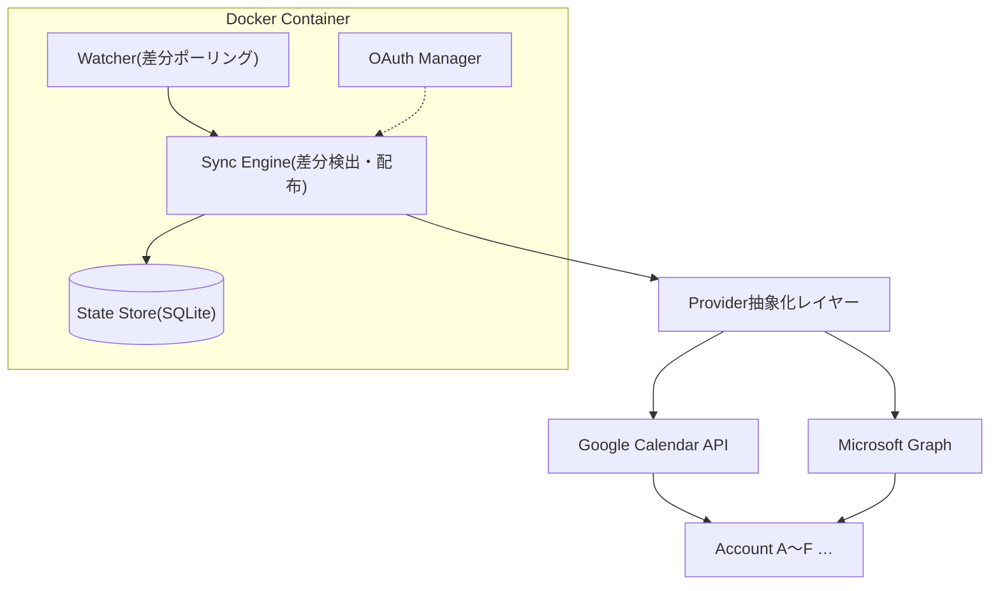
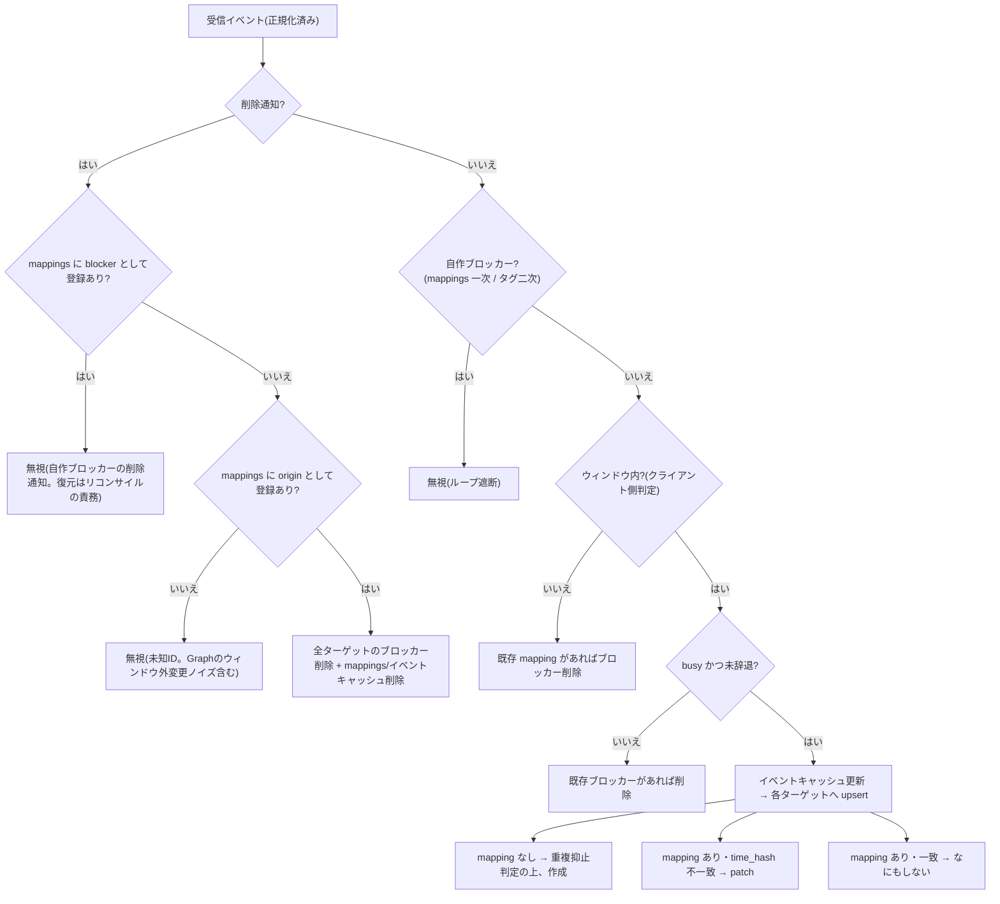

# calsync v1 設計書

作成日: 2026-07-03
ステータス: 承認済みドラフト(実装計画の入力)

## 1. 概要

calsync は、複数の Google カレンダー / Microsoft 365(および個人 Microsoft アカウント)カレンダーを相互監視し、どれかのアカウントに Busy な予定が入ったら他の全アカウントに「予定あり」ブロッカー予定を自動作成する、セルフホスト型(Docker)の OSS ツール。Go 製シングルバイナリ。

- 相互ミラーリング型の Busy Blocker。予定の中身は同期しない(タイトル固定・詳細なし)
- プロバイダ混在(Google ↔ Microsoft)でも相互ブロックが成立する
- アカウントは後から追加・削除できる
- ブロッカー予定への再同期による無限ループを構造的に防止する

本書の API 仕様に関する記述は、Google Calendar API / Microsoft Graph の公式ドキュメント(2026-07 時点の現行版)への裏取り調査に基づく。設計を左右する主張は複数エージェントによる敵対的検証済み。実機での確認が必要な残存項目は 15 章に列挙する。

## 2. 全体アーキテクチャ

N×(N-1) のメッシュ同期ではなく、各カレンダーの変更を 1 つの同期エンジンに集約し、エンジンが他の全アカウントへブロッカーを配る Hub & Spoke 構成。



| コンポーネント | 責務 |
| --- | --- |
| Watcher | 設定間隔(既定 1 分)で各カレンダーの差分取得をトリガーする。トリガーと同期処理は分離し、v2 で Webhook を追加できる構造にする |
| Sync Engine | 正規化イベントを受け取り、「どのアカウントにどのブロッカーを作成/更新/削除するか」を決定・実行する。プロバイダ非依存 |
| State Store | SQLite 1 ファイル(Docker ボリューム)。カーソル・イベントキャッシュ・マッピングを保持 |
| OAuth Manager | アカウントごとのトークン管理・更新・追加フロー。refresh token のローテーション追従と失効検出 |

## 3. 設計判断サマリ

| 項目 | 決定 | 根拠・補足 |
| --- | --- | --- |
| 言語 | Go | シングルバイナリ、distroless で軽量イメージ |
| 対応プロバイダ | Google / Microsoft | Provider インターフェースで抽象化 |
| 変更検出 | 差分ポーリングのみ(v1)、既定 1 分 | Webhook は公開 HTTPS 必須でセルフホストと矛盾。クォータは両者とも余裕(10 章) |
| 同期ウィンドウ | 未来 3 ヶ月(設定可)。**判定はクライアント側フィルタが正** | Google は増分同期にウィンドウを指定できず、初回同期のウィンドウが増分に引き継がれる保証も公式にない(5.1) |
| ブロッカー | 元予定 1 : ブロッカー 1(マージしない)、固定タイトル(既定「予定あり」)、リマインダーなし、visibility=private | 冪等性を優先 |
| ループ防止 | mappings テーブルで一次判定 + 拡張プロパティタグで二次判定・再構築 | Graph delta は拡張プロパティを返せない(公式確定)。Google の削除通知はタグ自体が含まれない(6.3) |
| Busy 判定 | Google: transparency ベース / Graph: showAs ベース。辞退(declined)は除外 | 6.2 に判定表 |
| 招待の扱い | 辞退のみ除外。未返信・仮承諾はブロック(安全側) | showAs=tentative / status=tentative はブロック対象 |
| 冪等作成 | Graph: transactionId / Google: クライアント生成イベント ID | 再送・クラッシュでも二重作成しない(6.4) |
| 同一会議の重複抑止 | v1 で実装(既定オン、設定でオフ可) | 同一人物の複数アカウントが同じ会議に招待されるケースは主用途で頻出(6.5) |
| 状態管理 | SQLite 1 ファイル + WAL + flock による多重起動防止 | 2 プロセス同時実行は重複ブロッカーを量産するため起動時に排他 |
| リコンサイル | 日次(既定 04:00、コンテナのローカル TZ)+ 手動コマンド | カーソル張り直しによるウィンドウスライド・孤児収容・自己修復(8 章) |
| OAuth スコープ | Google: `calendar.events` / Microsoft: `Calendars.ReadWrite` + `MailboxSettings.Read` + `offline_access` | 最小権限。freebusy 系スコープでは差分同期に必要な events 読み取りができない。Microsoft の `MailboxSettings.Read` は終日ブロッカー用のメールボックス TZ 取得(`/me/mailboxSettings/timeZone`)に必要。Google のカレンダー TZ は `calendars.get`(要 calendar 系スコープ)ではなく **events.list 応答の `timeZone` フィールド**から取得することで `calendar.events` のみで賄う |
| 配布 | 利用者が自分の GCP OAuth クライアント / Entra アプリ登録を用意 | 12 章のセットアップ要件が README の必須記載事項 |

## 4. Provider 抽象化

同期エンジンとストアはプロバイダ非依存。カレンダー操作だけを抽象化する。

```go
type Provider interface {
    // 差分取得。cursor が空なら window 付きフル同期から開始する。
    // 返るイベントは UTC 正規化済み。ウィンドウ外のイベントも返りうる
    // (エンジン側でフィルタする)。カーソル失効は ErrCursorInvalid を返す。
    Changes(ctx context.Context, cal CalendarRef, cursor string, window Window) (events []NormalizedEvent, newCursor string, err error)

    // idemKey: Graph は transactionId、Google はクライアント生成イベント ID に使う。
    CreateBlocker(ctx context.Context, cal CalendarRef, b Blocker, idemKey string) (eventID string, err error)
    UpdateBlocker(ctx context.Context, cal CalendarRef, eventID string, b Blocker) error
    DeleteBlocker(ctx context.Context, cal CalendarRef, eventID string) error

    // リコンサイル・DB 再構築用: calsync タグ付きイベントの列挙。
    ListBlockers(ctx context.Context, cal CalendarRef, window Window) ([]BlockerRecord, error)
}
```

`NormalizedEvent` はプロバイダの方言を吸収した正規形:

| フィールド | 内容 |
| --- | --- |
| `ID` | プロバイダ上のイベント ID(opaque として扱う。パース禁止) |
| `ICalUID` | iCalendar UID(重複抑止に使用) |
| `StartUTC` / `EndUTC` | UTC 正規化済み時刻 |
| `IsAllDay` / `AllDayStart` / `AllDayEnd` | 終日フラグと現地日付(終日は日付で保持) |
| `IsBusy` | 6.2 の判定結果 |
| `IsDeclined` | 自分が辞退済みか |
| `Deleted` | 削除通知(cancelled / @removed / isCancelled)か |
| `OriginTag` | calsync タグが読める場合その値(Google の増分応答では読める。Graph delta では常に空) |

### Google ↔ Microsoft Graph 対応表(裏取り済み)

| 概念 | Google Calendar API | Microsoft Graph |
| --- | --- | --- |
| 差分取得 | `events.list` + syncToken | `/me/calendarView/delta` + deltaLink |
| 繰り返し展開 | `singleEvents=true`(syncToken と併用可・公式例あり) | calendarView がサーバー側で展開済み |
| Busy 判定 | `transparency`(省略時 = opaque = busy) | `showAs` |
| 辞退判定 | `attendees[]` の `self==true` の `responseStatus` | `responseStatus.response` |
| タグ | `extendedProperties.private`(キー 44 字・値 1024 字上限) | `singleValueExtendedProperties`(固定 GUID + Name 形式) |
| タグの差分応答への含有 | 含まれる(削除通知を除く) | 含まれない($select/$expand 不可が公式仕様) |
| タグでの検索 | `privateExtendedProperty=k=v`(syncToken とは併用不可 → リコンサイル専用) | `$filter=singleValueExtendedProperties/Any(...)`(応答にタグ値は含まれない) |
| 削除通知 | `status=cancelled`(id のみ保証) | `@removed`(id のみ。**ウィンドウ外の追加・更新でも届く**) |
| カーソル失効 | 410 GONE | 410 + Location、または 40X `syncStateNotFound` 系 |
| イベント ID の安定性 | 安定(opaque) | 既定ではカレンダー移動で変化 → 全リクエストに `Prefer: IdType="ImmutableId"` を統一付与 |
| 作成の冪等化 | クライアント生成 ID(base32hex)を `id` に指定 | `transactionId` |
| 対象カレンダー | 複数カレンダー監視可 | **v1 はプライマリのみ**(calendarView delta の v1.0 文書はプライマリのみ記載) |

## 5. 差分同期設計

### 5.1 Google(syncToken の制約と対応)

公式仕様(検証済み): syncToken は `timeMin` / `timeMax` / `privateExtendedProperty` / `q` / `iCalUID` / `orderBy` / `sharedExtendedProperty` / `updatedMin` と併用できず、併用すると 400 が返る。それ以外のパラメータ(`singleEvents` 等)は初回と増分で同一にしないと undefined behavior。増分結果が初回のウィンドウ内に限定される公式保証はない。

対応:

1. 初回フルシンク: `timeMin=now`, `timeMax=now+window`, `singleEvents=true` で取得。**timeMax は必須**(終了日のない繰り返し予定の展開範囲が未文書化のため、上限なしだと応答量が読めない)
2. 増分: `syncToken` + `singleEvents=true` のみ。ウィンドウ外イベントが混入する前提で、エンジン側でウィンドウ判定する
3. ページング: `nextSyncToken` は最終ページにのみ返る。**完走した時だけ**カーソルを永続化する(途中終了時は旧カーソルで再実行 — 冪等なので安全)
4. 増分で `showDeleted=false` を明示指定しない(400 になる)
5. ウィンドウのスライドは日次リコンサイルでのカーソル張り直しで行う(8 章)

繰り返し予定: インスタンス ID はパースせず opaque として扱う。回の識別が必要な場合は `recurringEventId` + `originalStartTime`(ともに Immutable と公式明記)を使う。

### 5.2 Microsoft Graph(calendarView delta の制約と対応)

公式仕様(検証済み): 初回リクエストの `startDateTime` / `endDateTime` は deltaLink に符号化されて固定される。ウィンドウ変更はカーソル破棄+フル再同期のみ。`$select` / `$expand` / `$filter` / `$orderby` / `$search` は非対応(拡張プロパティは delta 応答に含められない)。`showAs` / `responseStatus` / `isAllDay` / `start` / `end` は delta 応答に含まれる。

対応:

1. `Prefer: odata.maxpagesize` は**使わない**。繰り返し予定の展開と組み合わせた無限ページネーション問題が GitHub(msgraph-sdk-dotnet #3070 'Service issue' ラベル・2026 年時点 open)で報告されている
2. サーキットブレーカー: 1 ラウンドのページ数上限と、ページ内容(イベント ID 列のフィンガープリント)の同一反復検知を実装し、検知したらフル再同期にフォールバック
3. `@removed` は「ウィンドウ内の削除」以外に「ウィンドウ外イベントの追加・更新・削除」でも届く(公式明記)。mappings に origin として存在する ID のみ削除処理し、未知 ID は無視する(6.1)
4. カーソル失効は 410 + Location と 40X `syncStateNotFound` 系の**両方**をトリガーにする(公式は「40X-series error with error codes such as syncStateNotFound」としか保証していない)
5. delta の再送(同一変更の複数回出現)は公式に許容されている → 全処理を冪等にする
6. 全リクエストに `Prefer: IdType="ImmutableId"` を付与(付け忘れが 1 箇所でもあると 2 形式の ID が混在し mappings 照合が壊れる。ID 比較は case-sensitive)
7. 個人 Microsoft アカウント(outlook.com)も同一実装で対応(delegated / Calendars.ReadWrite で公式サポート)

### 5.3 同期ウィンドウ

- ウィンドウ判定の正はエンジン側のクライアントフィルタ: `end > now && start < now+window`(Google の timeMin/timeMax と同じ境界セマンティクス)
- サーバー側ウィンドウ(Google 初回の timeMin/timeMax、Graph の startDateTime/endDateTime)は転送量削減のベストエフォートと位置付ける
- ウィンドウ外に出た元予定のブロッカーは削除する(境界を跨ぐイベントは「重なりがあれば対象」)

## 6. 同期エンジン

### 6.1 イベント 1 件の処理フロー



削除通知は id しか含まれない前提で設計する(Google 公式: 「Deleted events are only guaranteed to have the id field populated」)。したがって削除の判定はタグではなく mappings で行う。

### 6.2 Busy 判定

| プロバイダ | ブロック対象 | 除外 |
| --- | --- | --- |
| Google | `status != cancelled` かつ `transparency != transparent`(フィールド省略時は opaque = busy が公式仕様) | `attendees[]` の `self==true` エントリが `responseStatus==declined` |
| Microsoft | `showAs ∈ {busy, oof, tentative}`(既定。設定 `busy_show_as` で変更可) | `responseStatus.response == declined`。`workingElsewhere` / `free` / `unknown` は対象外 |

- 未返信・仮承諾をブロックするのは安全側の確定判断。Google の `status=tentative` も transparency が opaque ならブロックされる
- Google の特殊イベントタイプは transparency 判定で自然に処理される(birthday / workingLocation は transparent、focusTime / outOfOffice は opaque — 公式仕様)
- 大人数会議で attendees が切り詰められても「参加者本人のエントリは必ず返る」(公式明記)ため辞退判定は壊れない。帯域最適化として `maxAttendees=1` を使ってよい

### 6.3 ループ防止(二段構え)

一次判定: mappings テーブル。受信イベントの ID が自作ブロッカー(`blocker_event_id`)として登録されていれば同期対象から除外する。**Graph delta は拡張プロパティを返せず、Google の削除通知はタグを含まないため、一次判定をタグに依存することはできない**(両制約とも公式仕様として検証済み)。

二次判定: 拡張プロパティタグ。mappings に無いのにタグが読めるイベント(例: DB 消失後・クラッシュ後の孤児)を検出し、リコンサイルで収容・掃除する。

タグ形式:

- Google: `extendedProperties.private` に `calsync=v1` と `calsync-origin=<origin_account>:<origin_event_id>`(値 1024 字上限に注意。イベント ID は最大 1024 字ありうるため超過時はハッシュ短縮)
- Graph: `String {固定GUID} Name calsyncOrigin` の 1 本に統一。GUID はソースコード埋め込みの固定値(設定可能にすると変更時に旧タグが見えなくなるため不可)
- ブロッカー作成時に本体と同時に設定(Graph は POST ボディ同梱で 1 コール・レースなし。Google も insert ボディに含める)

### 6.4 冪等性とゴーストブロッカー対策

CreateBlocker 成功と mappings 登録の間のクラッシュで孤児ブロッカーが生まれる問題は、intent-first + 決定的冪等キーで解消する:

1. mappings に `status=pending` 行を insert(`idempotency_key` = origin ID 等から決定的に導出)
2. 作成実行 — Graph は `transactionId=idempotency_key`(公式の二重作成防止機構)、Google はクライアント生成イベント ID(base32hex)を `id` に指定
3. 成功したら `blocker_event_id` を記録して `status=active` に更新

クラッシュ後の再実行は同じキーで再送されるため二重作成にならない(Google は既存 ID との衝突がエラーで返る → 既存扱いで収容)。pending のまま残った行はリコンサイルが実在確認して収容または再実行する。

### 6.5 同一会議の重複抑止(iCalUID)

同一人物のアカウント A と B が同じ会議に招待されている場合、B には実予定があるのに A 発のブロッカーが重なって立つ。これを既定で抑止する(`dedupe_same_meeting: true`)。

- 判定: ブロッカー作成前に、ターゲットのイベントキャッシュに「同一 iCalUID かつ同一開始時刻」の busy 実予定が存在すればブロッカーを作らず `status=suppressed` の mapping を記録する
- ターゲット側の実予定が消えたら(削除・辞退)、suppressed な mapping を作成に昇格する(削除処理時に iCalUID で suppressed を逆引き)
- 制約: Google は繰り返し全回が同一 iCalUID、Graph は回ごとに異なる値(公式仕様)のため、単発予定は確実、繰り返し予定はベストエフォート(iCalUID 前方一致 + 開始時刻)。クロスプロバイダの繰り返し会議で抑止漏れが起きた場合も、実害は「ブロッカーが重なるだけ」で安全側
- イベントキャッシュは 8 章の set-difference リコンサイルにも必要なため、この機能による追加 API コストはゼロ

### 6.6 終日イベントとタイムゾーン

- 内部時刻は UTC に統一。Graph は Prefer ヘッダを付けなければ UTC で返る(公式仕様)。Google は dateTime を UTC に変換
- `time_hash` = UTC 正規化した start/end + 終日フラグ(+ 終日は現地日付)のハッシュ
- 時刻指定イベントのブロッカーは `timeZone: UTC` で作成(表示はクライアントが変換する)
- 終日イベントは終日ブロッカーとしてミラーする。Google は `start.date`/`end.date`(end は排他的 = 翌日)、Graph は `isAllDay=true` + **ターゲットカレンダーのタイムゾーンでの midnight 境界**(公式要件。UTC midnight だと日付がズレる)。ターゲットの TZ は Google が events.list 応答の `timeZone`、Microsoft が `/me/mailboxSettings/timeZone` から取得してキャッシュする(取得は終日ブロッカー作成時のみの遅延実行 — 時刻指定ブロッカーは TZ 不要)
- アカウント間でタイムゾーンが異なる場合、終日→終日ミラーは「同じ日付」を維持する(同じ絶対時間帯ではない)。この仕様は README に明記する

## 7. State Store(SQLite)

```sql
CREATE TABLE calendars (
  account_id    TEXT NOT NULL,
  calendar_id   TEXT NOT NULL,
  cursor        TEXT,              -- syncToken / deltaLink
  window_start  INTEGER,           -- カーソル確立時のウィンドウ(エポック秒)
  window_end    INTEGER,
  timezone      TEXT,              -- 終日ブロッカー作成用にキャッシュ。
                                   -- blocker_calendar が監視対象外でも行を作り保持(cursor は NULL)
  last_synced_at INTEGER,
  last_error    TEXT,
  PRIMARY KEY (account_id, calendar_id)
);

-- 監視カレンダーの busy イベントキャッシュ。
-- 役割: (1) カーソル失効時の set-difference リコンサイル (2) iCalUID 重複抑止
CREATE TABLE events (
  account_id  TEXT NOT NULL,
  calendar_id TEXT NOT NULL,
  event_id    TEXT NOT NULL,
  ical_uid    TEXT,
  start_utc   INTEGER,
  end_utc     INTEGER,
  is_all_day  INTEGER NOT NULL DEFAULT 0,
  time_hash   TEXT NOT NULL,
  PRIMARY KEY (account_id, calendar_id, event_id)
);
CREATE INDEX idx_events_icaluid ON events (ical_uid, start_utc);

CREATE TABLE mappings (
  origin_account   TEXT NOT NULL,
  origin_calendar  TEXT NOT NULL,
  origin_event_id  TEXT NOT NULL,
  target_account   TEXT NOT NULL,
  target_calendar  TEXT NOT NULL,
  blocker_event_id TEXT,           -- pending / suppressed 中は NULL
  idempotency_key  TEXT NOT NULL,  -- Google: クライアント生成 ID / Graph: transactionId
  time_hash        TEXT NOT NULL,
  status           TEXT NOT NULL,  -- pending | active | suppressed
  PRIMARY KEY (origin_account, origin_calendar, origin_event_id, target_account)
);
CREATE INDEX idx_mappings_blocker ON mappings (target_account, blocker_event_id);
```

- WAL モード。データディレクトリの flock で多重起動を防止(二重起動は起動時に明示エラー)
- トークンは同ディレクトリ内に保存(ファイル権限 0600)。SQLite とともに Docker ボリュームにマウント

## 8. リコンサイル

日次(既定 04:00、コンテナのローカル TZ)+ `calsync reconcile` で手動実行。1 回のリコンサイルで以下を行う:

1. **カーソル張り直し**: 全カレンダーで新ウィンドウ(now 〜 now+window)のフル同期を実行し、新カーソルを確立(= ウィンドウのスライド)
2. **set-difference**: フル同期結果とイベントキャッシュ/mappings を突合。消えた元予定 → ブロッカー削除、新規範囲入り → ブロッカー作成、範囲外に出たブロッカー → 掃除。**Google の「410 時は全ワイプ」公式手順は mappings に適用しない**(適用するとループ防止と対応関係が失われる)。破棄するのはカーソルとイベントキャッシュのみ
3. **孤児収容(adoption)**: `ListBlockers`(タグ検索)で calsync 製ブロッカーを列挙し、mappings に無いもの(クラッシュ起因・DB 消失起因)を origin の実在に応じて収容 or 削除。pending のまま残った mappings 行も実在確認して解決
4. **手で消されたブロッカーの再作成**: 元予定が生きている限りブロッカーは維持する(確定仕様)
5. **DB 全損時**: 全カレンダーのタグ検索から mappings を再構築できる(Google の `extendedProperties.private` は client_id に紐付かずイベントコピー単位のため、別クライアントでも読める — 検証済み)

カーソル失効(Google 410 / Graph 410 or syncStateNotFound)を検出した場合も、そのカレンダーに対して同じフル同期 + set-difference を即時実行する。

## 9. 認証

### 9.1 フロー

| プロバイダ | 主経路 | 備考 |
| --- | --- | --- |
| Google | 認可コード + PKCE + ループバック(`http://127.0.0.1:<ランダムポート>`)。クライアントタイプは「Desktop app」 | OOB は廃止済みでループバック一択(公式)。Device flow は Calendar スコープに使えない前提 |
| Microsoft | 認可コード + PKCE + `http://localhost`(ポート任意 — localhost はポート無視でマッチする公式仕様) | Device Code Flow は `--device-code` オプションとして提供。ただし組織テナントは条件付きアクセスでブロック可能(Microsoft 自身がブロック推奨)なため主経路にしない |

### 9.2 Docker 環境での認証 UX

コンテナにはブラウザがないため、`calsync auth add <id>` は**ホストマシンでの実行を基本**とする:

- 推奨: ホストで同一バイナリ(または `docker run` の一時コンテナ + ポート公開)を実行し、トークンをデータディレクトリ(ボリューム)に保存してからデーモンを起動
- 代替: `docker compose run --rm -p 127.0.0.1:8484:8484 calsync auth add <id> --port 8484` で認可 URL を表示し、ホストのブラウザで開く(リダイレクトは公開ポート経由でコンテナに届く。`--port` はランダムポートを固定するためのフラグ)
- Microsoft のみの代替: Device Code Flow(コードと URL を表示するだけで完結)

### 9.3 トークン失効と reauth_required 状態

refresh token は必ず失効しうる(Microsoft: パスワード変更・管理者リセット・条件付きアクセス AADSTS530036 / Google: 取り消し・6 ヶ月未使用等 — いずれも検証済み)。

- `invalid_grant` / `interaction_required` 系を受けたアカウントは `reauth_required` 状態に遷移し、**そのアカウントだけ同期を停止**。他アカウントは継続
- `calsync status` にエラー表示、ログに再認証コマンドを明示
- 再認証後は次サイクル+リコンサイルで自動バックフィル(停止期間中の差分はカーソル or フル同期で回収)
- Microsoft の refresh token はローテーションする(公式仕様)ため、**更新のたびにトークンキャッシュを永続化**する。旧トークンを使い続ける実装は将来壊れる

## 10. エラー処理とレート制御

| 事象 | 対応 |
| --- | --- |
| Google 403/429 `usageLimits` 系 | 指数バックオフ + ジッター(公式推奨)。クォータは 600 req/min/user・100 万 req/日で通常運用は余裕 |
| Graph 429 | `Retry-After` ヘッダ準拠で待機・再試行。ヘッダ欠落時のみ指数バックオフ |
| Graph 並列度 | メールボックスあたり同時 4 リクエスト制限(公式)→ アカウント単位セマフォ 2〜3。アカウント間は独立に並列可 |
| 初回同期・アカウント追加時のバースト | 通常のリコンサイルとして扱い、逐次作成 + バックオフ。Google のバッチはクォータ節約にならない(公式)ため使わない。Graph の `$batch`(20 件)は任意最適化とし、採用時は項目別 429 の部分リトライを実装 |
| API 障害 | 書き込みは冪等キーで保護済みのため、リトライ・二重実行とも安全 |
| サイクル全体 | デッドラインとリトライ上限を設け、1 カレンダーの障害が全体を止めない |

## 11. 設定と CLI

```yaml
# calsync.yaml
poll_interval: 1m
sync_window: 3mo
blocker_title: "予定あり"
reconcile_at: "04:00"          # コンテナのローカル TZ(TZ 環境変数)で解釈
dedupe_same_meeting: true      # 6.5 の重複抑止
busy_show_as: [busy, oof, tentative]   # Microsoft の showAs ブロック対象

accounts:
  - id: personal
    provider: google
    email: user@gmail.com
    calendars: [primary]        # 監視対象(Google は複数可)
    blocker_calendar: primary   # ブロッカー書き込み先(既定 primary)
  - id: work-ms
    provider: microsoft
    email: user@example365.co.jp
    # Microsoft は v1 ではプライマリカレンダーのみ(15 章)
```

```
calsync auth add <account-id>    # OAuth フロー(ホスト実行推奨)。--device-code (MS のみ)
calsync auth list                # トークン状態一覧
calsync accounts remove <id>     # 配布済みブロッカー削除 → 受領ブロッカー削除 → ローカル状態削除
calsync run                      # デーモン起動(Docker エントリポイント)
calsync sync --once              # 1 回だけ同期して終了
calsync reconcile                # フルリコンサイル手動実行(DB 再構築を含む)
calsync status                   # 各カレンダーの最終同期時刻・reauth_required 等
calsync doctor                   # 設定・トークン・API 疎通・YAML と DB の不整合診断
```

YAML からアカウントを消しただけの場合は `doctor` と起動時ログが「remove を実行していない孤児状態」を警告する。

## 12. セットアップ要件(README 必須記載事項)

調査で確定した、利用者がつまずくと致命的な手順:

**Google(GCP)**

1. OAuth 同意画面: External の場合、**公開ステータスを必ず「In production」にする**。Testing のままだと refresh token が 7 日で失効し、常時同期ツールとして成立しない(公式仕様・検証済み)。個人利用(累計 100 ユーザー未満)は検証不要で、未検証アプリ警告はクリックスルーできる。Google Workspace 組織なら Internal が第一推奨(警告自体が出ない)
2. クライアントは「Desktop app」タイプで作成し、**JSON をその場でダウンロード保存**(2025 年以降 client secret は作成時にしか表示されない)
3. Desktop app の client_secret は Google 公式見解として機密扱いではない(README に引用付きで記載)
4. 6 ヶ月間トークン交換がないクライアントは自動削除される → 長期停止後の `invalid_client` はクライアント再作成を案内

**Microsoft(Entra)**

1. アプリ登録は無料テナントで可・課金不要。個人 Microsoft アカウントのみのユーザーは先に無料 Azure アカウント作成でテナントを取得する必要がある(検証済み。手順を README に明記)
2. Supported account types: 「任意の組織 + 個人 Microsoft アカウント」(signInAudience=AzureADandPersonalMicrosoftAccount)、認証は `/common`
3. プラットフォーム「Mobile and desktop applications」に `http://localhost` を追加(ポートはマッチング時に無視される)
4. **Advanced settings の「Allow public client flows」を Yes** にする(漏れると AADSTS7000218)
5. API permissions: `Calendars.ReadWrite`(delegated)+ `offline_access`。既定では管理者同意不要だが、組織でユーザー同意が無効な場合は AADSTS65001 / AADSTS90094 → ポータルの「Grant admin consent」手順を案内

## 13. エッジケースの挙動

| ケース | 挙動 |
| --- | --- |
| SQLite 消失 | リコンサイルが全カレンダーのタグ検索から mappings を再構築(8 章) |
| ブロッカーを手で削除 | 元予定が生きている限りリコンサイルで再作成 |
| 元予定の時刻変更 | time_hash 不一致 → patch。ウィンドウ外へ移動 → ブロッカー削除 |
| クラッシュ(作成とDB登録の間) | 冪等キーで二重作成なし。pending 行をリコンサイルが解決(6.4) |
| トークン失効 | 該当アカウントのみ reauth_required で停止、他は継続。復帰後バックフィル(9.3) |
| ウィンドウ境界 | 日次リコンサイルがスライド。範囲外ブロッカー掃除・新規範囲入り作成 |
| 同一会議に複数自アカウント招待 | 既定で重複抑止。ターゲットの実予定が消えたら昇格(6.5) |
| A と B の予定が同時刻 | C には 2 つのブロッカーが立つ(1:1 マッピング仕様。マージしない) |
| 2 プロセス同時起動 | flock により後発が起動エラー |
| calsync-origin タグの越境メタデータ | ブロッカーの拡張プロパティに元アカウント ID とイベント ID が残る(UI 非表示・API では読める)。README のプライバシー節に明記 |

## 14. テスト戦略

1. **エンジン単体テスト(最重要)**: Provider をインメモリのフェイク実装に差し替え、ループ防止・冪等性・410 リカバリ(set-difference)・重複抑止・ウィンドウスライド・クラッシュ復旧(pending 解決)・@removed ノイズ耐性をシナリオテストする。エンジンがプロバイダ非依存である設計の検証を兼ねる
2. **ストアテスト**: スキーマ・突合クエリ・flock・WAL 動作
3. **プロバイダ実装テスト**: `httptest` によるモックサーバー + 実 API から採取したレスポンス fixture(ページング・410・429・@removed・cancelled の各形)
4. **実機確認チェックリスト**: 15 章の未確認事項を最初のスパイクで消化する(自動テスト対象外)
5. CI: `go test -race`、golangci-lint

## 15. v1 の制約と実装時に実測確認する事項

**v1 の制約(仕様として明記)**

- Microsoft アカウントは プライマリカレンダーのみ監視・書き込み可(calendarView delta の v1.0 公式文書がプライマリのみ記載のため安全側に倒す)
- 過去方向は同期しない。ブロッカーのマージはしない
- 単一インスタンス前提(複数マシンでの分散実行は非対応)

**実装初期のスパイクで実測確認する事項(公式文書に明記がない)**

1. Google: timeMin/timeMax 付き初回同期の syncToken が増分でウィンドウ外変更を返すか(設計はどちらでも壊れないが、転送量見積りに影響)
2. Graph: `/me/calendars/{id}/calendarView/delta`(非プライマリ)が v1.0 で動くか(動けば制約を緩和できる)
3. Graph: 出席者側でキャンセルされた会議が `isCancelled=true` 更新と `@removed` のどちらで届くか(両対応で実装した上で確認)
4. 終日イベントを transparency/showAs 未指定で API 作成した場合の既定値(calsync 自身は常に明示指定するため参考確認)
5. MSAL Go(microsoft-authentication-library-for-go)の現行ステータスとトークンキャッシュ永続化のサポート状況
6. Google: Device flow が Calendar スコープで使えないことの確認(使えない前提で設計済み)
7. Google: 削除済み(cancelled)ブロッカーを同一 ID で蘇生する際、`events.update` で status が confirmed に戻り再びカレンダーに表示されること(実装は 409 収容パスで蘇生する設計。モックでは証明不能)
8. Graph: ブロッカー削除後に同一 `transactionId` で再作成した場合の挙動(409 が返るなら復元はエラーとして表面化し日次リコンサイルで再試行される — 許容だが実測で確認)
9. Graph: 終日イベントが delta 応答(Prefer なし = UTC 返却)で UTC midnight に変換されて届くか。変換される場合、UTC+ タイムゾーンの終日ブロッカーが前日に立つため、`originalStartTimeZone` からの現地日付復元が必要(`internal/provider/microsoft/delta.go` にマーカーコメントあり)
10. スコープの実疎通: Google `calendar.events` のみで events.list 応答の `timeZone` が読めること / Microsoft `MailboxSettings.Read` で `/me/mailboxSettings/timeZone` が 200 を返すこと(§3 の改訂根拠の実機確認)
11. `docker build` と `docker run --rm calsync:dev --help` の成功(実装時は Docker デーモン不在で `docker compose config -q` と CGO_ENABLED=0 ビルドのみ確認済み)

## 16. リポジトリ構成とロードマップ

```
calsync/
├── cmd/calsync/         # CLI エントリポイント
├── internal/
│   ├── auth/            # OAuth(Google ループバック / MS 認可コード+PKCE / Device Code)
│   ├── provider/        # Provider インターフェース
│   │   ├── google/
│   │   └── microsoft/
│   ├── engine/          # 同期エンジン(トリガーと同期処理を分離)
│   ├── store/           # SQLite(スキーマ・マイグレーション・flock)
│   └── config/          # YAML ロード・バリデーション
├── docs/
├── Dockerfile           # multi-stage、distroless
└── docker-compose.yaml  # ボリューム設定例つき
```

- **v1**: 本書の全機能(Google + Microsoft、ポーリング同期、YAML + CLI、リコンサイル、重複抑止)
- **v2 候補**: Webhook 併設(トリガー追加のみで成立する構造)、ペアごとのタイトル・除外ポリシー(`exclude_pairs`)、Web UI ダッシュボード、Graph 非プライマリカレンダー対応、iCloud 等の追加プロバイダ
