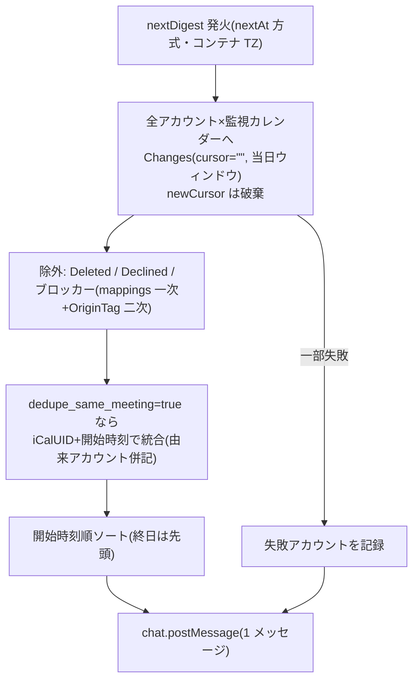
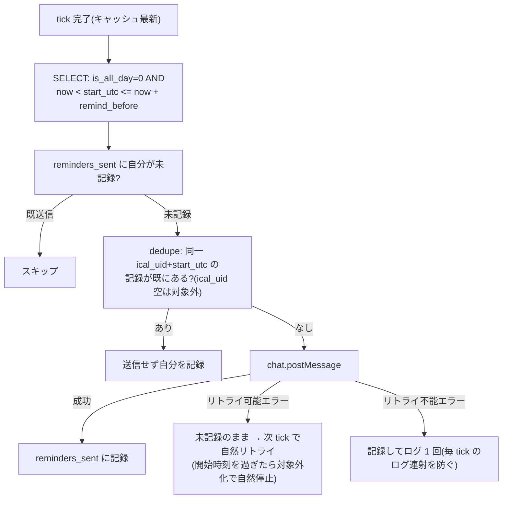

# calsync Slack 通知 設計書(Issue #10)

作成日: 2026-07-05
ステータス: 承認済みドラフト(実装計画の入力)
親設計書: [2026-07-03-calsync-design.md](2026-07-03-calsync-design.md)

## 1. 概要

Slack Bot トークンを使い、ユーザーが用意した Slack App(Bot)経由で DM / プライベートチャンネル / 公開チャンネルへ通知する 2 機能を追加する。

1. **朝のダイジェスト**: 指定時刻(例 07:30)に、当日の「ブロッカー以外の予定」を全アカウント横断・開始時刻順で通知する
2. **開始前リマインド**: 各予定の指定時間前(例 10 分前)に通知する

通知はデーモン(`calsync run`)専用の機能で、`sync --once` や `reconcile` では発火しない。

## 2. 設計判断サマリ

| 論点 | 決定 | 根拠・補足 |
| --- | --- | --- |
| ダイジェストのデータ源 | **当日分をライブ取得**(`Changes(cursor="", 当日ウィンドウ)`) | イベントキャッシュはタイトルを持たず busy のみ・揮発。ライブ取得なら free の予定も件名付きで拾え、1 日 1 回なのでクォータ影響は無視できる。返ってきた `newCursor` は**捨てる**(カーソル規律に抵触しない) |
| リマインドのデータ源 | **イベントキャッシュ+title 列追加** | 直前通知は「当日途中に追加された予定を拾えること」が最重要。キャッシュは tick 毎に更新されるためこれを満たす。free・終日予定は対象外(v1 制約、12 章) |
| タイトルの扱い | `NormalizedEvent` に `Title` を追加し、events テーブルにも永続化 | `TimeHash` には**含めない**(件名変更でブロッカー更新は走らない — 現行契約を維持) |
| bot_token の保管 | **環境変数のみ**。変数名は `bot_token_env` で変更可(既定 `SLACK_BOT_TOKEN`) | YAML に秘密を入れない。存在チェックは `calsync run` 起動時のみ行い、`status` / `doctor` は環境変数なしで動く |
| アーキテクチャ | **エンジン統合型**。`Engine` に `Notifier` インターフェースを追加し、既存 Run ループに組み込む | nextAt 方式・単一 goroutine・「Run を落とさない」既存パターンをそのまま流用。Slack 実装は `internal/notify/slack` に隔離し、fake 差し替えでテスト(provider/fake と同じ構図) |
| ダイジェストの発火 | `reconcile_at` と同じ nextAt 方式(コンテナ TZ、精度は `poll_interval` に律速) | 停止中に時刻を跨いだ日はスキップ(キャッチアップなし — reconcile と同じ既存制約) |
| リマインドの二重送信防止 | 送信記録テーブル `reminders_sent` を新設。「送信成功時」または「dedupe により送信不要と確定した時」に記録 | nextAt と違いリマインドは再起動でメモリ状態が消えるため永続化が必須 |
| 依存関係 | **追加なし**。`net/http` で Slack Web API を直接叩く | 使うのは `chat.postMessage` と `conversations.open` の 2 エンドポイントのみ |
| アカウント表示 | YAML の `id` を表示(email は出さない) | Issue #7 と同じプライバシー方針 |

## 3. 設定

```yaml
notifications:
  slack:
    bot_token_env: SLACK_BOT_TOKEN  # トークンを読む環境変数名。省略時 "SLACK_BOT_TOKEN"
    channel: "C0XXXXXXX"            # C…/G…: チャンネル / U…: DM(conversations.open で解決)
    morning_digest: "07:30"         # 省略時はダイジェスト無効。HH:MM、コンテナ TZ(reconcile_at と同形式)
    remind_before: 10m              # 省略時はリマインド無効。正の Go duration
```

`Load` での検証(既存パターンに追加):

- `morning_digest` は `time.Parse("15:04")` で検証
- `remind_before` は `time.ParseDuration` で正の値のみ許容。さらに **`remind_before >= poll_interval` を必須**とする(リマインド判定は tick 毎のため、これを下回るとウィンドウが tick 間隔より狭くなり発火保証がなくなる)
- `slack` セクションがあるのに `channel` が空 → エラー
- `morning_digest` と `remind_before` の両方が省略 → エラー(設定したのに何も送られない事故の防止)
- 未知キーは既存の `KnownFields(true)` で拒否される

`notifications` セクション自体が無ければ通知機能は完全に無効(`Engine.Notifier` が nil のまま)。

通知の重複統合(5 章・6 章)は**既存のトップレベルキー `dedupe_same_meeting`(既定 true、親設計書 6.5)を流用**する。通知用の新キーは追加しない。

必要な Slack スコープ: `chat:write`、DM(`U…`)を使う場合は `im:write`、Bot 未参加の公開チャンネルへ送る場合は `chat:write.public`。

## 4. データモデル・スキーマ変更

### 4.1 NormalizedEvent.Title

`model.NormalizedEvent` に `Title string` を追加する。

- google は `summary`、microsoft は `subject` から正規化する。fake も同じ契約で `Title` を保持する
- 各プロバイダが取得フィールドを絞っている場合(`fields` / `$select`)は件名を取得対象に加える(本書 13 章スパイク 1・2)
- `TimeHash` の入力には**加えない**。件名だけが変わった予定はブロッカー更新をトリガーしない

### 4.2 events テーブルへの title 列追加(本リポジトリ初のマイグレーション)

- const schema の `CREATE TABLE events` に `title TEXT NOT NULL DEFAULT ''` を追加(新規 DB 用)
- 既存 DB 向けに `Open` 時、schema 適用後に `ALTER TABLE events ADD COLUMN title TEXT NOT NULL DEFAULT ''` を実行し、duplicate column エラーのみ無視する(冪等)
- **マイグレーション方針の明文化**: 本リポジトリのスキーマ変更は「新規は const schema、既存は Open 時の冪等 ALTER(失敗パターンを限定して無視)」で行う。schema version 管理は導入しない(必要になった時点で再検討)
- **既存行の title が埋まるタイミング**: 通常の同期は差分取得のため、変更のなかったイベントは upsert を通らない。既存行の title は (a) 当該イベントが変更されたとき、または (b) 日次リコンサイルの FullResync(既定 04:00)で全件が再投入されたときに埋まる。**つまりマイグレーション直後は最大 ~24 時間、リマインドが「(件名なし)」表示になりうる**(ダイジェストはライブ取得のため影響なし)。これは許容する

### 4.3 reminders_sent テーブル(新設)

```sql
CREATE TABLE IF NOT EXISTS reminders_sent (
  account_id  TEXT NOT NULL,
  calendar_id TEXT NOT NULL,
  event_id    TEXT NOT NULL,
  start_utc   INTEGER NOT NULL,
  ical_uid    TEXT NOT NULL DEFAULT '',
  sent_at     INTEGER NOT NULL,
  PRIMARY KEY (account_id, calendar_id, event_id, start_utc)
);
CREATE INDEX IF NOT EXISTS idx_reminders_sent_icaluid ON reminders_sent(ical_uid, start_utc);
```

- `start_utc` を主キーに含めることで、**予定の時刻変更後は自動で再アーム**される(変更後の開始時刻で再度リマインドが飛ぶ)
- `ical_uid` を持たせることで、dedupe の既送信照会(6 章)が events キャッシュとの JOIN なしに自己完結する(キャッシュ行が消えても照会可能)
- 掃除: 日次リコンサイルで `start_utc < now - 48h` の行を削除する。日次リコンサイルはデーモンで常に有効(`reconcile_at` は既定 04:00・無効化不可)のため、相乗りで肥大しない。アカウント削除時は store に削除メソッド(`DeleteRemindersForAccount`)を追加し、`engine.RemoveAccount` のローカル状態削除ステップから呼ぶ

## 5. 朝のダイジェスト



- **対象日**: 発火時の now ではなく、**スケジュールされていた `nextDigest` の日付**から導出する(tick が長時間の同期で midnight を跨いで遅延しても対象日がずれない・同日 2 通を防ぐ)
- **当日ウィンドウと対象判定**(コンテナ TZ の `[対象日 00:00, 翌日 00:00)`):
  - 時刻指定の予定: UTC 時刻の重なり判定 `EndUTC > 窓開始 && StartUTC < 窓終了`
  - 終日の予定: **日付文字列比較 `AllDayStart <= 対象日のローカル日付 < AllDayEnd`**。`Window.Contains` は終日を UTC 日付として近似するため 1 日幅・非 UTC の TZ では前日/翌日の終日予定を誤包含する(JST では毎朝前日の終日予定が混入する)。**流用禁止**
- **free の予定も含める**(`IsBusy` は見ない)。busy 判定はブロッカー配布の関心事であり、ダイジェストは「その日カレンダーに載っている実予定」を示す
- ブロッカー除外は既存の決定則と同じ順序: mappings の `IsBlocker` が一次、`OriginTag` が二次。ただし **Graph delta はタグを返せないため、二次判定はライブ取得経路では Google のみ有効**(既存不変条件と同じ制約)。Microsoft は mappings のみで除外され、DB 全損直後〜リコンサイルのフェーズ 0 完了前にダイジェストが発火した場合は受領ブロッカーが混入しうる
- `dedupe_same_meeting: true`(既定)なら同一 iCalUID+開始時刻の予定を 1 行に統合し、由来アカウントを併記する。統合時の件名は **accounts の YAML 定義順で最初の非空 `Title` を採用**し、全て空なら「(件名なし)」(決定的規則)
- 開始時刻順にソートし、終日予定は先頭に「(終日)」としてまとめる
- 0 件の日も「今日の予定はありません」を送る(デーモンの生存確認を兼ねる)
- 取得に失敗したアカウントは本文末尾に「⚠ <account_id>: 取得失敗」と明記する(黙って欠落させない)
- エントリ数は最大 100 件。超過分は「…他 N 件」に切り詰める(Slack メッセージ長対策)
- Run ループ内の分岐は reconcile 分岐と**独立**させる(reconcile 側の reauth/failures リセットという副作用に相乗りしない)。**同一 tick で digest と reconcile の両方が期限到来した場合はダイジェストを先に実行する**(reconcile の所要時間でダイジェストを遅らせない)
- DST を持つ TZ では `time.Date` の正規化に従う(存在しない時刻は後ろ倒し、当日ウィンドウは 23/25 時間になりうる)。これは許容する

## 6. 開始前リマインド

毎 tick(同期処理の後 — キャッシュが最新の状態で)以下を実行する。



- **抽出対象はイベントキャッシュそのまま**: キャッシュには設計上「busy・未辞退・ウィンドウ内の実予定」しか入らない(ブロッカーは決定則 2 で、declined/free は決定則 5 で投入前に弾かれる — 親設計書 6 章)ため、リマインド側での追加除外フィルタは不要。例外は DB 全損直後の Microsoft 受領ブロッカー混入(5 章と同じ制約・リコンサイルで自己修復)で、これは許容する
- 発火条件: `start - remind_before <= now < start`(SQL では `start_utc > now AND start_utc <= now + remind_before`)
- **reminders_sent への記録条件は 2 つ**: (a) 自分が送信に成功したとき、(b) dedupe により送信不要と確定したとき(スキップした側も記録し、以後の照会を単純化する)。リトライ可能エラーでの失敗時は記録せず、次 tick で自然リトライされ、開始時刻を過ぎると抽出条件から外れて自然に止まる。リトライ不能エラー(8 章)の場合は記録してログ 1 回に留める(ダイジェスト側の「翌日へ進める」と対称)
- デーモンがリマインドウィンドウ途中で再起動しても `reminders_sent` が永続なので二重送信しない。停止中にウィンドウが丸ごと過ぎた(開始済みの)予定は通知しない。開始前に復帰すれば遅れてでも通知する
- 発火精度は `poll_interval`(既定 1 分)に律速される。同期が長引いて tick が落ちた場合、通知が遅れる(または開始直前の予定では消失する)ことは許容する
- `dedupe_same_meeting: true`(既定)のとき、`reminders_sent` の `ical_uid` 列で同一 iCalUID+`start_utc` の記録を照会し、あればスキップ+自分も記録する(複数アカウントに同じ会議がある場合の重複 DM 防止)。`ical_uid` が空のイベントは dedupe 対象外(既存の重複抑止と同じ規則)。**Graph は繰り返しの回ごとに iCalUID が異なるため、クロスプロバイダの繰り返し会議の重複抑止はブロッカー dedupe と同じくベストエフォート**

## 7. メッセージ形式

時刻はコンテナ TZ、アカウント表示は YAML の `id`(email は出さない — #7 と同方針)。

```
📅 7/5(日) の予定
・(終日) 社内イベント [work-google]
・09:00–09:30 朝会 [work-google]
・10:00–11:00 設計レビュー [work-ms, personal]
```

```
⏰ 8分後: 10:00–11:00 設計レビュー [work-ms]
```

- 文言の組み立て(フォーマット)は `internal/notify/slack` の責務。エンジンは構造化データ(件名・開始/終了・終日フラグ・由来アカウント ID 列)だけを渡す
- リマインドの「N 分後」は**送信時点の実残り時間**(`StartUTC - now` を分単位に丸め)を表示する(遅延通知や再起動復帰時に設定値と実態がずれるため、設定値は表示しない)
- 開始または終了が当日ウィンドウ外の予定は日付を付ける(例: `7/4 23:00–01:00`、`23:00–7/6 01:00`)
- 件名が空(4.2 の移行期間、または元予定が無題)の場合は「(件名なし)」を表示する(両ケースを区別しない)

## 8. Slack 送信レイヤー(internal/notify/slack)

- 依存追加なし。`net/http` で `chat.postMessage` を直接叩く。`channel` が `U…` の場合のみ初回に `conversations.open` で DM チャンネル ID を解決し、プロセス存続中はメモリにキャッシュする(解決失敗は送信失敗と同じ 2 分類で扱う)
- **外部由来文字列(件名等)は必ずエスケープする**: Slack の text 仕様に従い `&` `<` `>` を `&amp;` `&lt;` `&gt;` に変換する。件名は外部からの会議招待で任意に注入できるため、エスケープしないと `<!channel>` 等の特殊メンション構文が発火する(メンションインジェクション)
- 1 リクエスト 10 秒タイムアウト。Run ループ内の同期呼び出しだが上限が保証されるためループを長時間塞がない
- エラーは 2 分類の sentinel に正規化する(provider の autherr.go と同じ「方言を閉じ込める」方針。Slack API の `ok:false` + `error` 文字列はこのパッケージから漏らさない):
  - **リトライ可能**: ネットワークエラー、5xx、429(rate limit)。**この 3 種のみ**
  - **リトライ不能**: 上記以外すべて。`invalid_auth`、`channel_not_found`、`not_in_channel`、`missing_scope` 等の設定起因エラーに加え、**`ok:false` の未知エラー文字列も既定でリトライ不能に分類**する(13 章スパイク 4 の実測で列挙を確定)

## 9. エンジン統合とエラーポリシー

```go
// internal/engine(概形)
type DigestEntry struct {
    Title       string
    StartUTC    time.Time
    EndUTC      time.Time
    IsAllDay    bool
    AllDayStart string
    AccountIDs  []string // dedupe 統合後の由来アカウント
}

type Notifier interface {
    SendDigest(ctx context.Context, day time.Time, entries []DigestEntry, failedAccounts []string) error
    // lead は送信時点の実残り時間(7 章)
    SendReminder(ctx context.Context, e DigestEntry, lead time.Duration) error
}
```

- `Engine.Notifier` が nil なら通知機能は完全に無効(既存テストへの影響ゼロ)。構築・注入は `cmd_run.go` のみ。起動時にトークン環境変数が空なら明確なエラーで即終了する
- Run ループの変更は 4 点: (1) `nextDigest` の初期化(`nextReconcileAt` を汎用化して流用)、(2) ticker 発火時の digest 分岐(reconcile 分岐と独立・**reconcile より先に判定**)、(3) ループ内 tick 後の `checkReminders`、(4) **起動直後の初回 tick の後にも `checkReminders` を呼ぶ**(再起動直後のリマインドを最大 1 tick 遅らせない)
- **通知の失敗で Run は絶対に落とさない**(ログのみ):
  - ダイジェスト送信がリトライ可能エラー → `nextDigest` を据え置き、次 tick で再試行。**再試行時に対象日(5 章)が過去日になっていたら前日分は放棄し、翌日の `nextDigest` に進める**
  - リトライ不能エラー → ログして翌日へ進める(毎分エラーログを吐き続けるループを防ぐ)
  - ダイジェストのイベント取得が一部アカウントで失敗 → 成功分だけで送信し、失敗アカウントを本文に明記
  - リマインド送信失敗 → 6 章の通り(リトライ可能: 未記録で自然リトライ / リトライ不能: 記録してログ 1 回)

### 既存不変条件との整合

| 不変条件 | 本機能での扱い |
| --- | --- |
| ループ防止(mappings 一次・タグ二次) | ダイジェストのブロッカー除外で同じ判定順序を流用する(Graph delta のタグ制約も同じ — 5 章)。イベントを作成・変更しないため配布系への影響なし |
| カーソル規律 | ライブ取得は `cursor=""` の窓付きフル取得で、返る `newCursor` を**保存しない**。既存カーソルにも触れない |
| 冪等作成 | 対象外(通知はイベントを作らない)。通知側の冪等性は `reminders_sent` と nextAt 方式で担保 |
| Graph の作法 | ライブ取得は既存 `Changes` 実装をそのまま使うため新たな Graph 呼び出しはない |

## 10. テスト計画

- **scheduler_test(fake notifier)**: nextAt 発火タイミング、reconcile 分岐との独立性と同一 tick での実行順序(digest 先行)、再起動シミュレーション(ダイジェスト・リマインドとも二重送信なし)、リマインドのウィンドウ境界(`start - remind_before` ちょうど / `start` ちょうど)、終日予定の除外、起動直後 tick 後の checkReminders、リトライ不能エラーでの記録+ログ 1 回、Notifier nil で完全無効
- **ダイジェスト対象判定**: 非 UTC の TZ(JST 相当)で前日/翌日の終日予定が混入しないこと(5 章の日付文字列比較)、日跨ぎ予定の包含と表示
- **store**: title 列マイグレーション(旧スキーマの DB ファイルを開いて列が足されること・二度開いても壊れないこと)、`reminders_sent` の記録・重複判定・`ical_uid` 照会・時刻変更での再アーム・掃除(48h・アカウント削除)
- **config**: 新キーの検証(不正 HH:MM / 負・ゼロ duration / `remind_before < poll_interval` / channel 欠落 / digest と remind 両方省略 / 未知キー拒否)
- **notify/slack**: `httptest` でエラー分類(retryable / non-retryable / 未知エラーの既定)、DM 解決とキャッシュ、タイムアウト、**エスケープ(件名に `<!channel>` `&` `<` `>` を含むケース)**
- **provider/fake**: Title の保持(実プロバイダと同じ契約)
- 全テスト `-race -count=1`(リポジトリ規約)

## 11. ドキュメント・運用

- README: Slack App 作成手順(スコープ: `chat:write`、DM 用 `im:write`、未参加公開チャンネル用 `chat:write.public`)、docker-compose 例への環境変数の通し方、**通知先チャンネルの公開範囲への注意書き**(予定の件名が流れるため)
- `.agents/skills/calsync-setup` に Slack セットアップの節を追加
- CHANGELOG `[Unreleased]` に機能実装時に追記

## 12. v1 スコープ外(明記して見送り)

- free 予定・終日予定のリマインド(free はキャッシュに入らない、終日は開始時刻がない)
- 停止中に跨いだダイジェストのキャッチアップ(reconcile と同じ制約)
- アカウント別の通知先出し分け(Issue #10 でも v2 と明記)
- `calsync status` / `doctor` への通知状態表示・トークン検証
- Block Kit 等のリッチ表示、通知文言のカスタマイズ

## 13. スパイクチェックリスト(実測で消し込む)

**スパイク 1・2 は Title 配管全体(4 章)の前提のため、実装計画の最初のタスクに置くこと。**

1. Graph の calendarView delta 応答に `subject` が含まれるか(`$select` 指定の有無と合わせて確認)
2. Google の増分同期応答に `summary` が含まれるか(現行実装が `fields` でフィールドを絞っていないか確認)
3. `conversations.open` + `chat.postMessage` の DM 送信が Bot トークン+`im:write` で成立するか
4. `channel_not_found` / `not_in_channel` / `missing_scope` の実際のエラー文字列(リトライ不能分類の網羅確認)
