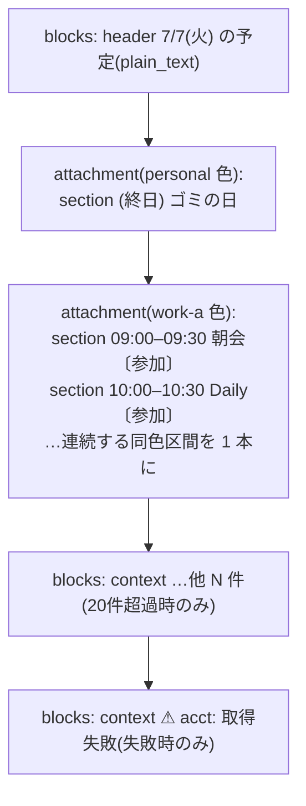

# calsync Slack 通知 v2 設計書(Block Kit・会議 URL・Description)

作成日: 2026-07-06
ステータス: 承認済みドラフト(実装計画の入力)
親設計書: [2026-07-05-slack-notifications-design.md](2026-07-05-slack-notifications-design.md)(v1。本書は v1 の差分であり、明記しない挙動はすべて v1 のまま)

## 1. 概要

v1 のテキスト通知を Google Calendar Slack アプリ風に拡張する。

1. **ダイジェスト**: 予定ごとにブロック分割。各予定 = 時刻レンジ+件名(カレンダーの当該予定へのリンク)+会議 URL(Zoom / Meet / Teams があれば「参加」ボタン)
2. **リマインド**: 会議 URL(参加ボタン)+ description 全文を追加
3. 表現は Slack **Block Kit**(`chat.postMessage` の `blocks`)。通知プレビュー・非対応クライアント用の fallback `text` には v1 のテキスト形式をそのまま使う

**スコープ外(構造的理由)**: Google Calendar アプリの「Going? / Change Response」ボタン。ボタン操作の受信には Slack interactivity 用の公開 HTTPS エンドポイントが必要で、calsync の「セルフホスト・公開サーバーなし」原則(親設計書の Webhook 不採用と同じ判断)と衝突する。URL ボタン(ただのリンク)は受信不要なのでスコープ内。

## 2. 設計判断サマリ

| 論点 | 決定 | 根拠・補足 |
| --- | --- | --- |
| リマインドのデータ源 | **イベントキャッシュ拡張**(`meeting_url` / `description` / `html_link` の 3 列追加) | v1 の title と同じ配管。当日追加の予定も拾える。ライブ単発取得(Provider IF 拡張)は不採用 |
| 会議 URL の抽出 | 構造化フィールド優先 → location / description の正規表現フォールバック(leftmost match) | **実測(2026-07-06)**: Zoom は conferenceData(アドオン経由)が主だが、「location と description に生 URL だけ」の予定が実在する |
| URL の安全規則 | **出所を問わず**レンダリング前に検証(https 前方一致・禁止文字なし・長さ上限)。不合格はボタン/リンクを出さない | 構造化フィールド(conferenceData の uri 等)は API 仕様上 https 保証がないため、抽出時ではなく表示時に一律検証する |
| Graph の description | 全 Graph リクエストの `Prefer` に `outlook.body-content-type="text"` を追加 | **実測(2026-07-06)**: delta にも効き、body がプレーンテキストで返る。作成/検索/PATCH 等の他エンドポイントは応答から id しか読まないため副作用なし(3.4) |
| Google の description | **簡易 HTML 除去を Google プロバイダ内で適用** | Google の description は HTML 断片(`<a href>`・`<br>` 等)を含みうる。依存追加なしで `<br>`/`</p>` → 改行・残タグ除去・std `html.UnescapeString` の 3 段(3.4) |
| Graph のデータ可用性 | 追加の `$select` なし | **実測(2026-07-06)**: calendarView delta は既定でフルリソース(body / location / onlineMeeting / onlineMeetingUrl / webLink 等)を返す |
| TimeHash | `MeetingURL` / `Description` / `HTMLLink` は**入力に含めない** | v1 の Title と同じ不変条件。URL・本文の変更でブロッカー更新は走らない |
| fallback text | v1 の `formatDigest` / `formatReminder` を流用(100 件キャップ等 v1 規則のまま。blocks 側の「他 N 件」と数値が食い違うことは許容) | 通知バナー・非対応面の可読性を無償で維持。fallback は資産流用が正 |
| invalid_blocks の縮退 | blocks 起因エラー(`invalid_blocks*`)のときだけ **fallback text 単体で 1 回再送** | blocks の中身は外部入力(件名・本文)由来で、v1 の「リトライ不能=設定起因」の前提が成立しない。全損よりテキスト縮退(8 章) |
| エラー処理・記録条件 | 上記の縮退を除き **v1 から変更なし** | リトライ分類・reminders_sent の記録条件・dedupe 送信抑止は同一 |

## 3. データモデルと抽出規則

### 3.1 NormalizedEvent の拡張

```go
type NormalizedEvent struct {
	...
	Title       string
	MeetingURL  string // 会議 URL(3.2 の規則で抽出。表示時に 7 章の検証を通す)
	Description string // 本文プレーンテキスト(Graph: Prefer で text 化 / Google: 3.4 の簡易 HTML 除去済み)
	HTMLLink    string // カレンダー上の当該予定への URL(Google: htmlLink / Graph: webLink)
	...
}
```

- 3 フィールドとも表示専用。`TimeHash` の入力には**絶対に含めない**
- 削除イベント(cancelled / @removed)は従来どおり ID のみ(3 フィールドとも空)

### 3.2 会議 URL の抽出優先順

1. **構造化フィールド**(プロバイダ方言。各プロバイダ内に閉じ込める):
   - Google: `conferenceData.entryPoints[]` の `entryPointType == "video"` の `uri` → 無ければ `hangoutLink`
   - Graph: `onlineMeeting.joinUrl` → 無ければ `onlineMeetingUrl`
2. **フォールバック正規表現**(共有ヘルパー `model.ExtractMeetingURL(location, description string) string`):
   - `location` → `description` の順。フィールド内に複数マッチがある場合は**出現位置が最も先頭の一致**(leftmost match。パターン種別間に優先順位は付けない)
   - 対象パターン(いずれも `https://` 固定):
     - `https://zoom.us/…` および `https://<sub>.zoom.us/…` の `/j/` `/my/` パス(**サブドメイン省略可**)
     - `https://meet.google.com/…`
     - `https://teams.microsoft.com/l/meetup-join/…`
   - URL 本体は **RFC 3986 の ASCII 文字集合のみ**(許可列挙)。空白・`"` `<` `>` `|`・全角スペースや「。」「、」等の非 ASCII はすべて終端になる。**切り出し後、末尾の `)` `]` `.` `,` `;` を除去**(括弧囲い・文末句読点の巻き込み防止)
   - **スキームなしの手貼り**(例: 場所欄の `meet.google.com/abc-defg-hij`)にも対応する(v2.1 追補): 各フィールド内で **(1) `https://` 付きを優先**して探し、無ければ **(2) スキームなしパターン**を探して `https://` を補完する。スキームなし判定は「文字列先頭、または直前が URL 断片文字(`A-Za-z0-9/.-`)以外」の境界を要求し、`http://zoom.us/…` の途中一致による https 昇格を防ぐ(`http://` は従来どおり不採用)。フィールド優先(location → description)はこの 2 パスより上位

### 3.3 events テーブルへの 3 列追加(冪等 ALTER の 2 回目)

- const schema の events に `meeting_url TEXT NOT NULL DEFAULT ''` / `description TEXT NOT NULL DEFAULT ''` / `html_link TEXT NOT NULL DEFAULT ''` を追加
- `store.migrate()` に 3 本の `ALTER TABLE events ADD COLUMN …`(duplicate column のみ無視)を追加
- `UpsertEvent` / `GetEvent` / `ListUpcomingEvents` が 3 列を読み書きする
- **既存行のバックフィル**: v1 の title と同じ — 変更検出時または日次 FullResync で埋まる(最大 ~24h は空。ダイジェストはライブ取得のため影響なし)
- description のディスク保存はプライバシー面で件名保存(v1 判断済み)の延長として許容する。README の注意書きを強化(9 章)

### 3.4 プロバイダ変更

- **google**: `normalizeEvent` で `MeetingURL`(3.2 の優先順)/ `Description` / `HTMLLink`(`item.HtmlLink`)を設定。Description は `item.Description` に**簡易 HTML 除去**を適用してから格納する: (1) `<br>` `<br/>` `</p>` を改行に置換 → (2) 残りの `<…>` タグを除去 → (3) std `html.UnescapeString` で実体参照を復元 → (4) NBSP(U+00A0)を通常スペースに正規化 → (5) 前後の空白を `TrimSpace`(表示用の後始末)。依存追加なし。除去はプロバイダ内の表示用正規化であり、同期ロジックには影響しない
- **microsoft**: `deltaEvent` に `Body{Content, ContentType}` / `Location{DisplayName}` / `OnlineMeeting{JoinURL}` / `OnlineMeetingURL` / `WebLink` を追加し、`normalizeDeltaEvent` で設定(MeetingURL は joinUrl → onlineMeetingUrl → 3.2 の正規表現の順)。**`Prefer` ヘッダーは `Client.do()` で一元設定されているため、全リクエスト共通で `IdType="ImmutableId", outlook.body-content-type="text"` に更新する**。delta 以外のエンドポイント(作成・検索・PATCH・DELETE・mailboxSettings)は応答から id しか読まないため副作用なし(コード確認済み)。テストの共通アサート `requireCommonHeaders` の期待値も新しい併記値に更新する(全リクエスト同一のため分岐は不要)
- **fake**: 素通し(契約テストのみ追加)

## 4. DigestEntry / UpcomingEvent の拡張

```go
type DigestEntry struct {
	...既存フィールド...
	MeetingURL  string
	Description string // ダイジェストの blocks では使わない(リマインド用)
	HTMLLink    string
}
```

- `store.UpcomingEvent` にも同 3 フィールドを追加(リマインドがキャッシュから読む)
- **dedupe 統合の規則(ダイジェスト経路のみ)**:
  - `Title` と `HTMLLink` は**同一アカウントからペアで採用**する: AccountIDs(YAML 定義順)で最初に `HTMLLink` が非空のアカウントの (Title, HTMLLink) を使う。全アカウントで HTMLLink が空なら Title は v1 規則(最初の非空)のまま。リンクラベルと遷移先が別アカウントの予定コピーになる混成を防ぐ(Google の htmlLink はマルチログイン時に別アカウントで開くと表示できないため)
  - `MeetingURL` / `Description` は独立に「最初の非空」(同一会議なら実質同値のため混成は無害)
- **リマインド経路には統合規則は適用されない**: v1 どおり最初に処理された行(`ListUpcomingEvents` の SQL 順)の値をそのまま使い、dedupe は送信抑止のみ

## 5. Block Kit — ダイジェスト

**v2.1 改訂(2026-07-06 実表示フィードバック反映)**: 予定行はトップレベル blocks の section ではなく、**attachment(色付き左バー)**にする。色は**由来アカウントごとの固定パレット**で塗り分け、行の区切りとアカウントの識別を同時に解決する。

**v2.2 改訂(2026-07-14 実表示フィードバック反映)**: attachment は「予定ごとに 1 つ」ではなく、**時系列順で連続する同一色(= 同一先頭アカウント)の予定を 1 つの attachment に束ねる**(run-length グルーピング)。Slack クライアントは attachment が多いと「+ N more attachments」に自動で折りたたみ、これを API から無効化する手段は存在しないため、attachment 数を実用上の折りたたみ閾値以下に抑える。時系列・色分け・予定ごとの参加ボタン(section ごとの accessory)はすべて維持される。



- **トップレベル blocks**: `header`(日付・絵文字なし。plain_text のためエスケープ不要)+ 必要時の `context`(他 N 件・取得失敗)のみ。0 件日は header + section「今日の予定はありません」
- **グルーピング(v2.2)**: ソート済みエントリ列(終日先頭 → 開始時刻順)を先頭から走査し、**色アカウント(AccountIDs[0])が同じ連続区間**を 1 つの `{color, blocks: [section...]}` に束ねる。色アカウントが変わったら新しい attachment を開始する(並べ替えはしない — 時系列を崩さない)
- section の中身は従来どおり(予定 1 件 = section 1 個。参加ボタンは section の accessory なので**予定ごとに維持される**):
  - mrkdwn: `*09:00–10:00*  <htmlLink|件名> [acct-a, acct-b]`(時刻レンジは v1 規則、終日は `*(終日)*`、AccountIDs カンマ全併記、件名空 → 「(件名なし)」、HTMLLink 検証不合格 → プレーン表示)
  - 会議 URL が 7 章の検証合格なら `accessory` に「参加」ボタン
- **色の割当**: `cfg.Accounts` の定義順で固定パレット(8 色)を巡回割当。`slack.Client` に `Accounts []string`(YAML 定義順の ID 列)を注入し、エントリの **AccountIDs[0]**(= dedupe 統合の先頭アカウント)の色を使う。未知アカウントは `#999999`。パレット: `#4285F4` `#0F9D58` `#F4B400` `#DB4437` `#7B1FA2` `#00ACC1` `#FF7043` `#5C6BC0`
- **件数上限**: 表示する**予定(section)は最大 20 件**(v2.1 の「attachment 20 件」と同数 — v2.2 では attachment 数はグルーピングにより予定数以下になる)。超過分はトップレベル context「…他 N 件」。20 件目がグループ途中でも件数優先で打ち切る(グループは途中で切れてよい)
- **unfurl 抑止**: `chat.postMessage` に `unfurl_links: false` / `unfurl_media: false` を必ず付ける(htmlLink・本文内 URL のプレビュー展開が 1 予定ごとに巨大カードとして展開される実害を実測で確認済み)
- fallback `text`: v1 の `formatDigest` の出力をそのまま設定(fallback 側は v1 の 100 件キャップのままで、blocks 側と「他 N 件」の数値が食い違うことは許容する)

## 6. Block Kit — リマインド

- **単一の attachment**(色は由来アカウント色 — 5 章と同じ割当)に以下の blocks を入れる。トップレベル blocks は使わない:
  1. `section`(mrkdwn): `⏰ *8分後* 10:00–11:00 <htmlLink|件名> [acct-id]`。「N 分後」は実残り時間の分丸め(`Round`)・**1 分未満は「まもなく」— v1 実装(`formatReminder`)と同一規則**(v1 スペックに明記漏れだった挙動の明文化であり、blocks と fallback で表示は一致する)。MeetingURL が 7 章の検証合格なら `accessory` に「参加」ボタン
  2. Description が**非空(`strings.TrimSpace` 後に長さ > 0。表示にも trim 後を使う)**なら `section`(mrkdwn): 本文全文。長さ規則は 7 章
- fallback: v1 の `formatReminder` の出力を **attachment の `fallback` フィールド**に入れ、トップレベル `text` は**送らない**(v2.1 実測: blocks を持たないメッセージではトップレベル text が本文として描画され、attachment と二重表示になる)。unfurl 抑止は 5 章と同じ(本文内 URL の展開防止)
- リマインドの発火条件・記録条件・dedupe 送信抑止・エラー分類は v1 6 章のまま変更なし(8 章の縮退を除く)

## 7. エスケープ・切り詰め・URL 検証(v1 8 章の拡張)

**エスケープ**(適用対象: 件名・description・アカウント表示・取得失敗アカウント名 — すべての外部由来文字列):

- v1 の `escapeText`(`&` → `&amp;` を最初に、`<` `>` を実体参照化)を適用する。**description も外部入力**であり `<!channel>` インジェクションの対象になるため必須
- リンクラベル(`<url|label>` の label): `escapeText` 適用に加えて `|` を `/` に置換(mrkdwn リンク構文の破壊防止)

**切り詰め(順序と単位を固定)**: すべて **escapeText 適用後の文字列に対して rune 単位**で行う。切り詰め位置が実体参照(`&amp;` 等)の途中に当たる場合は**その参照ごと落とす**:

- リンクラベル(件名): 200 rune 超は 200 rune +「…」
- description section: 2,900 rune 超は 2,900 rune +「…(省略)」(section text 上限 3,000 の安全マージン。エスケープ後基準なので膨張による超過は構造的に起きない)
- 予定行 section はラベル 200 + 時刻・アカウント表示で構造的に 3,000 未満に収まる(URL は下記の 2,000 上限)

**URL 検証(MeetingURL / HTMLLink 共通。出所を問わずレンダリング直前に適用)**:

- `https://` 前方一致 かつ 空白・`|` `<` `>` を含まない かつ 2,000 rune 以内 → 合格
- 不合格の場合: リンク化しない(件名はプレーン表示)/ 参加ボタンを出さない。URL そのものは表示しない
- URL 内の `&` はエスケープせずそのまま扱う(Graph の webLink はクエリに `&` を含む。mrkdwn の URL 部での扱いは 12 章スパイクで実表示確認)

## 8. slack パッケージの変更

- 新ファイル `internal/notify/slack/blocks.go`: `digestMessage(day, entries, failed, loc, colorFor)` / `reminderMessage(e, lead, loc, colorFor)` が (blocks, attachments) を返す(最小の構造体群で型付けし、`json.Marshal` でペイロード化。attachment は `{color string, blocks []block}`)
- `chat.postMessage` のペイロードを `{channel, text?, blocks, attachments, unfurl_links: false, unfurl_media: false}` に拡張(blocks / attachments は空なら省略)。**トップレベル `text` は blocks があるとき(ダイジェスト)のみ**付ける — blocks の無いメッセージでは text が本文として描画され attachment と二重表示になるため、リマインドは attachment の `fallback` フィールドに通知用テキストを入れる(attachment 型は `{color, blocks, fallback?}`)
- `slack.Client` に `Accounts []string`(YAML 定義順)を追加し、`cmd_run` が `cfg.Accounts` の ID 列を注入。色割当ヘルパー `colorFor(accountID)` はパレット巡回+未知 `#999999`
- **縮退パス**: 送信が `ok:false` かつエラー文字列に `invalid_blocks` または `invalid_attachments` を含む場合のみ、**blocks と attachments を外し fallback text 単体で 1 回だけ再送**する(unfurl 抑止は再送にも付ける)。再送の結果は通常の分類(v1)に従う。それ以外のエラーは v1 どおり(縮退なし)
- `call()` / エラー分類 / DM 解決 / タイムアウトは変更なし

## 9. ドキュメント・運用

- README: 通知例を Block Kit 版に更新。**「会議 URL(パスワード付き Zoom リンク)と本文が通知先チャンネルに流れる」**注意書きを強化
- CHANGELOG `[Unreleased]` に追記
- スペック(本書)の実測記録を初回稼働時に更新

## 10. テスト計画

- **抽出**(`model.ExtractMeetingURL` テーブルテスト): location 優先 / description フォールバック / zoom サブドメインあり・**なし** / meet / teams / **括弧囲い `(https://…)` と文末ピリオドの終端除去** / **Zoom+Meet 混在時の leftmost match** / https 以外・マッチなし
- **HTML 除去**(google): `<br>`→改行 / `<a href>` 除去 / 実体参照復元 / プレーンテキスト素通し
- **プロバイダ**: google = conferenceData video 優先・hangoutLink フォールバック・htmlLink。microsoft = joinUrl 優先・onlineMeetingUrl フォールバック・webLink・body text 素通し・**`requireCommonHeaders` の Prefer 期待値更新(全リクエスト同一の新併記値)**
- **store**: 3 列マイグレーション(旧スキーマ → 3 列追加・二度開き)・ラウンドトリップ(UpsertEvent / GetEvent / ListUpcomingEvents)
- **blocks**: ブロック数上限(46+context)・accessory の有無・**超長件名(200 rune 切り詰め)**・**`&` 連続 description(エスケープ後切り詰めで 3,000 未満)**・**マルチバイト・実体参照境界の切り詰め**・**空白のみ description で section を出さない**・`|` 置換・`<!channel>` エスケープ・URL 検証不合格時のプレーン表示/ボタン省略
- **slack**: `invalid_blocks` 応答 → fallback text 単体で 1 回再送(httptest で 2 リクエスト目に blocks が無いこと)・再送成功/失敗の分類
- **engine**: dedupe 統合の Title+HTMLLink 同一アカウントペア規則 / MeetingURL・Description の独立「最初の非空」
- 全テスト `-race -count=1`

## 11. スコープ外

- Going? / Change Response ボタン(1 章の構造的理由)
- ダイジェストへの description 表示(ユーザー確認済み: リマインドのみ)
- 会議 URL パターンの網羅拡張(Webex 等)— 実需が出たら追加
- Teams 会議の定型ボイラープレート本文の整形(そのまま表示を許容)
- Block Kit のリッチ化(画像・メンション等)

## 12. スパイク(実測で消し込む)

1. ~~Block Kit の実表示(accessory ボタン・リンク・header・URL 内 `&` の扱い)~~ → **実測済み(2026-07-06)**: 14:19(v2)と 14:57(v2.1)の実予定ダイジェストで、件名リンク・参加ボタン・アカウント別色バー・unfurl 抑止をユーザー目視確認。リマインドの実表示(description の HTML 除去品質 = スパイク 4)のみ初回の実リマインドで確認
2. ~~`blocks` 付き `chat.postMessage` が既存トークン・スコープ(`chat:write`)のみで通ること~~ → **実測済み(2026-07-06 14:19)**: 実予定ありの当日ダイジェストを blocks 付きで送信し、エラー・縮退ログなしで投稿成功
3. `invalid_blocks` の実エラー文字列(縮退トリガーの網羅確認)— 発生時に確認(初回実測では未発生)
4. Google の HTML 入り description の実表示(3.4 の簡易除去の品質)— リマインドの実データで確認

**実測済み(2026-07-06、本設計の前提)**: Graph calendarView delta は既定でフルリソースを返す / `Prefer: outlook.body-content-type="text"` が delta に効く(text で返る)/ Zoom URL は conferenceData(video entryPoint)と location・description 手貼りの両方に実在 / Google 全予定に htmlLink が付く。
