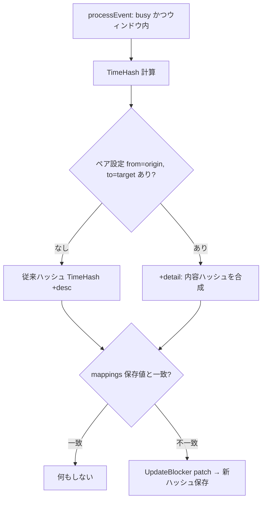

# calsync detail_sync(ペア別タイトル/説明同期)設計書

作成日: 2026-07-15
ステータス: 承認済みドラフト(実装計画の入力)
関連: [2026-07-03-calsync-design.md](2026-07-03-calsync-design.md)(v1 全体設計 — 本機能は §1「予定の中身は同期しない」の明示オプトイン例外)

## 1. 概要・動機

calsync のブロッカーは固定タイトル(既定「予定あり」)・説明なしの完全匿名が既定であり、これは変えない。本機能は「アカウント B の予定をアカウント A へミラーするときだけ、タイトル(と指定すれば説明も)を元イベントから転記したい」というペア単位の要望に応えるオプトイン設定 `detail_sync` を追加する。

- **既定挙動は不変**: `detail_sync` を書かない限り、通常同期経路(processEvent)の動作と保存ハッシュは現状と完全に同一(アップグレード無風)。唯一の例外はリコンサイルの収容・再構築経路で、ペア未設定でも 1 回だけ自己修復 patch が走るようになる(§6 — オプトアウト保証とドリフト修復のための意図的な挙動変更)。
- **ペア単位・一方通行**: origin アカウント → target アカウントの方向ごとに指定する。逆方向も欲しければ 2 エントリ書く。
- **粒度はアカウント単位**: origin のカレンダー単位では指定できない(v1 判断)。ブロッカーのタグ(`calsync-origin`)に origin カレンダー ID が含まれず、DB 全損からの再構築時にカレンダー粒度のポリシーが誤適用されうるため。カレンダー粒度はタグ形式の拡張とセットで将来検討。

v1 全体設計 §16 の v2 候補「ペアごとのタイトル・除外ポリシー」のうちタイトル/説明部分の具体化にあたる。配布自体の抑止(exclude_pairs)は本機能のスコープ外。

## 2. 設定と検証

```yaml
# トップレベル。どの詳細がどこへ開示されるかを 1 箇所で監査できる
detail_sync:
  - from: btajp        # origin アカウント id(YAML の accounts[].id)
    to: personal       # target アカウント id
    fields: [title, description]
  - from: work-a
    to: personal
    fields: [title]
```

検証規則(すべて `config: ` プレフィックスの既存流儀に従う):

| 規則 | エラー例 |
| --- | --- |
| `from` / `to` は accounts に実在する id | `config: detail_sync[0]: unknown account "typo"` |
| `from != to` | `config: detail_sync[0]: from and to must differ` |
| 同一 (from, to) の重複エントリ禁止 | `config: detail_sync[1]: duplicate pair "btajp" => "personal"` |
| `fields` は非空、値は `title` / `description` のみ、エントリ内重複禁止 | `config: detail_sync[0]: invalid field "location" (want title or description)` |

- accounts の実在チェックはアカウント読込完了後の後検証パスで行う(未知 id の黙殺は KnownFields の思想に反する)。
- provider の制約なし: Google / Microsoft どちらの組み合わせも from / to に指定できる。
- 解決 API: `Config.DetailSyncFor(originID, targetID)` がエントリ(なければ nil)を返す。

## 3. 変更検知(設計の肝)

現状の更新トリガーは mappings.time_hash(時刻のみの TimeHash に、`show_origin_in_description` の "+desc" フラグを合成した値)の不一致だけであり、タイトル/説明の変更は検知されない。本機能ではペア設定がある場合のみ、**同期対象フィールドの実内容のハッシュ**をさらに合成する:

```
保存ハッシュ = TimeHash
             + ("+desc")                    ← 既存(show_origin_in_description ON 時)
             + ("+detail:" + detailHash)    ← 新規(ペア設定あり時)

detailHash = sha256 先頭16桁hex(
  有効フィールドを正規順(title → description)で
  "<フィールド名>=" + sha256hex(<フィールド値>)(64 桁 hex 全体)の形に写して "|" 連結した文字列
)
  fields=[title]              → "title=<sha256(元タイトル)>"
  fields=[title,description]  → "title=<sha256(元タイトル)>|description=<sha256(元説明)>"
```

- **無風保証**: ペア未設定なら "+detail:" 成分は付かず、保存ハッシュは現在の値と完全一致(通常同期経路。収容・再構築経路のみ §6 の sentinel が例外)。
- **内容変更の伝搬**: フラグではなく内容そのものをハッシュに入れるため、origin でタイトルを変更すると差分同期(約 1 分のポーリング)の processEvent でハッシュ不一致になり、ブロッカーが自動 patch される。
- **フィールドの正規順**: YAML 上の記述順に依存せず title → description の固定順で連結する(記述順の入れ替えで無駄 patch が走らないように)。
- **境界衝突の排除**: フィールド値は生のまま連結せず、値ごとに sha256 してから連結する。タイトルに `|description|` のような区切り文字列が含まれていても隣接フィールドと混ざらない(TimeHash の `|` 連結は値が固定形式の時刻なので安全だが、今回は自由文字列が載るため個別ハッシュが必須)。
- **設定変更の遡及**: ペアの追加・削除・fields 変更は、デーモン再起動後の**次回日次リコンサイル(FullResync の全件再処理)または手動 `calsync reconcile`** で既存ブロッカーに反映される(`show_origin_in_description` トグルと同じ意味論。手動 reconcile はデーモン停止中のみという運用制約も同じ)。
- 合成は既存の `policyHashFor` を拡張して一本化し、全経路(通常配布・suppressed 追従・pending 解決・404 再作成・リコンサイル収容)が同じ導出を通る。導出規則が経路間でズレると「永久不一致 → 毎サイクル patch」または「更新漏れ」になるため、合成箇所の分散は禁止。



## 4. ブロッカー内容の組み立て

- `title` 指定時: 元イベントのタイトルをそのまま転記(接頭辞・装飾なし)。**元タイトルが空文字ならグローバル `blocker_title` にフォールバック**(events キャッシュの旧行が温まる前でも壊れない。内容ハッシュには実際に使った値ではなく元の空文字が入るため、キャッシュが温まれば不一致 → 自動修復)。
- `description` 指定時: 元イベントの説明をそのまま転記。target の `show_origin_in_description` も ON の場合は、転記した説明の末尾に空行を挟んで従来の「calsync: ミラー元アカウント = <origin id>」行を併記する(説明が空なら origin 行のみ)。
- 組み立ては `blockerFor` / `descriptionFor` の拡張として全作成経路共通のヘルパに集約する。origin アカウント id は OriginTag(`<account_id>:<event_id>`)から解決できるため、シグネチャ拡張は最小で済む。
- ダイジェスト/リマインド(Slack 通知)への影響なし: 通知はブロッカーを除外して元イベントから生成するため、detail_sync の有無で通知内容は変わらない。

## 5. プロバイダ変更

| プロバイダ | 変更 |
| --- | --- |
| Google | (1) `UpdateBlocker` の events.patch に Summary を追加(現在は Start/End/Description のみ)。タイトルはフォールバックにより常に非空のため、ForceSendFields の追加は不要(Description の空クリア対応は既存のまま)。(2) `CreateBlocker` の 409 で既存イベントが非 cancelled の場合、現在は既存 ID を返すだけだが、**返す前に patch を 1 回打って内容を揃える**(下記) |
| Microsoft | `CreateBlocker` の 409 復旧(origin タグ $filter で既存 ID 引き当て)も現在は ID を返すだけ。**同様に返す前に PATCH を 1 回打って内容を揃える** |
| fake | 変更なし(既に body 全置換 = 変更後の Google と同じ契約になり、従来あった「fake はタイトルを更新するが Google はしない」という契約の非対称が解消される) |

- **409 復旧時の内容整合(新規)**: 作成のクラッシュ再実行(pending 残留 → resolvePending → 409)では、停止中に origin の内容が変わっていると「ブロッカー実体は古い内容・mappings のハッシュは新しい値」の食い違いが固定化し、次の時刻/内容変更まで修復されない。409 で既存 ID を引き当てたときに作成しようとしていたボディで patch してから返せば、この食い違いクラスが両プロバイダとも解消する。追加コストは 409 発生時(稀)の 1 呼び出しのみ。Google の cancelled → 蘇生パスは従来から blockerEventBody 全体を再送しており(実測済み)変更なし。
- 冪等キー(Google クライアント生成 ID / Graph transactionId)の導出は**一切変更しない**。ペア設定をキーに混ぜると設定変更のたびにブロッカーが二重作成される。見た目は常に patch、キーは不変。

## 6. リコンサイル・DB 全損との整合

タグ再構築・孤児収容の経路では、プロバイダの `ListBlockers` がブロッカーの実時刻から再計算した TimeHash しか得られず、内容成分を再現できない。そこで:

- **収容・再構築で mappings に入る行は、ペア設定の有無に関わらず、policyHashFor の出力(素の TimeHash または "+desc" 付き)の末尾に sentinel(`+detail:unknown`)を付与して保存する**。sentinel は実際の保存ハッシュ(素の TimeHash・"+desc" 付き・実 detailHash 付きのいずれ)とも決して一致しないため、FullResync 再処理でハッシュ不一致 → 1 回だけ patch が走り、そのペアの正しい内容(ペアなしなら既定の「予定あり」・説明ポリシー値)+正規ハッシュに自己修復する。
- **ペア設定なしの行にも sentinel を入れる理由**: ペア解除 → 反映用リコンサイルの前に DB 全損 → 再構築、という経路では、時刻ハッシュだけで復元すると「転記済みタイトルが残ったままハッシュ一致」となり、詳細が無期限に残留する(プライバシー上のオプトアウト保証が破れる)。無条件 sentinel なら再構築行は必ず 1 回既定内容へ patch されるため、この残留と「ユーザーがブロッカーを手で書き換えた」系のドリフトが収容時にまとめて修復される。
- 修復タイミング: タグ再構築(フェーズ 0)は直後の FullResync で同一リコンサイル内に修復。孤児収容(adoptOrphans — FullResync の後段)は次回リコンサイルまたは元イベントの次回変更で修復。
- patch 回数は有界: 通常運用では収容された行のみ。DB 全損リコンサイルでは全ブロッカーが対象になるため**全件 1 回ずつ patch が走る**(1 回限り。既存の再構築コストと同じオーダーで、レート制御は既存のリトライ機構に委ねる)。

## 7. 壊さない不変条件

- ループ防止は mappings 一次+タグ二次のまま。**タイトルをループ判定・対応付けに使わない**(Graph delta はタグを返せない前提も不変)。
- カーソル規律・mappings ワイプ禁止・pending → active 遷移は無変更。
- ブロッカーの visibility=private(Google)/ sensitivity=private(Graph)は維持する(detail_sync ペアで visibility が明示指定された場合を除く — §12)。閲覧権限だけの共有相手には従来通り非公開予定としか見えない。ただし private が隠せるのは閲覧レベルの共有に対してのみで、**編集権限を持つ共有相手・組織の管理者・そのカレンダーに API アクセスできる人は転記内容を読める**(show_origin_in_description の既存注意と同じ性質)。README のプライバシー記述もこれに合わせる。
- suppressed mapping はハッシュ追従のみ(実体なし)。昇格時は共通ヘルパ経由で最新内容が作られる。

## 8. 既知の制限(仕様として明記)

- リコンサイルは既存 mapping が健全な行のブロッカー内容ドリフト(ユーザーがブロッカーを手で書き換えた等)を検証・修復しない(v1 から不変。検証は存在と時刻+ポリシーハッシュのみ)。修復されるのは (1) 収容・再構築を経た行(§6 の sentinel)、(2) origin イベントの時刻/内容が次に変わったとき、(3) 設定変更(ペア追加・削除・fields 変更・show_origin トグル)後のリコンサイル、のいずれかのみ。
- 説明の転記はプレーンテキスト。Graph は text ボディを保存時に HTML 化するため、ライブのブロッカー本文を読み戻して差分判定する設計は採らない(判定は常に mappings 内ハッシュ)。

## 9. 成果物

| ファイル | 内容 |
| --- | --- |
| `internal/config/config.go` | `detail_sync` スキーマ・検証・`DetailSyncFor` |
| `internal/engine/` | `policyHashFor` 拡張・`blockerFor`/`descriptionFor` 拡張・収容時 sentinel(無条件) |
| `internal/provider/google/blockers.go` | UpdateBlocker に Summary 追加・409 非 cancelled 分岐で内容整合 patch |
| `internal/provider/microsoft/blockers.go` | 409 復旧で内容整合 PATCH |
| 仕様書 v1 §1/§3 | 本スペックへの参照を追記(「中身は同期しない」の例外として) |
| README | 冒頭の特徴節(「予定の中身は同期しません」)とプライバシー節(「一切コピーされません」)の**両方**を「既定では一切コピーしない。detail_sync で明示したペアのみ転記」に改訂。設定例は show_origin_in_description と同じ設定リファレンス周辺に detail_sync の項として追加 |
| CHANGELOG | `[Unreleased]` に追記 |

DB スキーマ変更なし(ハッシュは opaque な TEXT、元データは events キャッシュの既存カラム)。

## 10. テスト計画

- config: 検証規則の全ケース(未知アカウント・自己参照・重複ペア・不正フィールド・空 fields・KnownFields タイポ)
- ハッシュ: ペア未設定で従来値と完全一致(無風保証の回帰テスト)/ フィールド内容の変更で変化 / fields 記述順に不変 / "+desc" との合成順 / 境界衝突耐性(`title="A|description|B"` と `title="A", description="B"` が異なるハッシュになる)/ 空タイトル時は空文字ベースの detailHash になる(フォールバック値ではなく)
- 組み立て: title 転記・空タイトルフォールバック・description 転記・show_origin_in_description との併記・ペアなしは従来値
- Google: patch ボディに Summary が含まれる / 409 非 cancelled で patch が 1 回走る(httptest でボディ検証)
- Microsoft: 409 復旧で PATCH が 1 回走り、ボディに転記内容(subject/body)が入る(httptest)
- エンジン結合(fake): ペア ON で作成されるブロッカーの内容 / origin タイトル変更 → 次 tick で patch / ペア OFF → ON・ON → OFF の遡及(FullResync 経由)/ 収容 sentinel → 自己修復 patch が 1 回だけ走る(ペアあり・**ペアなし両方**)/ ペア解除後に DB 再構築を挟んでも既定内容へ復帰する / suppressed 昇格時の内容 / 設定変更の前後で冪等キーとブロッカー件数が不変(二重作成しない — §5 の中核主張の固定)
- ライブ検証: 実運用構成で、デーモン停止 → `detail_sync` を 1 ペア追記 → 停止中に `calsync reconcile` → デーモン起動 → 既存ブロッカーのタイトル反映を確認 → origin でタイトル変更 → 約 1 分で追従 → 同手順で設定を外し「予定あり」への復帰を確認(書き込み系コマンドはデーモン停止中のみ、の運用制約に従う)

### 実測記録(2026-07-15)

- 実運用構成に `work-b => work-a, fields: [title, description]` を投入(テストではなく恒久設定)。手順: デーモン停止 → 新バイナリ再ビルド → 設定追記 → 停止中 `calsync reconcile`(完走・エラーなし)→ 再起動 → 全 6 アカウント ok
- 投入時点で work-b はウィンドウ内 busy 0 件(mappings・events とも 0 行を SQLite で確認)。その後 work-b に入った予定が work-a へ転記され、**タイトル・説明本文・origin 行(show_origin_in_description ON のため末尾併記)がすべて意図どおり表示されることをユーザーが目視確認**(ブロッカーは非公開マーク付き = visibility=private 維持も確認)
- 「設定を外して復帰」は恒久設定のため意図的に未実施(fake の結合テスト `TestFullResync_DetailSyncTogglesRetroactively` で担保)
- この検証から追加要件が判明: 内容を開示するペアではブロッカーの visibility 自体も設定したい(非公開マークを外したい)→ 別スペックで対応

## 11. スコープ外

- origin カレンダー単位の粒度(タグ形式拡張が前提。§1 参照)
- `location` 等の追加フィールド(events キャッシュ・プロバイダ層の拡張が必要。`fields` の列挙値追加で将来対応可能)
- 配布自体のペア別抑止(exclude_pairs — v1 全体設計 §16 の別項目のまま)
- Slack 通知の変更(影響なし)

## 12. 改訂: ペア別 visibility(2026-07-15 追記・承認済み)

§10 の実測投入で判明した追加要件: 内容を開示するペアでは、ブロッカーの visibility(非公開マーク)自体も制御したい。既定の匿名ブロッカーは非公開のまま。

### 12.1 設定

detail_sync エントリに任意キー `visibility` を追加する:

```yaml
detail_sync:
  - from: work-b
    to: work-a
    fields: [title, description]
    visibility: default   # private(既定・未指定と同義)| default | public
```

- 値は Google の語彙をそのまま使う 3 値。`private` = 現状(鍵マーク・詳細は本人と編集権限者のみ)/ `default` = カレンダーの共有設定に従う(普通の予定と同じ)/ `public` = 共有相手が時間枠のみ表示でも詳細を見せる
- 検証: 3 値以外はエラー `config: detail_sync[%d]: invalid visibility %q (want private, default, or public)`。`DetailSyncPair.Visibility` には正規化済みの値を持つ(未指定 → "private")
- visibility はペア(detail_sync エントリ)がある場合のみ意味を持つ。ペアなしブロッカーは常に private

### 12.2 プロバイダ写像

| 値 | Google(event.visibility) | Microsoft(sensitivity) |
| --- | --- | --- |
| private | private | private |
| default | default | normal |
| public | public | normal |

- `model.Blocker` に `Visibility string` を追加。**空文字は private 扱い**(ペアなし経路・後方互換の安全側)
- Google: `blockerEventBody`(insert・409 蘇生)と `UpdateBlocker` patch の両方で送る。写像後の値は常に非空なので ForceSendFields 不要
- Microsoft: `blockerBody` の Sensitivity を写像値に(create / PATCH 共通。Graph に「公開」の段階は無いため default/public とも normal)
- fake: body 全置換のため変更不要

### 12.3 変更検知

ペアの保存ハッシュに visibility 成分を追加合成する。**private(既定)のときは何も付けない**:

```
保存ハッシュ = TimeHash [+desc] [+detail:<16hex>] [+vis:<default|public>]
```

- **ハッシュ側でも空文字は private 扱い**(allowlist: `default` / `public` のときのみ `+vis:` を付与)。`config.Load` を通らずペアを直接構築するテスト等で `Visibility` がゼロ値("")でも、正規化済みの "private" と同じ「成分なし」になる — `model.Blocker.Visibility` の空文字 = private と同じ contract
- 既存ペア(visibility 未指定 = private)はアップグレード無風(保存ハッシュ不変 — 稼働中の work-b => work-a に一斉 patch は走らない)
- visibility の変更は次回リコンサイル(または停止中の手動 `calsync reconcile`)で既存ブロッカーへ遡及 patch(§3 と同じ意味論)
- 合成は `detailComponentFor` 1 箇所に閉じる(vis 成分は detail 成分の直後・固定順)。sentinel(`+detail:unknown`)は canonical 値(`+detail:<hex>` または `+detail:<hex>+vis:<v>`)と決して一致しないため、収容・再構築の自己修復(§6)は従来どおり機能する

### 12.4 プライバシー注意(README にも明記)

`default` / `public` にすると、そのカレンダーの共有相手に転記内容が共有設定に応じて見えるようになる。これは「このペアは開示する」という明示オプトインの意図した動作。Microsoft がミラー先の場合は `default` と `public` の体感差はない(どちらも sensitivity=normal)ことも README に明記する。

### 12.5 スコープ外(§11 への追記事項)

- **visibility 単独指定(転記なしで公開設定だけ変える)は不可**: `fields` 非空必須(§2)は緩めない。visibility は「内容を開示するペア」の付随設定という位置づけ(本要件の出所も内容転記ペア)。需要が出たら fields の必須解除とセットで再検討

### 12.6 成果物

| ファイル | 内容 |
| --- | --- |
| `internal/config/config.go` | `detail_sync[].visibility` の受理・enum 検証・"private" 正規化 |
| `internal/model/model.go` | `Blocker.Visibility`(空文字 = private) |
| `internal/engine/engine.go` | `detailComponentFor` に `+vis:` 成分(private/空文字は付与なし)・`blockerFor` でペアから解決 |
| `internal/provider/google/blockers.go` | insert/patch の visibility を写像値に |
| `internal/provider/microsoft/blockers.go` | sensitivity を写像値に |
| README / CHANGELOG | §12.1 の値説明・§12.4 の注意・変更履歴 |

### 12.7 テスト計画

- config: enum 検証 / 未指定 → "private" 正規化 / KnownFields タイポ
- ハッシュ: visibility=private **および空文字**でハッシュが §3 の従来値と完全一致(無風の回帰テスト)/ default・public で変化し、値ごとに異なる / "+detail:" との合成順固定
- 組み立て: Blocker.Visibility がペアから解決される / ペアなしは空文字(= private)
- Google: insert・patch ボディの visibility(private/default/public)を httptest で検証
- Microsoft: sensitivity 写像(private→private、default/public→normal)を httptest で検証
- エンジン結合(fake): visibility トグルの遡及(FullResync 経由・冪等キー/件数不変)
- ライブ検証: work-b => work-a に visibility を設定 → 停止中 reconcile → カレンダー上で鍵マークが消えることを目視確認
