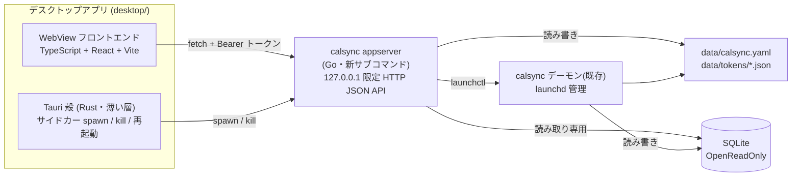
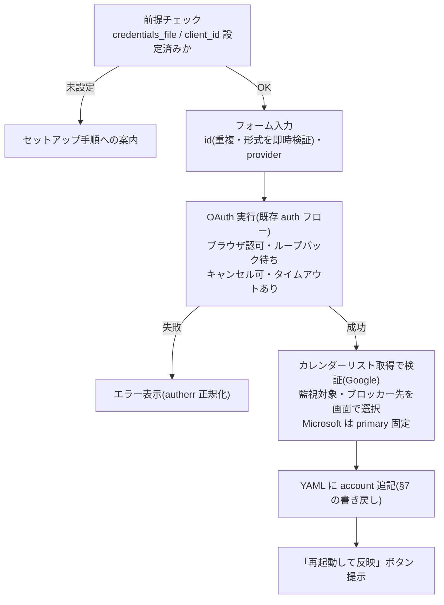

# calsync デスクトップアプリ v1 設計書

作成日: 2026-07-21
ステータス: 承認済みドラフト(実装計画の入力)

## 1. 概要

calsync の設定確認・変更・アカウント追加・デーモン制御を GUI で行う macOS デスクトップアプリを、本リポジトリの機能として追加する。ターミナルを開かずに以下ができることが目的:

- カレンダー構成の俯瞰(アカウント・監視対象カレンダー・ブロッカー先・digest 対象・同期状態)
- 設定(`data/calsync.yaml`)のフォーム編集と検証付き保存
- アカウント追加(OAuth 認可 → カレンダー選択 → 設定追記 → 再起動、の一気通貫)
- デーモンの停止・起動・再起動(launchd 管理時)

全アカウントの予定を週/月表示で重ねて見る「予定マージビュー」は本設計のスコープ外とし、フェーズ 2 として別スペックで扱う(§14)。

## 2. スコープ

### v1 に含む

| 機能 | 内容 |
| --- | --- |
| ダッシュボード | デーモン状態・アカウント別の最終同期・直近エラー・doctor 相当の診断 |
| カレンダー構成の俯瞰 | アカウントごとの監視対象/ブロッカー先/digest カレンダーの一覧表示 |
| 設定のフォーム編集 | 主要設定(poll_interval・sync_window・blocker_title・reconcile_at・dedupe_same_meeting・busy_show_as・Slack 通知・accounts・detail_sync)の編集・検証・保存 |
| アカウント追加 | 前提チェック → フォーム → OAuth → カレンダー選択 → YAML 追記 → 再起動誘導 |
| デーモン制御 | launchctl 経由の停止/起動/再起動。launchd 管理外は手順案内にフォールバック |

### v1 に含まない

- 予定マージビュー(フェーズ 2)
- アカウント削除(デーモン停止+DB 書き込みが必要で危険度が高い。`calsync-uninstall` 手順への案内に留める)
- `sync` / `reconcile` の手動実行(同上)
- アプリ内 YAML テキストエディタ(外部エディタで代替可能)
- 署名・公証・配布物(DMG 等)。v1 は自分でビルドして使う前提
- Linux / Windows 対応(アーキテクチャ上は将来可能だが検証しない)

## 3. フレームワーク選定

Tauri v2(2.11 系、2024-10 から stable)+ Go サイドカー構成を採用する。

選定は 2026-07-21 時点の一次情報調査に基づく。比較した選択肢と見送り理由:

| 候補 | 見送り理由 |
| --- | --- |
| Wails v3 | Go 直接バインドで技術的相性は最良だが、3.5 年アルファが継続中(v3.0.0-alpha2.117)で破壊的変更が現役。かつ実質 1 人のサイドプロジェクト(直近 12 ヶ月の人間のコミットが lead 653 vs 次点 14、資金は個人 Sponsors 54 口)で、保守の持続性を保証できない |
| Swift ネイティブ | macOS 専用化・2 言語保守・配布時の公証コスト。サイドカー構成になる点は Tauri と同じで優位性が薄い |
| Fyne v2.8 | 純 Go で安定だが非ネイティブな見た目。フェーズ 2 のカレンダービューに使える既製ウィジェットがなく全自作になる |
| Electron | ~150MB 級のフットプリントと Chromium 追従の保守負担。利点がない |

Tauri の既知の弱点と対応方針:

- サイドカーのライフサイクル管理(Cmd+Q での孤児化等)は公式機能がない → 殻に明示的な kill 処理を実装する(§5)
- サイドカー同梱時の公証に既知の不具合報告(tauri#11992)→ v1 は配布しないため影響なし。スパイク項目として §15 に積む
- Rust + Node がビルド要件に加わる → デーモン本体のビルド(CGO なし・Go のみ)には影響させない

## 4. 全体アーキテクチャ

3 プロセス構成。機能ロジックは全て Go 側(appserver)に置き、Rust 殻は起動・監視・終了のみを担う。



### 不変条件との整合(壊してはいけないもの)

- appserver は SQLite を既存の `OpenReadOnly` でしか開かない。書き込みはファイル(YAML・トークン)のみ。flock・カーソル規律・mappings に一切触れない
- macOS ネイティブ(launchd)運用ではデーモン稼働中の読み取り専用アクセスは安全(既存の status/doctor と同じ経路)
- コンテナ運用のホストから data/ に触ることは読み取り含め禁止(VirtioFS 越しの読み取りで DB 物理破損の実績あり)→ §9 のコンテナガードで構造的に防ぐ
- OAuth の作法(Microsoft の「localhost・パスなし」リダイレクト、`prompt=select_account`)は既存 `internal/auth` を再利用することでそのまま維持する

## 5. プロセスと配置

### リポジトリ配置

```
desktop/                        # Tauri プロジェクト(新規)
  src/                          # フロントエンド(TypeScript + React + Vite)
  src-tauri/                    # Rust 殻(スキャフォールドほぼそのまま)
cmd/calsync/cmd_appserver.go    # appserver サブコマンド(新規)
internal/appserver/             # HTTP ハンドラ群(新規パッケージ)
```

- デーモンのビルドは従来どおり `go build`(CGO 不要)。`desktop/` のビルドにのみ Rust + Node が必要
- フロントは React + TypeScript。フェーズ 2 のカレンダービュー既製品(FullCalendar 等)のエコシステムを見込んだ選定

### サイドカーのライフサイクル

1. 殻は起動時に `calsync appserver --config <path> --data <dir>` を spawn する
2. appserver は 127.0.0.1 のエフェメラルポートに bind し、起動時に生成したワンタイム Bearer トークンとポート番号を stdout に 1 行 JSON で出力する(例: `{"port": 12345, "token": "..."}`)
3. 殻はこの 1 行を読み取り、フロントに渡す。以後フロントは `fetch` + `Authorization: Bearer` で直接叩く
4. 殻はアプリ終了時(ウィンドウクローズ・Cmd+Q・クラッシュハンドラ)に必ずサイドカーを kill する。サイドカー異常終了時は 1 回だけ自動再起動し、失敗したらエラー画面+ログパスを表示する
5. appserver は親プロセス(殻)の死活を stdin の EOF で検知し、孤児化した場合は自ら終了する(二重防御)

## 6. appserver API

すべて `127.0.0.1` bind・Bearer トークン必須・CORS 不許可。トークン不一致は一律 401。

| エンドポイント | 動作 | 再利用する既存コード |
| --- | --- | --- |
| `GET /api/status` | デーモン状態(launchctl + プロセス)・アカウント別最終同期・直近エラー | `cmd_status` 相当、store `OpenReadOnly` |
| `GET /api/doctor` | doctor 相当の診断結果 | `cmd_doctor` 相当 |
| `GET /api/config` | 現設定の構造化 JSON(検証済み値+生値) | `internal/config` |
| `PUT /api/config` | 検証 → コメント保持で YAML 書き戻し(§7) | `internal/config` の検証 |
| `GET /api/accounts/{id}/calendars` | カレンダーリスト取得(Google のみ。v1 の Microsoft は primary 固定のため不要) | `internal/provider/google` |
| `POST /api/auth/start` | OAuth 認可開始(ブラウザ起動+ループバック待ち)。進捗は同エンドポイントのロングポーリングで返す | `internal/auth` |
| `POST /api/auth/cancel` | 進行中の認可を中断 | 同上 |
| `POST /api/daemon/start` `stop` `restart` | launchctl 実行。launchd 管理外は 409 + 手動手順を返す | 新規(runner 抽象越し) |

- エラーは全エンドポイント共通で `{code, message, hint}`。プロバイダ認証エラーは既存 `autherr` 正規化を通して hint(再認可の要否)を付ける
- デーモン状態はフロントがフォアグラウンド時に 5 秒間隔でポーリングする

## 7. 設定の書き戻しとコメント保持

- 書き戻しは yaml.v3 の Node API でファイルを木構造のまま部分編集する(struct への marshal し直しはしない)。触っていない箇所のコメント・キー順は構造的に保持される
- 保存手順: Node 木を編集 → 出力バイト列を `config.Load` 相当の検証に通す → 通った場合のみ tmp+rename でアトミック書き込み。直前の内容は `calsync.yaml.bak` として 1 世代残す
- 読み込み時 mtime を保存時に照合し、外部変更を検出したら保存を拒否して再読み込みを促す
- 保存後は「デーモン未反映」バナーを表示し、「再起動して適用」ボタンで §9 の再起動につなげる(反映漏れ事故の防止)

## 8. アカウント追加フロー

認可 → 検証 → YAML 追記 → 再起動の順に固定する。途中失敗時に YAML は未変更のため、残るのは最悪でもトークンファイル 1 個(再認可で上書きされ無害)。



## 9. デーモン制御とコンテナガード

- launchd 管理(既存の LaunchAgent ラベル)を `launchctl print` で検出し、停止/起動/再起動ボタンを提供する。実行は runner インターフェース越しに行い、テストでは fake に差し替える
- launchd 管理外(手動 `calsync run` 等)を検出したら操作ボタンを出さず、手動手順の案内を表示する
- コンテナガード: launchd ジョブが見つからず、かつ docker CLI で稼働中の calsync コンテナを検出した場合、DB 読み取りを含む全機能を停止して案内表示モードに落とす。docker CLI が無い場合はこの判定をスキップする(launchd 管理外の案内モードになるだけで、DB には launchd 検出成功時しか触れない構造にする)

## 10. エラー処理

| 事象 | 挙動 |
| --- | --- |
| appserver 起動失敗 | 殻がエラー画面+ログパス表示(自動再起動は 1 回まで) |
| 設定検証エラー | メッセージ一覧を表示(既存エラーが文字列のため v1 はフィールド単位ハイライトなし。将来課題) |
| OAuth 失敗 | `autherr` 正規化済みメッセージ+再認可 hint |
| launchctl 失敗 | stderr を表示し状態を再取得 |
| 外部での YAML 変更 | mtime 照合で保存拒否 → 再読み込み誘導 |

## 11. セキュリティ

- API は 127.0.0.1 bind・エフェメラルポート・起動ごとに生成するワンタイム Bearer トークン。トークンは stdout 経由で殻だけが受け取る(ファイルに書かない)
- CORS 不許可(ブラウザから叩かれても Origin 検証とトークンの二重で拒否)
- トークン・credentials の値はログ・エラーメッセージ・API レスポンスに含めない
- Tauri の capability は shell(サイドカー spawn)等の必要最小限のみ許可する

## 12. テスト戦略

- Go(CI 必須): `internal/appserver` を httptest + fake provider + 一時 data ディレクトリでユニットテスト。YAML 書き戻しは「コメント・キー順の保持」「検証エラー時のファイル不変」「mtime 競合検出」を重点テスト。launchctl は fake runner でテスト
- フロントエンド: vitest で API クライアントと設定フォームの直列化のみ(薄く)。E2E は v1 では持たず手動チェックリスト
- CI: 既存の `go test ./... -race` / `go vet` / `gofmt` を維持。desktop 側は型チェック+vitest の軽量ジョブを追加し、Rust ビルドは CI に載せない
- 検証コマンド: `go build ./cmd/calsync && go test ./... -race -count=1 && go vet ./... && gofmt -l internal/ cmd/`、desktop は `npm run typecheck && npm test`(および手元での `npm run tauri build`)

## 13. ドキュメント義務(同一ブランチで実施)

- README: デスクトップアプリのビルド・起動手順(要 Rust + Node)、`appserver` サブコマンドの記載
- CHANGELOG `[Unreleased]` 追記
- `.agents/skills/calsync-setup` / `calsync-uninstall`: アプリ経由の操作が増えることによる手順分岐の追記
- 実環境識別子(メールアドレス・実在 id・カレンダー ID 等)は本書・画面例・テストデータに一切含めない

## 14. フェーズ 2(別スペック)

全アカウントの予定を週/月カレンダーに重ねて表示するマージビュー。論点(本書では未決定):

- データ経路: デーモンの SQLite キャッシュ読み(busy のみ・同期窓内のみ)か、プロバイダ API ライブ取得か
- Microsoft の refresh token ローテーションとトークンファイル競合(デーモンと appserver が同一トークンを更新し合うリスク)
- 表示コンポーネント(FullCalendar 等)の選定

## 15. スパイク・未検証事項

- [ ] Tauri サイドカーの stdout 1 行 JSON 受け渡し(ポート+トークン)の実機確認(Evil Martians パターンの追試)
- [ ] Cmd+Q・クラッシュ時のサイドカー kill が漏れないこと(アクティビティモニタで確認)
- [ ] stdin EOF による appserver の孤児検知が Tauri の spawn 実装で機能すること
- [ ] launchctl print による LaunchAgent 検出の網羅性(login 前後・Rosetta 有無)
- [ ] (配布する場合)サイドカー同梱時の公証(tauri#11992 の再現有無)
